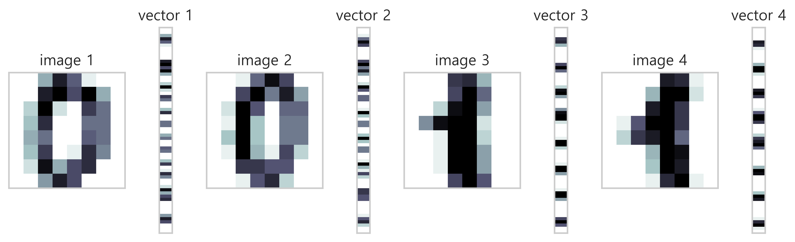
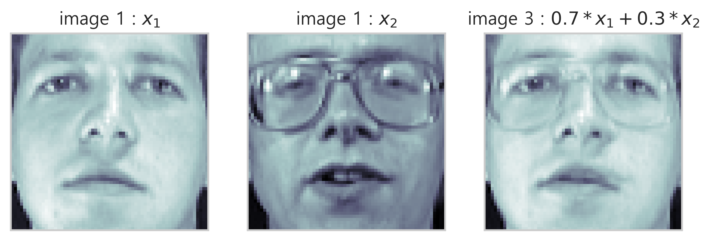

# Numpy 와 선형대수

## 1. 데이터와 행렬

## 데이터 유형

#### 스칼라
- 스칼라 scala : 숫자하나로 이루어진 데이터
- 붓꽃데이터에서 꽃잎 길이 하나의 데이터.
- 스칼라는 보통 실수 real number 이다.

#### 벡터
- 벡터 vector : 여러숫자로 이루어진 데이터 레코드
- 순서가 정해진 데이터들이 모여있는 것. 순서가 바뀌면 어떤 것인지 알아볼 수 없다.
- 붓꽃 한 송이의 크기 : 꽃잎의 길이,폭,꽃받침의 길이,폭
- 복수의 행과 하나의 열로 표기된다.
- 하나의 벡터를 이루는 데이터의 수가 N 이면, n-차원 벡터 라고 한다. 붓꽃은 4개의 데이터 이므로 4차원 벡터.
- 특징벡터 feature vector : 예측문제에서 입력데이터로 쓰이는 벡터. 길에서 주운 붓꽃 데이터, 예측하고자하는 집의 데이터, 선수의 스택 등.
- 넘파이의 배열의 차원은 데이터의 수와 상관없이 한 줄이면 1차원, 여러개의 줄, 사각형이면 2차원 이다.

#### 행렬
- 행렬 matrix : 데이터 레코드 즉 벡터가 여럿인 데이터 집합
- 복수의 차원을 가지고 있는 데이터 레코드(벡터) 여러개를 합쳐서 표기한 것.
- 벡터는 열이 1인 행렬이다. 열벡터 column vector.
- 데이터를 행렬로 표시할 때는 열이 아닌 행으로 표시한다.
- 하나의 데이터 레코드를 벡터로 나타낼 떄는 하나의 열 (세로), 복수의 데이터 레코드 집합을 행렬로 나타낼때는 하나의 행 (가로) 이 된다.
- 특징행렬 feature matrix : 예측 문제를 풀기 위해 입력하는 행렬

### 텐서
- 텐서 tensor : 같은 크기의 행렬이 여러개 있는 것
- 데이터사이언스 분야에서는 다차원의 배열을 흔히 텐서라고 한다. 수학적으로는 다차원의 배열로 표현되는 사상 mapping 이다.
- 컬러이미지는 2차원의 행렬인 것 같지만, 빨강, 파랑, 초록 이미지가 겹친 것으로 3차원 텐서이다.

### 행렬의 연산
- 스칼라, 벡터, 행렬 데이터를 변형시키는 것을 연산 operation 이라고 한다.
- 전치연산 transpose operation : 행과 열을 바꾸는 연산
- 전치행렬 : 전치연산으로 만든 행렬, 6x4 행렬을 전치연산으로 바꾸면, 4x6 전치행렬이 된다.
- 행벡터 row vector : 벡터를 전치 연산하면 하나의 행을 가진 행벡터가 된다.

### 행렬의 행 표기법과 열 표기법
- 행렬은 열벡터와 행벡터로 이루어져 있다.
- 열 벡터의 묶음으로 볼 수도 있고, 행벡터의 묶음으로 볼 수도 있다.
- 벡터가 기본적으로 열벡터이므로, 행벡터로 표기할 때는  라고 쓴다. 열 벡터 r 을 전치 연산한 것.

### 특수한 벡터와 행렬
- 영벡터 zeros-vector : 모든 요소가 0인 벡터
- 일벡터 ones-vector : 모든 요소가 1인 n 차원 벡터
- 정방행렬 square matrix : 행과 열의 갯수가 같은 행렬
- 대각행렬 diagonal matrix : 모든 비대각 요소가 0인 행렬, 대각 요소는 0이 아니어도 된다. 정방행렬이 아니어도 된다.
    - 대각 diagonal : 행과 열이 같은 위치. 대각선.
    - 비대각 off-diagonal : 대각 위치가 아닌 것들.
- 항등행렬 identity matrix : 대각행렬 중에서 대각성분의 모든 요소가 1인 대각행렬. 대문자 I 로 표시한다.
    - 항등행렬은 대각행렬의 한 종류이다.
- 대칭행렬 symmetric matrix : 전치행렬과 원래의 행렬이 같은 경우. 정방행렬만 대칭행렬이 될 수 있다.

## 2. 백터와 행렬의 연산

### 벡터와 행렬의 연산
- 요소별 연산 : 같은 위치의 요소끼리 덧셈, 뺄셈을 해준다.
- 스칼라와 벡터, 행렬의 곱 : 모든 요소에 스칼라를 곱해준다.
- 브로드캐스팅 broadcasting : 벡터와 행렬의 연산은 같은 크기끼리 가능하다. 스칼라는 예외적으로 같은 크기의 1벡터를 곱해서 크기를 맞춰준다.
- 평균 제거 벡터, 0-평균 벡터 : 모든 요소에서 요소의 평균값을 뺀 것
- 선형조합 linear combination : 벡터나 행렬에 스칼라를 곱한 후 더하거나 뺀 것.
- ```내적 inner product``` : 벡터의 곱셈 
    - 조건1) 벡터의 차원이 같아야 한다.
    - 조건2) 앞의 벡터가 행벡터이고 뒤의 벡터가 열벡터이어야 한다. 
    - 요소별 연산으로 같은 위치끼리 곱한 후 더해 준다. 따라서 벡터의 곱의 결과는 스칼라이다.

### 내적을 이용한 다른 연산
- 가중합 weighted sum : 가중치를 곱해서 더하는 것. 마트에서 물건 살때 총금액 계산과 같다. 10개x100원 + 20개x50원
- 가중평균 : 대학교 시험 성적을 계산하고 평균을 내는 것과 같다. 과목별로 학점이 다름.
- 유사도 similarity : 두 벡터가 닮은 정도를 정량적으로 나타낸 값. 비슷하면 유사도가 커지고, 안 비슷하면 유사도가 작아진다.
    - 코사인 유사도 cosine similarity
- ```선형회귀 모형 linear regression model``` : 독립변수 x 에서 종속변수 y 를 예측하는 방법
    - x 벡터와 가중치 벡터 w 와의 가중합으로 y 에 대한 예측값을 계산하는 수식
    - 보스턴 집값 문제
    - 단점 : 현실의 비선형적 데이터를 예측하기 어려울 수 있다. 이를 보완한 수정 선형회귀 모델을 사용한다.
- 제곱합 : 데이터를 제곱한 뒤 모두 더한 값. 분산이나 표준편차 등을 구할 때 사용. 

### 행렬과 행렬의 곱셈
- A 행렬의 열의 수와 B 행렬의 행의 수가 같아야 한다.
    - (N x L)x(L x M) = NxM
    - A 행렬의 행벡터와 B 행렬의 열벡터가 한번씩 내적하여 스칼라 값으로 구성된 C 행렬이 된다.
    - 벡터의 내적은 스칼라가 되고, 행렬의 내적은 행렬이 된다.
- 행렬의 곱셈 법칙
    - 교환법칙이 성립하지 않는다. 곱하는 행렬의 순서가 바뀌면 값이 달라진다. 
    - 덧셈에 대한 분배벅칙은 성립한다. 
    - 덧셈/뺄셈의 전치연산도 분배법칙이 성립한다. 
    - 곱셈의 전치연산은 순서가 바뀐다. 
- 행렬 X 의 평균
    - X_bar = ((ones @ ones.T) @ X) / N   (N 은 X 의 행의 길이)
- 곱셈의 연결
    - 연속된 행렬의 곱셈은 순서를 임의로 바꾸어도 결과가 같다. 
    - 계산의 순서는 바꾸어도 되지만, 행렬의 순서를 바꾸면 결과가 달라진다.
- 항등행렬의 곱셈
    - 어떤 행렬이든 항등행렬을 곱하면 행렬값이 변하지 않는다. 

### 행렬과 벡터의 곱
- 
- M 의 성분을 열로 보는 경우와 행으로 보는 경우 2가지 가능하다.
- 열벡터의 선형조합
    - 행렬 X 와 벡터 w 의 곱은 행렬 X 의 열벡터 c_1, c_2, ... 에 벡터 w 의 각 성분을 곱해서 더한 선형조합한 것과 같다.
    - w_1c_1 + w_2c_2 + ... +w_m c_m
    - 벡터의 선형조합은 다양한 분야에서 사용된다. 두 이미지 벡터의 선형조합은 두 이미지를 섞어 놓은 모핑 효과를 얻는데 사용할 수 있다.
- 여러개의 벡터에 대한 가중합 동시계산
    - 
- 따라서 행렬과 벡터의 곱은 : 열로 쪼개서 곱 -> 선형조합 하거나, 행으로 쪼개서 곱 -> 여러개의 가중합

### 잔차 
- 오차 error, 잔차 residual
- 선형회귀분석 linear regression 을 한 결과로 가중치 w 벡터가 나온다. 
- 예측치는 w 벡터와 독립변수 벡터 x 와의 가중합으로 구한다. 
- 실제값 target 과 예측치의 차이를 오차, 잔차 라고 한다. 모든 독립변수에 대한 잔차를 구하면 잔차벡터가 된다.
- 

### 잔차의 크기
- ```잔차제곱합 RSS residual sum of squares``` : 잔차 벡터의 각 원소를 제곱한 후 더한 값.
- 잔차의 크기로 선형회귀모델의 성능을 파악할 수 있다. 잔차의 크기가 작을 수록 좋은 모델. 실제값에 가깝다는 의미.
- 
- ```벡터의 이차형식 quadratic form``` : 
    - 가 정방행렬이 된다. 이것을 A 라고 하면,  가 된다.
    - 행벡터 x 정방행렬 x 열벡터 의 형태
    - 
- RSS 는 결과가 스칼라 값이다.

### 부분행렬
- 정방행렬 A, B 의 곱을 부분행렬을 사용하여 여러가지 방식으로 풀 수 있다.
    - 1) 행벡터 x 행렬
    - 2) 행렬 x 열벡터
    - 3) 열벡터 x 행벡터
- 행렬을 행벡터와 열벡터의 기준으로 보면, 여러가지 방식으로 곱을 풀 수 있게 된다.

## 3. 행렬의 성질

### 행렬의 부호
- 행렬은 여러가지 수로 이루어져 있어서 부호를 결정하기 어렵다.
- 벡터의 이차형식을 기준으로 부호를 정할 수 있다.
    - ```양의 정부호 positive definite pd``` :  > 0 이면 양의 정부호. 이 행렬은 양수이다.
    - 양의 정부호일 경우는 x 벡터가 0 벡터가 아닌 경우이다. 0 벡터이면 이차형식의 결과가 0이 나와서 양의 준정부호가 된다.
    - ```양의 준정부호 positive semi definite psd``` :  >= 0 이면 양의 준정부호 라고 한다.

### 행렬의 크기
- 행렬의 크기는 놈 norm, 대각합 trace, 행렬식 determinant 으로 구할 수 있다.
- ```놈 norm```
    - 여러 종류가 있지만 요소별 행렬 놈 을 주로 사용한다.
    - 
    - p = 1, 2 또는 무한대가 있지만, p=2 를 많이 사용한다. p=2 인 경우 프로뵈니우스 놈 Frobenius norm 이라고 한다.
    - 
    - A 의 i 번쨰 행의 j 번째 열의 모든 요소를 다 더하는 것
- 벡터도 놈으로 크기를 구할 수 있다.
    - 
    - 벡터의 놈의 제곱은 벡터의 제곱합과 같다.
- 놈의 성질 4가지
    - 1) 놈은 항상 0 보다 크거나 같다. 영행렬 일 떄만 0이다. : 
    - 2) 행렬에 스칼라를 곱한 놈은 행렬의 놈에 절대값 스칼라를 곱한 것과 같다. : 
    - 3) 두 행렬의 합의 놈은 각 행렬의 놈의 합보다 작거나 같다 : 
    - 4) 행렬의 곱의 놈은 각 행렬의 놈의 곱보다 작거나 같다. : 
- ```대각합 trace```
    - 정방행렬에 대해서만 정의되며 대각원소의 합이다.
    - 
    - 항등행렬의 대각합은 N 이다.
    - 대각합은 음수가 될 수 도 있다. (절대값이나 제곱값을 사용하지 않으므로)
- 대각합의 성질 5가지
    - 1) 스칼라를 곱한 행렬의 대각합은 행렬의 대각합에 스칼라를 곱한것과 같다. : 
    - 2) 전치연산을 해도 대각합이 달라지지 않는다. :  
    - 3) 두 행렬의 합의 대각합은 각 행렬의 대각합의 합과 같다. : 
    - 4) 두 행렬의 곱의 대각합은 행렬의 순서가 바뀌어도 변하지 않는다.: 
    - 5) 세 행렬의 곱의 대각합은 순서가 변해도 변하지 않는다. : 
    - 마지막 성질을 ```트레이스 트릭 trace trick``` 이라고 한다. 이차형식의 미분을 구하는데 유용하게 사용된다.
    - 
- ```행렬식 determinant```
    - 정방행렬 A 의 행렬식 : 
    - 
    - 마이너가 행렬식이므로 재귀적으로 계산된다.
    - 행렬 A 가 스칼라인 a 이면, 행렬식은 a 이다.
    - 행렬 A 가 스칼라가 아니면, 여인수 전개식 cofector expension 을 사용하여 계산할 수 있다.
    - 행렬식의 값도 대각합과 마찬가지로 음수가 될 수 있다.
- 여인수 전개식 : 여인수와 마이너의 곱
    - 마이너 minor :  : 행렬 A 의 i행, j열을 제거하여 크기가 1이 작아진 행렬의 행렬식이다.
    - 여인수 cofector : 
- 2x2 정방행렬의 행렬식 : ad-bc, 3x3 정방행렬의 행렬식 : aei+bfg+cdh-ceg-bdi-afh
- 행렬식의 성질 5가지
    - 1) 전치행렬의 행렬식은 원래 행렬의 행렬식과 같다. : 
    - 2) 항등행렬의 행렬식은 1이다. : 
    - 3) 두 행렬의 곱의 행렬식은 각 행렬의 행렬식의 곱과 같다. : 
    - 4) 역행렬 $A^{-1}$ 은 원래의 행렬 A과 다음의 관계를 만족하는 정방행렬이다. : 
    - 5) 역행렬의 행렬식은 원래 행렬의 행렬식의 역수이다. : 
- 행렬의 크기를 확인하는 개념
    - 놈 norm
    - 대각합 trace
    - 행렬식 determinant

## 4. 선형연립방정식과 역행렬

### 선형연립방정식
- 복수의 미지수를 포함하는 복수의 선형방정식.
-  로 표현된다. A 는 계수행렬, x 는 미지수 벡터, b 는 상수벡터
- 일반적인 방정식 풀이에 의해서  이렇게 구할 수 있지만 행렬에서는 나눗셈이 정의되지 않는다.
- 행렬의 나눗셈 대신 역행렬을 사용한다.

### 역행렬
- 역행렬을 사용하여 선형예측모형의 가중치 벡터를 구할 수 있다.
- 역행렬은 다음 조건을 만족한다. : 
- 역행렬이 있는 행렬 : 가역행렬, 역행렬이 없는 행렬 : 비가역행렬, 특이행렬
- ```역행렬의 계산```
    - 
    - 는 A 의 i,j 번째 원소에 대한 여인수이다.
    - 여인수로 이루어진 행렬 : 여인수행렬, 여인수행렬의 전치행렬 : 어드조인트행렬  라고 한다.
    - 이에따라서 A 가 0 이면 역수가 존재하지 않으므로, ```역행렬은 행렬식이 0이 아닌 경우에만 존재한다.```
- ```역행렬의 성질```
    - 전치행렬의 역행렬은 역행렬의 전치행렬과 같다. : 
    - 정방행렬의 곱의 역행렬은 행렬의 순서가 바뀐 역행렬의 곱과 같다. :  , 
- 역행렬에 대한 여러가지 정리
    - 셔먼-모리슨 공식 : 
    - 우드베리 공식 : 
    - 분할행렬의 역행렬 : 
        - 

### 역행렬과 선형 연립방정식의 해
- 

### 선형연립방정식과 선형예측모델
- 선형연립방정식의 해는 선형예측모델의 가중치를 구하는 것과 같다.
- 계수행렬 X, 미지수 벡터 w, 상수벡터 y 인 선형연립방정식의 해.
- 
- 양변에 X 의 역행렬을 곱해준다.
- X 가 역행렬이 존재한다는 전재하에서 계산이 가능하다. 역행렬은 행렬식의 값이 0이면 존재하지 않는다.

### 미지수의 수와 방정식의 수
- 미지수와 방정식의 수에 따라서 선형연립방정식의 해의 갯수가 정해진다.
    - 방정식의 수가 미지수의 수와 같은 경우 : 해를 구할 수 있다.
    - 방정식의 수가 미지수의 수보다 적을 경우 : 해가 무수히 많을 수 있다.
    - 방정식의 수가 미지수의 수보다 많을 경우 : 해가 아예 없을 수 있다.
- 현실 데이터는 3번째인 경우가 많다. 입력차원 보다 데이터의 수가 많다. 아파트 면적, 층수, 전망 보다 조사한 아파트 갯수가 더 많다.
- 이런 경우는 선형연립방정식으로 선형예측모형의 가중치 벡터를 구할 수 없다.

### 최소자승문제
- ```최소자승문제 least square problem```
- 데이터의 수가 입력차원보다 큰 경우는 선형연립방정식이 아닌 최소자승문제에 해당한다.
- 방정식의 수가 미지수의 수보다 많은 경우 예측값과 실제값이 정확하게 맞지 않아도 된다고 했을때 최소자승문제로 접근할 수 있다.
- 즉 예측값과 목푯값의 차이를 최소화 하는 문제가 된다.
    - 잔차 : 
    - 잔차 e 는 벡터이므로 벡터의 크기를 최소화하기 위해 놈을 최소화 한다. 즉 놈의 제곱을 최소화 한다.
    - 
    - 이 값을 최소화하는 x 값 : 
- 의사역행렬 pseudo inverse : 역행렬과 유사한 행렬
    - 
    -  을 의사역행렬 이라고 한다.  과 유사하다.
    - 의사역행렬  를 로 표기한다.
    - 그러므로  가 된다.
    - 역행렬은 정방행렬만 가능하다.
- 최소자승문제의 해 즉, 잔차 제곱합을 최소로 하는 x 는 최적화를 풀어야 한다. 최적화는 행렬의 미분에서 다루게 된다.

## 5. Numpy code

### 1) 전치연산 Trancepose

- 5x4 행렬 A
```
A = np.array([[11,12,13],[14,15,16]])
A, A.shape

=====print=====
(array([[5.1, 3.5, 1.4, 0.2],
        [4.9, 3. , 1.4, 0.2],
        [4.7, 3.2, 1.3, 0.2],
        [4.6, 3.1, 1.5, 0.2],
        [5. , 3.6, 1.4, 0.2]]), (5, 4))
```

- 전치 연산
```
A.T, A.T.shape

=====print=====
(array([[5.1, 4.9, 4.7, 4.6, 5. ],
        [3.5, 3. , 3.2, 3.1, 3.6],
        [1.4, 1.4, 1.3, 1.5, 1.4],
        [0.2, 0.2, 0.2, 0.2, 0.2]]), (4, 5))
```

- 전치 연산의 전치 연산 : 원래의 행렬로 돌아온다.
```
X.T.T, X.T.T

=====print=====
(array([[5.1, 3.5, 1.4, 0.2],
        [4.9, 3. , 1.4, 0.2],
        [4.7, 3.2, 1.3, 0.2],
        [4.6, 3.1, 1.5, 0.2],
        [5. , 3.6, 1.4, 0.2]]), (5, 4))
```

### 2) 특수한 행렬

#### 영벡터
- 모든 원소가 0이고, 열이 하나인 벡터
```
np.zeros([4,1]

=====print=====
array([[0.],
       [0.],
       [0.],
       [0.]])
```

#### 일벡터
- 모든 원소가 1이고, 열이 하나인 벡터
```
np.ones([3,1])

=====print=====

array([[1.],
       [1.],
       [1.]])
```

#### 대각행렬
- 모든 비대각 원소가 0인 행렬, 대각 성분의 요소는 0이 아니어도 된다.
```
np.diag([1,2,3])

=====print=====
array([[1, 0, 0],
       [0, 2, 0],
       [0, 0, 3]])
```

#### 항등행렬
- 대각 성분의 모든 요소가 1인 대각행렬, 항등행렬은 대각행렬이다.
```
np.identity(5)

=====print=====

array([[1., 0., 0., 0., 0.],
       [0., 1., 0., 0., 0.],
       [0., 0., 1., 0., 0.],
       [0., 0., 0., 1., 0.],
       [0., 0., 0., 0., 1.]])
```
```
np.eye(3)

=====print=====

array([[1., 0., 0.],
       [0., 1., 0.],
       [0., 0., 1.]])
```

#### 정방행렬
- 행과 열의 갯수가 같은 행렬
```
B = np.array([[1,2,3],[4,5,6],[7,8,9]])
B

=====print=====

array([[1, 2, 3],
       [4, 5, 6],
       [7, 8, 9]])
```
```
B = np.arange(16).reshape(4,4)
B

=====print=====

array([[ 0,  1,  2,  3],
       [ 4,  5,  6,  7],
       [ 8,  9, 10, 11],
       [12, 13, 14, 15]])
```

#### 대칭행렬
- 전치 연산을 해도 모양이 같은 행렬
- 정방행렬 + 정방행렬의 전치행렬
```
C = B + B.T
C

=====print=====

array([[ 2,  6, 10],
       [ 6, 10, 14],
       [10, 14, 18]])
```

- 대칭행렬 C 는 전치연산을 해도 같다.
```
C.T

=====print=====

array([[ 2,  6, 10],
       [ 6, 10, 14],
       [10, 14, 18]])
```

### 3) 벡터와 행렬의 연산
- 행렬의 덧셈
```
x = np.array([1,2,3,4])
y = np.array([5,6,7,8])
```
```
x + y

=====print=====

array([ 6,  8, 10, 12])
```

- 행렬의 뺼셈
```
x - y

=====print=====

array([-4, -4, -4, -4])
```

- 복합 연산
```
x = np.array([[5,6],[7,8]])
y = np.array([[1,2],[3,4]])
z = np.array([[10,10],[10,10]])
```
```
x + y + z

=====print=====

array([[16, 18],
       [20, 22]])
```
```
x + y - z

=====print=====

array([[-4, -2],
       [ 0,  2]])
```

### 4) 벡터와 벡터의 곱셈
- 벡터의 곱셈은 내적으로 정의된다.
```
x = np.array([[5],[2],[3]])
y = np.array([[4],[5],[6]])
```
```
x.T @ y

=====print=====
array([[48]])
```
```
x = np.array([15, 16, 20])
y = np.array([10, 20, 15])

np.dot(x.T, y)

=====print=====

770
```

### 5) 가중합, 가중평균

#### 가중합
- 내적을 이용하여 가중치를 곱한 행렬의 연산을 할 수 있다.
```
p = np.array([[1000000],[800000],[500000]])
n = np.array([[3],[4],[5]])
```
```
p.T @ n

=====print=====

array([[8700000]])
```
```
np.dot(p.T, n)

=====print=====

array([[8700000]])
```

#### 가중 평균
- 가중치값을 가중치의 합을 나눈 후 각각의 데이터에 곱한 후 더한다.
```
x = np.arange(10)
N = len(x)
```
```
np.ones(N) @ x / N

=====print=====
4.5
```
```
x.mean()

=====print=====
4.5
```

### 6) 유사한 이미지의 벡터의 내적 관계
- 유사한 이미지들은 벡터의 내적 값이 크다. 유사하지 않은 이미지들은 벡터의 내적 값이 상대적으로 작다.
```
from sklearn.datasets import load_digits
import matplotlib.gridspec as gridspec
```
- 숫자 이미지에서 필요한 이미지만 변수에 저장
- 0 이미지 2개 1 이미지 2개
```
digits = load_digits()
d1 = digits.images[0]
d2 = digits.images[10]
d3 = digits.images[7]
d4 = digits.images[17]

### 이미지를 벡터화 시킨다.
v1 = d1.reshape(64,1)
v2 = d2.reshape(64,1)
v3 = d3.reshape(64,1)
v4 = d4.reshape(64,1)
```

- 그림을 배치할 수 있는 그리드의 형태를 정의할 수 있다. gridspec
- nrows, ncols, height_ratios : 열의 높이 비율, width_ratios : 각 열의 넓이 비율
```
plt.figure(figsize=(9,9))
gs = gridspec.GridSpec(1, 8, height_ratios=[1], width_ratios=[9,1,9,1,9,1,9,1])

for i in range(4) :
    plt.subplot(gs[2 * i])                                                 
    plt.imshow(eval('d' + str(i+1)), aspect=1, interpolation='nearest', cmap=plt.cm.bone_r) # eval 함수는 str 값을 숫자처럼 연산해준다.
    plt.grid(False); plt.xticks([]); plt.yticks([])
    plt.title('image {}'.format(i+1))
    plt.subplot(gs[2 * i + 1])
    plt.imshow(eval('v' + str(i+1)), aspect=0.25, interpolation='nearest', cmap=plt.cm.bone_r)
    plt.grid(False); plt.xticks([]); plt.yticks([])
    plt.title('vector {}'.format(i+1))

plt.tight_layout()
plt.show()
```


#### 유사한 이미지 벡터의 내적
- 0과 0 이미지
```
(v1.T @ v2)[0][0], (v3.T @ v4)[0][0]

=====print=====
(3064.0, 3661.0)
```
- 0과 1 이미지
- 내적 값이 상대적으로 작다
```
(v3.T @ v1)[0][0], (v2.T @ v4)[0][0]

=====print=====
(1866.0, 2479.0)
```

### 7) 행렬의 곱셈

#### 교환 법칙이 성립하지 않는다.
- 행렬의 순서가 바뀌면 값이 달라진다.
```
A = np.array([[1,2,3], [4,5,6]])
B = np.array([[1,2], [3,4], [5,6]])
```
```
A @ B

=====print=====
array([[22, 28],
       [49, 64]])
```
```
B @ A

=====print=====

array([[ 9, 12, 15],
       [19, 26, 33],
       [29, 40, 51]])
```

#### 분배 법칙은 성립한다.
```
A @ (B+C)

=====print=====

array([[42, 42],
       [98, 98]])
```
```
A @ B + A @ C

=====print=====

array([[42, 42],
       [98, 98]])
```

#### 덧셈의 전치연산도 분배 법칙이 성립한다.
```
(A + B).T

=====print=====
array([[ 6, 10],
       [ 8, 12]])
```
```
A.T + B.T

=====print=====

array([[ 6, 10],
       [ 8, 12]])
```

#### 곱셈의 전치연산은 순서가 바뀐다.
```
(A @ B).T

=====print=====
array([[19, 43],
       [22, 50]])
```
```
B.T @ A.T

=====print=====
array([[19, 43],
       [22, 50]])
```

- 순서가 그대로면 값이 다르다.
```
A.T @ B.T

=====print=====

array([[23, 31],
       [34, 46]])
```

#### 곱셈의 연결
- 연속된 행렬의 곱셈은 순서가 바뀌어도 값이 같다.
- 단 행렬의 순서가 바뀌면 안된다.
```
A = np.array([[1,2]])
B = np.array([[1,2],[3,4]])
C = np.array([[5],[6]])
```
```
A @ B @ C

=====print=====

array([[95]])
```

- 이번엔 B와 C 먼저 곱하고, A 를 마지막에 곱한다.
```
A @ (B @ C)

=====print=====

array([[95]])
```

#### 항등행렬의 곱
- 어떤 행렬에 항등행렬을 곱해도 값이 변하지 않는다. 
- AI = A
```
A = np.array([[1,2,3],[4,5,6],[7,8,9]])
I = np.eye(3)
```
```
A @ I

=====print=====

array([[1., 2., 3.],
       [4., 5., 6.],
       [7., 8., 9.]])
```

### 8) 벡터의 선형조합의 응용 : 이미지 합치기
- 서로 다른 이미지의 벡터에 가중치를 다르게 적용한 후 선형조합하면 새로운 벡터의 이미지가 출력된다.
- 이러한 방식을 모핑 morphing 이라고 한다. 
- 올리베티 얼구 이미지 패키지에서 서로 다른 이미지를 가져온다.
```
from sklearn.datasets import fetch_olivetti_faces

faces = fetch_olivetti_faces()

f, ax = plt.subplots(1, 3)

ax[0].imshow(faces.images[6], cmap=plt.cm.bone)
ax[0].grid(False)
ax[0].set_xticks([])
ax[0].set_yticks([])
ax[0].set_title('image 1 : $x_1$')

ax[1].imshow(faces.images[10], cmap=plt.cm.bone)
ax[1].grid(False)
ax[1].set_xticks([])
ax[1].set_yticks([])
ax[1].set_title('image 1 : $x_2$')

### 벡터의 선형 조합 : 이미지 6에 가중치 0.7, 이미지 10에 가중치 0.3
new_face = 0.7 * faces.images[6] + 0.3 * faces.images[10]
ax[2].imshow(new_face, cmap=plt.cm.bone)
ax[2].grid(False)
ax[2].set_xticks([])
ax[2].set_yticks([])
ax[2].set_title('image 3 : $0.7*x_1 + 0.3*x_2$')

plt.show()
```



### 9) 벡터의 이차형식
```
x = np.array([1,2,3])
x

=====print=====

array([1, 2, 3])
```
```
A = np.arange(1,10).reshape(3,3)
A

=====print=====

array([[1, 2, 3],
       [4, 5, 6],
       [7, 8, 9]])
```
```
x.T @ A @ x

=====print=====

228
```

### 10) 행렬의 크기

#### 놈 norm

```
A = (np.arange(9)-4).reshape(3,3)
A

=====print=====

array([[-4, -3, -2],
       [-1,  0,  1],
       [ 2,  3,  4]])
```
```
np.linalg.norm(A)

=====print=====

7.745966692414834
```

#### 대각합 trace
```
np.trace(np.eye(4))

=====print=====
4.0
```

#### 역행렬 inverse matrix
```
A = np.array([[1,1,0],[0,1,1],[1,1,1]])
A

=====print=====

array([[1, 1, 0],
       [0, 1, 1],
       [1, 1, 1]])
```
```
Ainv = np.linalg.inv(A)
Ainv

=====print=====
array([[ 0., -1.,  1.],
       [ 1.,  1., -1.],
       [-1.,  0.,  1.]])
```
### 11) 선형 연립방정식의 해
- inv() 사용하는 것 보다 lstsq()를 사용하여 계사하는 것이 더 정확하다.
```
b = np.array([[2],[2],[3]])
b

=====print=====

array([[2],
       [2],
       [3]])
```

- 선형 연립방정식의 해
```
x = Ainv @ b
x

=====print=====

array([[1.],
       [1.],
       [1.]])
```

- 위에서 구한 해가 맞는지 확인
```
A @ x - b

=====print=====

array([[0.],
       [0.],
       [0.]])
```

- lstsq() 사용
- resid : 잔차제곱하, rank : 랭크, s : 특잇값
```
x, resid, rank, s = np.linalg.lstsq(A, b)
x

=====print=====

array([[1.],
       [1.],
       [1.]])
```

### 12) 선형 연립방정식과 선형예측모형
- 보스턴 집값 문제에서 간단한 선형예측 모형을 구할 수 있다.
- 데이터의 입력값 : CRIM, NOX, RM, AGE
- 예측모형에서 구해진 가중치의 값이 입력값과 비례, 반비례 관계를 갖는지에 대해 확인

```
from sklearn.datasets import load_boston

boston = load_boston()

### y 는 실제값, 목표값
X = boston.data
y = boston.target

### 일부 데이터만 사용
A = X[:4, [0,4,5,6]]
b = y[:4]
```
- A 행렬의 역행렬을 구한다.
```
Ainv = np.linalg.inv(A)
Ainv

=====print=====
array([[-2.35172493e+01,  4.95752613e+01, -9.28388535e+01,
         7.19277399e+01],
       [ 5.96138349e+00,  6.66097478e+00, -2.68388003e+01,
         1.58431788e+01],
       [-2.19803095e-01, -8.06127089e-01,  1.99308607e+00,
        -9.57270077e-01],
       [-9.40782133e-03,  2.15240112e-02,  2.94704793e-02,
        -4.11681401e-02]])
```

- 가중치 벡터 w 를 구한다.
```
w = Ainv @ b
w

=====print=====

array([-3.12710043e+02, -1.15193942e+02,  1.44996465e+01, -1.13259317e-01])
```

### 13) 의사역행렬
- 최소자승문제를 푸는데 필요한 역행렬과 유사한 행렬
```
A = np.array([[1,1,0],[0,1,1],[1,1,1],[1,1,2]])
A

=====print=====

array([[1, 1, 0],
       [0, 1, 1],
       [1, 1, 1],
       [1, 1, 2]])
```

- 목표값 벡터 b
```
b = np.array([[2],[2],[3],[4.1]])
b

=====print=====

array([[2. ],
       [2. ],
       [3. ],
       [4.1]])
```

- 의사역행렬 구하기
```
Apinv = np.linalg.inv(A.T @ A) @ A.T
Apinv

=====print=====

array([[ 0.33333333, -1.        ,  0.33333333,  0.33333333],
       [ 0.5       ,  1.        ,  0.        , -0.5       ],
       [-0.5       ,  0.        ,  0.        ,  0.5       ]])
```

- 방정식의 해 x 를 구할 수 있다.
```
x = Apinv @ b
x

=====print=====

array([[1.03333333],
       [0.95      ],
       [1.05      ]])
```

- 행렬 A 와 의사역행렬로 구한 벡터 x 의 곱이 목표값 b 벡터와 거의 같음을 확인 할 수 있다.
```
A @ x

=====print=====

array([[1.98333333],
       [2.        ],
       [3.03333333],
       [4.08333333]])
```
