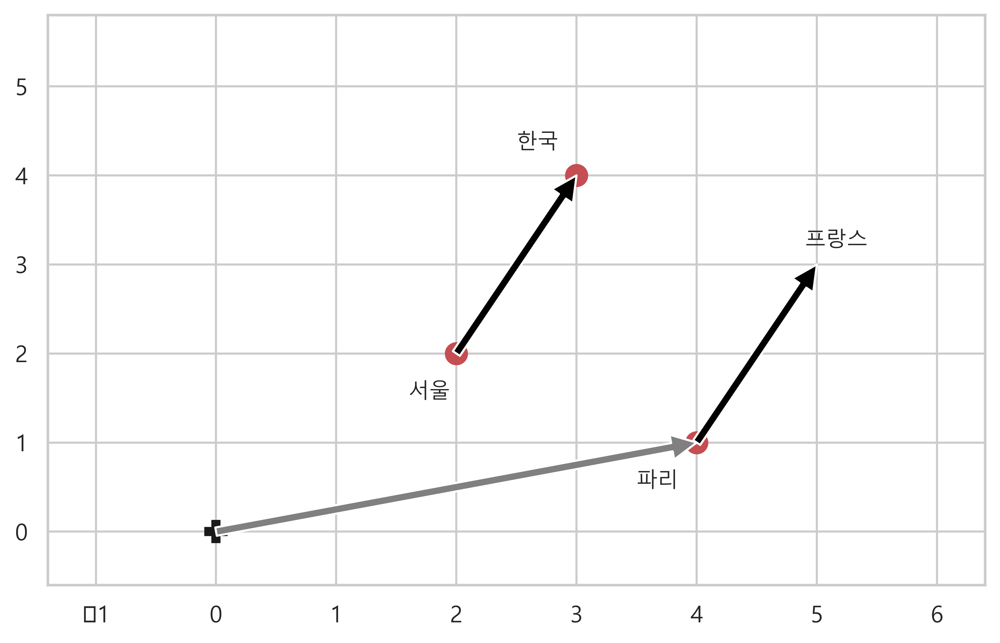
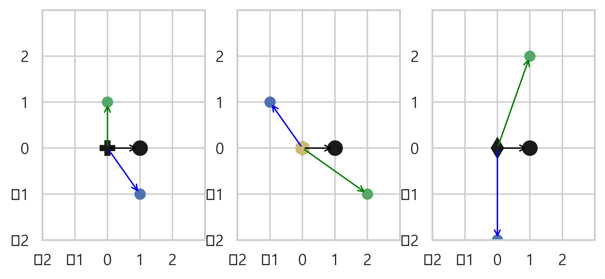
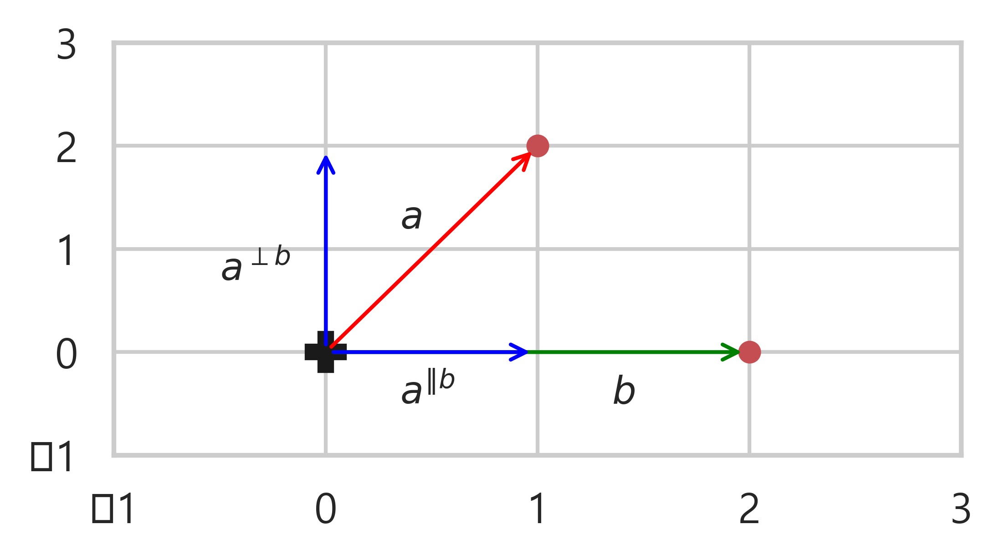
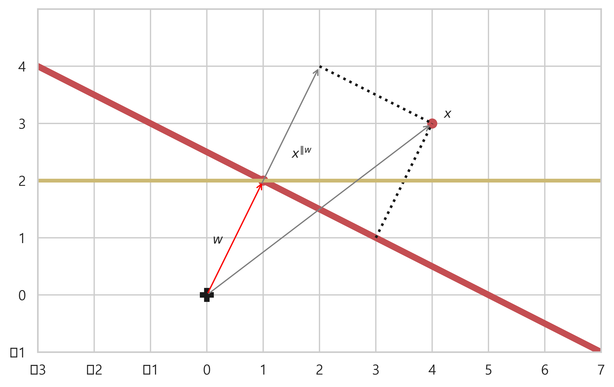
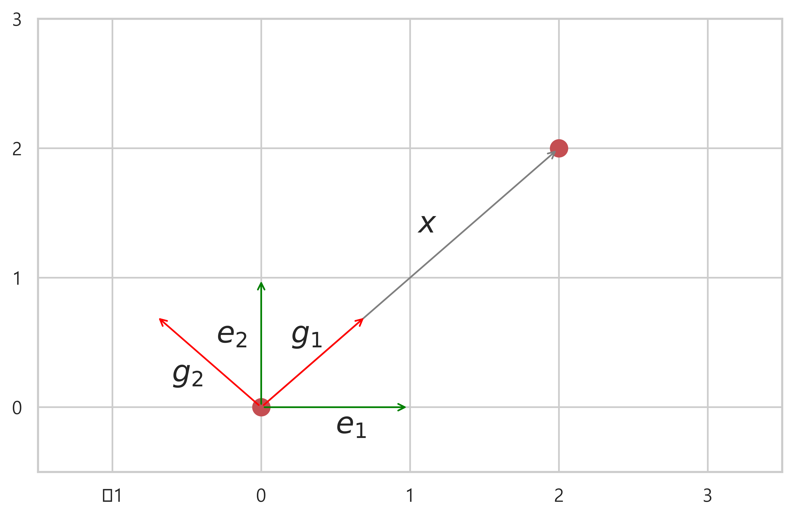
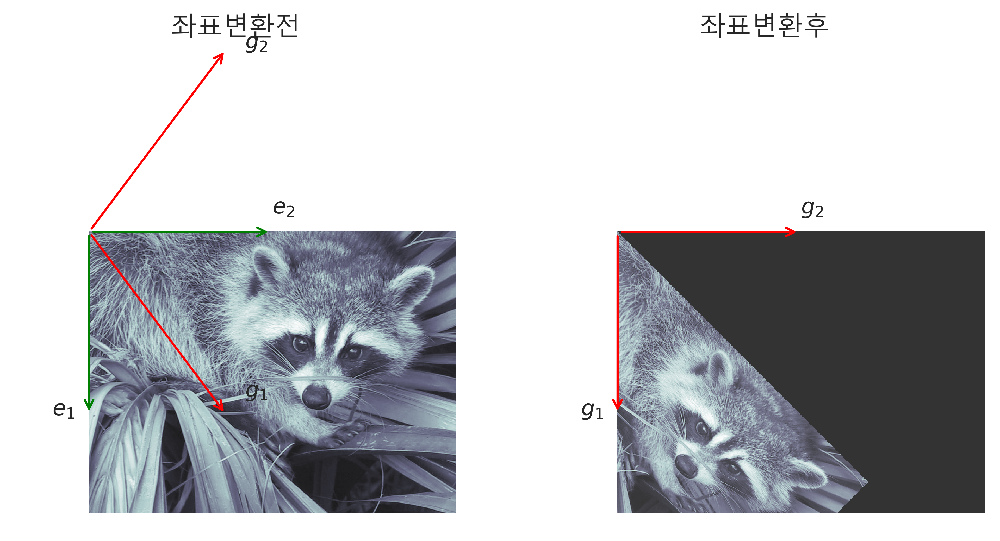
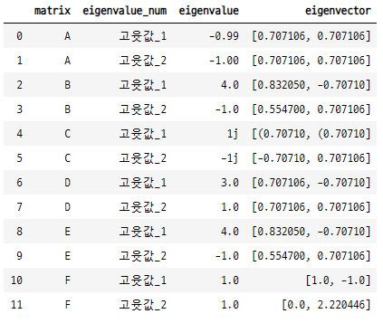
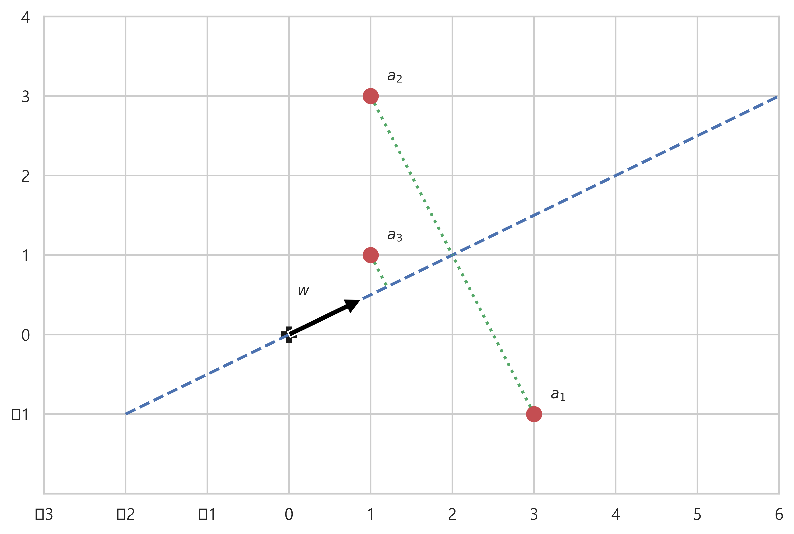
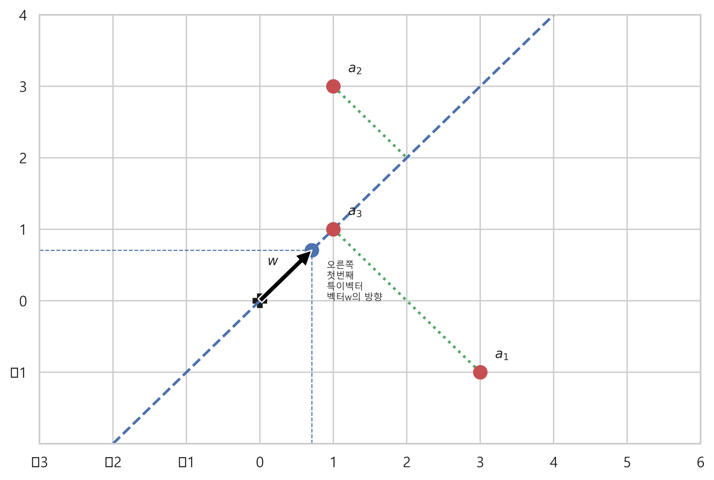

# Advanced Linear Algebra

### 1. 선형대수와 해석기하

#### 벡터의 기하학적 의미
- 벡터 a 는 n 차원 공간에서 점 또는 원점에서 점까지의 화살표를 의미한다.
- n 차원 공간에서의 벡터 a 는 평행이동 할 수 있다.
- 벡터의 길이는 놈 norm 으로 정의한다.
    - ```벡터의 길이``` : 
    - 원래 놈의 제곱은 이런 형태이다. 

#### 스칼라와 벡터의 곱
- 양의 실수 c 와 벡터 a 를 곱하면 방향은 고정, 길이가 실수 크기만큼 커진다.
- 음의 실수 c 와 벡터 a 를 곱하면 방향은 반대가 되고, 길이가 실수 크기만큼 커진다.

#### 단위벡터 unit vector
- ```길이가 1 인 벡터를 단위벡터라고 한다.``` (놈의 정의에 의해서 원소들의 제곱합이 1 인 벡터들은 모두 단위벡터 이다.)
- 영벡터가 아닌 어떤 벡터 x 에 대하여 x 의 놈, 즉 길이로 나눈 것은 x 의 단위벡터가 된다. : 

#### 벡터의 합
- 두 벡터의 합은 두 벡터를 이웃하는 변으로 가지는 평행사변형의 대각선 벡터가 된다.

#### 벡터의 선형조합
- 여러개의 벡터에 스칼라곱을 한 후 모두 더한 것을 ```선형조합 linear combination``` 이라고 한다.
- n 차원 공간에서 벡터의 선형조합의 의미는, 각 벡터에 가중치가 곱해져 길이나 방향이 변하고, 변한 벡터들을 더한 위치의 벡터가 된다.

#### 벡터의 차
- a-b=c 는 벡터 b 가 가리키는 점으로부터 벡터 a 가 가리키는 점을 연결하는 벡터다.
- b + c = b + (a - b) = a

#### wrod2Vec (인공신경망)
- 벡터의 차를 활용한 단어의미 분석
- 단어의 의미를 벡터로 표현하고, 벡터의 평행이동을 적용하여 다른 단어에도 적용함으로써 같은 의미를 찾을 수 있다.
    - ```한국 - 서울```은 ```서울->한국```으로 향하는 벡터일 때, 이것은 수도이름을 나라이름으로 바꾸는 행위와 같다.
    - 이러한 행위를 파리에 적용하면 ```파리 + (한국-서울)``` 이라고 벡터로 표시 할 수 있다.
    - 이러한 벡터의 연산을 word2Vec 에 학습 시키면, 파리와 가장 가까이에 위치한 단어인 ```프랑스```가 나온다.

#### 유클리드 거리
- ```유클리드 거리 Euclidean distance``` : 두 벡터가 가리키는 점 사이의 거리
- 벡터의 차의 길이로 구한다.
- 
- 

#### 벡터의 내적과 삼각함수
- 두 벡터의 내적은 벡터의 길이와 벡터사이의 각도의 ```코사인 함숫값```으로 계산할 수 있다.
    - 
    - 삼각함수 : 
    - 빗변과 높이의 비율 : , 빗변과 밑변의 비율 :  (따라서 각도에 따라 반대의 성질을 갖는다.)
    - 두 벡터의 각도가 90도 일때 : 
    - 두 벡터의 각도가 0도 일때 (방향이 완전히 같을때) : 

#### 직교
- ```직교 orthgonal``` : 두 벡터 사이의 각도가 90도 일때 직교한다고 정의한다.
- 각도가 90도 이면 $cos\theta=0$ 이므로, 두 벡터의 내적은 공식에 적용하면, 0 이 된다.
    - 
    - 내적값이 0 이면 직교한다고 할 수 있다.
- 행렬은 기본적으로 각 열벡터가 기저를 이루는 좌표계 cordinate system 이다.
    - 직교행렬 : 행렬의 모든 열벡터들이 서로 직교
    - 정규직교행렬 : 행렬이 직교행렬이고 모든 열벡터의 크기가 1이면 정규직교
- 어떤 행렬이 직교행렬인지 아닌지 확인하려면, 열벡터들의 내적이 0인지 아닌지 확인하면 된다.

#### 정규직교
- ```정규직교 orthonormal``` : ```N 개의 단위벡터``` v1,v2,v3,...vN 이 서로 직교하면 정규직교라고 한다.
    - 
    - 
    - 

#### 코사인 유사도
- ```코사인 유사도 cosine similarity``` : 두 벡터의 방향이 비슷할 수록 벡터가 비슷하다고 간주하여, 두 벡터 사이의 각의 코사인 값을 말한다.
- 각도가 0 일때 코사인값이 가장 커지므로, 두 벡터가 같은 방향을 가리키면 코사인 유사도가 최댓값 1을 가진다.
    -  (벡터의 내적 공식에서 도출)
- ```코사인 거리 cosine distance``` : 코사인 유사도를 사용하여 두 벡터간의 거리를 측정한다. ```추천시스템 recommender system``` 에서 사용된다.
    - 
    - 분모는 벡터의 길이간의 곱이므로 내적이 아니다.

#### 벡터의 성분과 분해
- 벡터 a 와 b 의 합으로 벡터 c 를 만들 수 있다. 이때 벡터 c 는 ```성분 component``` a, b 로 ```분해 decomposition``` 된다고 한다.

#### 벡터의 투영성분과 직교성분
- 벡터 a 는 벡터 b 에 대한 ```투영성분 projection``` 과 ```직교성분 rejection``` 으로 분해 된다.
- 벡터 a 에 수직으로 햇빛이 내리쬐면 바닥에 생기는 그림자를 투영성분, 벡터 a 에서 바닥으로 그은 직선을 직교성분이라고 한다.
    - 투영성분 : 
    - 투영성분의 길이 : 
    - 투영성분 그 자체 :  는 벡터 b 의 단위벡터이다.)
    - b 가 단위 벡터 일 경우 :  ; (단위벡터의 길이가 1이므로, a, b 의 내적이 된다.)
    - 직교성분 : 
    - 직교성분은 투영성분을 뺸 나머지이다. : 

#### 직선의 방정식
- 원점에서 출발하는 벡터 w 가 가리키는 지점을 지나고, 벡터 w 에 직교하는 어떤 직선 A.
- ```직선 A 위의 임의의 점 x 와 벡터 w 사이의 벡터.```
    - ,   (벡터 w 와 벡터 x-w 가 직교하므로)
    - 직선 A 와 원점 사이의 거리 :   (벡터 w 의 길이)
- ```벡터 w 의 점을 지나지 않고, 벡터 w 에 직교인 직선 A 의 방정식```
    - 직선 A 는 벡터 w 의 점을 지나지는 않지만, 벡터 w 위의 어떤 점 cw 는 지난다. (c 는 임의의 상수)
    - 
    - cw 가 임의의 점이므로 
    - 직선 A 와 원점 사이의 거리 : 

#### 직선과 점의 거리
- 직선 A 가  이고, 이 위에 있지 않은 임의의 점 x' 와의 거리
- x' 는 벡터 w 에 대해서 투영성분으로 분해 할 수 있다. 이 x' 의 벡터 w 에대한 투영성분으로 직선 A 와의 거리를 구한다.
    - 투영성분의 길이 : 
    - 점 x' 와 직선 A 의 거리는 벡터 w 와 벡터 x' 의 투영성분의 차와 같다.
    - 
- 직선 A 가  이고, 이 위에 있지 않은 임의의 점 x' 와의 거리
    - , ()
- 직선과 점사이의 거리는 분류방법의 하나인 ```서포트 벡터 머신 SVM, support vector machine``` 에서 사용된다.

### 2. 좌표와 변환

#### 선형종속과 선형독립
- ```선형종속 linearly dependent``` : 선형조합이 0이 되게끔 만드는 계수가 모두 0이 아닌 경우가 존재하는 경우. 즉 계수 c 가 0이 아니어도 선형조합의 값이 0이 되는 경우.
    - 
- ```선형독립 linearly independent``` : 선형조합이 0이 되게끔 만드는 계수가 모두 0이어야만 하는 경우. 즉 계수 c 가 0이 아니면 선형조합의 값이 0이 안되는 경우.
    -  (반드시 계수 모두가 0 이어야 한다.)
    -  (계수 모두가 0 이면 선형조합이 0 이다라는 조건 추가)
- 모든 벡터들간에 선형독립이 성립하지 않는 경우 : 3 개의 2차원 벡터들, 4 개의 3차원 벡터들. 미지수의 갯수가 방정식의 갯수보다 많으므로 해의 갯수가 무한대이다. 즉 계수들이 0 이 아니어도 선형조합의 값이 0이 될 수 있는 경우가 많다.
- 선형독립인 벡터를 찾을 때 : 벡터의 요소별 비율이 같으면 선형독립이 된다.

#### 선형독립과 선형 연립방정식
- 선형독립 관계를 행렬의 선형연립방정식 형태로 나타낼 수 있다.
    - 
    - 벡터의 선형독립 문제는 선형연립방정식을 푸는 것과 같다. : 
    - 

#### 선형종속의 대표적인 예
- 데이터의 열벡터들이 선형종속이면 다중공선성 multicollinearity 라고 한다. 예측 성능이 떨어진다. 안 좋은 데이터.
- 벡터가 선형종속이 되는 대표적인 경우
    - ```벡터의 개수가 벡터의 차원보다 크면 선형종속이다.``` : 열이 행보다 많다. 특징이 데이터보다 많다. 미지수가 방정식보다 많다. 해가 많다.
    - ```중복 데이터가 있으면 반드시 선형종속이다.``` : i, j 번째 열벡터가 같으면 선형종속이다. c 가 0 이 아닌 경우에도 선형조합이 0 이 된다.
    - ```어떤 벡터가 다른 벡터의 선형조합이면 선형종속이다.``` : 주차별 매출이 각각 다른 벡터인데, 매출 평균이 다른 벡터에 들어 있는 경우.

#### 랭크
- 랭크 rank : 어떤 행렬 A 에서 서로 선형독립인 벡터들의 최대 갯수. 스칼라.
    - ```열랭크 column rank``` : 열벡터 간의 선형독립인 열벡터들의 최대 갯수
    - ```행랭크 row randk``` : 행벡터 간의 선형독립인 행벡터들의 최대 갯수
- 랭크의 성질
    - ```행랭크와 열랭크는 같다.``` 즉 행 기준으로 선형조합을 따지든, 열 기준으로 선형조합을 따지든 선형독립 벡터의 최대갯수는 같다.
    - 행랭크는 행의 갯수보다 커질 수 없고, 열벡터는 열의 갯수보다 커질 수 없다.
    -  (M,N 중 작은 것과 같거나 작다.)
    - 랭크가 1인 경우도 있다.
- ```풀랭크 full rank``` : 랭크가 행이나 열의 갯수 중 작은 값과 같으면 풀랭크라고 한다.
    -  (M,N 중 작은 것과 같다.)
    - 벡터간의 선형조합의 값이 0 인 계수 c1,c2...cn 이 모두 0 일 때만 가능한 경우 ```선형독립```이라고 하며, 어떤 행렬에서 선형독립인 벡터들의 최대 갯수를 ```랭크```라고 한다. ```풀랭크```는 이러한 랭크의 갯수가 행과 열의 갯수 중 작은 값과 같은 경우를 말한다.
    - 선형독립인 벡터들로 행렬을 만들었을 때 항상 풀랭크이다.
    - 풀랭크 인 행렬일 수록 좋은 데이터이다.
    - 위의 성질에 따라서 4x3 행렬에서 랭크는 3을 넘을 수 없고, 행과 열의 랭크가 같으므로, 3개의 열에서 랭크의 갯수를 찾는 것이 효율적이다. 랭크가 2가 나오면 풀랭크가 아니다. 최소 3개가 나와야 풀랭크 행렬이다.
- ```로우 랭크 행렬 low rank matrix```
    - N 차원 벡터 x 한 개로 만들어지는 정방 행렬을 ```랭크-1 행렬``` 이라고 한다. : 
    - 랭크-1 행렬은 고윳값과 고유벡터의 정리에서 사용된다.
    - 벡터 x 는 기본적으로 열벡터이므로 열벡터와 행벡터의 곱의 형태이므로 정방행렬이 된다.
        - 랭크-1 행렬의 랭크는 1이다. 열벡터, 행벡터가 곱해져서 정방행렬로 뻥튀기 된 것. 쓸모 있는 것은 하나밖에 없다.
    - N 차원 벡터 x 두 개로 만들어지는 다음 행렬을 ```랭크-2 행렬``` 이라고 한다. : 
        - 랭크-2 행렬의 랭크는 2이다.
    - N 차원 벡터 x M 개로 만들어지는 다음 행렬을 ```랭크-M 행렬``` 이라고 한다. : 
        - 랭크-M 행렬은 ```특잇값 분해와 PCA principal component analysis 에서 사용 된다.```
- ```정방행렬 X 가 풀랭크 이면 역행렬이 존재한다.``` 풀랭크의 여부로 역행렬이 있는지 없는지 확인 할 수 있다.
    - 정방행렬이 풀랭크 이면, 행과 열 벡터 모두가 선형독립이다.
    - 역행렬이 존재한다면, 선형회귀모델에서 가중치 x 의 값을 구할 수 있다. 

#### 벡터공간과 기저벡터
- ```벡터공간 vector space``` : 서로 선형독립인 벡터 N 개를 선형조합하여 만들어지는 벡터의 집합을 벡터공간이라고 한다. $V$
    - 벡터공간의 차원 : 벡터공간의 차원은 벡터공간을 이루는 벡터의 갯수 N 개 (벡터의 차원은 벡터의 원소의 수)
    - 벡터 100개를 선형조합하여 만든 벡터공간 V 의 차원은 100차원이다.
    - 서로 선형독립인 벡터 N 를 벡터공간의 ```기저벡터 basis vector``` 라고 한다.
    - 
- N 차원 벡터 N 개가 선형독립이면 아래의 정리가 성립한다.
    - N 개의 N 차원 벡터  이 선형독립이면, 이를 선형조합하여 모든 N 차원 벡터를 만들 수 있다.
    - x_1=np.array([[1],[2]]), x_2=np.array([[2],[1]]) 두 벡터는 서로 선형독립이다. 이 정리에 따라서 두 벡터를 계수 c_1, c_2 와 선형조합하여 어떠한 2 차원 벡터도 만들 수 있다. 이러한 선형조합하여 만들어진 벡터들의 집합을 벡터공간이라고 한다.
    - 선형독립이 아닌 벡터는 벡터공간의 기저벡터가 될 수 없다.
    - x_1=np.array([[1],[2],[0]]), x_2=np.array([[2],[1],[0]]) 은 선형독립이며 벡터공간의 기저벡터이다. 이 벡터공간은 2개의 벡터로 만들어졌으므로 2차원이다. (3차원이 아니다.)
- 벡터공간의 차원과 벡터의 차원의 기준이 다른 이유는 기저벡터를 선형조합하여 만들지 못하는 벡터들이 있기 때문.

#### 랭크와 역행렬
- 정방행렬의 랭크와 역행렬 사이의 정리.
    - ```정방행렬이 풀랭크면 역행렬이 존재한다. 역도 성립한다. 즉, 정방행렬의 역행렬이 존재하면 풀랭크이다.```
    - 정방행렬이 풀랭크이다. ↔ 역행렬이 존재한다.
    - -> 방향의 증명 : 기저벡터의 선형조합으로 항등행렬을 만들 수 있다고 가정하면, XC=CX=I 가 성립한다. 역행렬의 성질에 의해서 C 는 X 의 역행렬이 된다.
    - <- 방향의 증명 : 선형연립방정식과 선형독립의 관계에서 벡터 N 개가 선형독립 일때의 논리기호 Xc=0 ↔ c=0 를 사용한다. c=0 이면 Xc=0 성립, X의 역행렬이 존재한다고 가정하면  이 성립한다. 따라서 X 의 역행렬이 존재한다.
- 어떤 정방행렬 데이터가 풀랭크이면 역행렬이 존재하고, 역행렬이 존재하면 선형조합의 해와 선형연립방정식의 최소자승문제의 해를 의사역행렬을 통해서 구할 수 있게 된다.

#### 벡터공간과 투영벡터, 직교벡터
- N 차원 벡터 M 개 v1, v2, ... , vm 으로 이루어진 기저벡터가 있을 때, N 차원 벡터 x 와 이 기저벡터 v1,v2,...,vm 을 선형조합하여 벡터  를 만들었다.
- 이 벡터와 벡터 x 의 차  인 벡터 a가 모든 기저벡터 v1,v2,...,vm 에 대하여 직교할 때,
    -  벡터를 ```벡터공간 V 에 대한 직교벡터```라고 한다.
    -  벡터를 ```벡터공간 V 에 대한 투영벡터```라고 한다.
    - 
- v1,v2,...,vm 은 기저벡터이므로 이미 선형독립인 벡터들이다.
- M=2, N=3 으로 정의하면, 2차원 평면에 3차원 벡터가 투영 된 것을 확인 할 수 있다.

#### 정규직교인 기저벡터로 이루어진 벡터공간
- 기저벡터  이 정규직교이면, 투영벡터는 각 기저벡터에 대한 내적값으로 표현할 수 있다.
    - 
    - ```!!! 투영벡터가 내적의 결과라는 것은 알겠는데, 내적에서 v_1 이 왜 두번 곱해지는지 확인 할것, 이해 안됨.```
    - ```!!! 투영벡터의 정의에서 분모가 v의 놈의 제곱인데, v는 정규직교하는 기저벡터이므로 단위벡터이다. 길이가 1이다. 따라서 분모가 1로 없어지고 분자만 남음```
- 이러한 투영벡터의 길이의 제곱은 각 기저벡터와의 내적의 제곱합이다.
    - , (위의 식 정리)
    - 벡터 x 에서 투영벡터를 뺴면 직교벡터가 된다. (증명 가능)
- 직교벡터  는 기저벡터  으로 이루어진 벡터공간의 모든 벡터에 대해서 직교한다.
- 따라서 벡터 x 의 투영벡터  는 기저벡터  이루어진 벡터공간의 모든 벡터 중에서 벡터 x 와 가장 가까운 벡터이다.

#### 표준기저벡터
- 표준기저벡터 standard basis vector : 기저벡터 중에서 원소 중 하나의 값이 1 이고 나머지는 0 으로 이루어진 것.
    - 표준기저벡터들을 열벡터로 갖는 행렬은 항등행렬이 된다.
    - 

####  좌표
- ```좌표 coordinate``` : 어떤 벡터 x 를 나타내기 위해 기저벡터를 선형조합하여 만든 계수벡터를 말한다.
    - 
- 어떤 벡터 x 가 있을 때 이 벡터의 위치를 표시하는 것은 어떤 기저벡터를 기준으로 했느냐에 따라 달라진다. 이러한 기준이 되는 기저벡터로 벡터 x 의 위치를 표시한 것을 좌표라고 한다.
    -  (벡터 x 를 기저벡터로 나타낸 것)
    -  (x_e 가 벡터 x 에 대한 기저벡터의 좌표가 된다.)
- 기저벡터가 바뀌면 벡터 x 는 그대로 이지만 좌표는 새 기저벡터에 맞게 바뀐다. 즉 기존의 기저벡터 e 에서의 좌표와 새로운 기저벡터 g 에서의 좌표는 다르다.
    -  (새로운 기저벡터)
    -  (벡터 x 에 대한 새로운 기저벡터의 좌표)
    - 이 의미는 벡터 x 는 g_1 방향으로 4 만큼, g_2 방향으로 2 만큼 이동한 벡터의 합이 가리키는 지점이라는 뜻이다.
- 그러나 같은 벡터 x 에 대한 상대적인 값이기 때문에 기저벡터간의 호환할 수 있는 기준이 필요하다. 즉 기존 기저벡터와 새로운 기저벡터를 서로를 사용해서 정의할 수 있어야 한다.
    - 
    - g1e, g2e 를 열벡터로 묶은 행렬 A
- ```변환행렬 transform matrix``` : 벡터 x 를 나타내는데 기존의 기저벡터와 새로운 기저벡터를 서로 호환하기 위한 행렬 A 의 역행렬 
- ```좌표변환 coordinate transform``` : 새로운 기저벡터에 대해 좌표를 계산하는 것
- 벡터 x 의 기저벡터  의 좌표 xe 를 새로운 기저벡터  에 대한 좌표 xg 로 변환하면서 변환행렬이 정의 된다.
    - 
    - 
    -  을 대입한다.
    - 

#### 이미지변환
- 좌표의 변환으로 이미지를 변환 할 수 있다.
    - 회전 : 기준이 되는 기저벡터가 바뀌면서 이미지의 방향이 바뀐다.
    - 스케일 : 기존 좌표에서 변환 된 좌표와의 비례에 따라서 이미지가 늘어나거나 줄어든다.
- 원점 자체를 바꿀 수 는 없다.
- scipy 패키지의 기저벡터 : 

### 3. 고윳값분해
- 고윳값분해와 특잇값분해는 행렬의 내부구조를 살펴보거나, 행렬의 연산을 효율적으로 하기위해 유용하게 사용된다.
- 행렬의 좌표변환의 일종이다. 변환해서 방향은 안 바뀌고 길이에만 변화가 있는 벡터.

#### 고윳값과 고유벡터
- ```고유벡터 eigenvector``` : 정방행렬 A 를 곱해서 변환하려고 해도 변환되지 않는 벡터. 영벡터가 아니어야한다. 
- ```고윳값 eigenvalue``` : 고유벡터의 변형 전,후의 크기의 비율. 
- ```고윳값분해 eigenvalue decomposition, 고유분해 eigen-decomposition``` : 정방행렬 A 에서 고유벡터와 고윳값을 찾는 행위
- 행렬 A 에 대하여 고윳값과 고유벡터는 다음 식을 만족한다.
    - 
    - 
- 어떤 벡터 v 가 고유벡터이면, 이 벡터에 실수를 곱한 모든 cv 벡터, v와 방향이 같은 벡터는 모두 고유벡터가 된다.
    - 
    - 고유벡터는 길이가 1인 단위벡터로 정규화 하여 표시한다. : 

#### 특성방정식
- 정방행렬 A 만 주어졌을 때 고윳값과 고유벡터를 구하는 방법.
- 고윳값은  의 행렬식의 값을 0으로 만드는 특성방정식 characteristic equation 의 해와 같다.
    - 
    - 이 조건에 의해서  는 역행렬을 갖지 않는다는 것을 알 수 있다. (역행렬 공식 확인)
    - 특성방정식의 해를 구하면 고윳값을 구할 수 있고, 행렬과 고윳값을 알고 있기 때문에 고유벡터도 구할 수 있게 된다.
    - 고윳값은 특성방정식의 해에 따라서 1개 (중복고윳값), 2개, 또는 실수가 아닌 복소수인 경우 로 달라지게 된다.

#### 고윳값의 갯수
- ```중복된 고윳값을 가진 경우 각각으로 생각하고, 복소수인 고윳값도 가능하다면, n 차원 정방행렬의 고윳값은 항상 n 개이다.```

#### 고윳값과 대각합/행렬식
- 대각합과 행렬식은 벡터와 행렬의 크기에 해당하는 개념들.
- 어떤 행렬의 고윳값이  라고 할 떄, 모든 고윳값의 합은 행렬의 대각합과 같고, 모든 고윳값의 곱은 행렬의 행렬식 값과 같다.
    - 
    - 
    - ```역행렬의 존재여부는 고윳값 중에 0 이 있느냐 없느냐로 판단 가능하다. 고윳값 중에 0 이 있으면, det(A) 가 0이 된다.```

#### 고유벡터의 계산
- 고윳값을 알면 다음 연립방정식을 풀어 고유벡터를 구할 수 있다.
    - 
    - 고윳값 각각 고유벡터를 구해야 한다.
    - 고윳값이 1개일때 고유벡터도 1개이거나 경우에 따라서 여러개 일 수 있다. v_11 = 2/3v_12 를 만족하는 모든 벡터 가 될 수도 있다.
    - 항등행렬 I 의 고윳값은 1 하나이지만, 고유벡터는 임의의 2차원 벡터 모두가 될 수 있다.
    - 단, 단위벡터는 1개 이다.
    - 고유벡터는 단위벡터로 정규화하여 나타내주는 것이 좋다.

#### 대각화
- ```대각화 diagonalization``` : N 차원 정방행렬을 인수분해 하는 행위.
    - 고유벡터행렬  : 고유벡터를 열벡터로 옆으로 쌓아서 만든 행렬, , 정방행렬
    - 고유값행렬  : 고윳값을 대각성분으로 가지는 대각행렬, , 정방행렬
    - 
    - V 의 역행렬이 존재한다면 : 
- ```정방행렬에 대한 고윳값-고유벡터의 성질```
    - 고윳값은 복소수이다.
    - 고윳값은 N 개이다. (N 차원 정방행렬의 고윳값은 N 개이다.)
    - 
    -  , (대각합은 고윳값들의 합과 같다.)
    -  , (행렬식은 고윳값들의 곱과 같다.)

#### 대각화 가능
- ```행렬이 대각화가능 하려면 고유벡터가 선형독립이어야 한다.```
    - 고유벡터행렬 V 가 역행렬이 있어야 하므로, 역행렬의 조건인 풀랭크이어야 한다. 정방행렬의 풀랭크 조건은 벡터들이 선형독립이어야 한다.

#### 고윳값과 역행렬
- ```대각화가능한 행렬에 0인 고윳값이 없으면 항상 역행렬이 존재한다.```
    - 
    - 고윳값행렬은 고윳값의 대각행렬이다. 대각행렬의 역행렬은 대각요소들의 역수이므로, 고윳값이 0이 있으면 역행렬을 만들 수 없다.
    - 또한 A 의 행렬식은 고윳값의 곱과 같다는 정의에 의해서 고윳값 중에 0 이 있으면, 행렬식 값이 0 이므로 역행렬이 존재하지 않는다.

#### 대칭행렬의 고유분해
- 대칭행렬의 성질 :  , (정방행렬만 대칭행렬이 가능하다.)
- ```행렬 A가 실수인 대칭행렬이면, 고윳값이 실수이고, 고유벡터는 서로 직교한다.```
    - 고유벡터가 단위벡터로 정규화 된 상태이면, 고유벡터행렬 V 는 정규직교 행렬이다.
    - 정규직교 행렬의 성질 :  ,  , (, )
    - 
    - ```따라서 실수인 대칭행렬은 항상 대각화가능하다.```

#### 대칭행렬과 랭크-1 행렬
- N 차원 대칭행렬 A 를 N 개의 랭크-1 행렬의 합으로 나타낼 수 있다.
- 로우랭크에 속하는 랭크-1행렬은 N 차원 벡터 1개로 만들 수 있는 정방행렬이다. rank=1
    - 
    - 
- 만약 고윳값 중에 0 이 없다면, 역행렬도 랭크-1 행렬로 나타낼 수 있다.
    - 

#### 대칭행렬의 고윳값 부호
- 대칭행렬을 랭크-1 행렬의 합으로 나타낼 수 있고, 고유벡터가 서로 직교한다는 성질을 사용하면 다음 정리가 가능하다.
- ```각 정리에 대한 증명 중요!!!```
    - 대칭행렬이 양의 정부호이면, 모든 고윳값이 양의 정부호이다. 역도 성립한다. : 
    - 대칭행렬렬이 양의 준정부호이면, 모든 고윳값은 0 이거나 양수이다. 역도 성립한다. : 
    - 양의 준정부호 정리에서 실제로 고윳값은 0 이 될 수 없다. 벡터 x 와 고유벡터 vi 가 직교할 때 0 이되는데, 고유벡터 v 집합은 N 차원 벡터공간에서 기저벡터를 이루기때문에 모든 기저벡터와 직교하는 벡터는 존재하지 않는다. 따라서 양의 정부호이다.
- ```대칭행렬에 대한 고윳값-고유벡터의 성질```
    - 고윳값은 실수이다.
    - 고유벡터행렬의 전치연산은 역행렬과 같다. : 
    - 행렬 A 는 고유벡터행렬과 고윳값행렬, 고유벡터행렬의 전치연산의 곱이다. : 
    - 행렬 A 는 랭크-1 행렬의 합으로 나타낼 수 있다. : 

#### 분산행렬
- ```분산행렬 scatter matrix``` : 임의의 실수 행렬 X 에 대하여  인 정방행렬. 확률분포에서 사용된다.
- 분산행렬의 정리
    - ```분산행렬은 양의 준정부호이고 고윳값은 0보다 크거나 같다.```
    - 분산행렬의 이차형식으로 증명 : 
    - 분산행렬의 이차형식을 정리하면 어떤 행렬 u 의 제곱합이 되는데, 제곱합은 0 보다 크거나 같으므로 준정부호이다.
    - 또한 분산행렬은 대칭행렬이므로, 대칭행렬이 양의 준정부호이면 고윳값들은 모두 0 보다 크거나 같다.

#### 분산행렬의 역행렬
- ```행렬 X 가 풀랭크이면 이 행렬의 분산행렬의 역행렬이 존재한다.```
    - 행렬 X 가 풀랭크이면 열벡터들이 선형독립이면서 벡터공간의 기저벡터이다.
    - 행렬 x 의 열벡터인 v 벡터가 영벡터가 아니라면, Xv=u 가 성립하며 이때 어떤 벡터 u 는 영벡터가 아니다.
    - u 를 영벡터로 만드는 v 벡터가 영벡터가 아닌 벡터라고 한다면 선형독립이 아니게 된다. 따라서 X 가 풀랭크이므로 v 는 선형독립하고, v가 영벡터가 아니면 u 도 영벡터가 아니다. 그러므로 분산행렬의 이차형식은 양의 정부호가 된다.
    - 
    - ```분산행렬이 양의 정부호이면 항상 역행렬이 존재한다.```
        - 분산행렬은 대칭행렬이므로 대칭행렬이 양의 정부호이면 고윳값은 모두 0보다 크다.
        - 고윳값이 모두 양수이면 모든 고윳값의 곱이 양수이며 0보다 크다.
        - 정방행렬의 성질에 의해서 행렬식의 값이 모든 고윳값의 곱과 같으므로, 행렬식은 0 보다 크다. 따라서 역행렬이 존재한다.
- 역행렬이 존재하면 대칭행렬은 항상 양의 정부호인가?
    - 그렇지 않다. 역행렬이 존재한다면 행렬식이 0 이 아닌 양수이거나 음수이다. 행렬식이 음수인 경우라면, 고윳값의 곱이 음수이므로, 고윳값 중 한 개 이상이 음수가 된다.
    - 고윳값과 대칭행렬의 부호 성질에 의해서 고윳값이 음수이면 대칭행렬은 양의 정부호가 아니다.
    - 그러므로 역행렬이 존재한다고 해서 대칭행렬이 항상 양의 정부호 인것은 아니다.
    - 대칭행렬이 양의 정부호이면 항상 역행렬이 존재한다는 맞다.

#### 고유분해의 성질 요약
- 고유분해와 관련된 정리들은 데이터분석에서 자주 사용되므로 잘 익혀야 한다.
- N 차원 정방행렬 A 에 대해서 다음과 같은 사항이 성립한다.
    - 행렬 A는 N개의 고윳값-고유벡터를 갖는다. (복소수인 경우와 중복고윳값인 경우 포함)
    - 행렬의 대각합은 모든 고윳값의 합과 같다.
    - 행렬의 행렬식은 모든 고윳값의 곱과 같다.
    - 행렬 A가 대칭행렬이면 실수 고윳값 N 개를 가지며 고유벡터들이 서로 직교한다.
        - 정규직교하는 벡터의 성질은 증명에서 잘 사용된다. 
    - 행렬 A가 대칭행렬이고 고윳값이 모두 양수이면 양의 정부호이고 역행렬이 존재한다. 역도 성립한다.
    - 행렬 A가 어떤 행렬 X의 분산행렬이면 0 또는 양의 고윳값을 가진다.
    - 행렬 X가 풀랭크이면 분산행렬의 역행렬이 존재한다.

### 4. 특잇값 분해
- 정방행렬이 아닌 행렬을 분해하는 방법

#### 특잇값과 특이벡터
- ```특잇값 singular value, 특잇값분해 singular value decomposition, 특이분해 singular-decomposition```
- NxM 행렬 A는 다음과 같이 3개의 행렬의 곱으로 특잇값분해를 나타낼 수 있다.
    - 
    -  행렬 : **양수인 대각행렬이다.** 대각성분이 위에서부터 아래로 큰 수에서 작은 수로 되어 있다.
    - U 행렬 : 정방행렬이다. **열벡터들이 단위벡터이고 서로 직교**해야한다.
    - V 행렬 : 정방행렬이다. **열벡터들이 단위벡터이고 서로 직교**해야한다.
- 이러한 조건을 만족하는 행렬들에 대해서 다음과 같이 나타낼 수 있다.
    -  의 대각성분을 ```특잇값 singrular value``` 라고 한다.
    - U 의 열벡터들을 ```왼쪽 특이벡터 left singular vector``` 라고 한다.
    - V 의 행벡터들을 ```오른쪽 특이벡터 right singular vector``` 라고 한다.
- ```특잇값분해는 모든 행렬에 대해서 가능하다. 어떤 행렬이 주어지더라도 위와 같이 특잇값분해를 할 수 있다.``` (증명생략)

#### 특잇값분해 행렬의 크기
- 특잇값분해는 정방행렬이 아닌 행렬들을 분해하는 방법이기때문에 분해된 요소들의 크기가 달라진다.
- **N > M 인 NXM 행렬의 특잇값분해 (세로로 긴 행렬)**
    - U = NXN 정방행렬,  = NXM (mXm 은 대각행렬, (m+1)Xn 즉 대각행렬 아랫쪽이 영행렬), V = MXM 정방행렬 (작은 크기)
- **N < M 인 NXM 행렬의 특잇값분해 (가로로 긴 행렬)**
    - U = NXN 정방행렬 (작은 크기),  = NXM (nXn 은 대각행렬, nX(n+1) 즉 대각행렬 오른쪽이 영행렬), V = MXM 정방행렬 (큰 크기)

#### 특잇값분해의 축소형
- 특잇값분해를 하면 특잇값이 있는 시그마 행렬에 대각행렬인 부분을 제외한 부분에 영행렬이 포함된다. 이부분을 제거하여 실제로 사용할 수 있는 데이터로 만들 수 있다. 
    - 시그마 행렬의 영행렬을 제거하면 좌우의 특이벡터 행렬들에서도 연결되는 위치의 데이터가 제거된다.
- **N > M 인 NXM 행렬의 특잇값분해 축소형**
    -  행렬의 아랫쪽 영행렬과 이와 연결되는 위치의 U 행렬의 오른쪽 열벡터들을 제거한다.
    - U = NXM 행렬 (열의 m+1 부터 n 까지 삭제),  = MXM 정방행렬 (행의 m+1 부터 n 까지 삭제), V = MXM 정방행렬 (그대로)
- **N < M 인 NXM 행렬의 특잇값분해 축소형**
    -  행렬의 오른쪽 영행렬과 이와 연결되는 위치의 V 행렬의 아래쪽 열벡터들을 제거한다.
    - U = NXN 정방행렬,  = NXN 정방행렬 (열의 m+1 부터 n 까지 삭제), V = NXM (행의 m+1 부터 n 까지 삭제)
- 이렇게 불필요한 부분을 삭제해도 행렬의 결과는 달라지지 않는다.

#### 특잇값과 특이벡터의 관계
- 행렬 V 는 정규직교 행렬이므로 정규직교 행렬의 성질에 따라서  이 성립한다. (전치행렬이 역행렬이다.)
- 특잇값분해 된 등식의 양변에 적용.
    - 
- 행렬 A 의 크기에 따라서 위의 식을 적용하면, 행과 열 중 작은 크기에 따라서 모양이 바뀐다.
    - NXM 에서 N<M 행렬 A 일때 : 
    - NXM 에서 N>M 행렬 A 일때 : 
    - 
- 고윳값식에서는  로 양변의 v 벡터가 같다. 특잇값식에서는  로 양변의 v, u 다른 벡터이다.

#### 특잇값분해와 고윳값분해의 관계
- 특잇값분해를 통해서 얻은 요소와 고윳값분해를 통해서 얻은 요소의 관계
- 어떤 행렬 A 의 분산행렬  를 특잇값분해하면 다음과 같다.
    - 
    - **행렬 A 의 특잇값의 제곱 행렬 = 분산행렬의 고윳값 행렬** 
    - 행렬 A 의 오른쪽특이벡터 행렬 = 분산행렬의 고유벡터 행렬
-  행렬에서는 행렬 A 의 왼쪽특이벡터 행렬이 고유벡터 행렬이 된다. 

### 5. 근사문제
- 근사문제는 여러개의 벡터와 벡터가 가리키는 여러개의 점에 가장 가까운 직선 혹은 직선의 집합인 행렬을 찾는 것이다.
- 직선의 방정식, 고윳값분해, 특잇값분해의 여러가지 성질과 정리들이 복합적으로 사용된다.
- 핵심은 여러개의 점들과 직선 혹은 벡터공간의 기저벡터들 사이의 투영벡터와 직교벡터의 관계를 사용하여 직교성분의 거리가 가장 작은 경우 또는 투영벡터와 여러개의 점들의 집합인 최초 행렬이 가장 유사한 경우를 찾는 과정이다. 
- 1차원 근사문제, 랭크-1 근사문제, k차원 근사문제가 있다.

#### 1차원 근사문제
- 2차원 평면위에 있는 N 개의 2차원 벡터 a1, a2, ..., an 와 원점을 지나면서 이 점들과 가능한 가까운 직선을 만들기 위해 직선의 방향을 찾는다.
- 직선의 방향을 나타내는 단위벡터를 w 라고 할때, 벡터 w 와 점 ai 의 거리의 제곱을 구한다.
    - 
    - **피타고라스의 정리를 사용하여 직교성분의 길이를 나타낸 것.** 
    - **투영벡터는 투영되는 벡터가 단위벡터일 경우 내적값이 된다.** ()
- 벡터 a1, a2, a3 를 행벡터로 가지는 3X2 행렬 A 를 가정하고 위의 식에 대입한다.
    - 
    - 행벡터 놈의 제곱합은 행렬의 놈이 되므로, 모든 점들과 직선사이의 거리의 제곱의 합은 행렬의 놈으로 계산된다.
- 여기에서 점 ai 는 이미 주어진 값으로 고정되어 있으므로 행렬 A 도 고정된다. 따라서 직교벡터가 가장 작은 경우는 투영벡터  가 가장 커야한다. 
    -  
    - 투영벡터의 정리 식이 값을 가장 크게 만드는 벡터 w 를 찾는 것을 의미한다.
    
#### 1차원 근사문제 풀이
- ```3X2 A 행렬의 특잇값분해로 파악할 수 있는 것들.```
    - **첫번째 특잇값에 대응하는 것 : 첫 번째 왼쪽 특이벡터 (u1), 첫 번째 오른쪽 특이벡터 (v1^T)**
    - **두번째 특잇값에 대응하는 것 : 두 번째 왼쪽 특이벡터 (u2), 두 번째 오른쪽 특이벡터 (v2^T)**
    - **3X2 특잇값행렬의 특잇값 1 은 특잇값 2 보다 크거나 같다.** 
    - **A 에 오른쪽 특이벡터 v 를 곱하면 왼쪽 특이벡터 방향이 된다.** 
- Aw 값을 가장 크게 만드는 벡터 w는 2차원 벡터이므로, 서로 직교하고 선형독립인 오른쪽 특이벡터 v1, v2 를 기저벡터로 만든 2차원 벡터공간에서 이 두 벡터의 선형조합으로 만들 수 있다.
    - 
    - w 는 단위벡터 이므로  이어야 한다. 
- 위의 조건들을 사용하여 Aw 를 구한다.

    - orthogonal : u1 과 u2 는 단위벡터이면서 서로 직교하므로 이차방적식의 2u1^Tu2 부분은 내적값이 0 이 되어 제거된다.
    - 마찬가지로 u1, u2 의 놈의 제곱값도 1 이므로 상쇄된다.
-  을 만족하면서 위의 식을 가장 크게하는 w : w1=1, w2=0
    - 
    - 즉 Aw 의 놈을 가장 크게 만드는 벡터 w 의 방향은 첫 번째 오른쪽 특이벡터 방향이라는 것을 알 수 있다. 
- 그러므로 Aw 의 놈 값은 첫번째 특잇값이 된다.,
    - 

#### 여러개의 벡터에 대한 1차원 근사문제
- 여러개의 벡터와 벡터가 가리키는 여러개의 점들에 적용한 1차원 근사문제는 다음과 같다.

    - **ai^T 와 w 의 곱을 전치연산을 사용하여 정리하면 aiai^T 의 형태가 된다.** 이러한 형태는 분산행렬과 같다.
-  를 분산행렬의 고윳값분해를 사용하여 풀이한다.


- 따라서 여러개의 벡터에 대한 1차원 근사문제는 다음과 같다.
    - 
    - **이 값을 가장 크게 하려면 w 를 가장 큰 특잇값이 첫번째 특잇값에 대응하는 첫번째 오른쪽 특이벡터 v1 으로 해야한다.**
    
#### 랭크-1 근사문제
- 1차원 근사문제가 투영벡터를 크게 하여 점과 직선과의 거리를 작게하는 방식으로 접근했다면, **랭크-1 근사문제는 원래의 행렬과 투영벡터가 가장 유사해지도록 접근하는 방식이다.**
    - ai를 w에 투영한 벡터 : 
- N 개의 M 차원 벡터를 w 에 1차원으로 투영하여 가장 비슷한 N 개의 1차원 벡터를 만들 수 있다. 
    - 
- 이 투영벡터들로 구성된 행렬 A' 를 정의한다.


- **따라서 랭크-1 근사문제는 원래 행렬 A에 랭크-1 행렬 ww^T 를 곱해서 원래 행렬 A 와 가장 비슷한 행렬 A' 를 만드는 문제와 같다.**
    - 
    
#### K 차원 근사
- **K 차원 근사는 여러개의 벡터들이 가리키는 점에 가까운 다차원의 벡터공간을 찾는 것과 같다. 직선에 투영하는 것이 아니라 벡터공간에 투영하는 방식이다.**
    - N 개의 M 차원 벡터 a1,a2,aN 을 1차원이 아니라 정규직교인 기저벡터 w1,w2,...,wk 로 이루어진 **K 차원 벡터공간에 투영하여** 가장 비슷한 n개의 K 차원 벡터를 만드는 정규직교 기저벡터 w1,w2,...,wk 를 찾는 문제와 같다. **어떤 각도로 벡터공간을 놓아야 점들과 가까워지는지 찾는 문제.**
    - 즉 정규직교, 선형독립하는 기저벡터 wi 들로 벡터공간을 만들고, 여기에 벡터 ai 들을 투영하여 구한 직교벡터의 길이를 가장 작게 만들기 위한 기저벡터 wi 를 찾는 것이다.
- ```기저벡터들의 집합인 행렬 W```
    - 
- ```정규직교 하는 기저벡터 wk에 대한 벡터 ai 의 투영벡터```
    - 
- ```벡터 a1,a2,aN 을 행벡터로 가지는 행렬 A 를 가정```
    - 
- ```모든 점들과의 거리의 제곱합은 행렬의 놈으로 계산할 수 있다.```
    - 

- ```행렬 A 는 이미 주어져 있으므로 이 식을 가장 작게하려면 투영벡터 길이의 제곱합을 크게 하면 된다.```
    - 
    - 전치연산을 통해서 수식 정리를 2번 하면 분산행렬의 형태로 바꿀 수 있다.
- ```분산행렬의 고유분해를 사용해서 정리.```
    - 
- 따라서 가장 큰 K 개의 특잇값에 대응하는 오른쪽 특이벡터가 기저벡터일 때 가장 값이 커진다는 것을 알 수 있다.

#### 랭크-K 근사문제
- 여러개의 벡터가 가리키는 점들에 가장 가까운 어떤 벡터공간을 구하기 위해서 이 점들과 벡터공간의 기저벡터들에 대한 투영벡터와 직교벡터의 관계를 적용하였다. 직교벡터 즉 거리들의 합을 가장 작게 하기 위해서 가장 큰 투영벡터를 만드는 **벡터공간의 기저벡터 wk 를 찾는 것이 목표이다.**
- 투영벡터들의 제곱합을 풀이하는 과정에서 고윳값분해 성질들을 적용하였고, **이 성질로부터 오른쪽 기저벡터 중 가장 큰 K 개의 특잇값에 대응하는 오른쪽 특이벡터가 기저벡터가 되는 것을 알 수 있었다.**
- 이러한 문제는 랭크-K 근사문제로 바꿀 수도 있다.
    - 
- 이러한 투영벡터를 모아놓은 행렬 A' 는 다음과 같다.
    - 

- 따라서 이 문제는 원래 행렬 A에 랭크-K 행렬을 WW^T 를 곱해서 원래의 행렬 A와 가장 비슷한 행렬 A' 를 만드는 문제와 같게 된다.
    - 
    
- 랭크-1 근사문제의 특징은 점 들을 1차원 형태인 벡터 w 에 투영한 결과를 찾는 방식이고, 랭크-K 근사문제의 특징은 기저벡터 여러개 w1,w2,...,wk 에 투영한 결과를 찾는 방식이다.

### 5. Numpy for Linear algebra

#### 1) 벡터의 길이
- 놈 norm
```
a = np.array([1,2])
a

=====print=====

array([1, 2])
```

```
np.linalg.norm(a)

=====print=====

2.23606797749979
```

#### 2) 스칼라와 벡터의 곱
- 벡터의 길이나 방향이 스칼라의 부호와 크기에 따라서 변화한다.
- 늘어나거나 줄어든다. 또는 방향이 반대가 된다.
- 벡터의 방향이 바뀌어도 길이는 변하지 않는다. 
```
-2 * a, 2 * a

=====print=====

(array([-2, -4]), array([2, 4]))
```

- 놈의 계산에서 바로 곱셈식을 사용할 수 있다.
```
np.linalg.norm(2 * a)

=====print=====

4.47213595499958
```
```
np.linalg.norm(-2 * a)

=====print=====

4.47213595499958
```

#### 3) 단위벡터
- 길이가 일인 벡터
- 벡터를 벡터의 놈으로 나눈 값
```
a = np.array([1,0])
b = np.array([0,1])
c = np.array([1/np.sqrt(2), 1/np.sqrt(2)])
np.linalg.norm(a), np.linalg.norm(b), np.linalg.norm(c)

=====print=====

(1.0, 1.0, 0.9999999999999999)
```

#### 4) word2Vec
- 벡터의 차를 이용하여 단어의 의미관계를 나타내는 머신러닝 기법
- 프랑스 = 파리 + (한국-서울)
= 한국의 수도는 서울, 프랑스의 수도는 파리 라는 의미관계를 나타냄. 파리라는 벡터에서 한국과 서울 벡터의 차를 더해주면 수도 파리가 속해있는 국가 프랑스를 가리키게 된다.
```
import numpy as np
import matplotlib.pylab as plt

### 색깔 정의
gray={'facecolor':'gray'}
black={'facecolor':'black'}

a = np.array([2,2])
b = np.array([3,4])
c = np.array([4,1])
d = a + (c-a)
e = b + (c-a)

### 화살표 스타일 정의
plt.annotate('', xy=b, xytext=a, arrowprops=black)
plt.annotate('', xy=e, xytext=d, arrowprops=black)
plt.annotate('', xy=c, xytext=[0,0], arrowprops=gray)

### 벡터의 지점 마커 정의
plt.plot(0,0,'kP', ms=10)
plt.plot(a[0], a[1], 'ro', ms=10)
plt.plot(b[0], b[1], 'ro', ms=10)
plt.plot(c[0], c[1], 'ro', ms=10)

### 벡터를 설명하는 텍스트 정의 : x, y 위치
plt.text(1.6, 1.5, '서울')
plt.text(2.5, 4.3, '한국')
plt.text(3.5, 0.5, '파리')
plt.text(4.9, 3.2, '프랑스')

### 그래프의 x, y 범위 정의
plt.xticks(np.arange(-2, 7))
plt.yticks(np.arange(-1, 6))
plt.xlim(-1.4, 6.4)
plt.ylim(-0.6, 5.8)
plt.show()
```


#### 5) 유클리드 거리와 코사인 유사도
- 유클리드 거리 = 벡터의 차의 놈의 제곱
- 코사인 유사도 = 코사인 함수로 벡터의 내적을 표현함으로써 벡터가 같은 방향인지를 알 수 있다. 
- 벡터 a,b,c 의 유클리드 거리는 b와 c가 가장 가깝고, a와 b가 가장 멀다.
```
a = np.array([[4],[5],[2],[2]])
b = np.array([[4],[0],[2],[0]])
c = np.array([[2],[2],[0],[1]])

ab_distance = np.linalg.norm(a-b)
ac_distance = np.linalg.norm(a-c)
bc_distance = np.linalg.norm(b-c)

print(ab_distance)
print(ac_distance)
print(bc_distance)

=====pirnt=====

5.385164807134504
4.242640687119285
3.605551275463989
```
- 벡터 a,b,c 의 코사인 유사도는 a와 c가 가장 가깝고, b와 c가 가장 멀다.
```
ab_cos_sim = 1 - (a.T @ b)[0][0] / (np.linalg.norm(a) * np.linalg.norm(b))
ac_cos_sim = 1 - (a.T @ c)[0][0] / (np.linalg.norm(a) * np.linalg.norm(c))
bc_cos_sim = 1 - (b.T @ c)[0][0] / (np.linalg.norm(b) * np.linalg.norm(c))

print(ab_cos_sim)
print(ac_cos_sim)
print(bc_cos_sim)

=====print=====

0.36112343500006017
0.04761904761904767
0.40371520600005606
```

#### 6) 벡터의 성분과 분해
- 벡터 A,B 의 합이 다른벡터 C 가 될때 C가 두 벡터 성분 A,B 로 분해된다고 말한다.
```
a = np.array([1,0])

b = np.array([0,1])
c = np.array([1, -1])
d = b + c

e = np.array([2, -1])
f = np.array([-1, 1])
g = e + f

h = np.array([1, 2])
i = np.array([0, -2])
j = h + i

### 그래프에서 사용할 색상에 대한 옵션을 dict 로 만들어 놓는다.
### annotate 의 설명을 참조하면 화살표 스타일을 다양하게 설정할 수 있다.
black = dict(arrowstyle = '->', color='black')
green = dict(arrowstyle = '->', color='green')
blue = dict(arrowstyle = '->', color='blue')

### 1행 3열로 그래프를 그리고, 각 그래프마다 ax1,ax2,ax3 의 변수에 저장한다.
fig, [ax1, ax2, ax3] = plt.subplots(1, 3, figsize=(7,3))

### 0,0 지점에 검은색 (k), 십자마크 (P) 를 사이즈 10으로 그린다.
ax1.plot(0,0,'kP',ms=10)

### 벡터를 표현할 화살표의 옵션을 설정한다.
### xytext 는 화살표의 시작점
ax1.annotate('', xy=a, xytext=[0,0], arrowprops=black)
ax1.annotate('', xy=b, xytext=[0,0], arrowprops=green)
ax1.annotate('', xy=c, xytext=[0,0], arrowprops=blue)

### 벡터의 지점에 원을 그려넣는다.
ax1.plot(a[0], a[1], 'ko', ms=10)
ax1.plot(b[0], b[1], 'go', ms=7)
ax1.plot(c[0], c[1], 'bo', ms=7)

### 그래프의 x, y 범위를 설정한다. np.arange(-2,3) = [-2, -1, 0, 1, 2]
ax1.set_xticks(np.arange(-2,3))
ax1.set_yticks(np.arange(-2,3))

### x, y 범위안에서 그래프로 나타낼 세부 범위를 지정한다.
ax1.set_xlim(-2,3)
ax1.set_ylim(-2,3)

ax2.plot(0,0,'yh',ms=10)
ax2.annotate('', xy=a, xytext=[0,0], arrowprops=black)
ax2.annotate('', xy=e, xytext=[0,0], arrowprops=green)
ax2.annotate('', xy=f, xytext=[0,0], arrowprops=blue)
ax2.plot(a[0], a[1], 'ko', ms=10)
ax2.plot(e[0], e[1], 'go', ms=7)
ax2.plot(f[0], f[1], 'bo', ms=7)
ax2.set_xticks(np.arange(-2,3))
ax2.set_yticks(np.arange(-2,3))
ax2.set_xlim(-2,3)
ax2.set_ylim(-2,3)

ax3.plot(0,0,'kd',ms=10)
ax3.annotate('', xy=a, xytext=[0,0], arrowprops=black)
ax3.annotate('', xy=h, xytext=[0,0], arrowprops=green)
ax3.annotate('', xy=i, xytext=[0,0], arrowprops=blue)
ax3.plot(a[0], a[1], 'ko', ms=10)
ax3.plot(h[0], h[1], 'go', ms=7)
ax3.plot(i[0], i[1], 'bo', ms=7)
ax3.set_xticks(np.arange(-2,3))
ax3.set_yticks(np.arange(-2,3))
ax3.set_xlim(-2,3)
ax3.set_ylim(-2,3)

plt.show()
```



#### 7) 벡터의 투영성분과 직교성분
- 벡터 a를 다른벡터 b에 직교하는 성분과 벡터 b에 평행한 성분으로 분해할 수 있는데, 평행한 성분을 벡터 a에 대한 투영성분, 벡터 b에 직교인 성분을 벡터 b에 대한 직교성분이라고 한다. 
```
### 칼라 옵션 정의
black = dict(arrowstyle='->', color='black')
green = dict(arrowstyle='->', color='green')
blue = dict(arrowstyle='->', color='blue')
red = dict(arrowstyle='->', color='red')

a = np.array([1,2])
b = np.array([2,0])
a2 = (a @ b) / np.linalg.norm(b) * np.array([1,0])       ### 투영성분
a1 = a - a2                                              ### 직교성분

### 벡터의 화살표 설정
plt.figure(figsize=(4,2))
plt.annotate('', xy=b, xytext=[0,0], arrowprops=green)
plt.annotate('', xy=a2, xytext=[0,0], arrowprops=blue)
plt.annotate('', xy=a1, xytext=[0,0], arrowprops=blue)
plt.annotate('', xy=a, xytext=[0,0], arrowprops=red)

### 원점 마크 kP = 검은색 십자가, a, b 벡터의 포인터 마크 ro = 빨간색 원
plt.plot(0,0, 'kP', ms=10)
plt.plot(a[0], a[1], 'ro', ms=5)
plt.plot(b[0], b[1], 'ro', ms=5)

### 벡터를 설명하는 text.  x,y 좌표 설정
plt.text(-0.5, 0.7, '$a^{\perp b}$')
plt.text(0.35, -0.5, '$a^{\Vert b}$')
plt.text(0.35, 1.2, '$a$')
plt.text(1.35, -0.5, '$b$')

### 그래프의 x, y 축 범위 설정
plt.xticks(np.arange(-10,10))
plt.yticks(np.arange(-10,10))
plt.xlim(-1, 3)
plt.ylim(-1, 3)

plt.show()
```


#### 8) 직선과 점 사이의 거리
- 원점을 지나는 벡터 w와 w가 가리키는 점을 직교하는 직선 A와 직선 A 위에 있지 않은 임의의 점 x와의 거리
- 직선 A 의 방정식과 벡터 x 의 벡터 w에 대한 투영성분, 직교성분을 피타고라스 정리로 구할 수 있다.
- 서포트 벡터 머신 분류 방법에 사용된다.
```
# 색상 정의
gray = dict(arrowstyle='->', color='gray')
red = dict(arrowstyle='->', color='red')

# 벡터 정의
w = np.array([1,2])
x1 = np.array([4,3])
x2 = np.array([1,2]) * 2

# 벡터에 대한 화살표 정의
plt.annotate('', xy=x1, xytext=[0,0], arrowprops=gray)
plt.annotate('', xy=x2, xytext=[0,0], arrowprops=gray)
plt.annotate('', xy=w, xytext=[0,0], arrowprops=red)

# 원점과 벡터가 가리키는 점 표시
plt.plot(0,0,'kP',ms=10)
plt.plot(w[0], w[1], 'ro', ms=7)
plt.plot(x1[0], x1[1], 'ro', ms=7)

### [-3,7], [4,-1] = 가로는 -3 에서 7, 세로는 4 에서 -1 로 직선을 그려라.
### [-3,7], [2,2] = 가로는 -3 에서 7, 세로는 2 에서 2 로 직선을 그려라. 세로의 높이가 없으므로 가로줄.
plt.plot([-3,7],[4,-1], 'r-', lw=5)
plt.plot([2,4],[4,3], 'k:', lw=2)
plt.plot([3,4],[1,3], 'k:', lw=2)
plt.plot([-3,7],[2,2], 'y-', lw=3)

# 벡터를 설명하는 텍스트 정의
plt.text(0.1, 0.9, '$w$')
plt.text(4.2,3.1, '$x$')
plt.text(1.5,2.4, '$x^{\Vert w}$')

# 그래프의 범위 정의
plt.xticks(np.arange(-3, 15))
plt.yticks(np.arange(-1, 5))
plt.xlim(-3, 7)
plt.ylim(-1, 5)

plt.show()
```


#### 9) 넘파이로 랭크의 갯수 확인
- 열랭크와 행랭크는 각각 모든 열과 행에서 선형독립인 벡터의 최대 갯수를 의미한다.
```
X1 = np.array([[1,3],[2,4]])
np.linalg.matrix_rank(X1)

=====print=====

2
```
```
X2 = np.array([[1,3,5],[2,3,7]])
np.linalg.matrix_rank(X2)

=====print=====

2
```
```
A = np.arange(9).reshape(3,3) * 1.5 - 4
A

=====print=====

array([[-4. , -2.5, -1. ],
       [ 0.5,  2. ,  3.5],
       [ 5. ,  6.5,  8. ]])
```
```
np.linalg.matrix_rank(A)

=====print=====

2
```

#### 10) 로우 랭크행렬을 만들고 랭크 갯수 확인하기
- 랭크-1 행렬의 랭크는 (선형독립하는 벡터의 최대갯수) 1이다.
- 랭크-2 행렬의 랭크는 2이다.
```
X1 = np.array([[1],[1]])
rank_1 = X1 @ X1.T
rank_1

=====print=====

array([[1, 1],
       [1, 1]])
```
```
np.linalg.matrix_rank(rank_1)

=====print=====

1
```
```
X1 = np.array([[1],[1]])
X2 = np.array([[1],[-1]])

rank_2 = X1 @ X1.T + X2 @ X2.T
rank_2

=====print=====

array([[2, 0],
       [0, 2]])
```
```
np.linalg.matrix_rank(rank_2)

=====print=====

2
```

#### 11) 좌표변환
- 새로운 기저벡터에 대해 좌표를 계산하는 것을 말한다.
```
black = dict(arrowstyle='->', color='black')
green = dict(arrowstyle='->', color='green')
blue = dict(arrowstyle='->', color='blue')
red = dict(arrowstyle='->', color='red')
gray = dict(arrowstyle='->', color='gray')

e1 = np.array([1,0])
e2 = np.array([0,1])
x = np.array([2,2])
g1 = np.array([1,1]) / np.sqrt(2)
g2 = np.array([-1,1]) / np.sqrt(2)

plt.annotate('', xy=e1, xytext=(0,0), arrowprops=green)
plt.annotate('', xy=e2, xytext=(0,0), arrowprops=green)
plt.annotate('', xy=x, xytext=(0,0), arrowprops=gray)
plt.annotate('', xy=g1, xytext=(0,0), arrowprops=red)
plt.annotate('', xy=g2, xytext=(0,0), arrowprops=red)

plt.plot(0,0, 'ro', ms=10)
plt.plot(x[0], x[1], 'ro', ms=10)

plt.text(1.05, 1.35, '$x$', fontdict={'size':18})
plt.text(-0.3, 0.5, '$e_2$', fontdict={'size':18})
plt.text(0.5, -0.2, '$e_1$', fontdict={'size':18})
plt.text(0.2, 0.5, '$g_1$', fontdict={'size':18})
plt.text(-0.6, 0.2, '$g_2$', fontdict={'size':18})

plt.xticks(np.arange(-2,4))
plt.yticks(np.arange(-1,4))
plt.xlim(-1.5, 3.5)
plt.ylim(-0.5, 3)

plt.show()
```


#### 12) 변환행렬
- 벡터 x 의 기저벡터 xe 와 새로운 기저벡터 xg 사이의 연관 관계를 나타내는 행렬 A 의 역행렬
- xe = A * xg
- xg = Ainv * xe
- 변환행렬은 vstack 매서드를 사용해서 구할 수 있다.
```
g1 = np.array([1,1]) / np.sqrt(2)
g2 = np.array([-1,1]) / np.sqrt(2)
x = np.array([2,2])

# 기저벡터 xg 의 행렬 A 
A = np.vstack([g1,g2]).T
A

=====print=====

array([[ 0.70710678, -0.70710678],
       [ 0.70710678,  0.70710678]])
```
```
# 변환행렬

Ainv = np.linalg.inv(A)
Ainv

=====print=====

array([[ 0.70710678,  0.70710678],
       [-0.70710678,  0.70710678]])
```
- 새로운 좌표벡터 xg 는 원래의 좌표벡터 xe 에 변환행렬을 곱하여 구할 수 있다.
```
Ainv.dot(x)

=====print=====

array([2.82842712, 0.        ])
```

#### 13) 이미지 변환
- 새로운 기저벡터에 대한 좌표 변환을 응용하여 이미지를 변환할 수 있다.
- scipy.ndimage 패키지의 affine_transform() 명령은 이미지를 이루는 픽셀을 새로운 좌표로 이동시켜 준다.

```
import scipy as sp
import scipy.misc
import scipy.ndimage

f = sp.misc.face(gray=True)

# 기저벡터 e1, e2
e1 = np.array([0,1])
e2 = np.array([1,0])
E = np.vstack([e1, e2]).T

# 새로운 기저벡터 g1, g2
#g1 = np.array([1,1]) / np.sqrt(2)
#g2 = np.array([-1,0]) / np.sqrt(2)
g1 = np.array([1,0.75])
g2 = np.array([-1,0.75])
A = np.vstack([g1,g2]).T
gc1 = E @ g1
gc2 = E @ g2

plt.subplot(121)
plt.imshow(f, cmap=mpl.cm.bone, alpha=0.9)
plt.annotate('', xy=500*e1, xytext=(0,0), arrowprops=green)
plt.annotate('$e_1$', xy=500*e1, xytext=500*e1 + [-100,0])
plt.annotate('', xy=500*e2, xytext=(0,0), arrowprops=green)
plt.annotate('$e_2$', xy=500*e2, xytext=500*e2 + [0,-50])
plt.annotate('', xy=500*gc1, xytext=(0,0), arrowprops=red)
plt.annotate('$g_1$', xy=500*gc1, xytext=500*gc1 + [50, -50])
plt.annotate('', xy=500*gc2, xytext=(0,0), arrowprops=red)
plt.annotate('$g_2$', xy=500*gc2, xytext=500*gc2 + [50,0])

plt.axis('off')
plt.xlim(-200, 1000)
plt.ylim(800, -500)
plt.title('좌표변환전')

# 이미지의 좌표변환 적용
# 이미지데이터 f 와 변환행렬의 역행렬 A 를 인수로 받는다.
f1 = sp.ndimage.affine_transform(f, A)

plt.subplot(122)
plt.imshow(f1, cmap=mpl.cm.bone, alpha=0.8)
plt.annotate('', xy=500*e1, xytext=(0,0), arrowprops=red)
plt.annotate('$g_1$', xy=500*e1, xytext=500*e1 + [-100,0])
plt.annotate('', xy=500*e2, xytext=(0,0), arrowprops=red)
plt.annotate('$g_2$', xy=500*e2, xytext=500*e2 + [0,-50])
plt.axis('off')
plt.xlim(-200, 1000)
plt.ylim(800, -500)
plt.title('좌표변환후')

plt.show()
```


#### 14) 고유분해
- 넘파이의 linalg 서브패키지에는 고윳값과 고유분해를 구하는 eig() 명령이 있음.
- 고윳값은 벡터, 고유벡터는 고유벡터 행렬로 묶어서 나온다. 
    - 고유벡터는 행렬로 출력되는데, 이 때 고유벡터는 행이아니라 열이다.
- 고유벡터는 크기가 1인 단위벡터로 정규화 되어 있다. 
- 실수인 고윳값이 존재하지 않으면, 복소수인 고윳값과 고유벡터를 계산해준다.
- 수치계산 오류로 미세하게 값이 달라질 수 있다.

```
A = np.array([[1,-2], [2,-3]])
w1, V1 = np.linalg.eig(A)

print("고윳값 : \n", w1)   ### 고윳값
print("고유벡터 : \n", V1)   ### 고유벡터는 단위벡터로 정규화되어 나온다.

=====print=====

고윳값 :
 [-0.99999998 -1.00000002]
고유벡터 :
 [[0.70710678 0.70710678]
 [0.70710678 0.70710678]]
```
```
B = np.array([[2,3],[2,1]])
w2, V2 = np.linalg.eig(B)

C = np.array([[0,-1],[1,0]])
w3, V3 = np.linalg.eig(C)

D = np.array([[2,1],[1,2]])
w4, V4 = np.linalg.eig(D)

E = np.array([[2,3],[2,1]])
w5, V5 = np.linalg.eig(E)

F = np.array([[1,1],[0,1]])
w6, V6 = np.linalg.eig(F)

### 행렬 A,B,C,D,E,F 고윳값과 고유벡터를 데이터프레임으로 정리 
dfs = []
matrix = ["A","B","C","D","E","F"]

for i in range(6) :

    for j in range(2) :
        eigenvalue_num = '고윳값'+'_'+str(j+1)
        eigenvalue = str(eval('w'+str(i+1))[j])[:5]
        eigenvector = [str(eval('V'+str(i+1))[j][0])[:8] , str(eval('V'+str(i+1))[j][1])[:8]]

        dfs.append({
            "matrix" : matrix[i],
            "eigenvalue_num" : eigenvalue_num,
            "eigenvalue" : eigenvalue,
            "eigenvector" : eigenvector,
        })

eigen_decomposition = pd.DataFrame(dfs)
eigen_decomposition
```


#### 15) 행렬의 대각화
- 고유분해를 통해 고유벡터행렬, 고유벡터행렬의 역행렬, 고유값행렬을 구하고, 세 행렬의 곱으로 원래 행렬 A 를 나타낼 수 있다.
```
B = np.array([[2,3],[2,1]])
w2, V2 = np.linalg.eig(B)
print(w2)
print(V2)

=====print=====

[ 4. -1.]
[[ 0.83205029 -0.70710678]
 [ 0.5547002   0.70710678]]
```
- 고유벡터 행렬의 역행렬
```
V2_inv = np.linalg.inv(V2)
V2_inv

=====print=====

array([[ 0.72111026,  0.72111026],
       [-0.56568542,  0.84852814]])
```
- 대각화 계산
- 원래 행렬 B 와 B_2 가 같다는 것을 알 수 있다.
```
B_2 = V2 @ np.diag(w2) @ V2_inv
B_2

=====print=====

array([[2., 3.],
       [2., 1.]])
```

#### 16) 대칭행렬을 랭크-1 행렬로 분해
- 대칭행렬 A 는 고윳값과 랭크-1 행렬이 곱으로  분해할 수 있다.
```
A = np.array([[60, 30, 20],
             [30,20,15],
             [20,15,12]])

# 고유값과 고유벡터 구하기
w, V = np.linalg.eig(A)
print(w)
print(V)

=====print=====

[84.49913563  7.33962395  0.16124042]
[[ 0.82704493  0.54744843  0.12765933]
 [ 0.4598639  -0.52829024 -0.71374689]
 [ 0.32329844 -0.64900666  0.68867153]]

# 고윳값을 각각 변수에 저장
w1, w2, w3 = w

# 고유벡터행렬을 각각 변수에 저장
v1 = V[:, 0:1]
v2 = V[:, 1:2]
v3 = V[:, 2:3]

# 랭크-1 행렬
A1 = v1 @ v1.T
A2 = v2 @ v2.T
A3 = v3 @ v3.T

print(A1)
print(A2)
print(A3)

=====print=====

[[0.68400331 0.38032811 0.26738233]
 [0.38032811 0.21147481 0.14867328]
 [0.26738233 0.14867328 0.10452188]]
[[ 0.29969978 -0.28921166 -0.35529768]
 [-0.28921166  0.27909057  0.34286388]
 [-0.35529768  0.34286388  0.42120964]]
[[ 0.0162969  -0.09111645  0.08791535]
 [-0.09111645  0.50943462 -0.49153716]
 [ 0.08791535 -0.49153716  0.47426848]]
```

- 랭크-1 행렬과 고윳값의 곱의 합은 원래 행렬 A 가 된다.
```
w1 * A1 + w2 * A2 + w3 * A3

array([[60., 30., 20.],
       [30., 20., 15.],
       [20., 15., 12.]])
```

- 대칭행렬의 역행렬을 랭크-1 행렬의 합으로 구할 수 있다.
- 고윳값의 역수와 고유벡터의 내적 행렬 A' 즉 랭크-1 행렬을 곱한 후 더해주면, 대칭행렬의 역행렬이 된다.

```
B = np.array([[15,25,40],
             [25,40,5],
             [40,5,11]])

w, V = np.linalg.eig(B)
w1, w2, w3 = w
v1 = V[:, 0:1]
v2 = V[:, 1:2]
v3 = V[:, 2:3]
A1 = v1 @ v1.T
A2 = v2 @ v2.T
A3 = v3 @ v3.T

(w1*A1) + (w2*A2) + (w3*A3)

=====print=====

array([[15., 25., 40.],
       [25., 40.,  5.],
       [40.,  5., 11.]])

B_inv = np.linalg.inv(B)

=====print=====

array([[-0.00759378,  0.00137237,  0.02698994],
       [ 0.00137237,  0.02625801, -0.01692589],
       [ 0.02698994, -0.01692589,  0.00045746]])

```
```
1/w1*A1 + 1/w2*A2 + 1/w3*A3

=====print=====

array([[-0.00759378,  0.00137237,  0.02698994],
       [ 0.00137237,  0.02625801, -0.01692589],
       [ 0.02698994, -0.01692589,  0.00045746]])
```

#### 17) 붓꽃 데이터와 보스턴 집값 데이터의  행렬 x 의 분산행렬과 분산행렬의 고윳값
- 분산행렬은 양의 준정부호 이고 고윳값은 0보다 크거나 같다는 정리를 확인 할 수 있다.
```
from sklearn.datasets import load_iris

iris = load_iris()

A = iris.data

# 분산행렬
A_scatter = A.T @ A

w1, V1 = np.linalg.eig(A_scatter)
print("===고윳값 : {} 개===".format(len(w1)))
print(w1)
print("===고윳벡터행렬 : {} 개===".format(len(V1)))
print(V1)

=====print=====

===고윳값 : 4 개===
[9.20830507e+03 3.15454317e+02 1.19780429e+01 3.55257020e+00]
===고윳벡터행렬 : 4 개===
[[ 0.75110816  0.2841749   0.50215472  0.32081425]
 [ 0.38008617  0.5467445  -0.67524332 -0.31725607]
 [ 0.51300886 -0.70866455 -0.05916621 -0.48074507]
 [ 0.16790754 -0.34367081 -0.53701625  0.75187165]]
```

- 보스턴 집값 데이터 
```
from sklearn.datasets import load_boston

boston = load_boston()

B = boston.data

# 분산행렬
B_scatter = B.T @ B

w2, V2 = np.linalg.eig(B_scatter)
print("===고윳값 : {} 개===".format(len(w2)))
print(w2)

=====print=====

===고윳값 : 13 개===
[1.58386796e+08 1.18747372e+07 4.17002244e+05 1.61644573e+05
 2.52697480e+04 1.47629635e+04 8.18396001e+03 6.07326738e+03
 4.23577535e+03 6.06399504e+02 3.27412564e+02 3.04157837e+01
 2.19326965e+00]
```

#### 18) 특잇값 분해
- numpy.linalg 와 scipy.linalg 의 서브패키지에는 svd() 명령을 제공한다. 
- 오른쪽 특이행렬은 전치연산된 행렬이 출력된다. 즉 실제 행렬은 출력결과의 전치연산 행렬이다. 그런데 특잇값분해 계산 때 어차피 오른쪽 특이행렬은 행벡터 즉 전치연산된 벡터를 사용하기 때문에 출력된 결과 그대로 계산에 사용한다.
```
from numpy.linalg import svd

A = np.array([[3,-1],[1,3],[1,1]])
U, S, VT = svd(A)

print("왼쪽특이행렬 U",U.shape,"\n",U,"\n")
print("특잇값행렬 S",S.shape,"\n",S,"\n")
print("오른쪽특이행렬 VT",VT.shape,"\n",VT)

=====print=====

왼쪽특이행렬 U (3, 3)
 [[-4.08248290e-01  8.94427191e-01 -1.82574186e-01]
 [-8.16496581e-01 -4.47213595e-01 -3.65148372e-01]
 [-4.08248290e-01 -1.94289029e-16  9.12870929e-01]]

특잇값행렬 S (2,)
 [3.46410162 3.16227766]

오른쪽특이행렬 VT (2, 2)
 [[-0.70710678 -0.70710678]
 [ 0.70710678 -0.70710678]]
```

- 특잇값 분해의 계산
- 넘파이에서 출력되는 특잇값을 대각행렬의 형태로 바꿔 특잇값행렬의 형태로 만든 후 계산해야 한다.
- 대각행렬로 바꿀 때 원래 행렬의 행렬의 갯수에 따라 특잇값행렬의 크기가 바뀌므로 이것을 고려해야한다.
```
U @ np.diag(S,1)[:, 1:] @ VT

=====print=====

array([[ 3., -1.],
       [ 1.,  3.],
       [ 1.,  1.]])
```

#### 19) 특잇값분해 축소형
- 특잇값분해 축소형은 svd() 명령의 인수 full_matrices=False 로 지정해주면 된다.
- 특잇값 행렬인 시그마 행렬에서 영행렬 부분을 제거하고, 이에 연결된 좌우의 특이행렬에서 해당부분을 함께 제거해준다.
```
U2, S2, VT2 = svd(A, full_matrices=False)

print("왼쪽특이행렬 U, 오른쪽 부분이 제거됨",U2.shape,"\n",U2,"\n") ### 행렬 A 와 크기가 같아진다.
print("특잇값행렬 S",S2.shape,"\n",S2,"\n")
print("특잇값행렬 S 형변환, 아랫쪽 부분이 제거됨",np.diag(S2).shape,"\n",np.diag(S2),"\n")
print("오른쪽특이행렬 VT",VT2.shape,"\n",VT2)

=====print=====

왼쪽특이행렬 U, 오른쪽 부분이 제거됨 (3, 2)
 [[-4.08248290e-01  8.94427191e-01]
 [-8.16496581e-01 -4.47213595e-01]
 [-4.08248290e-01 -1.94289029e-16]]

특잇값행렬 S (2,)
 [3.46410162 3.16227766]

특잇값행렬 S 형변환, 아랫쪽 부분이 제거됨 (2, 2)
 [[3.46410162 0.        ]
 [0.         3.16227766]]

오른쪽특이행렬 VT (2, 2)
 [[-0.70710678 -0.70710678]
 [ 0.70710678 -0.70710678]]
```

#### 20) 특잇값과 특이벡터의 관계
- 특잇값분해식의 양변에 V 를 곱해서 정리
- 원래행렬과 오른쪽 특이벡터행렬의 곱과 왼쪽특이벡터행렬과 특잇값행렬의 곱의 값이 같다.
- 행렬 A 의 크기에서 작은 갯수를 따라서 왼쪽특이행렬과 특잇값행렬의 크기가 결정된다.
```
B

=====print=====

array([[3, 2, 2],
       [2, 3, 2]])
```

- 축소형 특잇값 분해로 특잇값, 특잇값행렬을 구한다.
```
U_b, S_b, VT_b = svd(B, full_matrices=False)
```

- 원래행렬과 오른쪽특이벡터 행렬의 곱은 왼쪽특이벡터 행렬과 특잇값 행렬의 곱의 값이 같다. 
```
B @ VT_b.T

=====print=====

array([[-4.0620192 , -0.70710678],
       [-4.0620192 ,  0.70710678]])

U_b @ np.diag(S_b,-1)[1:,:2]

=====print=====

array([[-4.0620192 , -0.70710678],
       [-4.0620192 ,  0.70710678]])
```

#### 21) 특이값분해와 고유분해의 관계
- 행렬 A 의 분산행렬 A^TA 의 정리식에 의하여 다음과 같은 관계가 성립된다.
- 행렬 A 의 특잇값의 제곱과 분산행렬의 고윳값이 같다.
- 행렬 A 의 오른쪽 특이벡터가 분산행렬의 고유벡터가 된다.
- 같은 방법으로 행렬 A의 특잇값, 특이벡터가 행렬 AA^T 의 고유값, 고유벡터의 관계가 성립한다.
```
A

=====print=====

array([[ 3, -1],
       [ 1,  3],
       [ 1,  1]])
```

- 행렬 A의 분산행렬의 고윳값 분해
```
w, V = np.linalg.eig(A.T@A)
```

- 행렬 A의 특잇값분해 
```
U, S, VT = svd(A)
```

- 행렬 A 의 특잇값 제곱과 분산행렬의 고윳값이 같다
```
S ** 2

=====print=====

array([12., 10.])

w

=====print=====

array([12., 10.])
```

- 행렬 A 의 오른쪽특이벡터와 분산행렬의 고유벡터가 같다.
```
VT.T

=====print=====

array([[-0.70710678,  0.70710678],
       [-0.70710678, -0.70710678]])

V

=====print=====

array([[ 0.70710678, -0.70710678],
       [ 0.70710678,  0.70710678]])
```

#### 22) 1차원 근사 문제
- 2 차원 평면위에 3개의 2차원 벡터와 원점을 지나는 한 직선이 있다.
- 이 때 3 개의 2차원 벡터들에 가장 가까운 직선의 방향을 찾는 문제
```
w = np.array([2,1]) / np.sqrt(5)   ### 임의의 방향으로 설정
a1 = np.array([3,-1])
a2 = np.array([1,3])
a3 = np.array([1,1])

black = {'facecolor':'black'}

plt.figure(figsize=(9,6))
plt.plot(0,0,'kP',ms=10)
plt.annotate('', xy=w, xytext=(0,0), arrowprops=black)
plt.plot([-2,8],[-1,4],'b--',lw=2)
plt.plot([a1[0], 2], [a1[1], 1], 'g:', lw=2)
plt.plot([a2[0], 2], [a2[1], 1], 'g:', lw=2)
plt.plot([a3[0], 1.2], [a3[1], 0.6], 'g:', lw=2)
plt.plot(a1[0], a1[1], 'ro', ms=10)
plt.plot(a2[0], a2[1], 'ro', ms=10)
plt.plot(a3[0], a3[1], 'ro', ms=10)
plt.text(0.1, 0.5, '$w$')
plt.text(a1[0] + 0.2, a1[1] + 0.2, '$a_1$')
plt.text(a2[0] + 0.2, a2[1] + 0.2, '$a_2$')
plt.text(a3[0] + 0.2, a3[1] + 0.2, '$a_3$')
plt.xticks(np.arange(-3, 15))
plt.yticks(np.arange(-1, 5))
plt.xlim(-3, 6)
plt.ylim(-2, 4)
plt.show()
```



- 1차원 근사문제는 점 3개와 직선과의 피타고라스 정리를 통해서 투영벡터의 합이 커질 수록 점과 직선사이의 거리인 직교벡터가 작아진다는 원리를 이용하여 풀이할 수 있다.
- 이 원리를 이용하여 직선이 어떤 방향일 때 점 3개와 가장 가까운지 알 수 있다.
- 1차원 근사문제를 통해서 알 수 있는 것
     - 벡터 w 의 방향은 첫번째 특잇값에 해당하는 오른쪽 특이벡터 첫번째이다. w = np.array([1,1]) / np.sqrt(2)
     - 투영벡터의 길이의 제곱은 첫번째 특잇값이다.

```
A = np.array([[3,-1],[1,3],[1,1]])

from numpy.linalg import svd

U, S, VT = svd(A, full_matrices=False)

print(U)
print(S)
print(VT)

=====print=====

[[-4.08248290e-01  8.94427191e-01]
 [-8.16496581e-01 -4.47213595e-01]
 [-4.08248290e-01 -1.94289029e-16]]
[3.46410162 3.16227766]
[[-0.70710678 -0.70710678]
 [ 0.70710678 -0.70710678]]
```

- 점들과 직선의 거리가 가장 가까울때의 거리의 제곱
- 행렬 A 의 놈의 제곱 - 첫번째 특잇값의 제곱
```
np.linalg.norm(A)**2 - S[0]**2

=====print=====

9.999999999999998
```

- 3개의 2차원 벡터와 가장 가까운 직선을 그래프로 확인
```
w = np.array([1,1]) / np.sqrt(2)  ### 첫번째 특잇값에 해당하는 오른쪽 특이벡터 중 첫번째
a1 = np.array([3,-1])
a2 = np.array([1,3])
a3 = np.array([1,1])

black = {'facecolor':'black'}

plt.figure(figsize=(9,6))
plt.plot(0,0, 'kP', ms=10)
plt.annotate('', xy=w, xytext=(0,0), arrowprops=black)  ### 벡터 w 의 화살표
plt.plot([-2,4], [-2,4], 'b--', lw=2)
plt.plot([a1[0], 1], [a1[1], 1], 'g:', lw=2)
plt.plot([a2[0], 2], [a2[1], 2], 'g:', lw=2)
plt.plot([-3,w[0]], [w[1], w[1]], 'b--', lw=0.8)
plt.plot([w[0],w[0]], [w[1], -3], 'b--', lw=0.8)
plt.plot(a1[0], a1[1], 'ro', ms=10)
plt.plot(a2[0], a2[1], 'ro', ms=10)
plt.plot(a3[0], a3[1], 'ro', ms=10)
plt.plot(w[0], w[1], 'bo', ms=10)
plt.text(0.1, 0.5, '$w$')
plt.text(a1[0] + 0.2, a1[1] + 0.2, '$a_1$')
plt.text(a2[0] + 0.2, a2[1] + 0.2, '$a_2$')
plt.text(a3[0] + 0.2, a3[1] + 0.2, '$a_3$')
plt.text(w[0] + 0.2, w[1] - 0.7, '오른쪽 \n첫번째 \n특이벡터 \n벡터w의 방향', fontsize=7)
plt.xticks(np.arange(-3, 15))
plt.yticks(np.arange(-1, 5))
plt.xlim(-3,6)
plt.ylim(-2,4)
plt.show()
```


