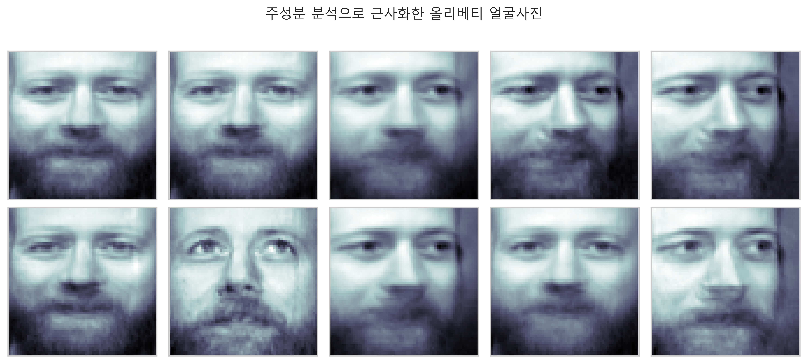

# PCA

### 1. PCA의 의미
- `PCA principle component analysis` : `주성분 분석`
    - 고차원의 데이터 집합이 주어졌을 때 이 데이터 집합과 가장 비슷하면서 더 낮은 차원의 데이터를 찾아내는 방법
    - **차원축소 demension reduction** 라고 부르기도 한다.
- 더 낮은 차원의 데이터값의 변화가 더 높은 차원의 데이터값의 변화를 설명할 수 있다는 의미로 해석할 수 있다.
- N개의 M차원 데이터가 있을 때, 이 데이터들은 서로 다른 값을 갖는다. 붓꽃 데이터의 꽃잎과 꽃받침의 길이와 폭에 대한 각각의 꽃들이나, 보스턴 집값 데이터의 13가지 특징에 대한 각각의 집들이나 모두 서로 다른 값을 갖는다.
- 그러나 이러한 서로다른 값을 갖는 데이터들의 차이는 무작위로 만들어지는 것이 아니라 **특정한 규칙**에 의해 만들어진다.
- 예를들어서 붓꽃의 형태는 꽃잎과 꽃받침의 세부적인 특징이 다르다고 해도, 일정한 형태를 벗어난 완전히 다른 형태를 갖지는 않는다. 즉 무제한의 자유도를 갖지 않는다. 왜냐하면 "붓꽃의 크기"라는 **잠재변수 latent variable** 가 측정한 데이터의 기저에서 데이터를 결정짓는 기능을 하기 때문이다.
- 따라서 PCA 에서는 이 잠재변수와 측정 데이터가 **선형적인 관계**로 연결되어 있다고 가정한다.

### 2. PCA의 기능
- 실제로 분석에 사용하는 데이터들은 N > M 일 수록 좋다. 데이터의 양이 종류보다 많을 수록 좋다는 의미이다. 예를들어 아파트 집값을 분석하기위해 데이터를 측정했을 때, 데이터의 종류 즉 역세권, 높이, 평수, 전망 등 아파트의 특징은 한정적이지만 실제로 측정한 아파트 데이터는 매우 많은 것과 같다.
- 일반적으로 실제 데이터의 측정 결과는 **선형종속에 가까운 경우가 많고**, **선형종속이면 역행렬이 존재하지 않는다**. 데이터의 역행렬이 존재하지 않는 것은 데이터의 상태가 나쁘다는 것을 의미하므로 데이터를 선별해야한다.
- 이러한 데이터의 선별, **M 개의 데이터 중 일부만 사용하고 일부는 버리는 행위를 해야한다.** 그런데 데이터를 필요없다고 무작정 삭제하는 것은 오히려 데이터 자체에 더 문제가 될 수 있으므로 **PCA 로 데이터를 저차원으로 압축해서 사용할 수 있다.**
- `즉 PCA 는 데이터의 잠재변수를 확인하는 기능도 있지만, 데이터의 차원을 변환한다는 의미에서 데이터의 상태를 개선하는 기능이 있다.`


### 3. PCA의 수학적 의미
- PCA 에서는 잠재변수와 측정 데이터가 선형적인 관계로 연결되어 있다고 가정한다. 즉 i 번째 표본의 측정 데이터 벡터 xi의 각 원소를 선형조합하면 그 뒤에 숨은 i번째 표본의 잠재변수 ui의 값을 계산할 수 있다고 가정한다.
    - 
    - 붓꽃 데이터에서 꽃받침의 길이와 꽃받침 폭을 선형조합하여 꽃의 크기를 나타내는 어떤 값을 찾은 것이라고 생각할 수 있다.
    - 
    - 하나의 꽃의 측정데이터, 꽃잎의 길이와 폭, 꽃받침의 길이와 폭으로 이루어진 4차원의 데이터를 1차원으로 축소한 것과 같은 의미이다.

#### 차원축소와 벡터공간 투영
- 차원축소문제는 다차원의 벡터를 더 낮은 차원의 벡터공간에 투영하는 문제로 생각할 수 있다. 즉 특잇값분해에서 다룬 `로우-랭크 근사 low-rank approximation 문제`가 된다. 이 문제는 다음과 같이 서술 할 수 있다.
    - **n 개의 M 차원 벡터 x1, x2, ... , xN** 을 정규직교인 기저벡터 **w1, w2, ... , wK 로 이루어진 K 차원 벡터공간으로 투영하여** 가장 비슷한 N 개의 K 차원 벡터  를 만드는 **정규직교 기저벡터 w1, w2, ..., wK 를 찾는다.**
    - 즉, M 차원 벡터 집합을 K 차원의 벡터공간에 투영하여 가장 비슷한 벡터 집합을 만들 수 있는 이 벡터공간을 구성하는 기저벡터(기저벡터는 정규직교함) w 벡터 집합을 찾는 것
    - **M 차원 벡터 -> K 차원 벡터공간 투영 -> 가장 비슷한 투영벡터 집합을 찾는다. -> 가장 비슷하도록 하는 기저벡터 w**
- 로우-랭크 근사문제와 달리 근사 성능을 높이기 위해 직선이 원점을 지나야 한다는 제한조건을 없앤다. 따라서 문제는 다음과 같이 바뀐다.
    - N 개의 M 차원 데이터 벡터 x1, x2, ..., xN 에 대해 **어떤 상수 벡터 x0 를 뺀 데이터 벡터 x1-x0, x2-x0,...,xN-x0** 을 정규직교인 기저벡터 w1, w2,...,wK 로 이루어진 K 차원 벡터공간으로 투영하여 가장 비슷한 n 개의 K 차원 벡터  를 만드는 **정규직교 기저벡터 w1,w2,...,wk 와 상수 벡터 x0 를 찾는다.**
- N 개의 데이터를 1차원 직선에 투영하는 문제라고 하면 원점을 지난는 직선을 찾는게 아니라 원점이 아닌 어떤 임의의 점 x0를 지나는 직선을 찾는 문제로 바뀐 것이다. 이 문제의 답은 다음과 같다.
    - x0 은 데이터 벡터 x1,x2,...,xN 의 **평균벡터**이고, w1,w2,...,wk는 **가장 큰 K개의 특잇값에 대응하는 오른쪽 특이벡터 v1,v2,...,vK 이다.**
    - `x0 = 평균벡터, w1,...,wk = 오른쪽특이벡터 중 K 번째 까지(가장 큰 K 개의 특잇값에 대응)`
- 3차원의 데이터 집합을 2차원 평면에 투영하여 새로운 데이터 집합을 만들때 어떤 평면을 선택해야 원래의 데이터와 투영된 데이터가 가장 차이가 적을 것인지, 이 평면을 찾는 것, 즉 PCA 는 근사 문제를 푸는 것과 같다.

#### 수학적 설명
- M 차원의 데이터 x 가 N 개 있을 때 이 데이터를 가능한 쓸모 있는 정보를 유지하면서 더 작은 차원인 K (K < M) 차원의 차원축소 벡터  로 선형변환하고자 한다.
- 데이터가 원점을 중심으로 존재한다고 가정한다. 이러한 경우에 벡터에 좌표변환에서 다룬 **변환행렬**을 곱하면 투영벡터를 계산할 수 있다.
    -   ()
    - 
- 모든 데이터 xi(i=1,2,...,N) 에 대해 변환을 하면 벡터가 아닌 행렬로 표시할 수 있다.
    - 
    - 
- 행렬 X 는 벡터 xi 를 행으로 갖는 행렬이고, 행렬 $\hat{X}$ 는 벡터  를 행으로 갖는 행렬이다. PCA의 목표는 변환 결과인 차원축소 벡터  의 정보가 원래의 벡터 xi 의 정보와 가장 유사하게 되는 변환행렬 W 값을 찾는 것이다. 

#### 역변환행렬의 도입
- 차원축소된 벡터는 K 차원이고 원래의 벡터 xi 는 M 차원이기 때문에 **두 벡터의 유사도를 직접 비교할 수 없다.** 따라서 차원축소 벡터  를 다시 M 차원 벡터로 변환하여  와 원래의 행렬을 비교하여 유사도를 구한다.
- 이때 차원축소 된 벡터를 다시 M 차원으로 선형 변형하는데 필요한 행렬을 **역변환행렬**이라고 한다. 변환행렬과 함께 역변환행렬도 찾는다.
    - 
    - 
    - 
    - 역변환행렬을 곱해서 만든 M 차원 벡터는 원래의 행렬 x 와 비슷하지만 완전히 같지는 않다.
- 이 역변환된 행렬을 차원축소하면 다시 차원축소 벡터  가 된다.
    - 
    - 따라서 변환행렬 W 와 역변환행렬 U 는 다음과 같은 관계를 따른다.
    - 

#### 최적화식 적용
- 역변환 행렬 U 를 알고 있다고 가정하면, 역변환 했을 때 원래 벡터 x와 가장 비슷해지는 차원 축소 벡터를 최적화를 이용하여 찾는다.
    - 
- 목적함수를 정리하면
    - 
- 목적함수를 최소화하는 문제이기 때문에, 이 식을 최소하기위해서  로 미분한 식이 영벡터가 되는 값을 찾는다.
    - 
    - 
    - 원래의 변환식  과 비교하면  가 된다는 것을 알 수 있다.
    - 
- 앞선 정리에서  이고,  임을 확인하였으므로, 최적화 문제를 변형하면 변환행렬 W 를 찾는 문제가 된다.
    - 
    - 모든 데이터에 적용하면,
    - 
- 따라서 변환행렬 W 를 찾는 문제는 랭크-K 차원 근사문제가 되어, `W 는 가장 큰 K 개의 특잇값에 대응하는 오론쪽 특이벡터로 만들어진 행렬이 된다는 것을 알 수 있다.`

### 4. Numpy

#### 1) 붓꽃 데이터에서 잠재변수 찾기
- 붓꽃 데이터에서 붓꽃의 크기라는 잠재변수를 찾아본다.
```
from sklearn.datasets import load_iris

iris = load_iris()
N = 10

# 데이터 10개(10송이의 붓꽃)만 선택하고 꽃받침의 길이와 폭만 사용
X = iris.data[:N, :2]
X

=====print=====

array([[5.1, 3.5],
       [4.9, 3. ],
       [4.7, 3.2],
       [4.6, 3.1],
       [5. , 3.6],
       [5.4, 3.9],
       [4.6, 3.4],
       [5. , 3.4],
       [4.4, 2.9],
       [4.9, 3.1]])
```

- 붓꽃 데이터 10개의 꽃받침의 길이와 폭을 그래프로 나타내보면, 꽃받침의 길이가 클 수록 꽃받침의 폭도 커진다는 것을 알 수 있다.
```
plt.plot(X.T, 'o:')
plt.xticks(range(4), ['꽃받침 길이', '꽃받침 폭'])
plt.xlim(-0.5, 2)
plt.ylim(2.5, 6)
plt.title('붓꽃 크기 특성')
plt.legend(['표본 {}'.format(i+1) for i in range(N)])
plt.show()
```


#### 2) 스캐터 플롯으로 꽃받침의 길이와 폭의 잠재변수 확인
- 꽃받침의 길이와 폭은 서로 상관관계가 있다는 것을 알 수 있다.
- 이 상관관계가 꽃받침의 길이와 폭의 데이터의 자유도를 기저에서 제약하는 변이, 잠재변수라는 것을 알 수 있다.
```
plt.figure(figsize=(8,8))
ax = sns.scatterplot(0,1, data=pd.DataFrame(X), s=100, color='.2', marker='s')

### 표본의 이름의 위치를 정해주는 코드
for i in range(N) :
    ax.text(X[i, 0] - 0.05, X[i, 1] + 0.03, '표본 {}'.format(i+1))
plt.xlabel('꽃받침의 길이')
plt.ylabel('꽃받침의 폭')
plt.title('붓꽃 크기 특성 (2차원 표시)')
plt.axis('equal')
plt.show()
```


#### 3) 붓꽃 데이터를 차원축소하여 그래프로 확인
- 2차원 데이터를 1차원으로 차원축소 한뒤 다시 2차원으로 복귀
- 원래 행렬 -> 변환행렬 곱하기 -> 차원축소벡터 -> 역변환행렬 곱하기 -> 원래 행렬과 유사한 행렬로 복귀
- sklearn 의 decomposition 서브패키지는 PCA 클래스를 제공한다. 
- 입력인수
     - n_component : 정수 (축소할 차원, 1이면 1차원으로 축소, 2이면 2차원으로 축소)
- 매서드
     - fit_transform() : 특징행렬을 낮은 차원의 근사행렬로 변환, 차원축소
     - inverse_transform() : 변환된 근사행렬을 원래의 차원으로 복귀, 역변환행렬을 곱해서 만든 행렬
- 속성
     - mean_ : 평균벡터, 로우-랭크 근사문제에서 원점으로부터 이동한 상수벡터 x0
     - components_ : 주성분 벡터, 원래 행렬에 가장 유사하게 만드는 정규직교하는 기저벡터 w 
```
from sklearn.decomposition import PCA

pca1 = PCA(n_components=1)         # PCA 클래스 호출
X_low = pca1.fit_transform(X)      # X 를 차원축소하여 1차원 근사데이터의 집합을 만들어준다.
X2 = pca1.inverse_transform(X_low) # X_low 를 다시 2차원 데이터로 복귀해준다.

plt.figure(figsize=(7,7))

# 좌표 이름의 위치를 정해줄 d 변수를 좌표마다 조건을 붙여서 상황에 맞게 적용
# marker='s' 는 사각형, d는 다이아몬드 등...
ax = sns.scatterplot(0, 1, data=pd.DataFrame(X), s=100, color='.2', marker='s')   
for i in range(N) :
    d = 0.03 if X[i, 1] > X2[i, 1] else 0.04
    ax.text(X[i, 0]-0.065, X[i, 1]+d, '표본 {}'.format(i+1))
    # X 와 차원축소 된 좌표들을 잇는 점선
    plt.plot([X[i, 0], X2[i, 0]], [X[i, 1], X2[i, 1]], 'k--')   

# 차원축소된 좌표에 동그라미 표시
plt.plot(X2[:, 0], X2[:, 1], 'o-', markersize=10)
# 꽃받침의 길이와 폭의 평균인 지점에 큰 다이아몬드 표시
plt.plot(X[:, 0].mean(), X[:, 1].mean(), markersize=10, marker='D')   
# 꽃받침의 길이와 폭의 평균이 지점을 수직,수평으로 잇는 빨간색 직선
plt.axvline(X[:, 0].mean(), c='r')   
plt.axhline(X[:, 1].mean(), c='r')
plt.grid(False)   # 격자 그리드 제거
plt.xlabel('꽃받침 길이')
plt.ylabel('꽃받침 폭')
plt.title('Iris 데이터의 1차원 차원축소')
plt.show()
```
- 그래프에서 2차원의 붓꽃 데이터를 1차원의 데이터로 축소한 것을 볼 수 있다. 
- 각각의 붓꽃 벡터와 거리가 가장 작게 되는 방향으로 주성분 벡터 w 가 그려졌다. 
- 이 벡터 w 는 원점이 아닌 임의의 상수 벡터 x0 를 지나는 직선이다. x0 는 붓꽃 데이터의 평균값이다.


#### 4) sklearn의 PCA 클래스에서 제공하는 속성 확인
- 데이터의 평균값 : 붓꽃 데이터의 평균값, 주성분 벡터가 지나는 임의의 점 x0 의 값이기도 하다.
```
pca1.mean_

=====print=====

array([4.86, 3.31])
```

- 주성분 벡터 w
- 랭크-K 차원 근사문제의 풀이에 의하여 w 는 특잇값분해의 가장 큰 특잇값에 대응하는 오른쪽특이벡터 또는 고윳값분해의 가장 큰 고윳값에 해당하는 고유벡터와 같다.
- 즉 붓꽃의 크기 = 0.68 x 꽃받침의 길이 + 0.73 x 꽃받침의 폭 을 의미한다.
```
pca1.components_

=====print=====

array([[0.68305029, 0.73037134]])
```

- 특잇값분해로 특이벡터 확인
```
X0 = X - X.mean(axis=0)
U, S, VT = np.linalg.svd(X0)
VT[:,0]

=====print=====

array([-0.68305029, -0.73037134])
```

- 고윳값분해로 고유벡터 확인
```
XCOV = X0.T @ X0
W, V = np.linalg.eig(XCOV)

# 고윳벡터중 가장 큰 고윳값에 해당하는 것
# argmax 는 가장 큰 데이터의 인덱스를 가져온다.
V[:, np.argmax(W)]

=====print=====

array([-0.68305029, -0.73037134])
```

#### 5) 차원축소 벡터, 역변환 벡터의 확인
- 8 번째 꽃의 꽃받침의 길이와 폭
```
X[7, :]

=====print=====

array([5. , 3.4])
```

- 이 데이터를 차원축소한 값
```
X_low[7]

=====print=====

array([0.16136046])
```

- 주성분 x (원래 행렬 - 평균값) = 차원축소 벡터
- 원래 행렬에서 평균값을 빼는 의미는 원점을 지나는 직선이 아닌 원점에서 x0 만큼 떨어진 점을 지나는 직선을 의미함.
```
pca1.components_ @ (X[7, :] - pca1.mean_)

=====print=====
array([0.16136046])
```

- 역변환 벡터는 원래 행렬과 거의 유사하다.
- 8 번째 꽃
```
X2[7, :]

=====print=====

array([4.97021731, 3.42785306])
```

#### 6) setosa 종으로 PCA 적용
- PCA 결과
     - 꽃의 크기라는 잠재변수는 다음과 같은 선형조합의 형태이다.
     - 꽃의 크기 : 0.67 X 꽃받침의 길이 + 0.73 X 꽃받침의 폭 + 0.1 X 꽃잎의 길이 + 0.06 꽃잎의 폭

```
X_setosa = iris.data[:50, :]
pca = PCA(n_components=1)
X_low_setosa = pca.fit_transform(X_setosa)
pca.components_

=====print=====

array([[0.6690784 , 0.73414783, 0.0965439 , 0.06356359]])
```

#### 7) 올리베티 얼굴이미지를 사용한 PCA

#### 올리베티 얼굴이미지 종류
```
num = list(range(0,400,10))
face_unique = faces_all.images[num]

N = 8
M = 5
fig = plt.figure(figsize=(10,15))
plt.subplots_adjust(top=0.5, bottom=0, hspace=0, wspace=0.05)
for i in range(N) :
    for j in range(M) :
        k = i * M + j
        ax = fig.add_subplot(N, M, k+1)
        ax.imshow(face_unique[k], cmap=plt.cm.bone)
        ax.xaxis.set_ticks([])
        ax.yaxis.set_ticks([])
        plt.title('올리베티 이미지 {}'.format(k), fontsize=8)
plt.tight_layout()
plt.show()
```


#### 25 번째 이미지를 선택한 후 이미지 확인
```
from sklearn.datasets import fetch_olivetti_faces

faces_all = fetch_olivetti_faces()
K = 25
# 25 번째 이미지를 faces 변수에 저장
faces = faces_all.images[faces_all.target==K]

N = 2
M = 5
fig = plt.figure(figsize=(10, 5))
plt.subplots_adjust(top=1, bottom=0, hspace=0, wspace=0.05)

# 이미지를 2행 5열로 나타내기 위해 for 문을 사용
# i = 0 이면 k 는 0,1,2,3,4 가 되고, i = 1 이면 k 는 5,6,7,8,9
for i in range(N) :       # i = 0, 1
    for j in range(M) :   # j = 0,1,2,3,4
        k = i * M + j
        ax = fig.add_subplot(N, M, k+1)        # 2X5 로 layout 을 설정하고, 각 칸의 인덱스를 지정
        ax.imshow(faces[k], cmap=plt.cm.bone)  # 위에서 지정한 인덱스에 k 번째 이미지가 위치하게 된다.
        ax.grid(False)
        ax.xaxis.set_ticks([])
        ax.yaxis.set_ticks([])
plt.suptitle('올리베티 얼굴 사진')
plt.tight_layout()
plt.show()
```


#### 주성분 2개인 PCA 분석 적용
- 올리베티 이미지는 4096 차원이다.
- 이것을 2차원의 벡터 공간에 투영시켜 차원축소 한다.
```
from sklearn.decomposition import PCA

pca3 = PCA(n_components=2)   # 주성분 2 설정
X3 = faces_all.data[faces_all.target==K]   # K=25
W3 = pca3.fit_transform(X3)   # 25 번째 이미지의 데이터를 차원축소
X32 = pca3.inverse_transform(W3)   # 역변환행렬
```

#### PCA 로 근사화한 이미지 확인
- 차원축소 후 역변환 시킨 근사 이미지
- 원래 이미지와 거의 유사하다. 약간 흐릿한 부분들이 보인다.
```
N = 2
M = 5
fig = plt.figure(figsize=(10,5))
plt.subplots_adjust(top=1, bottom=0, hspace=0, wspace=0.05)
for i in range(N) :
    for j in range(M) :
        k = i * M + j
        ax = fig.add_subplot(N, M, k+1)
        ax.imshow(X32[k].reshape(64,64), cmap=plt.cm.bone)
        ax.grid(False)
        ax.xaxis.set_ticks([])
        ax.yaxis.set_ticks([])
plt.suptitle('주성분 분석으로 근사화한 올리베티 얼굴사진')
plt.tight_layout()
plt.show()
```


#### PCA 의 결과인 평균, 주성분의 이미지 확인
- 2 개의 주성분 이미지가 나타내는 특징이 무엇인지 확인
```
face_mean = pca3.mean_.reshape(64,64)
face_p1 = pca3.components_[0].reshape(64,64)
face_p2 = pca3.components_[1].reshape(64,64)

plt.subplot(131)
plt.imshow(face_mean, cmap=plt.cm.bone)
plt.grid(False)
plt.xticks([])
plt.yticks([])
plt.title('평균얼굴')
plt.subplot(132)
plt.imshow(face_p1, cmap=plt.cm.bone)
plt.grid(False)
plt.xticks([])
plt.yticks([])
plt.title('주성분 1')
plt.subplot(133)
plt.imshow(face_p2, cmap=plt.cm.bone)
plt.xticks([])
plt.yticks([])
plt.title('주성분 2')
plt.show()
```


#### 평균얼굴에 주성분 1을 더한 얼굴 확인
- 주성분의 비중을 다르게 하여 평균값에 곱한 후 그 차이를 살펴본다.
- 주성분 1의 의미는 정면을 바라보는 얼굴과 왼쪽으로 얼굴을 돌린 모습을 구분한다.
```
N = 2
M = 5
fig = plt.figure(figsize=(10,5))
plt.subplots_adjust(top=1, bottom=0, hspace=0, wspace=0.05)
for i in range(N) :
    for j in range(M) :
        k = i * M + j
        ax = fig.add_subplot(N, M, k+1)
        w = 1.5 * (k-5) if k < 5 else 1.5 * (k-4)
        ax.imshow(face_mean + w * face_p1, cmap=plt.cm.bone)
        ax.grid(False)
        ax.xaxis.set_ticks([])
        ax.yaxis.set_ticks([])
        plt.title('주성분1의 비중={}'.format(w))
plt.suptitle('평균 얼굴에 주성분 1을 더한 사진')
plt.tight_layout()
plt.show()
```

#### 평균얼굴에 주성분 2를 더한 얼굴 확인
- 주성분 2의 의미는 정면을 바라보는 것과 위쪽을 바라보는 것의 모습을 구분해준다.
```
N = 2
M = 5
fig = plt.figure(figsize=(10,5))
plt.subplots_adjust(top=1, bottom=0, hspace=0, wspace=0.05)
for i in range(N) :
    for j in range(M) :
        k = i * M + j
        ax = fig.add_subplot(N, M, k+1)
        w = 1.5 * (k-5) if k < 5 else 1.5 * (k-4)
        ax.imshow(face_mean + w * face_p2, cmap=plt.cm.bone)
        ax.grid(False)
        ax.xaxis.set_ticks([])
        ax.yaxis.set_ticks([])
        plt.title('주성분 2의 비중={}'.format(w))
plt.suptitle('평균 얼굴에 주성분 2를 더한 사진')
plt.tight_layout()
plt.show()
```


- 즉 25번째 얼굴 이미지 10장에서 잠재변수를 확인하고 2가지의 특징을 확인 할 수 있었다.

#### 8) 주식가격의 PCA
- 판다스 데이터리더의 주식가격 데이터를 로드하여 PCA 를 적용한다.
- 미국, 유럽, 일본, 한국의 지난 20년간의 주가 데이터를 로드한다.
```
pd.core.common.is_list_like = pd.api.types.is_list_like
import pandas_datareader.data as web
import datetime

symbols = [
    'SPASTT01USM661N',
    'SPASTT01JPM661N',
    'SPASTT01EZM661N',
    'SPASTT01KRM661N',
]

data = pd.DataFrame()
for sym in symbols :
    data[sym] = web.DataReader(sym, data_source='fred',
                               start=datetime.datetime(1998, 1, 1),
                               end=datetime.datetime(2017, 12, 31))[sym]

data.columns = ['US', 'JP', 'EZ', 'KR']
data = data / data.iloc[0] * 100

styles = ['b-.', 'g--', 'c:', 'r-']
data.plot(style=styles)
plt.title('세계 주요국의 20년간의 주가')
plt.show()
```


#### 연간 주식 수익률 구하기
- 4 X 20 의 특징행렬이 된다.
```
df = ((data.pct_change() + 1).resample('A').prod() -1).T * 100
print(df.iloc[:, :])

=====print=====

DATE  1998-12-31  1999-12-31  2000-12-31  2001-12-31  2002-12-31  2003-12-31  \
US     14.249290   10.800392    1.094171   -9.638213  -17.680773   23.135271
JP     -8.567915   47.802619  -18.365577  -23.827406  -16.923968   19.628102
EZ     21.308040   36.872314    1.375330  -21.857080  -30.647772   12.066127
KR     10.411582   87.623876  -46.975114   27.644005    4.448180   15.121124
```

#### 국가별 연간수익률을 그래프로 나타내기
```
df.T.plot(style=styles)
plt.title('주요국의 과거 20년간 연간수익률')
plt.xticks(df.columns)
plt.show()
```


#### 연간수익률의 잠재변수를 확인하기 위하여 PCA 적용
- 즉 20년간의 국가별 주가의 연간 수익률의 변화의 요인이 무엇인지 파악하고자 하는 것
- 실제데이터는 이보다 더 많은 잠재변수들이 적용된다.
```
from sklearn.decomposition import PCA

pca2 = PCA(n_components=1)
w = pca2.fit_transform(df)
```

- 평균값은 미국,유럽,일본,한국의 20년간 연간수익율의 평균값이다.
```
m = pca2.mean_
m, m.shape

=====print=====

(array([  9.35024903,  45.7748003 , -15.71779759,  -6.91967355,
        -15.20108361,  17.48765584,  10.95568389,  32.60609686,
         11.08048721,   9.94632162, -44.28095456,  27.19782058,
          8.32897696, -12.63319273,  11.86532327,  23.41445161,
          5.34108071,   3.42888451,   2.14468408,  17.2613721 ]), (20,))
```

- 주성분 확인
- 나라마다 주가를 다르게 하는 요인
```
p1 = pca2.components_[0]
p1, p1.shape

=====print=====

(array([-0.00270658,  0.53651512, -0.39468113,  0.41148841,  0.23991661,
        -0.0315062 , -0.02577946,  0.27841406, -0.07254126,  0.28104992,
         0.03493189,  0.23635416,  0.15424312,  0.05797757, -0.0706337 ,
        -0.2543979 , -0.09127243, -0.01132363, -0.00264183,  0.06046709]),
 (20,))
```

#### 평균과 주성분을 그래프로 확인
- 주성분의 특징을 확인하기 위해 과장해서 나타냄
```
xrange = np.linspace(1998, 2017, 20, dtype=int)
for i in np.linspace(0, 100, 5) :
    plt.plot(xrange, m + p1 * i)

plt.plot(xrange, m + p1 * 100, label='주성분의 100배를 추가한 수익율')
plt.plot(xrange, m, 'ko-', lw=5, label='평균 수익율')
plt.title('주성분 크기에 의한 주가수익률의 변화')
plt.legend()
plt.show()
```


#### 주성분이 가지는 의미
- 차원축소 벡터는 각 나라마다 주성분의 비중을 의미한다.
- 즉 나라마다 주가를 차이나게 하는 잠재변수는 한국에서 가장 비중이 높다. 영향을 많이 미친다.
- 따라서 미국,유럽,일본 이라는 데이터로부터 한국 이라는 데이터로 변화시키는 요인 즉 중진국 요인을 의미한다.
```
df_w = pd.DataFrame(w)

df_w.index = df.index
df_w.columns = ['주성분 비중']
print(df_w)

=====print=====

       주성분 비중
US -33.413784
JP -20.943197
EZ -26.917702
KR  81.274683
```

#### 9) PCA 클래스의 다른 속성 값
- pca.explained_variance_ratio_ : 누적 설명 분산량, 각각의 주성분이 차지하는 비율
- sum(pca.explained_variance_ratio_) : 누적 설명 분산량의 합, 각각의 주성분이 전체 분산에서 차지하는 비율
