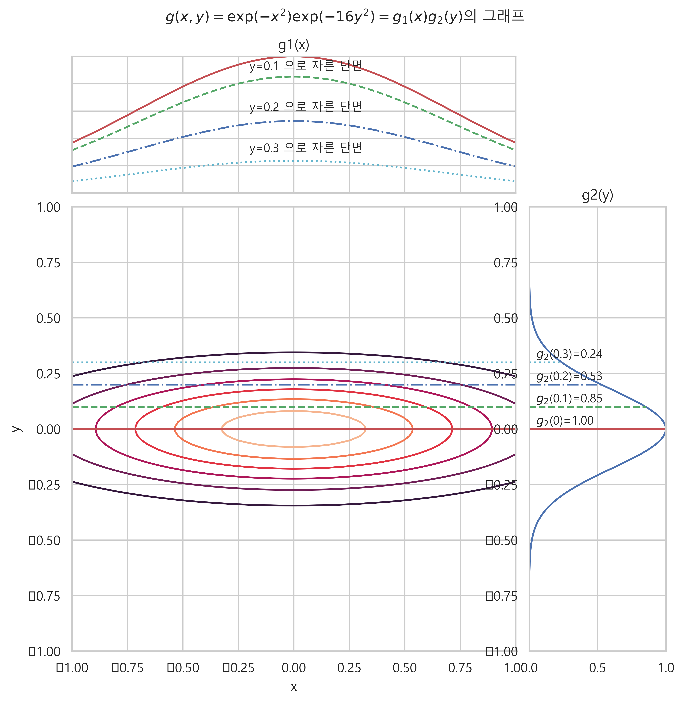

# 데이터분석과 함수

### 1. 함수

#### 데이터분석에서의 함수의 의미
- 입력데이터를 원하는 출력데이터로 만들어주는 **좋은 함수**를 찾는 것이 중요
    - `좋은 함수` : 성능이 떨어지는 **함수를 개선해서 좋은 함수로 만드는 과정**이 필요하다.
    - `미분, 적분` : 입력값이나 계수가 바뀌었을 때, 출력이 어떻게 변하는지를 알려주는 일종의 **신호**와 같다. 입출력 변화의 신호.
    - `범함수` : 함수 자체를 입력받아서 **함수의 점수**를 출력해준다.
    - 이외에도 미분과 적분, 부정적분, 정적분, 도함수, 행렬의 미분 등이 데이터분석에 활용된다.

#### 함수의 정의
- `함수 function` : 입력값을 출력값으로 바꾸어 출력하는 관계
    - 입력데이터를 받아서 출력데이터로 만들어 내보낸다.
    - `정의역 domain` : 입력값의 범위, 실수 전체인 경우가 대부분.
    - `공역 range` : 출력값의 범위
    - 1,2,3... → function → 2,4,6,...
    - **입력된 값에 대해서 항상 같은 출력값이 나와야 함수관계가 성립한다.**
- 함수관계는 실생활의 다양한 현상에 적용 된다. **서로 관계를 맺는 모든 숫자의 쌍은 함수이다.**
    - 엠프, 전자렌지, 선풍기, 보일러 등의 조절나사의 각도, 입력버튼의 누른 횟수 x 와 출력되는 결과물의 크기나 정도 y
    - 등산할 때 출발점에서 간 거리 x 와 그 위치의 고도 y
    - 자동차가 이동한 거리 x 와 연료 사용량 y 등.
- 정의역이 유한개의 원소로 이루어져 있으면 함수는 일종의 표 lookup table 이 된다.
    - 파이썬의 딕셔너리 {} 로 함수를 구현할 수 있다.

#### 변수
- `변수 variable` : 어떤 숫자를 대표하는 기호 sign. x, y, z 등으로 표기한다.
    - `입력변수 input variable` : 입력값을 대표하는 변수
    - `출력변수 ouput varialbe` : 출력값을 대표하는 변수
    - 변수와 수식을 사용하여 입출력값의 관계를 표현 할 수 있다.
- 함수의 표기 : f, g, h 등으로 표기한다.
    - x → 2x , y = 2x
    - f(x) = 2x
    - g(x) = 2x + 5
    - h(x) = 1/2x + 1

#### 연속과 불연속
- `불연속 discontinuous` : 함수의 값이 중간에 변하는 것.
- `연속 continuous` : 함수의 값이 변하지 않고 연속적인 것.
- `불연속 함수`
    - `부호함수 sign function` : 입력값이 양수이면 1, 0이면 0, 음수이면 -1 을 출력. x=0 에서 불연속인 함수.
        - 
    - `단위계단 함수 heaviside step function` : 입력값이 0보다 크거나 같으면 1, 0보다 작으면 0 을 출력하는 함수.
        - 
    - `지시함수 indicator function` : 미리 지정된 값이 입력되면 1, 지정된 값이 아니면 0을 출력하는 함수
        - 
        - 
    - 지시함수는 데이터 중에서 특정한 데이터만 선택하여 그 갯수를 세는 데 사용되기도 한다.
        -  (데이터의 값이 0인 것의 갯수)
        -  (데이터의 값이 1인 것이 갯수)

#### 역함수
- `역함수 inverse function` : 어떤 함수의 입력,출력 관계와 **정반대의 입력,출력 관계를 갖는 함수.**
    - 
- 역함수 기호와 함수의 역수 기호는 유사하지만 혼동하며 안된다.
    - 
- `모든 함수가 항상 역함수를 갖는 것은 아니다.`
    - 서로 다른 입력값이 같은 출력값을 갖는 함수의 경우 역함수가 존재하지 않는다.
    -  는 역함수가 존재하지 않는다. 그러나 x 의 범위를 양수로 제한하면 역함수가 존재한다. 

### 2. 데이터분석에서 많이 사용되는 함수 10가지

#### `다항식 함수 polynomial function`
- 상수항 c0 와 거듭제곱 항의 선형조함으로 이루어진 함수
    - 

#### `최대함수와 최소함수`
- 두 개의 인수 중에서 큰 것 또는 작은 것을 출력해주는 함수
    - 
    - 

#### `렐루 함수 ReLU rectified lenear unit`
- 최대함수에서 y 를 0 으로 고정시킨 함수. x가 양수이면 x, x가 음수이면 0 이 출력된다.
- 인공신경망에서 사용된다.
    - 

#### `지수함수 exponential function`
- `밑 base 가 오일러 수 (약 2.718) 이고, 입력값을 거듭제곱으로 하는 함수`
- exponential : 기하급수적, 지수의
    - 
    - 
- 넘파이에서 e 는 오일러수, exp() 명령은 지수함수를 계산해준다.
- `지수함수의 특징`
    - 오일러수는 양수이므로 거듭제곱한 수는 항상 양수이다.
    - x=0 일 때 1 이다.
    - x가 양의 무한대로 가면 y도 양의 무한대로 간다.
    - x가 음의 무한대로 가면 y는 0으로 다가간다.
    - x1 > x2 이면 exp x1 > exp x2 이다. (단조증가)
    - 두 지수함수의 곱은 입력값 합의 지수함수값과 같다.
        - 

#### `로지스틱 함수 logistic function`
- 지수함수를 변형한 함수이다. 회귀분석이나 인공신경망 분야에서 자주 사용된다.
- 시그모이드 함수 sigmoid function 의 하나이다. 시그모이드 함수 중 대표적이므로 시그모이드 함수 = 로지스틱 함수로 쓰인다.
    - 
- 로지스틱 함수의 특징
    - x가 양의 무한대로 갈 수록 y는 1에 가까워진다.
    - x가 음의 무한대로 갈 수록 y는 0에 가까워진다.
    - x가 0일때 y는 0.5이다.

#### `로그 함수 log function`
- 지수함수의 역함수이다.
- 지수함수의 출력이 특정한 값이 되게 하는 입력값을 찾는 것과 같다.
    - 
    - 
    - 
- 지수함수의 특징
    - 입력값은 항상 양수여야 한다.
    - x > 1 → y > 0
    - x = 1 → y = 0
    - 0< x < 1 → y < 0
    - x1 > x2 → logx1 > logx2
- 넘파이 : np.log()

#### `로그 함수의 성질`
- `곱하기를 더하기로 변환한다.`
    - 
    - 
    - 
- `어떤 함수에 로그를 적용해도 함수의 최고점, 최저점의 위치는 변하지 않는다.`
    - 높낮이는 바뀌어도, 최고점, 최저점의 위치는 바뀌지 않는다.
    - 최적화 할 때 함수에 로그를 취해서 최적화를 하는 경우가 많다. 
- `로그 함수는 0부터 1사이의 작은 값을 확대해서 보여준다.`
    - 입력값 0부터 1사이에 대하여 음의 무한대부터 0사이의 값으로 보여준다.
    - 따라서 확률값과 같이 0~1 사이의 **작은 값을 확대하여 비교를 잘 할 수 있게 해준다.**

#### `소프트 플러스 함수 softplus function`
- 지수함수와 로그함수를 결합하여 만든 함수.
- ReLU 함수와 유사하지만, x=0 에서 부드럽게 변하는 장점이 있다.
    - 

#### `다변수 함수 multivariate function`
- 복수의 입력변수를 갖는 함수. **2차원 함수** 라고도 한다.
- 두 개의 독립변수 x, y 를 갖고, 출력변수 z 를 내보내는 함수.
    - 
    - 
- 다변수 함수의 대표적인 예로 평면상의 지형이 있다. 위도 x, 경도 y를 입력받아서 고도 z를 출력하는 함수이다.
- 서피스 플로 surface plot, 컨투어 플롯 contour plot 을 사용하여 나타낼 수 있다.

#### `분리가능 다변수 함수 separable multivariable function`
- 다변수 함수 중에는 **단변수의 곱**으로 나타낼 수 있는 함수들이 있다. 이러한 함수를 **분리가능 다변수 함수**라고 한다.
    - 
    - 확률론에서 중요하게 사용되는 함수이다.
- 2차원 함수는 지형도와 같으므로 x 또는 y 둘중 하나를 상수값으로 고정 시킬 수 있다. 이럴경우 움직일 수 있는 변수는 하나가 되어 1차원 단변수함수가 된다.
- **지형도의 단면의 모양과 같게된다.**
    - 
    - k0 는 고정된 값이므로 f(y) 만 조절한 모양이 된다.

#### `다변수 다출력 함수`
- **여러개의 변수를 받아서 여러개의 출력변수로 나타내주는 함수.** 벡터나 행렬로 출력할 수 있다.
- 소프트맥스 함수 softmax function : 다차원 벡터를 입력받아서 다차원 벡터를 출력해준다. 또한 **다변수 입력을 확률 처럼 보이게 출력해주는 특징**이 있어서 인공신경망의 마지막단에서 출력을 조건부로 변형하는데 사용된다. (벡터를 확률로 출력)
    - 
- `출력벡터의 특징`
    - **모든 출력원소는 0과 1사이의 값을 갖는다.** : 지수함수값이 모두 양수이고, 분모가 분자보다 크기 때문이다.
    - **모든 출력원소의 합은 1이다.**
    - **입력원소의 크기 순서와 출력원소의 크기 순서가 같다.** : 단조증가 (x1 > x2 -> f(x1) > f(x2))

#### `함수의 이동`
- 그래프 상에서 함수를 이동시킬 수 있다.
- 단변수 함수의 이동
    - **x축 방향의 이동은 수식 적용시 부호 반대**
    - x축으로 +a 만큼 이동 : 
    - x축으로 -a 만큼 이동 : 
    - **y축 방향의 이동은 수식 적용시 부호 같음**
    - y축으로 +b 만큼 이동 : 
    - y축으로 -b 만큼 이동 : 
- 다변수 함수의 이동
    - **수식 적용시 부호가 반대**
    - x축으로 +a, y축으로 +b 이동 : 

#### `함수의 스케일링`
- 단변수 함수의 스케일링
    - x축으로 a배 늘이기 : 
    - y축으로 b배 늘이기 : 

# 3. Python 에서 함수 사용하기

### 1) 표를 사용하여 함수 나타내기
- 유한한 갯수의 정의역 (입력값의 범위)을 갖는 함수 f 는 표 형태로 나타낼 수 있다. 
- dictionary 데이터 타입을 사용한다.

```
f = {
    1:2,
    2:4,
    3:6,
    4:8,
    5:10
}

f

=====print=====

{1: 2, 2: 4, 3: 6, 4: 8, 5: 10}
```
```
f[1], f[2], f[3], f[4], f[5]

=====print=====

(2, 4, 6, 8, 10)
```

### 2) 함수 정의하기
- 정의역이 무한개 일 때는 표로 나타낼 수 없다. 변수를 사용하여 함수 관계를 수식으로 표현한다.

```
def f(x) :
    return 2 * x

x = 10
y = f(x)

print("f({}) = {}".format(x, y))

=====print=====

f(10) = 20
```
```
def g(x) :
    return 1/2 * x + 1

x = 5
y = g(x)

print("f({}) = {}".format(x, y))

=====print=====

f(5) = 3.5
```

### 3) 불연속함수
- 부호함수, 단위계단함수, 지시함수 등

#### 부호함수 sign function

```
np.sign(-1000), np.sign(0), np.sign(1000)

=====print=====

(-1, 0, 1)
```
#### 단위계단함수 Heaviside step function

```
def heaviside_step(x) :
    # isinstance 는 파라미터의 타입이 정의한 것과 일치하는지 여부를 T/F 로 출력해준다.
    if isinstance(x, np.ndarray) :
        # np.where 는 배열의 각 요소가 해당 조건에 일치하는지를 확인하고 값을 변경해서 반환해준다.
        return np.where(x >= 0, 1, 0)
    else :
        return 1.0 if x >= 0 else 0.0

heaviside_step(-0.001), heaviside_step(0), heaviside_step(0.0001), heaviside_step(np.array([1,2,-3]))

=====print=====

(0.0, 1.0, 1.0, array([1, 1, 0]))
```

#### isinstance(x, condition) 명령어 확인
- x 가 condition 에 일치하면 True, 일치하지 않으면 False 를 출력한다.
```
isinstance(np.array([1,2,3]), np.ndarray)

=====print=====

True
```
```
isinstance({1:2}, dict)

=====print=====

True
```

#### np.where() 의 기능
- 넘파이의 배열의 요소들을 조건에 따라서 조건에 포함되면 x, 조건에 포함되지 않으면 y를 입력해서 변환해준다.
- np.where(condition, [x, y])

```
a = np.arange(10)
# 5보다 작으면 a, 5보다 크면 10*a 로 변환해준다.
np.where(a < 5, a, 10*a)

=====print=====

array([ 0,  1,  2,  3,  4, 50, 60, 70, 80, 90])
```
### 4) 함수의 그래프 표현
- 맷플로립의 라인플롯을 사용하여 함수를 그래프로 표현 할 수 있다.
- 함수의 특징에 따라서 파이플롯의 여러가지 명령어들을 사용하여 표현 가능하다.

#### 함수를 테이블로 나타내기
```
def f(x) :
    return x**3 - 3*(x**2) + x

x = np.linspace(-1, 3, 9)
y = f(x)

table_f = dict(zip(x, y))
table_f

=====print=====

{-1.0: -5.0,
 -0.5: -1.375,
 0.0: 0.0,
 0.5: -0.125,
 1.0: -1.0,
 1.5: -1.875,
 2.0: -2.0,
 2.5: -0.625,
 3.0: 3.0}
```

#### 함수를 그래프로 표현하기
- 정의역의 범위가 좁다.

```
# 입력변수 x와 출력변수 y를 지정
plt.plot(x, y, 'ro-')
plt.title('함수 $f(x)=x^3-3x^2+x$의 그래프')
# 그래프의 전체 범위
plt.xticks(np.arange(-4,6))
plt.yticks(np.arange(-6,5))
# 그래프에 실제 보여지는 범위
plt.xlim(-2,4)
plt.show()
```


#### 정의역의 범위를 늘려서 그래프가 곡선에 가깝게 변환

```
x = np.linspace(-1, 3, 400)
y = f(x)
plt.plot(x,y)   # plt.plot(x,y,'ro-',ms=1)
plt.title('함수 $f(x)=x^3-3x^2+x$의 그래프')
plt.xticks(np.arange(-4,6))
plt.yticks(np.arange(-6,5))
plt.xlim(-2,4)
plt.show()
```


### 5) 부호함수와 단위계단함수를 라인플롯으로 나타내기

```
def heaviside_step(x) :
    if isinstance(x, np.ndarray) :
        return np.where(x>=0,1,0)
    else :
        return 1.0 if x>=0 else 0.0

def sign(x) :
    return np.sign(x)

x = np.linspace(-1,1,1000)

sign = sign(x)
step = heaviside_step(x)

plt.figure(figsize=(7,4))
plt.subplot(121)
plt.plot(x,sign)
plt.title('부호함수')
plt.ylim(-1.5,1.5)

plt.subplot(122)
plt.plot(x,step)
plt.title('헤비스텝 함수')
plt.ylim(-1.5,1.5)
plt.show()
```


### 6) 역함수의 그래프

```
def f1(x) :
    return x ** 2

def f1_inv(x) :
    return np.sqrt(x)

x = np.linspace(0,3,300)
plt.plot(x, f1(x), 'r-', label='함수 $f(x) = x^2$')
plt.plot(x, f1_inv(x), 'b--', label='함수 $f^{-1}(x) = \sqrt{x}$')
plt.plot(x, x, 'g--')
plt.axis('equal')
plt.xlim(0,2)
plt.ylim(0,2)
plt.legend()
plt.title('역함수의 그래프')
plt.show()
```


### 7) 렐루 ReLU 함수

```
xx = np.linspace(-10,10,100)

# np.maximum(x,0) 은 x와 0을 비교하여 큰 수를 남겨준다.
# np.minimum(x,y) 는 x와 y를 비교하여 작은 수를 남겨준다.
plt.plot(xx, np.maximum(xx, 0))
plt.title('max(x,0) 또는 ReLU 함수')
plt.xlabel('$x$')
plt.ylabel('$ReLU(x)$')
plt.show()
```


#### np.maximum(), np.minmum() 확인

```
x2 = np.linspace(-10,10,20)
x2

=====print=====

array([-10.        ,  -8.94736842,  -7.89473684,  -6.84210526,
        -5.78947368,  -4.73684211,  -3.68421053,  -2.63157895,
        -1.57894737,  -0.52631579,   0.52631579,   1.57894737,
         2.63157895,   3.68421053,   4.73684211,   5.78947368,
         6.84210526,   7.89473684,   8.94736842,  10.        ])

x3 = np.arange(-10,10)
x3

=====print=====

array([-10,  -9,  -8,  -7,  -6,  -5,  -4,  -3,  -2,  -1,   0,   1,   2,
         3,   4,   5,   6,   7,   8,   9])
```
- maximum 은 인수로 받은 배열을 인덱스별로 비교하여 큰 값을 출력해준다.
```
np.maximum(x2,x3)

=====print=====

array([-10.        ,  -8.94736842,  -7.89473684,  -6.84210526,
        -5.78947368,  -4.73684211,  -3.68421053,  -2.63157895,
        -1.57894737,  -0.52631579,   0.52631579,   1.57894737,
         2.63157895,   3.68421053,   4.73684211,   5.78947368,
         6.84210526,   7.89473684,   8.94736842,  10.        ])
```
- np.minimum 은 인수로 받은 배열을 인덱스별로 비교하여 작은 값을 출력해준다.
```
np.minimum(x2,x3)

=====print=====

array([-10.,  -9.,  -8.,  -7.,  -6.,  -5.,  -4.,  -3.,  -2.,  -1.,   0.,
         1.,   2.,   3.,   4.,   5.,   6.,   7.,   8.,   9.])
```

### 8) 지수함수

#### 오일러수
```
np.e

=====print=====

2.718281828459045
```

#### 지수함수
```
np.exp(-10), np.exp(-1), np.exp(0), np.exp(1), np.exp(10)

=====print=====

(4.5399929762484854e-05,
 0.36787944117144233,
 1.0,
 2.718281828459045,
 22026.465794806718)
```
#### 그래프
```
xx = np.linspace(-2,2,100)
yy = np.exp(xx)

plt.title('지수함수')
plt.plot(xx, yy)
# axhline 은 수평선, axvline 수직선 을 그려준다.
plt.axhline(1, c='r', ls='-.', linewidth=0.7)
plt.axhline(0, c='g', ls='-.', linewidth=0.7)
plt.axvline(0, c='k', ls='-', linewidth=0.7)
plt.xlabel('$x$')
plt.ylabel('$exp(x)$')
plt.show()
```


#### 지수함수의 특징
- 서로 다른 입력변수를 받는 두 지수함수의 곱은 입력변수의 합의 지수함수의 값과 같다.
```
np.exp(2 + 3), np.exp(2) * np.exp(3)

=====print=====

(148.4131591025766, 148.4131591025766)
```

### 9) 로지스틱 함수
```
def logistic(x) :
    return 1 / (1 + np.exp(-x))

xx = np.linspace(-10,10,100)
plt.plot(xx, logistic(xx))
plt.title('로지스틱 함수')
plt.xlabel('$x$')
plt.ylabel('$\sigma(x)$')
plt.axhline(0.5, c='k', ls='--', linewidth=0.6)
plt.text(0.25, 0.43, '(0, 0.5)', fontsize=7.5)
plt.show()
```


### 10) 로그함수
- 로그함수의 입력값은 지수함수의 출력값과 같고 로그함수의 결과값은 지수함수의 입력값가 같다.
- 즉 log 10 = 2.3025851 일 때, 10 은 지수함수의 출력값이고, 2.3025851 은 지수함수의 입력값이다.
- 지수함수의 출력값을 특정값으로 만들고 싶다면, 로그에 출력값을 넣어서 나온 결과가 지수함수의 입력값이 된다.

```
np.log(10)

=====print=====

2.302585092994046

np.exp(2.3025851)

=====print=====

10.000000070059542
```

#### 그래프
```
xx = np.linspace(0.01, 8, 100)
yy = np.log(xx)

plt.plot(xx, yy)
plt.title('로그 함수')
plt.axhline(0, c='r', ls='--', linewidth=0.75)
plt.axvline(1, c='r', ls='--', linewidth=0.75)
plt.axvline(0, c='r', ls='--', linewidth=0.75)
plt.xlabel('$x$')
plt.ylabel('$log(x)$')
plt.show()
```


#### 지수함수와 로그함수의 역함수 관계 그래프
```
def exp_function(x) :
    return np.exp(x)

def log_function(x) :
    return np.log(x)

x = np.linspace(-5, 5, 300)

plt.figure(figsize=(7,4))
plt.title('지수함수와 로그함수 역함수관계')
plt.plot(x, exp_function(x), 'r', label='$f(x)=e^x$')
plt.plot(x, log_function(x), 'b', label='$f(x)=logx$')
plt.plot(x, x, 'g--', label='$f(x)=x$')
plt.axhline(0, c='k', ls='-', linewidth=0.75)
plt.axvline(0, c='k', ls='-', linewidth=0.75)
plt.xticks(np.arange(-4,4))
plt.xticks(np.arange(-4,4))
plt.xlim(-4, 4)
plt.ylim(-3, 3)
# plt.legend() 는 각 그래프의 label을 표시해준다.
plt.legend()
plt.show()
```


### 11) 로지스틱 함수와 역함수
```
np.log(np.e)

=====print=====

1.0
```
```
def logistic_function(x) :
    return 1 / (1 + np.exp(-x))

def logistic_inv(x) :
    return np.log(x / (1 - x))

xx = np.linspace(-4, 4, 100)
xxx = np.linspace(0.01, 2, 100)

plt.plot(xx, logistic_function(xx), 'r-', label='로지스틱 함수')
plt.plot(xxx, logistic_inv(xxx), 'b-', label='로지스틱 역함수')
plt.plot(x, x, 'g--', linewidth=0.6, label='$f(x)=x$')

plt.axhline(0.0, c='k', ls='-')
plt.axvline(0.0, c='k', ls='-')
plt.plot(0.5, 0, 'ro', ms=5)
plt.plot(0, 0.5, 'ro', ms=5)
plt.plot(0, 0, 'ko', ms=5)

plt.xticks(np.arange(-4,4))
plt.yticks(np.arange(-3,3))
plt.xlim(-4, 4)
plt.ylim(-3, 3)

plt.title('로지스틱함수와 역함수')
plt.text(0.6, -0.3, '0.5')
plt.text(-0.4, 0.6, '0.5')
plt.legend(loc='upper right', bbox_to_anchor=(0,1), fontsize='medium')
plt.show()
```


### 12) 로그함수의 성질
- 데이터분석에서 가장 중요한 함수중에 하나이다.

#### 성질 1. 곱하기를 더하기로 변환해준다.
#### 성질 2. 어떤 함수에 로그를 취하면 최고점, 최저점의 위치는 변하지 않는다.
```
def ff(x) :
    return x ** 3 - 12*x + 20 * np.sin(x) + 7

xx = np.linspace(-4, 4, 300)
yy = ff(xx)

plt.subplot(211)
plt.plot(xx, yy)
plt.axhline(1, c='r', ls='--')
plt.yticks([0, 1, 5, 10])
plt.ylim(-2, 15)
plt.title('$f(x)$')

plt.subplot(212)
plt.plot(xx, np.log(yy))
plt.axhline(0, c='r', ls='--')
plt.title('$\log f(x)$')

plt.tight_layout()
plt.show()
```


#### 성질 3. 0과 1사이의 입력값에 대해 확대하여 보여준다.
```
np.random.seed(0)
x = np.random.rand(5)
x = x / x.sum()

plt.subplot(211)
plt.title('0, 1 사이의 숫자들의 $\log$ 변환')
plt.bar(range(1, 6), x)
plt.ylim(0, 1)
plt.ylabel('x')

plt.subplot(212)
plt.bar(range(1,6), np.log(x))
plt.ylabel('$\log x$')

plt.show()
```


- 함수와 로그값을 비교
```
x = np.random.rand(5)
y = x / x.sum()
log_y = np.log(y)

print(x)
print(y)
print(log_y)

=====print=====

[0.6176355  0.61209572 0.616934   0.94374808 0.6818203 ]
[0.17787844 0.17628299 0.17767641 0.27179856 0.1963636 ]
[-1.72665488 -1.73566467 -1.72779131 -1.30269409 -1.62778722]
```

### 13) 소프트 플러스 함수
- ReLU 함수와 모양이 유사한 함수.
- x=0 에서 부드럽게 변화하는 특징이 있다.

```
def soft_plus(x) :
    return np.log(1 + np.exp(x))

xx = np.linspace(-10, 10, 200)

plt.plot(xx, soft_plus(xx), 'r-', label='softplus 함수')
plt.plot(xx, np.maximum(xx, 0), 'b--', linewidth=0.8, label='ReLU 함수')
plt.title('소프트플러스 함수')
plt.xlabel('$x$')
plt.ylabel('Softplus($x$)')
plt.xticks(np.arange(-5, 5))
plt.xlim(-5, 5)
plt.ylim(-1, 6)
plt.legend()
plt.show()
```


### 14) 다변수 함수 
- 2차원 함수
- x, y 복수의 입력변수를 받아서 z를 출력하는 함수
- 평면상의 지형이 대표적이 예이다.

```
def f(x,y) :
    return 2 * x**2 + 6 * x * y + 7* y**2 - 26 * x - 54 * y + 107

xx = np.linspace(-3, 7, 100)
yy = np.linspace(-3, 7, 100)

# np.meshgrid() : 벡터를 정방행렬로 변환시켜주는 명령어
X, Y = np.meshgrid(xx, yy)
# 다변수 함수에 정방행렬을 입력변수로 넣는다.
Z = f(X, Y)

fig = plt.figure()
ax = fig.gca(projection='3d')
ax.plot_surface(X, Y, Z, linewidth=0.1)

# ax.view_init(elev, azim) : 보이는 앵글 설정. elev 는 z 평면의 고도, azim 은 x,y 평면의 방위각
ax.view_init(40, -110)
plt.xlabel('x')
plt.ylabel('y')
ax.set_zlabel('z')
plt.title('서피스 플롯')
plt.show()
```


- contour plot
```
CS = plt.contour(X, Y, Z, levels=np.logspace(0, 3, 10))
plt.clabel(CS, fmt='%d')
plt.title('컨투어 플롯')
plt.show()
```


#### np.meshgrid(x, y)
- N 차원 벡터를 N X N 차원 정방행렬로 변환시켜준다.
- 두 개의 행렬 변수로 출력해주는데, x 벡터는 전치연산하여 아래로 확장한 행렬로 변환하고 (열을 행으로), y 벡터는 벡터자체를 옆으로 확장한 행렬로 변환해 준다 (행을 열로).
- numpy의 배열로 보면 1차원 배열을 2차원 배열로 변환시켜준다.
- 연산을 쉽게 처리 할 수 있다. 

```
a = np.array([1,2,3,4])
b = np.array([5,6,7,8])

A, B = np.meshgrid(a, b)

A

=====print=====

array([[1, 2, 3, 4],
       [1, 2, 3, 4],
       [1, 2, 3, 4],
       [1, 2, 3, 4]])


B

=====print=====

array([[5, 5, 5, 5],
       [6, 6, 6, 6],
       [7, 7, 7, 7],
       [8, 8, 8, 8]])

A+B

=====print=====

array([[ 6,  7,  8,  9],
       [ 7,  8,  9, 10],
       [ 8,  9, 10, 11],
       [ 9, 10, 11, 12]])
```

### 15) 분리가능 다변수 함수
- 두개의 단변수 함수의 곱으로 이루어진 다변수 함수에서 하나의 변수를 고정하게 되면, 나머지 변수 하나만 변형이 가능하게 되면 1차원 평면이 된다.
- 2차원 지형도의 1차원 단면과 같은 모양이다.
```
# 캔버스에 그려지는 요소들의 최종위치를 결정하기 위한 기하학적 변형 클래스 : 다양한 프레임워크가 내장되어 있다.
from matplotlib import transforms

# 맷플롯립의 서브패키지 ticker 의 NullFormatter 클래스 : Formatter 클래스의 하위 클래스이다.
# axis 클래스로 지정한 눈금의 위치와 형식을 사용하며, 단일눈금의 축에 문자열을 반환해준다.
from matplotlib.ticker import NullFormatter

def g1(x) :
    return np.exp(-x ** 2)

def g2(y) :
    return np.exp(-16 * y ** 2)

# 분리가능 다변수 함수의 수식 : g(x,y) = g1(x)g2(y)
def g(x, y) :
    return g1(x) * g2(y)

xx = np.linspace(-1, 1, 100)
yy = np.linspace(-1, 1, 100)
X, Y = np.meshgrid(xx, yy)
Z = g(X, Y)

left, width = 0.1, 0.65
bottom, height = 0.1, 0.65
bottom_h = left_h = left + width + 0.02

# 사각형 피규어의 사이즈 설정
rect = [left, bottom, width, height]
rectx = [left, bottom_h, width, 0.2]
recty = [left_h, bottom, 0.2, height]

plt.figure(1, figsize=(8,8))
ax = plt.axes(rect)
axx = plt.axes(rectx)
axy = plt.axes(recty)

# 눈금선에 맞춰서 문자열을 입력하기 위한 클래스 선언
nullfmt = NullFormatter()
axx.xaxis.set_major_formatter(nullfmt)
axx.yaxis.set_major_formatter(nullfmt)

# 지형도
ax.contour(X, Y, Z)
ax.axhline(0, c='r', ls='-')
ax.axhline(0.1, c='g', ls='--')
ax.axhline(0.2, c='b', ls='-.')
ax.axhline(0.3, c='c', ls=':')
ax.set_xlabel('x')
ax.set_ylabel('y')

# g1(x) 함수의 그래프
# g1(xx) 는 고정 된 값, g2(y) 는 변화 가능.
axx.plot(xx, g1(xx), c='r')
axx.plot(xx, g2(0.1) * g1(xx), c='g', ls='--')
axx.plot(xx, g2(0.2) * g1(xx), c='b', ls='-.')
axx.plot(xx, g2(0.3) * g1(xx), c='c', ls=':')
axx.set_title('g1(x)')
# 문자열의 좌측 위치는 -0.2로 고정, 그래프 높이에 따라서 높이만 수정
axx.text(-0.2, 0.3, 'y=0.3 으로 자른 단면')
axx.text(-0.2, 0.6, 'y=0.2 으로 자른 단면')
axx.text(-0.2, 0.9, 'y=0.1 으로 자른 단면')

# g2(y) 함수의 그래프
base = axy.transData
rot = transforms.Affine2D().rotate_deg(-90)
# plot 의 인수 transform 에 위에서 캔버스의 모양을 변형시킨 값을 넣어준다.
axy.plot(yy, g2(yy), transform=rot + base)
axy.set_title('g2(y)')
axy.axhline(0, xmax=g2(0), c='r', ls='-')
plt.text(0.05, 0.02, '$g_2$(0)={:.2f}'.format(g2(0)))
axy.axhline(0.1, xmax=g2(0.1), c='g', ls='--')
plt.text(0.05, 0.12, '$g_2$(0.1)={:.2f}'.format(g2(0.1)))
axy.axhline(0.2, xmax=g2(0.2), c='b', ls='-.')
plt.text(0.05, 0.22, '$g_2$(0.2)={:.2f}'.format(g2(0.2)))
axy.axhline(0.3, xmax=g2(0.3), c='c', ls=':')
plt.text(0.05, 0.32, '$g_2$(0.3)={:.2f}'.format(g2(0.3)))

axx.set_xlim(ax.get_xlim())
axx.set_ylim(0, 1)
axy.set_ylim(ax.get_ylim())
axy.set_xlim(0, 1)

# suptitle 이 캔버스와 겹칠 떄는 y의 좌표값을 지정해주면 겹치지 않게 할 수 있다.
# y = 1 이면 겹치고, 2 이면 캔버스 전체 높이의 2 배로 벌어지고, -1 이면 캔버스 아래쪽에 설정된다.
plt.suptitle('$g(x,y) = \exp(-x^2)\exp(-16y^2)=g_1(x)g_2(y)$의 그래프', y=1.04)
plt.show()
```



### 16) 다변수 다출력 함수
- 소프트맥스 함수
```
def softmax(x, w) :   # x 는 1차원벡터, w 는 가중치벡터
    e = np.exp(w * x)
    return np.exp(w * x) / e.sum()

x = [2.0, 1.0, 0.5]
y = softmax(x, np.ones(3))
```
#### 소프트맥스 함수의 출력값의 합은 1이다.
```
np.sum(y)

=====print=====

1.0
```
#### 가중치가 커지면 최댓값과 최솟값의 차이가 더 벌어진다.
```
y_1 = softmax(x, np.ones(3))
y_2 = softmax(x, 4 * np.ones(3))

# 가중치 1 일때와 가중치 4 일때의 변화량 비교
print('{:.3f}'.format(y_1[0] - y_1[2]))
print('{:.3f}'.format(y_2[0] - y_2[2]))

=====print=====

0.488
0.977
```

### 17) 함수의 이동과 스케일링

#### 로지스틱 함수를 x축으로 +5, y축으로 -1 만큼 이동

```
def logistic(x) :
    return 1 / (1 + np.exp(-x))

xx = np.linspace(-10, 10, 100)

plt.plot(xx, logistic(xx), label='$sigma(x)$', ls='-')
plt.plot(xx, logistic(xx-5)-1, label='$sigma(x-5)-1$', ls='--')
plt.legend()
plt.title('로지스틱 함수를 오른쪽으로 5, 아래로 1만큼 이동')
plt.show()
```


#### 변수가 둘인 다변수함수를 오른쪽으로 0.5, 위로 0.75 평행이동
```
def g(x, y) :
    return np.exp(-x ** 2 -16 * y ** 2)

xx = np.linspace(-1, 1, 100)
yy = np.linspace(-1, 1, 100)

X, Y = np.meshgrid(xx, yy)
Z1 = g(X, Y)
# 오른쪽으로 0.5, 위쪽으로 0.75 만큼 평행이동
Z2 = g(X-0.5, Y-0.75)

plt.contour(X, Y, Z1)
plt.contour(X, Y, Z2, linestyles='--')
plt.text(-0.05, -0.02, 'f(x,y)')
plt.text(0.35, 0.73, 'f(x-0.5, y-0.75)')
plt.ylim(-0.5, 1)
plt.title('다변수함수의 평행이동')
plt.show()
```


#### 로지스틱 함수 스케일링
- x축 방향으로 1/2배, 2배
- y축 방향으로 2배
```
def logistic(x) :
    return 1 / (1 + np.exp(-x))

xx = np.linspace(-6, 6, 100)

plt.plot(xx, logistic(xx), label='$\sigma(x)$', c='r', ls='-')
plt.plot(xx, logistic(2*xx), label='$\sigma(2x)$', c='g', ls=':', linewidth=0.75)
plt.plot(xx, 2*logistic(2*xx), label='$2\sigma(2x)$',  c='g', ls='-', linewidth=0.7)
plt.plot(xx, logistic(1/2*xx), label='$\sigma(1/2x)$', c='k', ls=':', linewidth=0.75)
plt.plot(xx, 2*logistic(1/2*xx), label='$2\sigma(1/2x)$', c='k', ls='-', linewidth=0.7)
plt.title('로지스틱함수의 스케일링 : x축 방향 1/2,2배, y축 방향 2배 ', y=1.04)
plt.legend()
plt.show()
```


