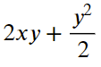
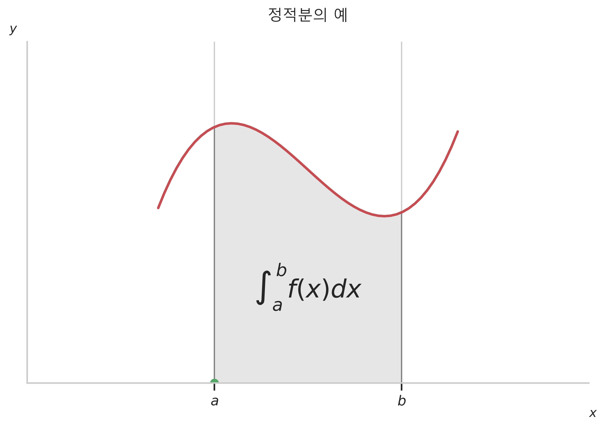

# 적분, 행렬의 미분, 범함수

# 1. 적분

### 1) 부정적분
- `적분 integral` : 적분은 미분과 반대되는 개념이다. 적분에는 **부정적분 indefinite integral**, **적분 definite integral** 이 있다.
    - 부정적분 : 도함수의 원래 함수를 찾는 작업. 미분의 반대 과정.
    - 적분 : "정해져 있다.". 특정 구간에 해당하는 그래프의 면적을 구하는 작업.

#### `부정적분 indefinite integral`
- 부정적분은 **미분의 반대 anti-derivative** 개념이다. 도함수를 f(x)라고 할 때 도함수를 만들어 낸 원래 함수 F(x) 를 찾는 과정 또는 그 결과를 의미한다.
    - 
    - dx 는 x로 F를 x로 미분했다는 의미로 편미분에 대응하는 적분이라는 표기
    - C 는 상수항으로 미분을 하면 0이 되어 사라진 것을 의미한다. C에 대한 부정적분의 해는 무한개이다. 표기를 생략하기도 한다.

#### `편미분의 부정적분`
- 다변수 함수를 도함수라고 할 때 원래의 다변수 함수를 찾는 작업. 도함수의 결과가 다변수 함수라는 것은 원래의 함수 F도 다변수 함수이며 이것을 편미분한 결과라는 의미이다.
- 따라서 편미분 과정에서 변수 x 또는 y를 사용하기 때문에, 주어진 도함수 f를 적분할 때에도 x, y로 각각 적분해야 원래의 함수 F를 찾을 수 있다.
>- x로 부정적분 : 
>- y로 부정적분 : 
- C(x), C(y)는 상수항 또는 x, y의 함수일 수 있다. 원래의 함수 F를 한변수로 미분하면 다른변수는 상수항 처럼 취급되어 0이 되기 때문이다.

#### `다차도함수와 다중적분`
- 2차 도함수와 같이 어떤 함수를 미분을 여러번 하여 구한 다차도함수의 경우 원래의 함수를 구하기 위해선 다중적분 multiple integration 을 해야한다. 여러번 적분을 한다는 의미이다.
- 함수 f(x,y)가 F(x,y)를 x로 한번, y로 한번 편미분하여 나온 이차 도함수라고 할때, 원래의 함수 F를 구하기 위해서는 y로 적분을 하고 다시 x로 적분을 해야한다.
>- 
>- 적분기호의 아래 변수명을 생략하여 쓰기도 한다 : 

#### `심파이를 이용한 부정적분`
- 단변수 함수 f를 적분 : sympy.integrate(f)
- 다변수 함수 f를 x로 적분 : sympy.integrate(f, x)
- 다변수 함수 f를 y로 적분 : sympy.integrate(f, y)

### 2) 정적분

#### `정적분 definite integral`
- 독립변수 x가 어떤 구간 [a,b]의 사이에 있을 때 **이 구간에서 f(x)의 값과 수평선 x축이 이루는 면적**을 구하는 행위 혹은 그 값을 의미한다.
>- 
- 정적분의 값은 숫자값이다.

#### `미적분학의 기본 정리 Fundamental Theorem Calculus`
- 함수 f의 특정 구간에서의 면적을 의미하는 정적분은 부정적분으로 구한 함수 F와 다음과 같은 관계가 성립하므로 미분과 관련이 있다.
>- 
- 즉 함수 F로부터 미분을 하면 도함수 f를 구할 수 있고, 도함수 f를 부정적분하면 원래의 함수 F를 구할 수있다. 함수 F의 b와 a의 값의 차는 도함수 f의 a와 b 사이의 면적과 같다.

#### `심파이를 이용한 정적분`
- 함수 f를 부정적분하여 함수 F를 구하고, 이 F를 사용하여 정적분 값을 구하는 방법
- 함수 f의 a,b 구간의 면적을 실제로 잘개 쪼갠 후 근사값을 구하는 **수치적분 numerical integration** 방법

#### `다변수 정적분`
- 입력변수가 2개인 2차원 함수 f(x,y)의 정적분
- 2차원 함수 f(x,y)는 다변수 함수로 지형도와 같다. 위도 x, 경도 y 를 입력받아 고도 z 값을 출력하는 함수.
- 이러한 2차원 함수를 정적분하면 2차원 평면에서 사각형의 **부피**와 같다.
> 

#### `수치이중적분`
- 단변수 함수의 정적분에서 수치적분 처럼 다변수함수의 정적분도 수치이중적분이 가능하다.
- 사이파이의 integrate 서브패키지의 dblquad() 명령을 사용한다.
    - sp.integrate.dblquad(func, a, b, gfun, hfun)
    - a, b : x의 범위, **x의 하한 lower bound, x의 상한 upper bound**
    - gfun, hfun : y의 범위. 함수 형태로 입력받는다. (lambda x : a, lambda x : b)

#### `다차원 함수의 단일정적분`
- 다차원 함수이지만 변수를 하나만 선택하여 정적분을 할 수도 있다. 이때에는 하나의 변수만 진짜로 보고 다른 변수는 상수항 처럼 취급하여 계산한다.
> 
- y가 변수가 아니라는 것을 강조한 표기 : 

# 2. 행렬의 미분

### 1) 행렬미분

#### `행렬미분 matrix differentiation`
- 벡터나 행렬을 입력 받아서 벡터나 행렬로 출력해주는 함수의 미분
- 여러가지 입력변수와 출력변수의 종류
    - 다변수 함수는 함수의 독립변수가 벡터인 경우이다.
    - 벡터 x -> 스칼라 f
    > 

    - 행렬 x -> 스칼라 f
    > 

    - 벡터나 행렬을 출력하는 함수는 여러 함수를 합쳐놓은 것으로 볼 수 있다.
    - 스칼라 x -> 벡터 f
    > 

    - 스칼라 x -> 행렬 f
    > 

    - 벡터나 행렬을 입력받아 벡터나 행렬을 출력할 수 있다.
    - 벡터 x -> 벡터 f
    > 

    - 벡터 x -> 행렬 f
    > 
- 행렬미분은 편미분의 일종이다.
- 행렬미분의 종류
    - 분자중심 표현법 Numerator-layout notation
    - 분모중심 표현법 Denominator-layout notation

#### `그레디언트  벡터 gadient vector`
- 데이터분석에서는 출력변수가 스칼라이고 입력변수가 x 벡터인 다변수함수인 경우가 많다. 즉 x의 요소들로 편미분을 해줘야 하므로 여러개의 편미분이 존재한다.
- **스칼라를 벡터로 미분하는 경우**에는 열벡터로 표기한다. 이렇게 만들어진 벡터를 **그레디언트 벡터** 라고 한다.
> 그레디언트 벡터 : 
- 그레디언트 벡터는 기울기로 이루어진 열벡터 이다.
- 2차원 함수, 다변수 함수 f(x,y)는 경도 x, 위도 y에 따라 출력되는 고도 z의 지형도와 같다. f(x,y)의 그레디언트 벡터.
> 
- 즉 다변수 함수를 행렬미분한 값인 그레디언트 벡터는 x로 미분한 도함수와 y료 미분한 도함수로 이루어져 있다.
- 그레디언트 벡터의 특징
    - **그레디언트 벡터의 크기는 함수 곡면의 기울기의 정도를 나타낸다.** 벡터의 크기가 클 수록 경사가 심하다는 것을 의미한다.
    - **그레디언트 벡터의 방향은 가장 경사가 심한 곳을 가리킨다.** 즉 단위 길이당 함숫값이 가장 크게 증가하는 방향을 가리킨다.
    - **그레디언트 벡터의 방향은 등고선의 방향과 직교한다.**
- **테일러전개식**을 사용하여 그레디언트 벡터의 방향과 등고선의 방향이 직교함을 증명할 수 있다.
>- 어떤 점 x0 에서 x로 이동하면서 함숫값이 얼마나 변하는지 테일러 전개를 사용하여 근사하면 다음과 같다.
>>- 
>- 이 식에서  가 가장 크려면, 변화의 방향인 (x-x0)와 그레디언트 벡터 의 방향이 같아야 한다. 곱해서 양수.
>- 또한 등고선에서는 x의 위치에 상관없이 같은 높이이므로 함수값이 같다.
>>- 
>- 등고선의 방향과 그레디언트 벡터의 방향을 테일러전개식에서 정리하면,
>>- 
>>- 

### 2) 행렬미분법칙

#### `행렬미분법칙 1 : 선형모형의 미분`
- 선형조합으로 이루어진 함수를 미분하면 그레디언트 벡터는 **가중치 벡터 w** 이다.
>- 
- x는 벡터이므로 x의 각 요소들 x1,x2,x3,..,xn 로 w^Tx 를 각각 미분한다. 선형조합은 w1x1+w2x2+...+wnxn 이므로 x의 요소에 **해당하지 않는 항은 미분하여 0이되어 없어지고, x의 요소에 해당하는 값들만 미분이되어 w1, w2, w3... 만 남게 된다.** 따라서 가중치 벡터가 된다.
>- 

#### `행렬미분법칙 2 : 이차형식의 미분`
- 이차형식 Quadratic : 벡터의 이차형식이란 어떤 벡터와 정방행렬이 **행벡터X정방행렬X열벡터** 형식으로 되어 있는 것을 의미한다.
>- 여러개의 벡터에 대하여 가중합을 동시에 계산
>> 
>- 잔차 = 목표값 - 예측값
>> 
>- 잔차 제곱합 RSS(Residual Sum of Squares) : 선형회귀모델의 성능을 평가할 수 있는 잔차의 크기는 잔차 제곱합으로 구할 수 있다. 잔차 제곱합은 잔차의 내적으로 간단하게 표현할 수 있다.
>> 
>- 잔차제곱합의 식에서 마지막항을 벡터의 이차형식이라고 한다. 이차형식은 i, j 의 모든 쌍의 조합에 가중치를 곱한 값들의 총합이 된다.(스칼라)
>> 
- 이차형식을 미분하면 행렬과 벡터의 곱이 된다
> 
- 선형조합을 벡터 x의 각 요소들로 미분을 하는 과정에서 선형조합을 aijxixj의 이중합으로 변환하면 현재 미분하려는 x의 요소에 대응하는 항만 남고 해당하지 않는 항은 0이되어 사라진다. 이 과정은 마치 행렬식의 여인수 전개에서 코펙터를 구하기 위해 i,j 번째를 제외하고 나머지 요소들을 제거하는 방식과 반대의 방식과 같다. (행렬식은 역행렬을 구할 때 사용된다. 역행렬은 행렬식이 0이 아닌 경우에만 존재한다)

#### `벡터를 스칼라로 미분`
- 함수 f1, f2,...,fn 을 벡터로 갖는 f(x)를 스칼라 x로 미분하는 경우에는 행벡터로 결과를 나타낼 수 있다.
>- 
>- 

#### `벡터를 벡터로 미분`
- 벡터를 입력으로 받아 벡터를 출력하는 함수 f(x)의 미분은 **도함수의 2차원 행렬**이 된다.
- 벡터를 벡터로 미분하면, 미분을 당하는 원소 N개와 미분을 하는 벡터의 원소 M개 이다.
>- 

#### `행렬미분법칙 3 : 행렬과 벡터의 곱의 미분`
- 행렬 A와 벡터 x의 곱 Ax를 벡터 x로 미분하면 행렬  가 된다.
>- 
>- 행렬과 벡터의 곱 정리에서 A를 열벡터들 c1, c2,...,cM 의 조합이라고 보면 Ax는 선형조합의 형태가 된다.
>>- 
>>- 
>>- 미분하는 변수인 x1, x2,...,xm에 대응하는 선형조합의 항만 남고 나머지 항은 상수항 처리되어 0으로 없어진다.

#### `자코비안 행렬 Jacobian matrix`
- 벡터를 벡터로 미분하는 경우와 같이 벡터를 입력받아 벡터를 출력하는 함수의 경우, 입력변수 요소 각각과 출력변수 요소 각각의 조합에 대해 모두 미분이 존재한다. 따라서 이러한 경우는 도함수가 행렬 형태가 된다.
    - 다차원 데이터의 미분, 벡터를 입력 받아서 벡터를 출력하는 함수를 미분하면 도함수의 행렬 형태가 된다.
- 이러한 **도함수의 행렬 형태를 자코비안 행렬 Jacobian matrix** 이라고 한다.
- 또한 벡터함수를 벡터 변수로 미분했을 때 생기는 행렬의 **전치행렬**이다. NXM -> MXN 의 형태가 된다..
> 
- 다음 함수의 자코비안 행렬을 구하시오.
>- 
>- 
>- 

#### `헤시안 행렬 Hessian matrix`
- 다변수함수의 2차 도함수는 그레디언트 벡터를 입력변수 벡터로 미분한 것으로 **헤시안 행렬** 이라고 한다.
- 헤시안 행렬은 그레디언트 벡터의 자코비안 행렬의 전치행렬로 정의한다.
>- 
>- 
- 함수가 연속이고 미분가능하면 헤시안 행렬은 **대칭행렬**이 된다.
    - 대칭행렬 : 
- 어떤 함수의 헤시안 행렬을 구하려면 그레디언트 벡터를 구하고, 자코비안 행렬을 구한 뒤, 전치연산한 행렬을 찾는다.
    - 그레디언트 벡터는 미분의 대상인 함수는 동일하고 미분할 변수가 여러개로, 함수안에 해당하는 변수가 있는 경우만 남게되어 간단하게 형태로 정리된다.
    - 자코비안 행렬은 미분의 대상인 함수가 여러개이고 미분할 변수도 여러개이므로, 함수 1 과 미분 변수 여러개, 함수 2와 미분변수 여러개 의 형태이다. 즉 모든 입출력변수의 조합에 대한 도함수가 행렬의 형태로 만들어 진다. 마찬가지로 각 함수에 해당하는 변수가 있는 경우만 남게 되고 없는 경우는 상수항 처리되어 없어진다. 자코비안 행렬에서 상수항만 남게 된다.
    - 자코비안 행렬을 구한 뒤 전치연산으로 형태를 바꿔주면 헤시안 행렬이 된다.

#### `스칼라를 행렬로 미분`
- 출력변수 f가 스칼라이값이고 입력변수 X가 행렬인 경우, 행렬로 스칼라를 미분하면 도함수의 행렬의 모양이 입력변수 X의 모양과 같다.
> 
- 행렬 X의 모든 원소들로 F를 미분하는 방식으로 X의 행렬 구조와 모양이 같다.

#### `행렬미분법칙 4 : 행렬 곱의 대각성분의 미분`
- 두 정방행렬의 곱으로 만들어진 행렬의 대각성분의 합을 곱한 순서상 뒤의 행렬로 미분하면, 앞의 행렬의 전치행렬이 된다.
- 대각합 trace : 행렬의 대각성분의 합. 행렬식, 놈과 함께 행렬의 크기를 계산하는 방법 중 하나.
>- 
>- 
>>- 
>>- 
- 행렬의 대각합의 요소들을 행렬 X의 요소들로 미분하면, X의 요소에 해당하는 대각합의 요소들은 미분이되어 w_i,j 만 남고, 해당하지 않는 요소들은 상수항 처리되어 0이 된다.
- 그러므로 남는 값은 w_i,j 즉 처음 행렬의 전치행렬이 된다.

#### `행렬미분법칙 5 : 행렬식의 로그의 미분`
- 행렬식 determinant 은 행렬의 크기에 해당한다. det(A), |A| 등으로 표기하며, 재귀적인 방식으로 계산된다. 즉 행렬을 정의하기 위해선 행렬 자신이 필요하다는 의미이다.
- 행렬식의 공식은 여인수 전개 cofactor expansion 라는 식을 말한다. i_0 또는 j_0 중 하나를 정한 후, 부호결정과 마이너(처음 행렬 소거후 남은 요소들로 만든 행렬의 행렬식)의 곱으로 이루어진 코펙터(=여인수)와 a_i0,j 번째 요소의 곱이다.
>- 
>- 
>- 
- 행렬식의 계산 결과는 스칼라이고, 이 값의 로그값도 스칼라이다. 이 값을 원래의 행렬로 미분하면 원래 행렬의 역행렬의 전치행렬이 된다.
>- 
>- 행렬식을 X 행렬의 요소 x_i,j로 미분하면, 행렬식의 정의에서 a_i,j 가 지워지고 C_i,j만 남는다.
>>- 
>- 따라서 행렬 X로 행렬식을 미분하면 C 가 된다. 역행렬의 정의에서 C는 다음과 같이 도출된다.
>>- 
>>- 
>>- 
>- 이것을 로그 함수의 미분 공식에 대입하면 원래행렬 X의 역행렬의 전치행렬이 된다.
>>- 
>>- 로그 함수의 미분은 연쇄법칙을 사용하여 풀이된다.

# 3. 범함수

### 1) 범함수 functional
- 데이터분석에서는 함수와 더불어 다양한 범함수를 사용한다.
- 범함수 functional 는 **함수를 입력받아서 실수를 출력해준다.** (함수 function 은 실수를 입력받아서 실수를 출력한다.)
    - 기댓값, 엔트로피 등을 계산할 때 사용된다.

#### ```범함수의 표기```
- 보통 알파벳 대문자로 표기하고, 입력변수인 함수를 대괄호로 감싼다.
>-  : 함수 y(x) 를 입력받는 다는 의미

#### ```범함수의 계산```
- 일반적으로 범함수는 **정적분 definite integral 로 계산한다.**
- 확률밀도함수 p(x) 를 정적분한 값으로 갖는 기댓값과 엔트로피도 범함수에 속한다.
>- 
>- 

#### ```변분법 functional calculus```
- 입력변수인 함수가 변하는 것에 따라 범함수의 출력이 어떻게 달라지는를 계산하는 학문을 의미한다.
- 미분과 같은 기능이다.

### 2) 범함수의 테일러 전개

#### ```테일러 전개```
- 테일러 전개 : 함수 f(x) 의 도함수를 사용하여 함수 f(x) 의 근삿값을 구하는 방법
- 함수 -> 단변수 함수 -> 다변수 함수 -> 변수를 수열로 변환 -> 수열을 함수로 변환 -> 범함수 의 순서대로 테일러 전개식을 확장 해본다.
- **일반 함수** f(x) 에 대한 테일러 전개식
>-   ( 은 아주 작은 실수)
- **단변수 함수** F(y)의 테일러 전개식, 일반함수의 테일러 전개식에서 표기문자만 바꿈. 입력변수는 y 라는 실수값.
>- 
- **다변수 함수** F(y1,y2,...,yN)일 경우의 테일러 전개식. 입력변수는 y1,y2,...,yN N개의 실수
>- 
>- 
- **조건 추가**
    - yi 는 xi 를 입력받아 출력된 어떤 값 : 
    - 엡실론i 는 xi 를 입력받는 임의의 함수에 아주 작은 공통상수를 곱한 값 : 
>- 
- 위의 식은 벡터나 수열을 입력받아 실수를 출력하는 함수의 테일러 전개와 같다고 볼 수 있다.
    - 수열 {y(x1), y(x2), ..., y(xN)} -> 함수 F({y(x1), y(x2), ..., y(xN)})
- 수열의 크기 N 을 무한대로 확장한다면 수열은 함수 f(x) 를 의미하게 된다. 따라서 위의 다변수 함수의 테일러 전개식에서 조건 2가지를 추가하여 정리한 식은 이제 **범함수 F[y(x)] 에대한 테일러 전개식이 된다.**
    - 함수 y(x) -> 함수 F[y(x)]
>- 

### 3) 범함수의 도함수

#### ```범함수의 도함수```
- 범함수의 테일러 전개식에서 상수의 변화에 따른 범함수 값의 변화. 위의 식을 정리한 것.
>- 
>>-  (어떤 함수 에타에 대해서도 이 값이 0 이 되려면)
- 따라서 이것을 **범함수의 도함수 functional derivative** 라고 한다. 일반함수의 도함수와 같은 역할을 한다. 범함수 F 를 미분했다는 의미로 델다 표기를 사용함.

#### ```적분형 범함수의 도함수```
- 대부분의 범함수는 x 에 대한 적분으로 정의된다. G 는 함수 y(x), 실수 x 를 입력변수로 받는 함수이다.
>- 
- 범함수 F 의 도함수는 다음과 같다. y 는 함수이지만 실수형 입력변수 처럼 생각하고 G 를 편미분했다는 의미로 partial 기호를 사용한다.
>- 

#### ```기댓값 범함수의 도함수```
- 확률밀도함수 p(x) 를 입력변수로 받는 기댓값 E 는 다음과 같이 정의되는 범함수 이다.
>- 
- 범함수의 정의에서 G(y, x) 에 기댓값 정의를 대입하면,
>-  이다.
- 따라서 y(x)=p(x) 에 대한 E 의 도함수는
>- 

#### ```그래디언트 부스팅의 도함수```
- 그래디언트 부스팅 gradient boosting 방법은 주어진 목표함수 y(x) 와 가장 비슷한 모형함수  를 구하기 위해 범함수의 손실함수를 사용하는 것을 말한다.
    - 최적화 optimization : 목적함수가 주어졌을 때 목적함수의 값을 최대, 최소로 만드는 모수를 찾는 것
    - 목적함수 : 최적화의 대상이 되는 함수. 성능의 크기를 측정하는 성능함수 performance function, 모형의 오차나 오류를 측정하는 손실함수 loss function, 오류함수 error function, 비용함수 cost function 등이 있다.
    - PCA 의 의미는 원래 차원의 행렬 x 와 유사한 행렬  를 찾는 문제이다. 이를 위해 차원축소한 행렬에 역변환행렬을 곱하여 원래 차원으로 만든 행렬과 원래 차원 행렬 x 와의 차를 최소화하는 가장 차이가 적은 유사한, 차원축소행렬을 찾는 과정을 거친다.
    >- 
    - 이 최적화 과정에서 최적화의 대상이 된 함수를 손실함수라고 할 수 있다.
- 범함수의 손실함수
>- 
>>-  (풀어서 정리한 후 미분)
>>- 

#### ```오일러-라그랑주 공식```
- x, y(x) 입력변수 이외에  추가로 y(x) 의 x 에 대한 도함수인  를 입력 변수로 받는 함수 G 의 도함수도 있을 수 있다.
    - G(y(x), y'(x), x)
>- 
- 이러한 범함수 F 의 함수 y 에 대한 도함수
>- 
-  와  는 함수 y와 y'을 별개의 변수처럼 생각하고 편미분 한 것을 의미한다.  는 편미분하여 구해진 함수를 다시 변수 x 로 미분한 결과를 의미한다.
- 즉 G 를 y 와 y 의 도함수로 각각 편미분하고, y' 으로 편미분한 것을 다시 x 로 미분한다.

#### ```최적제어 optional control```
- 최적화는 어떤 함수 f(x) 의 값을 최대 또는 최소로 만드는 독립변수 x 의 값을 찾는 것이다.
- 최적제어는 범함수 F[f(x)] 의 값을 최대 또는 최소로 만드는 독립함수 y(x) 를 찾는 것이다.
- 최적화의 필요조건은 도함수 값이 0 이 되는 x 값이 어야 한다.
>- 
- 최적제어도 마찬가지로 범함수의 도함수 값이 0 이 되는 최적의 함수 y(x) 이어야 한다.
>- 
- ```GAN general adversarial network``` : 딥러닝에서 현실 데이터와 가장 유사한 데이터를 재현하는 방법
    - 두 확률분포함수 p_data 와 p_model 이 있을 때 범함수의 값을 최대화하는 확률분포함수 p(x) 를 구한다.
>- 
>- 
>- 위의 식에서 로그미분과 결합법칙을 사용하여 정리하면,
>- 
>- 최적제어에 의한 최적의 확률분포 함수 p*(x) 는 이 값이 0 이 되도록 하는 값이다.
>>- 
>>- 

# 4. Python

### 1) 적분
- sympy.integrate()
- 심파이의 출력언어를 mathjax 로 설정
```
import sympy

sympy.init_printing(use_latex='mathjax')
```
- 심볼릭 연산 설정
```
x = sympy.symbols('x')
f = x * sympy.exp(x) + sympy.exp(x)
f

=====print=====
```


- 부정적분 연산
```
sympy.integrate(f)

=====print=====
```


### 2) 다변수 함수의 부정적분
- 변수 각각에 대한 부정적분을 구해준다.
```
x, y = sympy.symbols('x, y')
f = 2 * x + y
f

=====print=====
```


- 심볼 x 로 부정적분
```
sympy.integrate(f, x)

=====print=====
```


- 심볼 y 로 부정적분
```
sympy.integrate(f, y)

=====print=====
```


#### 부정적분 계산
```
x = sympy.symbols('x')
f = 2 + 6 * x  + 4 * sympy.exp(x) + 5/x
F = sympy.integrate(f)
F

=====print=====
```


```
x, y = sympy.symbols('x, y')
f = x * y * sympy.exp(x ** 2 + y ** 2)
F_x = sympy.integrate(f, x)
F_y = sympy.integrate(f, y)
F_x, F_y

=====print=====
```


### 3) 정적분
- 정적분은 함수의 특정 구간의 면적을 구하는 것과 같다.
```
from matplotlib.patches import Polygon

def f(x):
    return x ** 3 - 3 * x ** 2 + x + 6

a, b = 0, 2
x = np.linspace(a - 0.6, b + 0.6, 50)
y = f(x)

# Axes 객체를 만들어 준다.
ax = plt.subplot(111)
plt.title('정적분의 예', y=1.04)
plt.plot(x, y, 'r', linewidth=2)
plt.plot(0,0,'go')
# 그래프가 x 축과 만나는 지점, 방정식의 해가 도면의 바닥에 오게 한다. top=0 이면 방정식의 해의 위치가 도면의 위로 오게된다.
plt.ylim(bottom=0)

# 그래프 아래쪽의 면적에 해당하는 부분
ix = np.linspace(a, b)
iy = f(ix)
# 면적을 그려줄 범위를 list 안에 튜플타입 (x,y) 으로 저장, 함수에 따라서 면적의 범위를 잘 설정해줘야 한다. 시작하는 부분 끝나는 부분, x,y 값을 넣을 부분.
verts = [(a, 0)] + list(zip(ix, iy)) + [(b, 0)]
# Polygon 명령어에 verts를 인수로 넣어준다.
poly = Polygon(verts, facecolor='0.9', edgecolor='0.5')
# 실제로 객체를 만들어주는 patch 패키지에 Polygon을 넣는다.
ax.add_patch(poly)

# 도면에 텍스트 넣기, polygon 안에 위치하도록 인수 값을 조정, horizontalalignment 는 현재 지정한 위치를 기준으로 가운데로 오게끔 해준다.
plt.text(0.5 * (a+b), 0.2 * (f(a) + f(b)), r'$\int_a^b f(x)dx$', horizontalalignment='center', fontsize=20)
# figure에 text를 입력. figure 자체의 좌표를 기준으로 텍스트가 들어갈 위치를 설정해준다.
plt.figtext(0.9, 0.05, '$x$')
plt.figtext(0.1, 0.9, '$y$')

# 도면의 오른쪽과 윗부분의 axis 수직선 제거
ax.spines['right'].set_visible(False)
ax.spines['top'].set_visible(False)

# x축의 눈금의 위치를 bottom 으로 정의, 진한 눈금생긴다. top 이면 도면의 위로 올라간다.
ax.xaxis.set_ticks_position('bottom')
# x축의 눈금을 0, 2의 위치로 설정
ax.set_xticks((a, b))
# x축의 눈금 라벨을 바꾼다.
ax.set_xticklabels(('$a$', '$b$'))
ax.set_yticks([])
ax.set_xlim(-2, 4)
ax.set_ylim(0, 8)
plt.show()
```


### 4) 심파이로 정적분 계산
- 심파이로 정적분을 계산하는 방법은 2가지
    - 함수를 부정적분 하여 원래 함수를 구하고, 미적분학의 기본정리를 적용하여, 정적분 구간의 값을 원래함수에 넣어 계산하는 방법
    - 실제 함수의 면적을 구하는 수치적분 방법
- 수치적분으로 구한 값과 정적분으로 구한 값은 거의 같다.

#### 함수의 부정적분을 계산한 뒤 subs() 함수를 사용하는 방법
- 심볼릭 연산으로 부정적분을 구한다.
```
import sympy

sympy.init_printing(use_latex='mathjax')

x, y = sympy.symbols('x, y')
f = x**3 - 3*x**2 + x + 6
F = sympy.integrate(f)
F

=====print=====
```


- 부정적분으로 구한 원래함수에 정적분 할 구간값을 넣어준다.
- 심볼릭함수의 변수에 실제 값을 넣고 계산하려면, subs(), evalf() 매서드를 사용해야한다.
```
# a=0, b=2 구간

(F.subs(x,2) - F.subs(x,0)).evalf()

=====print=====
```


#### 수치적분으로 구하는 방법 numerical integration
```
def f(x) :
    return x**3 - 3*x**2 + x + 6

sp.integrate.quad(f, 0, 2)

=====print=====
```


### 5) 다변수 정적분
- 평면에서 x축으로 a~b 구가, y축으로 c~d 구간에 해당하는 사각형 영역의 부피
```
fig = plt.figure()
# ax를 설정하는 다른 방법
ax = fig.add_subplot(111, projection='3d')

# 0~11 까지 생성 후 2나누고 2를 더해준 값들
_x = np.arange(12) / 2 + 2
_y = np.arange(12) / 2
# X는 _x를 행기준으로 반복하여 아래쪽으로 만든 행렬, Y는 _y를 열기준으로 반복하여 오른쪽으로 만든 행렬, 크기는 인수로 받은 두 벡터를 곱한 크기가 된다. _y -> 2X1, _x > 3X1 이면, X -> 2X3, Y -> 2X3 이 된다.
X, Y = np.meshgrid(_x, _y)
# X, Y 행렬을 각각 열벡터 형태로 변환 .ravel() 12X12 -> 144X1
x, y = X.ravel(), Y.ravel()
# 열벡터끼리의 곱셈은 요소별 연산으로 같은 위치의 데이터끼리 단순곱해준다. 내적아님.
z = x * x - 10 * x + y + 50
# 0행렬을 z의 형태로 만들기. _like(z) : 144x1 열벡터
z0 = np.zeros_like(z)

ax.bar3d(x, y, z0, 0.48, 0.48, z)
ax.set_xlim(0, 10)
ax.set_ylim(-2, 10)
ax.set_zlim(0, 50)
ax.set_xlabel('x')
ax.set_ylabel('y')
plt.title('f(x,y)')
plt.show()
```


#### meshgrid() 는 기존의 행렬을 새로운 행렬로 변형해 준다.
- X, Y = np.meshgrid(_x, _y)
- X 는 벡터 _x를 전치해서 행단위로 확장. 아래로.
- Y 는 벡터 _y를 전치없이 벡터자체를 열단위로 확장. 오른쪽으로.
```
_x

=====print=====

array([2. , 2.5, 3. , 3.5, 4. , 4.5, 5. , 5.5, 6. , 6.5, 7. , 7.5])

_y

=====print=====

array([0. , 0.5, 1. , 1.5, 2. , 2.5, 3. , 3.5, 4. , 4.5, 5. , 5.5])
```
```
X, Y = np.meshgrid(_x, _y)

X

=====print=====

array([[2. , 2.5, 3. , 3.5, 4. , 4.5, 5. , 5.5, 6. , 6.5, 7. , 7.5],
       [2. , 2.5, 3. , 3.5, 4. , 4.5, 5. , 5.5, 6. , 6.5, 7. , 7.5],
       [2. , 2.5, 3. , 3.5, 4. , 4.5, 5. , 5.5, 6. , 6.5, 7. , 7.5],
       [2. , 2.5, 3. , 3.5, 4. , 4.5, 5. , 5.5, 6. , 6.5, 7. , 7.5],
       [2. , 2.5, 3. , 3.5, 4. , 4.5, 5. , 5.5, 6. , 6.5, 7. , 7.5],
       [2. , 2.5, 3. , 3.5, 4. , 4.5, 5. , 5.5, 6. , 6.5, 7. , 7.5],
       [2. , 2.5, 3. , 3.5, 4. , 4.5, 5. , 5.5, 6. , 6.5, 7. , 7.5],
       [2. , 2.5, 3. , 3.5, 4. , 4.5, 5. , 5.5, 6. , 6.5, 7. , 7.5],
       [2. , 2.5, 3. , 3.5, 4. , 4.5, 5. , 5.5, 6. , 6.5, 7. , 7.5],
       [2. , 2.5, 3. , 3.5, 4. , 4.5, 5. , 5.5, 6. , 6.5, 7. , 7.5],
       [2. , 2.5, 3. , 3.5, 4. , 4.5, 5. , 5.5, 6. , 6.5, 7. , 7.5],
       [2. , 2.5, 3. , 3.5, 4. , 4.5, 5. , 5.5, 6. , 6.5, 7. , 7.5]])


Y 

=====print=====

array([[0. , 0. , 0. , 0. , 0. , 0. , 0. , 0. , 0. , 0. , 0. , 0. ],
       [0.5, 0.5, 0.5, 0.5, 0.5, 0.5, 0.5, 0.5, 0.5, 0.5, 0.5, 0.5],
       [1. , 1. , 1. , 1. , 1. , 1. , 1. , 1. , 1. , 1. , 1. , 1. ],
       [1.5, 1.5, 1.5, 1.5, 1.5, 1.5, 1.5, 1.5, 1.5, 1.5, 1.5, 1.5],
       [2. , 2. , 2. , 2. , 2. , 2. , 2. , 2. , 2. , 2. , 2. , 2. ],
       [2.5, 2.5, 2.5, 2.5, 2.5, 2.5, 2.5, 2.5, 2.5, 2.5, 2.5, 2.5],
       [3. , 3. , 3. , 3. , 3. , 3. , 3. , 3. , 3. , 3. , 3. , 3. ],
       [3.5, 3.5, 3.5, 3.5, 3.5, 3.5, 3.5, 3.5, 3.5, 3.5, 3.5, 3.5],
       [4. , 4. , 4. , 4. , 4. , 4. , 4. , 4. , 4. , 4. , 4. , 4. ],
       [4.5, 4.5, 4.5, 4.5, 4.5, 4.5, 4.5, 4.5, 4.5, 4.5, 4.5, 4.5],
       [5. , 5. , 5. , 5. , 5. , 5. , 5. , 5. , 5. , 5. , 5. , 5. ],
       [5.5, 5.5, 5.5, 5.5, 5.5, 5.5, 5.5, 5.5, 5.5, 5.5, 5.5, 5.5]])
```

### 6) 그래디언트 백터
- 컨투어 플롯과 퀴버 플롯을 사용하여 그래디언트 벡터를 화살표로 나타내어 준다.
```
def f(x, y) :
    return 2 * x**2 + 6 * x * y + 7 * y**2 -26 * x - 54 * y + 107

xx = np.linspace(1, 16, 100)
yy = np.linspace(-3, 6, 90)
X, Y = np.meshgrid(xx, yy)
Z = f(X, Y)

def gx(x, y) :
    return 4 * x + 6 * y - 26

def gy(x, y) :
    return 6 * x + 14 * y - 54

xx2 = np.linspace(1, 16, 15)
yy2 = np.linspace(-3, 6, 9)
# 9X15 의 행렬로 만든다.
X2, Y2 = np.meshgrid(xx2, yy2)
GX = gx(X2, Y2)
GY = gy(X2, Y2)

plt.figure(figsize=(10, 5))
# 컨투어 플롯 생성 : 지형도
plt.contour(X, Y, Z, levels=np.logspace(0, 3, 10))
# 퀴버 생성 : 기울기를 화살표로 나타내줌
plt.quiver(X2, Y2, GX, GY, color='blue', scale=400, minshaft=2)

plt.xlabel('x')
plt.ylabel('y')
plt.title('퀴버플롯 quiver plot')
plt.show()
```


### 7) 퀴버플롯에서 특정 지점의 화살표 모양
- 특정 좌표에서의 그래디언트 벡터가 나타내는 화살표의 모양을 시각화


```
black = {'facecolor':'black'}

# 그래디언트 벡터를 함수화
def g(x, y) :
    return ((4*x+6*y-26), (6*x+14*y-54))

g1 = g(7, 1)
g2 = g(2, 1)

plt.plot(0, 0, 'kP', ms=10)
plt.plot(g1[0], g1[1], 'ro', ms=10)
plt.annotate('', xy=g1, xytext=(0,0), arrowprops=black)
plt.plot(g2[0], g2[1], 'ro', ms=10)
plt.annotate('', xy=g2, xytext=(0,0), arrowprops=black)

plt.text(g1[0]+1.5, g1[1], '({},{})'.format(g1[0], g1[1]))
plt.text(g2[0]+1.5, g2[1], '({},{})'.format(g2[0], g2[1]))
plt.text(0+1.5, 0-2, '(0,0)', horizontalalignment='center')

plt.axis('equal')
plt.show()
```


### 8) 그래디언트 벡터의 의미
- 그래디언트 벡터를 화살표로 나타내었을 때 화살표의 길이, 방향의 의미
- 컨투어 플롯을 사용하여 특정 좌표에서의 공의 이동경로를 나타내기
- (14, 4) 의 위치에서 공을 놓았을 때 컨투어 플롯의 지형도에서 어떻게 움직일까.
```
black = {'facecolor':'black'}

def f(x, y) :
    return 2*x**2 + 6*x*y + 7*y**2 - 26*x - 54*y + 107

xx = np.linspace(1, 16, 100)
yy = np.linspace(-3, 6, 90)
X, Y = np.meshgrid(xx, yy)
Z = f(X, Y)

def gx(x, y) :
    return 4*x + 6*y - 26

def gy(x, y) :
    return 6*x + 14*y - 54

xx2 = np.linspace(1, 16, 15)
yy2 = np.linspace(-3, 6, 9)
X2, Y2 = np.meshgrid(xx2, yy2)
GX = gx(X2, Y2)
GY = gy(X2, Y2)
plt.contour(X, Y, Z, levels=np.logspace(0,3,10))

# 여기서부터 추가 된 코드
x0 = (14, 4)
plt.plot(x0[0], x0[1], 'ko', ms=10)

for i in range(20) :
    # 그래디언트 벡터를 만들기위해 배열에 x로 미분한 함수, y로 미분한 함수를 넣는다. 각각 x0의 좌표에 해당하는 x,y 값을 넣는다.
    g = np.array((gx(x0[0], x0[1]), gy(x0[0], x0[1])))
    # x0에서 다음으로 이동할 위치를 정한다. 최초 그래디언트 벡터인 g에 0.02를 곱하고 최초 좌표 x0 에서 이 값을 뺴준다.
    x_next = x0 - 0.02 * g
    plt.annotate('', xy=x_next, xytext=x0, arrowprops=black)
    # x0를 x_next로 저장하여 for문이 실행되는 동안 순차적으로 이동하게 된다.
    x0 = x_next

plt.xlabel('x')
plt.ylabel('y')
plt.show()
```

