# 최적화

## 데이터분석의 목표
- 주어진 데이터로부터 우리가 원하는 출력데이터를 만들어주는 다양한 함수들 중에서 좋은 분석용 함수를 찾는다.
    - 함수의 성능을 고쳐서 더 좋은 함수로 만든는 방식으로 최적의 함수를 찾는다.
- 분석용 함수를 찾았다면 함수의 성능을 따져서 더 좋은 함수로 개선한다. 
- 데이터 분석의 목표 예측오차가 가장 작은 최적의 예측모형을 찾는 것이다. 
- 최적의 예측모형을 찾기위해서는 예측모형 함수의 모수를 변화시켜야 한다.
- 모수에 따라서 값이 달라지기 때문이다.
- 예측모형 함수를 목적함수 objective function 이라고 부른다.
- 목적함수의 종류에 따라서 함수의 최대값과 최소값의 의미가 달라진다.
    - 성능함수 performance function : 예측모형의 성능을 의미한다. 값이 클 수록 예측모형이 좋다.
        - 성능을 나타내는 값이므로 최대값의 위치가 중요하다.
    - 손실함수 loss function, 비용함수 cost function, 오차함수 erorr function : 예측값과 원래값의 오차, 차이를 나타낸다. 
        - 원래값과 예측값의 차이를 나타내므로 최소값의 위치가 중요하다.
- 즉 예측함수의 최대값 또는 최소값을 이루는 입력값 즉 모수를 찾는 것이 데이터분석의 목표이다.
    - 모든 데이터분석은 주어진 기준에 가장 적합한 수식을 찾는다는 의미
    - 따라서 일종의 최적화 optimization 문제를 푸는 과정이다.

# 최적화 기초

### 최적화 문제 
- 최적화 문제의 수식 : 함수 f(x)의 값을 max 또는 min 으로 만드는 x 의 값 x*
    - 
- 일반적으로 f(x) 를 -f(x) 로 바꾸어서 최소값을 찾는다. 
- 최소화하려는 함수 :
    - 목적함수 objective function, 비용함수, cost function, 손실함수 loss function, 비용함수 cost funtion, 오차함수 erorr function 등이 있다. 
    - J, C, L, E 로 표기 하는 경우가 많다.
- ``어떤 목적함수의 그래프에서 가장 작은 최소값에 해당하는 x 값을 구하는 것과 같다.``

### 그리드서치와 수치적 최적화
- ``그리드서치 grid search 방법`` : 일반적으로 어떤 목적함수에서 가장은 최소값을 찾는 방법은 여러가지 x값에 해당하는 출력값을 비교하는 것이다.
    - 단점 : x값에 해당하는 모든 목적함숫값을 구해야한다. 모든 트레이닝 데이터에 대해서 예측값과 타깃값의 차이를 구해야하므로 계산량이 매우 크다.
- ```수치적 최적화 numerical optimization ``` : 반복적 시행 착오 trial and erorr 에 의해서 최적화 필요조건에 만족하는 값 x* 을 찾는 방법이다. 
    - 함수의 위치가 최적점이 될때까지 가능한 최소의 횟수로 찾는 방식이다.
    - 두 가지 알고리즘을 필요로 한다. 
    >- 현재 위치 x_k가 최적점인지 확인하는 알고리즘
    >- 현재 위치가 최적점이 아닌경우 다음 위치로 옮기는 알고리즘

### 기울기 필요조건
- ``현재 위치가 최적점(최대 또는 최소)이라면 기울기와 도함수 값이 0이다.`` 
- 단변수 함수 : 미분값이 0 이어야 한다.

> 

- 다변수 함수 : 모든 입력변수에 대한 편미분값이 0 이어야 한다. 즉 그레디어트 벡터의 값이 0 이어야 한다.

> 

> 

> 

- 기울기가 0이면 최대 또는 최소 지점이다. (반드시 최소지점은 아니다.)
    - 따라서 2차 도함수의 값을 구했을때 양수이면 최소값, 음수이면 최대값이다.
    
- 그레디언트 벡터 : 벡터 입력, 스칼라 출력 함수를 입력값 벡터로 미분한 것
    - 열벡터이고 모든 요소가 도함수로 이루어져 있다.
    - 함수를 한번 미분한 것
    - 다변수 함수의 그레디언트 벡터는 컨투어 플롯에서 기울기 방향을 나타내는 화살표와 같다. 

### 최대경사법
- ``최대경사법 steepest gradient decendent`` :  현재 위치에서의 기울기값을 이용하여 다음 위치를 찾는 방법
    - 
    - 현재 지점 x_k에서 기울기값에 어떤 상수값을 곱한 것을 뺀다.
    - 현재 지점의 기울기가 음수이면 x_k보다 앞으로 이동하고, 기울기가 음수이면 x_k보다 뒤로 이동한다. 현재 지점의 기울기는 다음 위치의 방향을 나타낸다.
    - 비례상수 mu :  ``스텝 사이즈 step size``, 이동 거리의 비율을 정한다.
    - 스텝 사이즈는 사용자가 경험적으로 정하거나 알고리즘으로 구한다. `적절한 스텝사이즈를 구해야 한다`
- 최대경사법에서는 스텝사이즈와 시작점에 따라서 최적화 결과가 결정된다.
    - 스텝사이즈가 너무 크면 최적점으로부터 멀어지게 된다.
    - 다변수 함수의 컨투어 플롯에서는 곡면이 계곡과 같은 지점에서 시작할 경우 진동 현상 oscillation 이 발생한다. 좌우를 왔다갔다하면서 최적점을 찾는데 오래 걸린다. 
- 진동 현상을 없애는 방법
    - 헤시안 행렬 (2차 도함수) 를 이용하는 방법
        - 
        - 그레디언트 벡터를 자코비안 행렬로 만든 뒤 전치연산을 한 것
        - 정방행렬, 대칭행렬, 
    - 모멘텀 momentom 방법 : x_k+1 의 위치를 일정한 방향을 유지하도록 모멘텀 성분을 추가하는 방법, 인공신경망 등에서 쓰임

### 2차 도함수를 사용하는 뉴턴 방법
- ``뉴턴 방법 Newton method`` : 목적함수가 2차함수 일 경우 최적점을 한번에 찾아준다.
- 한번에 찾아준다는 점이 특징이다. 
- 단변수 함수일 경우 : 현재 지점과 그 주변의 지점에서의 1차 도함수와 2차 도함수를 이용하여 최적점을 찾는방식
    - 테일러 전개식을 사용하여 현재 지점과 주변의 어떤 지점 t를 나타낸다.
    - 다음식에 의해서 어떠한 점에서 시작하더라도 한번에 최적점을 찾는다.

>  \
>  \
>  \
>  \
> 
    
- 다변수 함수일 경우 : 최대경사법에서 mu 대신에 2차 도함수인 헤시안 행렬의 역행렬을 곱한다.
    - ``다음 식에 의해서 어떤 점 x_n 에서 시작하더라도 바로 최저점으로 이동한다.``

>  \
>  
    
- 뉴턴방법은 도함수 (그레디언트 벡터)와 2차 도함수 (헤시안 행렬)를 둘다 구해야하고 2차 함수의 형태가 아닌 경우 최적화가 안되는 경우가 있다.

### 준뉴턴 방법
- ``준뉴턴 방법 Quasi-Newton method`` : 뉴턴 방법을 기반으로 단점을 보완한 방법, 헤시안 행렬 대신에 기울기 벡터를 분석하고 업데이트하여 최적점을 찾는다. 
    - 준뉴턴 방법으로는 BFGS, SR1 fomula, BHHH 방법 등이 있으며, BFGS 방법이 일반적으로 많이 사용 된다.
    - ``BFGS 방법 Broyden-Fletcher-Goldfarb-shanno`` : 자코비안 행렬을 업데이트하여 최적점을 찾는다.
    - ``CG 방법 conjugated gradient`` : 헤시안 행렬 대신 변형된 그레디언트 벡터를 바로 계산한다. 

### 여러가지 최적화 방법들
- 이 외에도 함수의 종류나 데이터의 형태 등에 따라서 다양한 최적화 방법이 있다.
- 핵심은 기울기 필요조건을 만족하면서 어떤 함수냐에 따라 다음 지점을 찾는 효율적인 방법을 찾아내는 것이다.
- scipy.github 페이지에 여러가지 최적화 방법들이 소개되어 있다.
    - scalar functions optimization
        - minimize_scalar(method='') : brant, bounded, golden
    - local (multivariate) optimization
        - minimize(method='') : CG, BFGS, Newton-CG, Powell, TNC, L-BFGS-B, SLSQP, ...
    - global (multivariate) optimization
        - basinhopping, brute, differntial_evolution, ...

### 전역 최적화 문제
- 최적화하려는 함수에 복수의 국소 최저점 local minima 있을 경우 수치적 최적화 방법으로 전역 최적점 global minimum에 도달하지 못할 수도 있다.
    - 전역 최적점 : 전체 함수에서 가장 작은 지점
    - 국소 최적점 : 함수의 특정 구간에서 가장 작은 지점
    - 전역 최적점이 국소 최적점보다 더 작다.
    - 국소 최적점은 한개일 수도 있고, 여러개일 수도 있다.
- 초기 추정값이나 알고리즘에 따라서 결과가 달라지게 된다. 
- 여러가지 다른 최적화 알고리즘을 사용해 보면 좋을 것 같다.

### 컨벡스 문제
- 컨벡스 문제 convex problem : 목적함수의 2차 도함수 값이 항상 0 이사이 되는 영역에서만 정의된 최적화 문제
- 2차 도함수 값이 0 이상이면 원래 목적함수의 형태는 볼록한 형태 (볼록도 convex) 이므로 최소점을 갖는 함수이다.
    - 
- 다변수 목적함수에서는 주어진 영역ㅇ서 헤시안 행렬은 항상 양의 준정부호 positive semidefinite 이다.
    - 
- 볼록도 convexity, 오목도 concave : 그래프 아래에서 위로 올려다 봤을 때의 형태를 떠올리면 쉽다.
    - 아래로 볼록한 그래프가 최소점, 위로 오목한 그래프가 최대점
- 볼록한 함수와 오목한 함수를 정의하는 식 : 볼록함수는 x에 t배 만큼 x2에 1-t배 만큼 곱한 값을 더한 위치의 함수값은 x, x2의 함수값에 각각 t, 1-t배 만큼 곱한 값의 합보다 항상 작다. 오목함수는 반대로 적용
    - 볼록함수 : 
    - 오목함수 : 
- 일반적으로 최적화는 컨벡스 문제를 다루며, 딥러닝도 복잡한 다변수 함수의 최적점을 찾는 문제와 같다. 
- 따라서 목적함수의 볼록도, 오목도에따라 최적화 방식도 다르다.

# 제한조건이 있는 최적화 문제
- 제한조건이 있는 최적화 constrained optimization

### 등식제한 조건이 있는 최적화 문제
- 등식제한 조건 equality constraint
- 최적화의 조건과 등식제한 조건을 함께 충족해야한다. : M개의 연립방정식이 0이어야 한다.
    - 목적함수 : 
    - 입력변수의 크기 : 
    - 등식제한 조건 : 
    
### 라그랑주 승수법
- 라그랑주 승수법 lagrange multiplier : 등식제한 조건이 있는 최적화 문제를 푸는 방법, 라그랑주 승수  를 사용한다.
- 새로운 목적함수 h(x, 람다)를 만든다. 원래 목적함수 f(x) 와 라그랑주 승수인 새로운 변수를 등식제한 조건 g_j 와 곱한 후 더한다. 
> 
- 새로운 함수 h는 라그랑주 승수 M개를 추가했기때문에 입력변수는 x N개, 람다 M개 이다.
- 입력변수가 늘어난 만큼 그레디언트 벡터를 영벡터로 만드는 최적화 조건이 된다.
- 모든 입력변수로 편미분한 값이 0이어야 한다. (x_1 ~ x_N, 람다_1 ~ 람다_M, N+M 개의 입력변수) 

> \
> \
> \
> \
> \
> \
> 
    
- 이 연립방정식을 풀면 나오는 해에서 라그랑주 승수를 제외한 x_1~x_N 을 구할 수 있다.
- 최적화를 위한 2가지 조건
    - 기울기 필요조건 : 현재 지점 x가 최적점인지 판단하는 조건
        - 단변수함수 : x로 미분한 값 = 0
        - 다변수함수 : x1-xN 으로 편미분한 값이 모두 = 0
    - 다음 위치를 결정하는 알고리즘 : 최대경사법, 목적함수의 모양, 데이터의 특징에 따라서 여러가지 알고리즘이 있다.

### 라그랑주 승수의 의미
- 최적화 문제에서 제한조건이 있는 경우와 제한조건이 없는 경우의 최적화의 값이 다르려면 라그랑주 승수가 0이 아니어야한다.
    - 
- 라그랑주 승수의 값이 0이면 제한조건이 있을때와 없을때의 최적화 값이 같게 된다.

### 부등식 제한조건이 있는 최적화 문제
- ``부등식 제한조건 inequality constraints`` : 등식 제한조건과 다르게 제한조건에 부등호가 있다.
    - 최적화 문제 : 
    - 입력변수의 범위 : 
    - 부등식 제한 조건 : 
- 부등식 제한조건이 있는 최적화 문제도 라그랑주 승수법과 마찬가지로 목적함수를 h로 바꾸어서 풀 수 있다.
    - 
    - 
- ``KKT Karush-Kuhn-Tucker 조건`` : 부등식 제한조건 최적화문제의 필요조건은 등식 제한조건 최적화문제와 다르다.
    - 모든 독립변수 x_1, x_2, ..., x_N 으로 미분한 값이 0이다. (등식제한조건에서는 모든 입력변수의 편미분값이 0이다.)
        - 
    - 모든 라그랑주 승수와 제한조건 부등식을 라그랑주 승수로 미분한 값의 곱이 0이다.
        - 
    - 라그랑주 승수는 음수가 아니어야 한다.
        - 
        - 
- ``부등식 제한조건이 있는 최적화 문제는 각 제한조건의 영역,범위에 대해서 KKT 조건을 따져보면서 최적해를 구해야 한다.``

#### KKT 2번째 조건의 의미
- 2번째 조건을 만족하는 경우는 라그랑주 승수 값 자체가 0이거나 미분한 값이 0이면 된다.
    - 즉 1번 조건과 달리 라그랑주 승수로 목적함수 h를 미분한 값은 0이거나 0이 아니어도 된다.
- 이 조건을 '라그랑주 승수의 의미'와 함께 생각해 보면
    - g_j가 0이면 λ는 0이 아니다. : 등식제한 조건이 된다. 그러므로 라그랑주 승수의 의미를 따른다. argminf와 argminh의 값이 다르다.
    - (g_j=0 자체가 등식제한 조건에 해당함)
    - g_j가 0이 아니면 λ는 0이다. : argminf와 argminh 값이 같으므로, 부등식제한 조건이 쓸모없다. 목적함수 h(x, λ)은 λg항이 있든 없든 항상 값이 같다.
- 그래프로 나타내면 부등식 제한조건이 허용하는 영역에 원래 목적함수 f의 최적해가 포함되어 있는지 아닌지 확인할 수 있다.
    - ``최적화 결과에 영향을 주지 않는 쓸모없는 제한조건`` : 제한조건이 있으나 없으나 원래 목적함수 f의 최적화 값과 같은 경우
        - 
    - ``최적화 결과에 영향을 주는 등식인 제한조건`` : 제한조건에 의해 원래 목적함수 f의 최적화 값과 달라지는 경우
        - $g_j = 0, \;\; \lambda \neq 0$
- ``부등식 제한조건이 있는 최적화 문제는 각 제한조건의 영역,범위에 대해서 KKT 조건을 따져보면서 최적해를 구해야 한다.``

# 선형계획법 문제와 이차계획법 문제

### 선형계획법 문제
- ``선형계획법 linear programming`` : 방정식(등식제한조건)이나 부등식 제한조건을 가지는 선형 모형 linear model의 값을 최소화 하는 문제, LP문제
    > 선형 모형 : 선형 조합 linear combination 으로 만든 예측 모형
    > 선형 조합 : 벡터나 행렬에 스칼라를 곱한 후 더하거나 뺀 것
         >>  \
         >>  
         
    > 선형 회귀 모형 linear regression model : 독립변수 x에서 종속변수 y를 예측하는 방법, 단순하면서 널리쓰이는 예측모형
        >> 
- LP 문제의 목적함수 : 
- 선형 연립방정식으로 된 등식 제한조건 eq_cons : 
- 입력 변수 조건 : 
- LP 문제는 여러가지 형태가 있으며 이와 같은 형태를 선형계획법 문제의 기본형 standard from 이라고 한다.
    > 기본형을 확장한 정규형 canonical form : 등식 제한조건이 아닌 부등식 제한조건으로 바뀜\
    > 

### LP문제의 예시
- 어떤 공장에서 두 가지 상품을 생산하는 조건
    - 제품 A와 제품 B 각각 150개씩 생산해야 한다.
    - 생산 시간은 300시간 이다.
    - 제품 A는 생산하는데 1시간 걸리고, B는 2시간 걸린다.
    - 특정 부품이 8000개 밖에 없다.
    - A는 생산하는데 부품을 4개 필요하고, B는 6개 필요하다.
    - A의 생산이익은 3만원, B의 생산이익은 5만원이다.
    
- 제품 A와 B의 생산량을 x1, x2 라고 하면 A와 B를 각각 몇개씩 생산할 때 이익이 최대가 될까?
    > 목적함수 :  
    
    > 부등식 제한조건 : \
    >  \
    >  \
    >  \
    >  
       
    > 입력변수의 조건 : 
       
- 정규형 선형계획법 문제로 표기
    > 
    
    >  
    
    > 

### 이차계획법 문제
- ``이차계획법 문제 quadratic programming`` : 방정식(등식 제한조건)이나 부등식 제한조건을 가지는 일반화 된 이차형식 quadratic form의 값을 최소화하는 문제, QP 문제

- ``이차형식 quadratic form`` : 어떤 벡터와 정방행렬이 '행벡터x정방행렬x행벡터' 형식으로 되어 있는 것 
    > 선형회귀 분석의 결과로 얻은 예측값들과 이에 상응하는 실제값들 간의 차이를 잔차 residual라고 한다. (혹은 오차 erorr) \
    > 모든 입력변수에 대한 잔차를 구하고 이를 잔차벡터로 만들 수 있다.\
    >   
        
    > 잔차의 크기 RSS Residual sum of square 는 잔차의 제곱합과 같다. \
    >   
    
    > 잔차의 크기인 잔차제곱합에서 도출 된 마지막 항, 벡터와 행렬의 곱의 형식 \
    > 
        
- QP의 목적함수 :  
- 등식 제한조건 : 
- 입력변수 조건 : 
- 잔차 제곱합을 최소화하는 예측 모형에 추가적인 제한조건이 있으면 이차계획법 문제가 된다.
    - 이차계획법에 대해서 좀 더 알아 볼것!!!

# Python

### 1차원 목적함수의 최적점 확인
```python
def f1(x) :
    return (x-2)**2 + 2

xx = np.linspace(-1, 4, 100)
plt.plot(xx, f1(xx), 'g-')
plt.plot(2, 2, 'ro', ms=10)
plt.xlabel('$x$')
plt.ylabel('$f_1(x)$')
plt.title('1차원 목적함수')
plt.xlim(-1, 4)
plt.ylim(0, 10)

plt.show() ;
```


### 2차원 목적함수의 최저점 확인
- 로젠브룩 Rosenbrock 함수
- 다변수 함수
```python

def f2(x, y) :
    return (1-x)**2 + 100.0 * (y-x**2)**2

xx = np.linspace(-4, 4, 800)
yy = np.linspace(-3, 3, 600)
X, Y = np.meshgrid(xx, yy)
Z = f2(X, Y)

# 로그 분할로 이루어진 배열을 적용
levels = np.logspace(-1, 3, 10)
plt.contourf(X, Y, Z, alpha=0.3, levels=levels)
# levels에 넣는 값에 따라서 그려지는 선이 달라진다. 선하나가 level 하나에 해당
plt.contour(X, Y, Z, colors='grey', levels=[0.4, 3, 15, 50, 150, 500, 1500, 5000])
plt.plot(1, 1, 'ro', ms=10)

plt.xlim(-4, 4)
plt.ylim(-3, 3)
plt.xticks(np.linspace(-4, 4, 9))
plt.yticks(np.linspace(-3, 3, 7))
plt.xlabel('$x$')
plt.ylabel('$y$')
plt.title('2차원 로젠브룩 함수 $f_2(x, y)$')

plt.show() ;
```
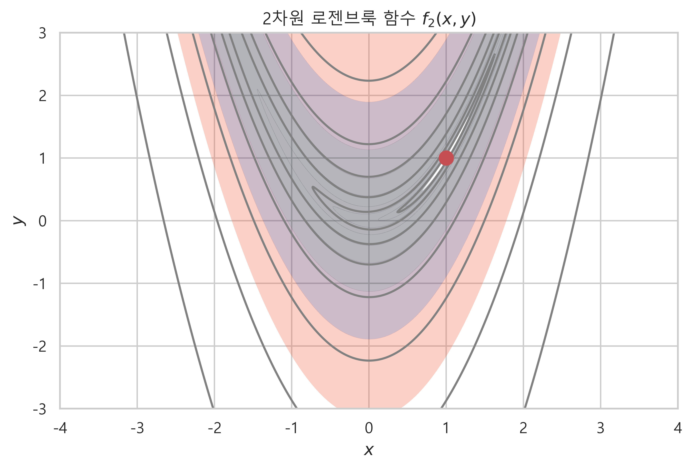

### np.logspace()
- log10(x) 의 값에 해당하는 범위를 분할하여 반환해준다.
- log10(0.1) = -1 부터 log10(1000) = 3 까지의 범위를 10개로 분할하여 실수 반환

```python
test = np.logspace(-1, 3, 10)  0.4, 3, 15, 50, 150, 500, 1500,
for c in test :
    print(c)

=====<print>=====

0.1
0.2782559402207124
0.774263682681127
2.1544346900318834
5.994842503189409
16.68100537200059
46.41588833612777
129.15496650148827
359.38136638046257
1000.0
```
### 최대경사법 Steepest gradient decendent
- 수치적 최적화에서 현재 위치 이후 다음 위치를 결정하는 알고리즘
- x_k+1 = x_k - mu f'(x_k)
   - 여기에서 f'(x_k)는 그레디언트 벡터
   - mu 는 경험적으로 정하거나 알고리즘으로 구한다.

```python
# f1 함수의 도함수

def f1d(x) :
    return 2 * x - 4

xx = np.linspace(-1, 5, 100)

plt.plot(xx, f1(xx), 'g-')

# step size
mu = 0.4

# k = 0
x = 0
plt.plot(x, f1(x), 'ro', ms=10)
plt.plot(xx, f1d(x)*(xx-x) + f1(x), 'b--', linewidth=0.7, label="$\mu=0.4$")
plt.text(x+0.1, f1(x)+0.1, '1차 시도', fontsize=8)
print("1차 시도 : x_1 = {:.2f}, g_1 = {:.2f}".format(x, f1d(x)))

x_2 = x - mu * f1d(x)
plt.plot(x_2, f1(x_2), 'ro', ms=10)
plt.plot(xx, f1d(x_2) * (xx-x_2) + f1(x_2), 'b--', linewidth=0.7)
plt.text(x_2 - 0.15, f1(x_2) + 0.3, '2차시도', fontsize=8)
print("2차 시도 : x_2 = {:.2f}, g_2 = {:.2f}".format(x_2, f1d(x_2)))

x_3 = x_2 - mu * f1d(x_2)
plt.plot(x_3, f1(x_3), 'ro', ms=10)
plt.plot(xx, f1d(x_3) * (xx-x_3) + f1(x_3), 'b--', linewidth=0.7)
plt.text(x_3 + 0.1, f1(x_3) + 0.2, '3차시도', fontsize=8)
print("3차 시도 : x_3 = {:.2f}, g_3 = {:.2f}".format(x_3, f1d(x_3)))


plt.xlabel('$x$')
plt.ylabel('$y$')
plt.ylim(0, 10)
plt.legend(loc="center right")
plt.show() ;

=====<print>=====

1차 시도 : x_1 = 0.00, g_1 = -4.00
2차 시도 : x_2 = 1.60, g_2 = -0.80
3차 시도 : x_3 = 1.92, g_3 = -0.16
```
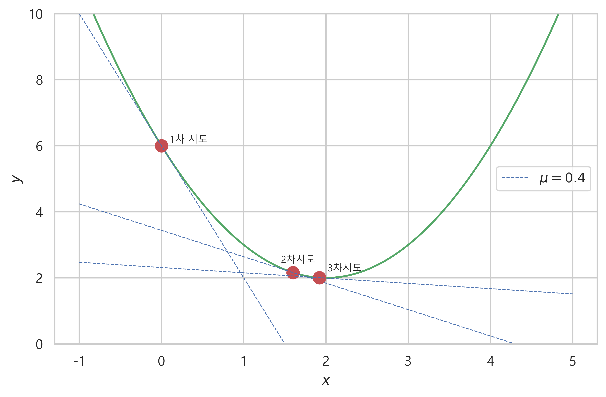

### mu 값을 크게 설정했을 때 최대경사법에서의 오류
- step size 를 너무 크게 설정하면 최대경사법에서 오히려 최저점 바깥으로 향하게 된다.
- 위에서 설정한 step size : 0.4, 다시 설정한 step size : 1.1
   - step size를 너무 크게 설정하면 최적점에서 오히려 멀어지는 경향이 나타난다.
   - 최적화 실패

```python
xx = np.linspace(-3, 8, 100)

plt.plot(xx, f1(xx), 'g')

# step size
mu = 1.1

# k = 0
x = 0
plt.plot(x, f1(x), 'ro', ms=10)
plt.plot(xx, f1d(x) * (xx-x) + f1(x), 'b--', linewidth=0.7, label="$\mu=1.1$")
plt.text(x+0.2, f1(x)+0.3, '1차 시도', fontsize=10)
print("1차 시도 : x = {:.2f}, g_1 = {:.2f}".format(x, f1d(x)))

x = x - mu * f1d(x)
plt.plot(x, f1(x), 'ro', ms=10)
plt.plot(xx, f1d(x) * (xx-x) + f1(x), 'b--', linewidth=0.7)
plt.text(x+0.2, f1(x)+0.3, '2차 시도', fontsize=10)
print("2차 시도 : x = {:.2f}, g_2 = {:.2f}".format(x, f1d(x)))

x = x - mu * f1d(x)
plt.plot(x, f1(x), 'ro', ms=10)
plt.plot(xx, f1d(x) * (xx-x) + f1(x), 'b--', linewidth=0.7)
plt.text(x+0.2, f1(x)+0.3, '3차 시도', fontsize=10)
print("3차 시도 : x = {:.2f}, g_3 = {:.2f}".format(x, f1d(x)))

x = x - mu * f1d(x)
plt.plot(x, f1(x), 'ro', ms=10)
plt.plot(xx, f1d(x) * (xx-x) + f1(x), 'b--', linewidth=0.7)
plt.text(x+0.2, f1(x)+0.3, '4차시도', fontsize=10)
print("4차 시도 : x = {:.2f}, g_4 = {:.2f}".format(x, f1d(x)))

plt.xlabel('$x$')
plt.ylabel('$y$')
plt.title('최대경사법을 사용한 1차함수의 최적화')
plt.ylim(0, 15)
plt.legend(loc="lower right")
plt.show() ;

=====<print>=====

1차 시도 : x = 0.00, g_1 = -4.00
2차 시도 : x = 4.40, g_2 = 4.80
3차 시도 : x = -0.88, g_3 = -5.76
4차 시도 : x = 5.46, g_4 = 6.91
```
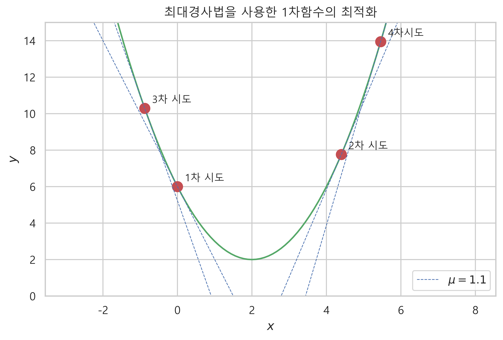

### 2차원 로젠브룩 함수에서의 최적화
- 2차원 로젠브룩 함수의 도함수, 입력변수 x와 y로 각각 편미분 한 것
```python
'''f2(x, y) 의 도함수, x와 y 각각으로 편미분한 것'''

def f2g(x, y) :
    return np.array((2.0 * (x-1) - 400.0 * x * (y - x**2), 200.0 * (y - x**2)))
```
- 2차원 로젠브룩 함수의 최적화
  - 서로 다른 시작점에서 최적점을 찾아가도록 해보았다.
  - 시작점이 어디냐에 따라서 최적화에 성공할 수도 있고 못할 수도 있다.
```python
def f2(x, y) :
    return (1-x)**2 + 100.0 * (y-x**2)**2

xx = np.linspace(-4, 4, 800)
yy = np.linspace(-3, 3, 600)
X, Y = np.meshgrid(xx, yy)
Z = f2(X, Y)

levels = np.logspace(-1, 3, 10)

plt.contourf(X, Y, Z, alpha=0.2, levels=levels)
plt.contour(X, Y, Z, colors='green', levels=levels, zorder=0)
plt.plot(1, 1, 'ro', ms=10)

# step size
mu = 8e-4
# arrow head size
s = 0.95

''시적점을 다르게 해서 최적점 찾아보기''
x, y = -1, -1
for i in range(10) :
    g = f2g(x, y)
    plt.arrow(x, y, -s * mu * g[0], -s * mu * g[1], 
             head_width=0.04, head_length=0.04, fc='k', ec='k', lw=1)
    x = x - mu * g[0]
    y = y - mu * g[1]

    
x, y = -0.7, 1
for i in range(10) :
    g = f2g(x, y)
    plt.arrow(x, y, -s * mu * g[0], -s * mu * g[1], 
             head_width=0.04, head_length=0.04, fc='k', ec='k', lw=1)
    x = x - mu * g[0]
    y = y - mu * g[1]
    
    
x, y = 0.8, 0
for i in range(10) :
    g = f2g(x, y)
    plt.arrow(x, y, -s * mu * g[0], -s * mu * g[1],
             head_width=0.04, head_length=0.04, fc='k', ec='k', lw=1)
    x = x - mu * g[0]
    y = y - mu * g[1]
    
    
plt.xlabel('$x$')
plt.ylabel('$y$')
plt.title('최대경사법을 사용한 2차함수의 최적화')

plt.xlim(-3, 3)
plt.ylim(-2, 2)    
plt.xticks(np.linspace(-3, 3, 7))
plt.yticks(np.linspace(-2, 2, 5))

plt.show() ;    
```
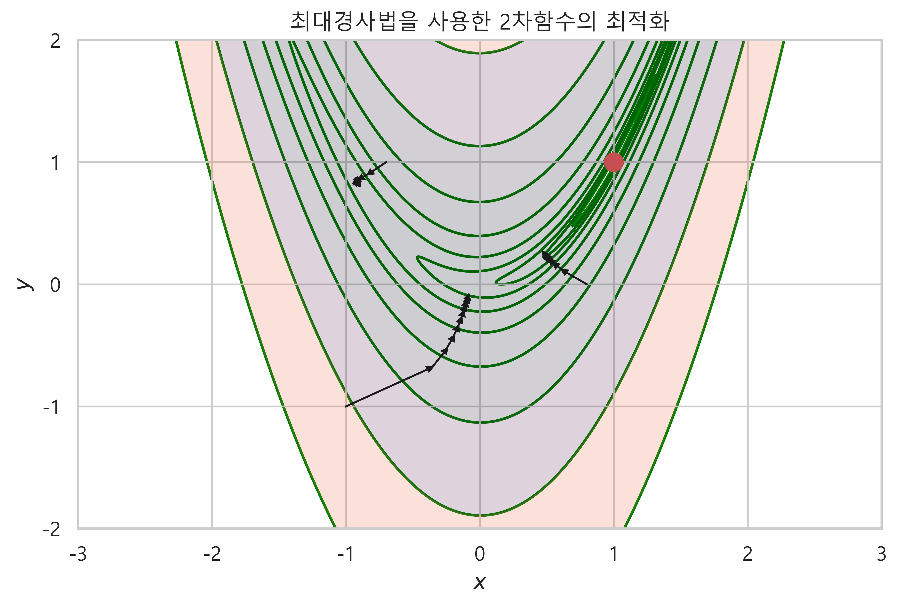

### 여러가지 시작점에서 최적점 찾아보기
- make_position(x, y) 함수를 만들고, 여러가지 시작점을 생성한다.
- 시작점에서 최대경사법을 이용하여 최적점을 찾아본다.
```python

xx = np.linspace(-4, 4, 800)
yy = np.linspace(-3, 3, 600)
X, Y = np.meshgrid(xx, yy)
Z = f2(X, Y)

levels = np.logspace(-1, 3, 10)

plt.contourf(X, Y, Z, alpha=0.2, levels=levels)
plt.contour(X, Y, Z, colors='green', levels=levels, zorder=0)
plt.plot(1, 1, 'ro', ms=10)

# step size
mu = 8e-4
# arrow head size
s = 0.95

# x, y의 모든 조합으로 좌표를 만들어주는 함수
def make_position(x, y) :

    navi = []

    for i in range(len(x)) :
        for j in range(len(x)) :
            g = (x[i][j], y[i][j])
            navi.append(g)

    return navi

test_x = np.linspace(-1, 1, 6, dtype=float)
test_y = np.linspace(-1, 1, 6, dtype=float)
test_xx, test_yy = np.meshgrid(test_x, test_y)

# 튜플로 반환된 좌표의 값을 사용하여 여러가지 시작점에서 최저점을 찾아보기
for x, y in make_position(test_xx, test_yy) :
    for i in range(5) :
        g = f2g(x, y)
        plt.arrow(x, y, -s * mu * g[0], -s * mu * g[1],
                 head_width=0.02, head_length=0.02, fc='k', ec='k', lw=1)
        x = x - mu * g[0]
        y = y - mu * g[1]

plt.xlabel('$x$')
plt.ylabel('$y$')
plt.title('최대경사법을 사용한 2차함수의 최적화')

plt.xlim(-1.5, 1.5)
plt.ylim(-1.5, 1.5)

plt.show() ;
```
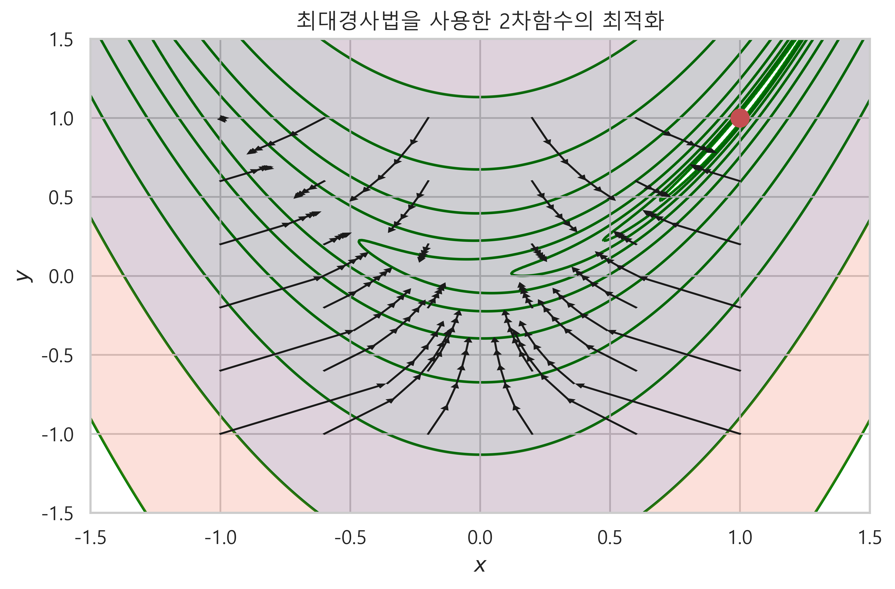

### python tip
- 소수점 표기
   - 8e-4 : 0.0008 : 8에서부터 앞으로 소수점 4개 이동
   - 1.8e-4 : 0.00018 : 1과 8사이에서 앞으로 소수점 4개 이동
   - 18e-5 : 0.00018 : 8에서부터 앞으로 소수점 5개 이동

### 최적화 결과는 시작점의 위치나 스텝사이즈에 영향을 받는다.
- 최적화는 시작점의 위치와 스텝사이즈에 영향을 받는다.
- 2차원 로젠브룩함수에서 곡면이 계곡과 같은 지점에서 시작점에 따라서 최적점에 다가가기까지 진동현상 osciliation 이 발생할 수 있다.   
- 이러한 단점을 보완하는 여러가지 최적화 방법이 있다. 뉴턴방법, 준뉴턴방법, CG 방법 등...

```python
xx = np.linspace(-4, 4, 800)
yy = np.linspace(-3, 3, 600)
X, Y = np.meshgrid(xx, yy)
Z = f2(X, Y)

levels = np.logspace(-1, 3, 10)

plt.contourf(X, Y, Z, alpha=0.2, levels=levels)
plt.contour(X, Y, Z, colors='green', levels=levels, zorder=0)
plt.plot(1, 1, 'ro', markersize=10)
plt.plot(1.5, 1.5, 'ko', markersize=10)
plt.text(1.5+0.07, 1.5+0.07, '시작점', fontsize=15)

mu = 1.8e-3
s = 0.95

x, y = 1.5, 1.5
for i in range(15) :
    g = f2g(x, y)
    plt.arrow(x, y, -s * mu * g[0], -s * mu * g[1],
             head_width=0.04, head_length=0.04, fc='k', ec='k', lw=2)
    x = x - mu * g[0]
    y = y - mu * g[1]

plt.xlabel('$x$')
plt.ylabel('$y$')
plt.title('최대경사법을 사용한 2차함수의 최적화 진동현상')

plt.xlim(0, 3)
plt.ylim(0, 2)
plt.xticks(np.linspace(0, 3, 4))
plt.yticks(np.linspace(0, 2, 3))
plt.show() ;
```
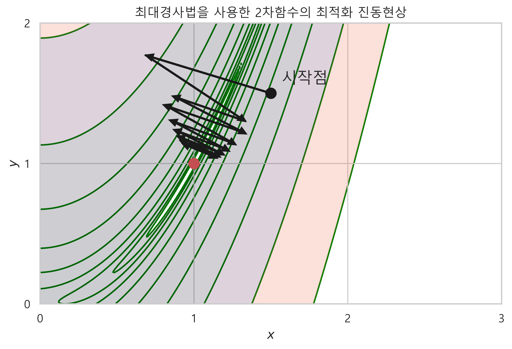

# 사이파이를 사용한 최적화
- 준뉴턴 방법 Quasi Newton 의 일종인 BFGS 방법을 사용한다.
    - BFGS 방법은 해당 지점의 부근에서 다른 x좌표에 해당하는 함숫값을 구하고, 이를 통해 2차도함수의 근사값을 계산하는 방식
    - CG 방법은 헤시안행렬 대신에 변형된 그레디언트 벡터를 사용한다.     
- 사용법
   - sp.optimize.minmize(func, x0, jac=jac)
   - func : 목적함수, x0 : 시작점, jac : 그레디언트 벡터를 출력하는 함수
- minimize 의 결과 : OptimizeResult 클래스 객체
   - fun : x 위치에서의 함수값 (최적화 값)
   - hess_inv : x위치에서의 헤시안 행렬의 값
   - jac : x위치에서 자코비안(그레디언트) 벡터의 값
   - message : 메시지 문자열, 최적화 결과에 대한 메시지
   - nfev : 최적화를 구하기 위해 목적함수를 호출한 횟수 (회수가 많으면 계산이 느리다는 것)
   - nit : x의 이동 횟수 (회수가 작을 수록 빨리 최적화 한 것)
   - njev : 최적화를 구하기 위해 자코비안 벡터를 계산한 횟수
   - status : 종료 상태. 최적화에 성공하면 0을 반환
   - success : 최적화에 성공하면 True 반환
- 사이파이의 최적화 라이브러리의 옵션에 대한 설명, 여러가지 최적화 방법에 대한 옵션이 나온다.

```python
from scipy.optimize import show_options

show_options(solver="minimize")
```

### 사이파이의 최적화 방법은 BFGS가 디폴트 값이다.
- 1차원 목적함수의 최적화
- 시작점 : 0
```python
def f1(x) :
    return (x - 2)**2 + 2

x0 = 0
result = sp.optimize.minimize(f1, x0)
print(result)

=====<print>=====

      fun: 2.0
 hess_inv: array([[0.5]])
      jac: array([0.])
  message: 'Optimization terminated successfully.'
     nfev: 6
      nit: 2
     njev: 3
   status: 0
  success: True
        x: array([1.99999999])
```

### jac 인수로 도함수를 넣어주면 계산 횟수를 줄일 수  있다.
- nfev 값이 높다는 것은 계산과정에서 목적함수를 여러번 호출 했다는 의미이다.
- BFGS 방법은 기본적으로 현재 x위치의 주변의 여러점에서 그레디언트 벡터의 근사값을 구하는 방식이다.
- 이런 경우는 jac 옵션으로 그레디언트 벡터값을 직접 입력해준다.
```python
def f1p(x) :
    return 2 * (x-2)

''jac의 값으로 1차원 목적함수의 도함수를 입력해준다''
x0 = 0
result = sp.optimize.minimize(f1, x0, jac=f1p)
print(result)


=====<print>=====
''nfev 목적함수 호출 횟수가 줄어들었다''

 fun: 2.0
 hess_inv: array([[0.5]])
      jac: array([0.])
  message: 'Optimization terminated successfully.'
     nfev: 3
      nit: 2
     njev: 3
   status: 0
  success: True
        x: array([2.])
```

### Newton-CG 방법 사용해보기
- optimize 라이브러리에는 여러가지 최적화 방법들이 내장되어 있다. 
- 그중에서 BFGS 방법이 아닌 newton-cg 방법을 사용해 최적화 해 보았다.
- 같은 명령어에 옵션으로 method="Newton-CG" 를 입력해준다.
- 최적화 방법마다 입력변수의 데이터 타입 등 사용방법이 다를 수 있고, 특정 함수의 형태에서만 사용할 수 있는 경우도 있다. 사이파이 docs 참조할 것.

```python
x0 = 0
result_2 = sp.optimize.minimize(f1, x0, method="Newton-CG", jac=f1p,
                               options={'disp':True})
print(result_2)

=====<print>=====

Optimization terminated successfully.
         Current function value: 2.000000
         Iterations: 2
         Function evaluations: 2
         Gradient evaluations: 3
         Hessian evaluations: 0
     fun: array([2.])
     jac: array([0.])
 message: 'Optimization terminated successfully.'
    nfev: 2
    nhev: 0
     nit: 2
    njev: 3
  status: 0
 success: True
       x: array([2.])
```

### 다변수함수의 최적화
- 목적함수가 벡터 인수이어야 한다.
- 2차원 로젠브룩 함수의 최적화
- nfev 값이 높은 것으로 봐서 입력변수가 하나인 함수보다 계산량이 많다는 것을 알 수 있다.
```python

def f2(x) :
    return (1 - x[0])**2 + 100.0 * (x[1] - x[0]**2)**2

x0 = (-1, -1)
result = sp.optimize.minimize(f2, x0, options={'disp':True})
print(result)

=====<print>=====

Optimization terminated successfully.
         Current function value: 0.000000
         Iterations: 31
         Function evaluations: 120
         Gradient evaluations: 40
      fun: 1.9949924665089535e-11
 hess_inv: array([[0.50844028, 1.01641749],
       [1.01641749, 2.0369327 ]])
      jac: array([ 2.78534581e-07, -1.27303812e-07])
  message: 'Optimization terminated successfully.'
     nfev: 120
      nit: 31
     njev: 40
   status: 0
  success: True
        x: array([0.99999553, 0.99999106])
```

### 시작점이 어디냐에 따라서 최적화에 실패하지 못할 수도 있다.
- 시작점을 바꾸니 최적화에 실패했다.
```python
def f2(x) :
    return (1 - x[0])**2 + 100.0 * (x[1] - x[0]**2)**2

x0_2 = (-1, -3)

result = sp.optimize.minimize(f2, x0_2, jac=None)
result

=====<print>=====

fun: 5.2746347107862e-12
 hess_inv: array([[0.49947896, 0.99887136],
       [0.99887136, 2.00255462]])
      jac: array([ 8.69215799e-05, -3.99714600e-05])
  message: 'Desired error not necessarily achieved due to precision loss.'
     nfev: 236
      nit: 35
     njev: 75
   status: 2
  success: False
        x: array([0.99999901, 0.99999782])
```

### jac 인수로 그레디언트 벡터를 설정해서 계산횟수를 줄여보기
- jac 인수로 도함수를 설정해주니 nfev 값이 줄어들었다.
```python
def f2(x) :
    return (1 - x[0])**2 + 100.0 * (x[1] - x[0]**2)**2

## f2 함수의 1차도함수인 그레디언트 벡터
def f2g(x) :
    return np.array((2.0 * (x[0]-1) - 400.0 * x[0] * (x[1] - x[0]**2), 200.0 * (x[1] - x[0]**2)))

x0_new_2 = (2, 1)

result_2 = sp.optimize.minimize(f2, x0_new_2, jac=f2g)
result_2

=====<print>=====

fun: 7.147230338222425e-15
 hess_inv: array([[0.519503  , 1.03596321],
       [1.03596321, 2.07129296]])
      jac: array([ 2.96697997e-06, -1.43910928e-06])
  message: 'Optimization terminated successfully.'
     nfev: 20
      nit: 16
     njev: 20
   status: 0
  success: True
        x: array([1.00000004, 1.00000008])
```

### 전역 최적화 문제
- 국소 최적점과 전역 최적점이 있는 함수의 경우 반드시 전역 최적점에 도달한다는 보장이 없다.

```python
def f_global(x) :
    return x**2 - 20 * np.cos(x)

x = np.arange(-10, 10, 0.1)
plt.plot(x, f_global(x))
plt.scatter(0, f_global(0), s=200)
plt.xlabel('$x$')
plt.ylabel('$y$')
plt.title('전역 최적화 문제')
plt.show() ;
```
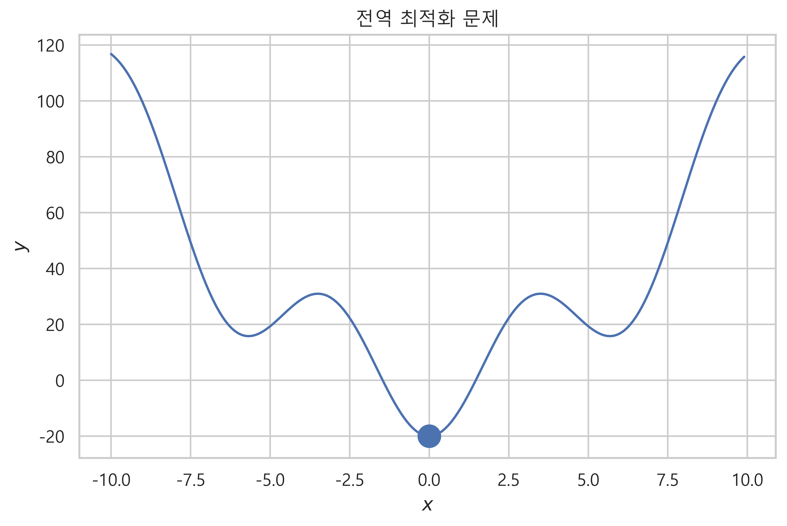

### 초기값에 따라서 전역 최저점으로 수렴하지 못하는 경우
- 국소 최적점 부근과 전역 최적점 부근의 서로 다른 시작점에서 최적화를 진행하면 다른 결과가 나온다.
- 시작점이 어디냐에 따라서 최적점의 결과가 다르다.

```python
def f_global(x) :
    return x**2 - 20 * np.cos(x)

x = np.arange(-10, 10, 0.1)
plt.plot(x, f_global(x))
plt.scatter(0, f_global(0), s=200)
plt.text(0-2.5, f_global(0)+0.7, '전역 최적점')

x0_1 = 4
plt.plot(x0_1, f_global(x0_1), 'go', markersize=10)
plt.text(x0_1, f_global(x0_1)+8, '시작점 1')

plt.scatter(x_sol, f_global(x_sol), s=200)
plt.text(x_sol+0.7, f_global(x_sol)+0.7, '시작점 1에서 찾은 국소 최적점')

x0 = 3
plt.plot(x0, f_global(x0), 'go', markersize=10)
plt.text(x0-2, f_global(x0)+6, '시작점 2')

plt.scatter(x_sol_bh, f_global(x_sol_bh), s=200)
plt.text(x_sol_bh+0.7, f_global(x_sol_bh)+0.7, '시작점 2에서 찾은 국소 최적점')

plt.xlabel('$x$')
plt.ylabel('$y$')
plt.title('전역 최적화에서 국소 최적점에 수렴하는 경우')
plt.show() ;
```


### 컨벡스 문제
- convex : 볼록도, 볼록함수
- 컨벡스 문제는 2차 도함수가 양수인 목적함수의 최적점을 찾는 것과 같다.
- 컨벡스 문제는 항상 전역 최저점이 존재한다.

```python
def f2(x) :
    return (1 - x[0])**2 + 100.0 * (x[1] - x[0]**2)**2


def f2prime(x) :
    return np.array([2 * (x[0] - 1) + 400 * x[0] * (x[0]**2 - x[1]),
                    200 * x[1] * (x[1] - x[0]**2)])

result = sp.optimize.minimize(f2, (2, 0.3), jac=f2prime)
result

=====<print>=====

    fun: 6.084206599035288e-16
 hess_inv: array([[0.50013531, 1.000134  ],
       [1.000134  , 2.00510248]])
      jac: array([ 9.85365952e-07, -4.89697928e-07])
  message: 'Optimization terminated successfully.'
     nfev: 27
      nit: 20
     njev: 27
   status: 0
  success: True
        x: array([1., 1.])
```

# 제한조건이 있는 최적화 문제
- 연립방정식 또는 등식 제한조건 : 라그랑주 승수를 사용하여 최적화한다.
- 부등식 제한조건 : KKT 조건을 이용하여 최적화 한다.

```python
''목적함수''
def f1(x1, x2) :
    return x1**2 + x2**2

x1 = np.linspace(-5, 5, 100)
x2 = np.linspace(-3, 3, 100)
X1, X2 = np.meshgrid(x1, x2)
Y = f1(X1, X2)

''등식 제한조건 식''
x2_g = 1 - x1

plt.contour(x1, x2, Y, colors='gray', levels=[0.5, 2, 8, 25])
plt.plot(x1, x2_g, 'g-')
plt.plot(0, 0, 'rP')
plt.plot(0.5, 0.5, 'ro', ms=10)

plt.xlim(-5, 5)
plt.ylim(-3, 3)
plt.xticks(np.linspace(-4, 4, 9))
plt.yticks(np.linspace(-3, 3, 7))

plt.xlabel('$x1$')
plt.ylabel('$x2$')
plt.title('등식 제한 조건이 있는 최적화 문제')
plt.show() ;
```
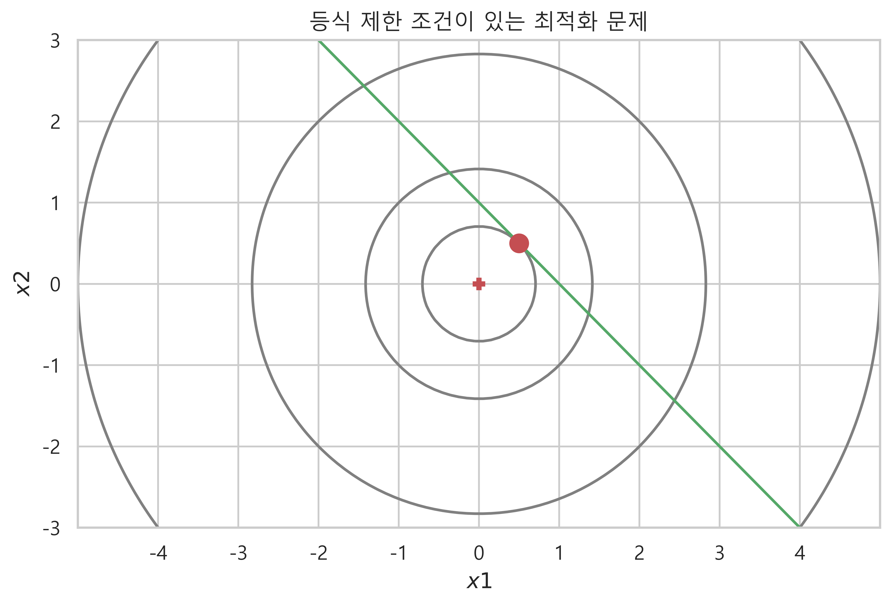


### 사이파이로 등식 제한조건이 있는 최적화 문제 계산하기
- sp.optimize.fmin_slsqp(func, x0, eqcons=[eq_constraint])
   - func : 목적함수, x0 : 시작점 넘파이의 배열, eqcons : 제한조건을 리스트에 넣어서 입력

```python

import scipy.optimize

def f1array(x) :
    return x[0]**2 + x[1]**2

def eq_constraint(x) :
    return x[0] + x[1] - 1

sp.optimize.fmin_slsqp(f1array, np.array([1, 1]), eqcons=[eq_constraint])

=====<print>=====

Optimization terminated successfully    (Exit mode 0)
            Current function value: 0.5000000000000002
            Iterations: 2
            Function evaluations: 6
            Gradient evaluations: 2
array([0.5, 0.5])
```

### 부등식 제한조건이 있는 최적화 문제
- KKT 조건에 따라서 부등식 제한조건의 영역과 목적함수의 최적점을 비교하여 최적점을 찾는다.
- 최적화 결과에 영향을 주지 않는 쓸모없는 제한조건 : 제한조건이 있으나 없으나 최적화 값이 같은 경우
    - 라그랑주 승수가 0인 경우
- 최적화 결과에 영향을 주는 등식인 제한조건 : 제한조건에 의해 원래 목적함수 f의 최적화 값과 달라지는 경우
    - 라그랑주 승수가 0이 아닌 경우
```python
def f1array(x1, x2) :
    return x1**2 + x2**2

def eq_constraint(x) :
    return x[0] + x[1] - 1

x1 = np.linspace(-4, 4, 100)
x2 = np.linspace(-5, 5, 100)
X1, X2 = np.meshgrid(x1, x2)
Y = f1array(X1, X2)

x2_g = 1 - x1

plt.figure(figsize=(13, 7))

ax1 = plt.subplot(121)
plt.contour(X1, X2, Y, colors='gray', levels=[0.5, 2, 8])
plt.plot(x1, x2_g, 'g-')
plt.plot(0, 0, 'ro', ms=10)

## 그래프의 특정 영역 색으로 채우기
ax1.fill_between(x1,-20, x2_g, alpha=0.5)

## xlim, ylim 을 정해주지 않으면 fill_between 으로 인해서 그래프 크기가 늘어난다.
plt.xlim(-3, 3)   
plt.ylim(-5, 5)
plt.xticks(np.linspace(-4, 4, 9))
plt.yticks(np.linspace(-5, 5, 11))
plt.xlabel('$x_1$')
plt.ylabel('$x_2$')
plt.title('최적해가 부등식과 관계없는 경우')

ax2 = plt.subplot(122)
plt.contour(X1, X2, Y, colors='gray', levels=[0.5, 2, 8])
plt.plot(x1, x2_g, 'g-')
plt.plot(0, 0, 'bo', ms=5)
plt.plot(0.5, 0.5, 'ro', ms=10)
ax2.fill_between(x1, 20, x2_g, alpha=0.5)
plt.xlim(-3, 3)
plt.ylim(-5, 5)
plt.xticks(np.linspace(-4, 4, 9))
plt.yticks(np.linspace(-5, 5, 11))
plt.xlabel('$x_1$')
plt.ylabel('$x_2$')
plt.title('최적해가 부등식에 의해 결정되는 경우')

plt.suptitle('부등식 제한조건이 있는 최적화 문제')
plt.show() ;
```


# 부등식 제한조건이 여러개인 최적화 문제

```python
def f2plt(x1, x2) :
    return np.sqrt((x1 - 4)**2 + (x2 - 2)**2)

x1 = np.linspace(-2, 5, 100)
x2 = np.linspace(-1.5, 3, 100)
X1, X2 = np.meshgrid(x1, x2)
Y = f2plt(X1, X2)

plt.contour(X1, X2, Y, colors='gray', levels=np.arange(0.5, 5, 0.5) * np.sqrt(2))

# 4개의 제한조건을 그리고 해당하는 범위를 표시
# 제한조건의 상수
k = 1
ax = plt.gca()
x12 = np.linspace(-k, 0, 10)
x13 = np.linspace(0, k, 10)
ax.fill_between(x12, x12 + k, -k - x12, color='g', alpha=0.5)
ax.fill_between(x13, x13 - k, k - x13, color='g', alpha=0.5)

x1_sol = 1
x2_sol = 0
plt.plot(x1_sol, x2_sol, 'ro', ms=10)

plt.xlim(-2, 5)
plt.ylim(-1.5, 3)
plt.xticks(np.linspace(-2, 5, 8))
plt.yticks(np.linspace(-1, 3, 5))
plt.xlabel('$x_1$')
plt.ylabel('$x_2$')
plt.title('$|x1| + |x2| \leq 1 \;$ 제한조건을 가지는 최적화 문제', y=1.05)

plt.show() ;
```
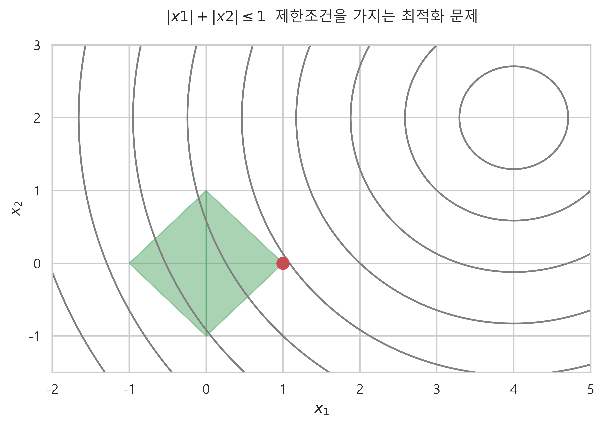

### 사이파이를 사용하여 부등식 제한조건이 있는 최적화 문제 계산하기
- sp.optimize.fmin_slsqp(func, x0, ieqcons=[ieq_constraint_1, ieq_constriant_2, ...]
   - func : 목적함수, x0 : 시작점 넘파이의 배열형태, ieqcons : 여러개의 제한 조건을 리스트로 입력

```python
import scipy.optimize

def f2(x) :
    return np.sqrt((x[0] - 4)**2 + (x[1] - 2)**2)

k = 1
def ieq_constraints(x) :
    return np.atleast_1d(k - np.sum(np.abs(x)))

result_2 = sp.optimize.fmin_slsqp(f2, np.array([0,0]), ieqcons=[ieq_constraints])
result_2[0], result_2[1]

=====<print>=====

Optimization terminated successfully    (Exit mode 0)
            Current function value: 3.605551280732028
            Iterations: 11
            Function evaluations: 66
            Gradient evaluations: 11
(0.9999999810058195, 1.89941791507163e-08)
```

### 여러개의 부등식 제한조건에서 k 값을 바꾸어 죄적화 해보기

```python
from functools import partial

def f2plt(x1, x2) :
    return np.sqrt((x1-4)**2 + (x2-2)**2)

def f2(x) :
    return np.sqrt((x[0]-4)**2 + (x[1]-2)**2)

def ieq_constraint2(x, k) :
    return np.atleast_1d(k - np.sum(np.abs(x)))

def plot_opt(k_list) :
    
    x1 = np.linspace(-8, 8, 100)
    x2 = np.linspace(-8, 8, 100)
    X1, X2 = np.meshgrid(x1, x2)
    Y = f2plt(X1, X2)
    
    N = 2
    M = 2
    fig = plt.figure(figsize=(15, 10))
    plt.subplots_adjust(top=0.5, bottom=0, hspace=0.5, wspace=0.05)
    
    ''k 값에 따라서 각각의 플롯에 그래프를 그려주는 코드''
    for i in range(N) :
        for j in range(M) :
            temp = i * M + j
            
            ax = fig.add_subplot(N, M, temp+1)
            ax = plt.gca()
            ax.contour(X1, X2, Y, colors='gray', levels=np.arange(0.5, 20, 0.5) * np.sqrt(2))
            
            k = round(k_list[temp], 1)
            x12 = np.linspace(-k, 0, 10)
            x13 = np.linspace(0, k, 10)
            
            ax.fill_between(x12, x12 + k, -k - x12, color='g', alpha=0.4)
            ax.fill_between(x13, x13 - k, k - x13, color='g', alpha=0.4)
            
            x_sol = sp.optimize.fmin_slsqp(f2, np.array([0,0]), ieqcons=[partial(ieq_constraint2, k=k)], iprint=0)
            ax.plot(x_sol[0], x_sol[1], 'ro', ms=8)
            
            ax.set_xlim(-3, 7)
            ax.set_ylim(-5, 5)
            ax.set_title('k : {}, 최적점 : ({}, {})'.format(k, round(x_sol[0], 2), round(x_sol[1], 2), fontsize=10), y=1.03)
            ax.set_xlabel("$x_1$")
            ax.set_ylabel("$x_2$")
            
    plt.tight_layout()
    plt.show() ;
```

- k 값으로 1, 2, 3, 4, 5 로 하여 함수를 호출   
```
test_sample = np.linspace(1, 5, 5)
plot_opt(test_sample)
```


### 최적화 그래프를 하나의 플롯으로 반환하는 코드

```python

from functools import partial

def f2plt(x1, x2) :
    return np.sqrt((x1-4)**2 + (x2-2)**2)

def f2(x) :
    return np.sqrt((x[0]-4)**2 + (x[1]-2)**2)

def ieq_constraint2(x, k) :
    return np.atleast_1d(k - np.sum(np.abs(x)))

def plot_opt_2(k) :
    x1 = np.linspace(-10, 10, 100)
    x2 = np.linspace(-10, 10, 100)
    X1, X2 = np.meshgrid(x1, x2)
    Y = f2plt(X1, X2)

    plt.contour(X1, X2, Y, colors='gray', levels=np.arange(0.5, 5, 0.5) * np.sqrt(2))

    ax = plt.gca()
    x12 = np.linspace(-k, 0, 10)
    x13 = np.linspace(0, k , 10)

    ax.fill_between(x12, x12+k, -x12-k, color='g', alpha=0.4)
    ax.fill_between(x13, x13-k, -x13+k, color='g', alpha=0.4)

    x_sol = sp.optimize.fmin_slsqp(f2, np.array([0,0]), ieqcons=[partial(ieq_constraint2, k=k)], iprint=0)
    plt.plot(x_sol[0], x_sol[1], 'ro', ms=15)

    plt.xlim(-2, 5)
    plt.ylim(-1.5, 3)
    plt.xticks(np.linspace(-2, 5, 8))
    plt.yticks(np.linspace(-1, 3, 5))
    plt.title("$|x_1| + |x_2| \leq {}$".format(k))
```
- k 값에 따른 최적화 변화
   - k = 1, 2, 3, 4 일때
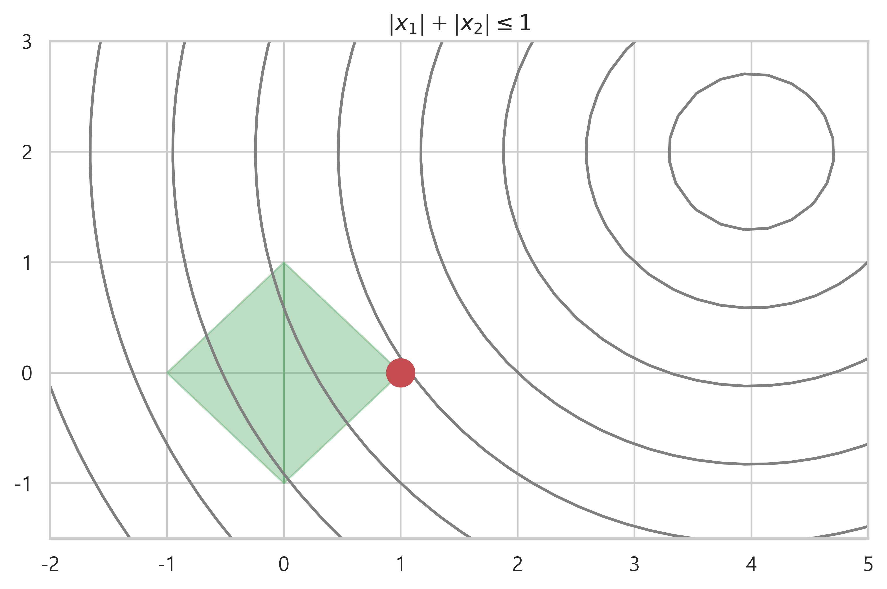
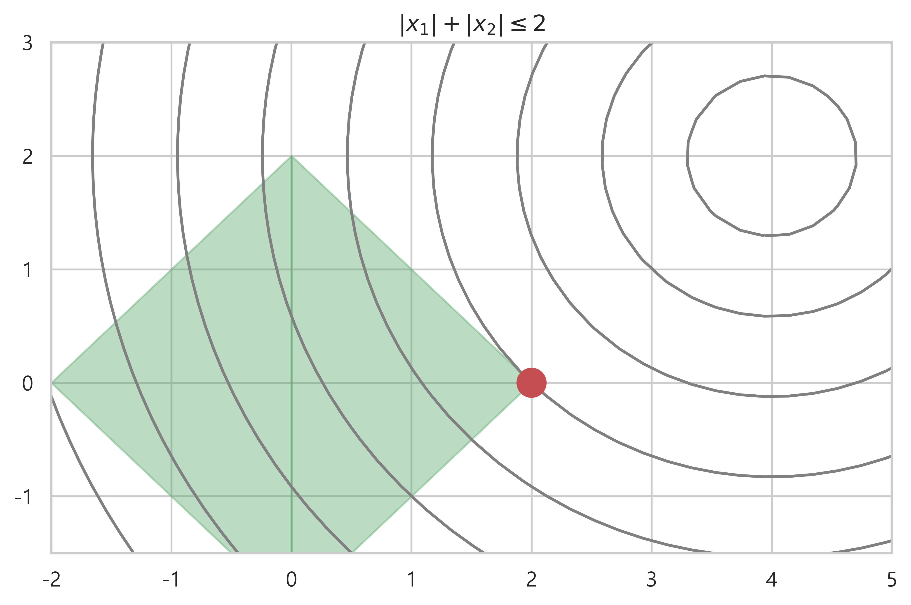
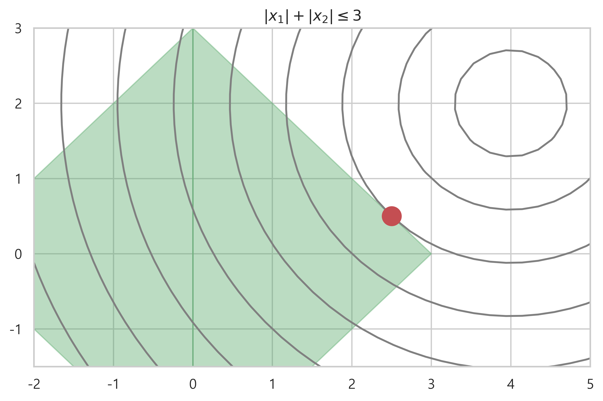
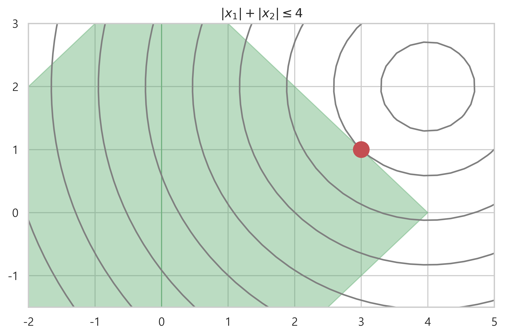

# 사이파이를 사용한 이차계획법 문제 계산
- linprog(c, A, b)
    - c : 목적함수의 계수 벡터
    - A : 등식 제한조건의 계수 행렬
    - b : 등식 제한조건의 상수 벡터

```python
import scipy.optimize

A = np.array([[-1, 0], [0, -1], [1, 2], [4, 5]])
b = np.array([[-100, -100, 500, 9800]])
c = np.array([-3, 5])

result = sp.optimize.linprog(c, A, b)
result

=====<print>=====

     con: array([], dtype=float64)
     fun: -399.9999998623001
 message: 'Optimization terminated successfully.'
     nit: 6
   slack: array([2.00000000e+02, 4.50999948e-09, 2.93632638e-08, 8.10000000e+03])
  status: 0
 success: True
       x: array([299.99999996, 100.        ])
```

