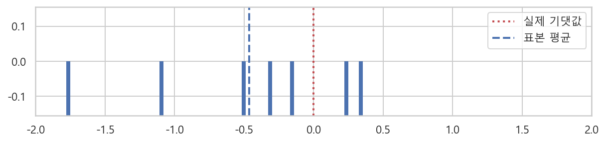

# 확률변수와 상관관계

## 확률적 데이터와 확률 변수

### ◈ 확률적 데이터
- 데이터의 특징 : 변하지 않는 데이터, 측정할 때마다 변하는 데이터
    - 변하지 않는 데이터와 변하는 데이터를 구분할 수 있을까?
    - 100% 정확하게 예측할 수 없는 데이터로부터 얻을 수 있는 지식은?
    - 이러한 데이터의 특징을 수학적으로 표현할 수 있을까?
- ```결정론적 데이터 deterministic data``` : 실험, 측정, 조사 등을 통해 어떤 데이터 값을 반복적으로 얻을 때 항상 같은 값이 나오는 데이터. 생년월일, 이름, 전화번호, 위치정보 등
- ```확률적 데이터 random data, probabilistic data``` : 정확히 예측할 수 없는 값이 나오는 데이터. 혈압, 키, 체중, 몸무게 등 **대부분의 데이터는 확률적데이터에 속한다.**
- 데이터가 확률적인 이유 : 여러조건이나 상황등에 데이터값이 영향을 받거나, 측정할 때 발생하는 오차때문

### ◈ 분포
- ```분포 distribution``` : 확률적 데이터에서 어떤 값이 자주나오고 어떤 값이 드물게 나오는지를 나타내는 정보
- 범주형 데이터는 **카운터 플롯 count plot**, 실수형 데이터는 **히스토그램 histogram**을 사용하여 시각화 할 수 있다.

### ◈ 기술통계
- ```기술통계 descriptive statistics``` :  확률적 데이터의 분포의 특징을 나타내는 숫자들로 분포를 나타내는 것
    - 표본평균, 표본중앙값, 표본최빈값
    - 표본분산, 표본표준편차
    - 표본첨도, 표본왜도
    
### ◈ 표본평균
- ```표본평균 sample mean, sample average``` : 확률적인 데이터값을 대표하는 기술통계중 하나, 데이터 분포의 대략적인 위치를 나타낸다. 
    - $m = \bar{x} = \dfrac{1}{N} \sum_{i=1}^{N} x_i$
    - N은 자료의 갯수, i는 자료의 순서
    
### ◈ 표본중앙값
- ```표본중앙값 sample median``` : 전체 자료를 크기별로 정렬했을 때 가장 중앙에 위치하는 값이다.
- 중앙값의 정의는 여러가지
- 전체 표본 개수가 N개일때,
    - N이 홀수 : (N+1) / 2 번째 표본의 값
    - N이 짝수 : N / 2 번째 표본의 값과 (N / 2) + 1 번째 표본의 값의 평균
- 99명의 혈압을 크기순으로 정렬 했을 때 표본중앙값은 50번째 사람의 혈압
- 100명의 혈압을 크기순으로 정렬 했을 때 표본중앙값은 50, 51번째 사람의 혈압의 평균

### ◈ 표본최빈값
- ```표본최빈값 sample frequent value, smaple mode``` : 데이터값 중 가장 빈번하게 나오는 값이다. 
- 유한한 종류의 값이 있는 데이터에서는 최빈값을 구하기 쉽지만 혈압, 키, 몸무게 등 연속적인 값이 있는 데이터에서는 최빈값을 구하기 어렵다. 
- 연속적인 값의 경우에는 일정한 구간 간격으로 나누어 **가장 많은 데이터를 가진 구간의 대푯값**을 최빈값으로 가정한다. 
- 이외에도 여러가지 방법이 있다. 

### ◈ 단본분포와 다봉분포
- 분포의 모양
    - 단봉 분포 uni-modal : 봉우리가 한개인 분포의 형태
    - 다봉 분포 multi-modal : 봉우리가 여러개인 분포의 형태

### ◈ 대칭분포의 특성
- 분포가 표본평균을 기준으로 대칭 symmetric이면 **표본중앙값은 표본평균과 같다.**
- 분포가 대칭이면서 단봉분포이면 **표본최빈값은 표본평균과 같다.**
- 대칭인 분포의 데이터에 다른 데이터가 들어와 비대칭이 되면 **표본평균 > 표본중앙값 > 표본최빈값 순으로 영향을 받는다.**
    - 각 통계값의 위치가 변한다.

### ◈ 분산과 표준편차
- ```표본분산 sample variance``` : 데이터가 얼마나 변동variation하는지 알려주는 정보의 특징값
    - $S^2 = \dfrac{1}{N} \sum_{i=1}^{N}(x_i - \bar{x})^2$
- ```표본표준편차 sample standard deviation``` : 데이터가 얼마나 변동하는지 알려주는 정보의 특징값
    - $standard \; deviation = \sqrt{variance}$
- 표본분산은 자료값과 평균 사이의 거리를 의미한다. 
- 분포가 하나의 대표값 주위에 모여있다면 대부분의 데이터는 "대푯값+-표준편차" 범위안에 있다고 말할 수 있다.
- 표본분산은 **편향 표본분산 biased sample variance** 에 해당한다. 
- ```비편향 표본분산 unbiased smaple variance```
    - $\small{s}^2_{unbiased} = \dfrac{1}{N-1} \sum_{i=1}^{N}(x_i - \bar{x})^2$
    - 분모가 N-1로 바뀐다. 
    - 확률변수의 분산에서 증명된다.

### ◈ 표본비대칭도
- ```표본비대칭도 smaple skewness``` : 평균과의 거리의 세제곱을 이용하여 구한 특징값
    - $skewness=\dfrac{\dfrac{1}{N}\sum_{i=1}^{N}(x_i - \bar{x})^3}{\sqrt{\dfrac{1}{N-1}\sum_{i=1}^{N}(x_i - \bar{x})^2}^3}$
- **표본비대칭도가 0이면 분포가 대칭형태이다.**
- 표본비대칭도가 음수면 표본평균값을 기준으로 왼쪽에 있는 값이 나올 가능성이 크다.

### ◈ 표본첨도
- ```표본첨도 sample kurtosis``` :  평균과의 거리의 네제곱을 이용하여 구한 특징값.
    - $kurtosis=\dfrac{\dfrac{1}{N}\sum_{i=1}^{N}(x_i - \bar{x})^4}{(\dfrac{1}{N}\sum_{i=1}^{N}(x_i - \bar{x})^2)^3}-3$
- 데이터가 중앙에 몰려있는 정도를 정밀하게 비교할 때 쓰인다. 
- 표본첨도의 기준은 정규분포 : 정규분포보다 첨도가 높으면 양수, 정규분포보다 첨도가 낮으면 음수

### ◈ 표본모멘트 sample moment
- ```표본모멘트 sample moment``` : 분산, 비대칭도, 첨도를 구하기 위해서 제곱, 세제곱 네제곱을 하는 것 처럼 k제곱을 이용하여 구한 모멘트
    - 표본모멘트 $= \dfrac{1}{N}\sum_{i=1}^{N}x_{i}^k$
    - 통계값의 공식의 기본 형태가 표본모멘트와 같다.
- 2차 표본모멘트 이상은 평균을 뺀 **표본중앙모멘트 sample centered moment** 값을 사용
    - 표본중앙모멘트 $=\dfrac{1}{N}\sum_{i=1}^{N}(x_i-\bar{x})^k$
- 평균 : 1차 모멘트
- 분산 : 2차 모멘트
- 비대칭도 : 3차 모멘트
- 첨도 : 4차 모멘트

## ◈ 확률변수
- 확률공간의 표본을 입력받아서 실수인 숫자로 출력해주는 함수와 같다.
- 확률변수에서 출력되는 실수가 곧 현실의 데이터의 값이다.
    - $\omega \in \Omega \rightarrow x \in R$ 
    - $X(\omega) = x$
- 확률변수 기호는 대문자 알파벳 사용 (소문자 알파벳을 사용하는 경우도 있음)
- 확률변수에 의해 할당된 실수는 소문자 알파벳 사용

### ◈ 이산확률변수
- ```이산확률변수 discrete random variable``` : 확률변수값이 연속적이지 않고 떨어져 있도록 정의 된 것
    - 플레잉카드의 모든 무늬의 표본집합에 대해서 숫자를 할당하면 확률변수가 된다.
    - X(♠) = 1, X(♡) = 2, X(◇) = 3, X(♣) = 4
    - 표본공간의 표본 스페이드를 입력받아서 실수 1을 출력해준다.
- 확률공간의 표본에는 확률이 할당되어 있음 : 확률질량함수 p(♡) = 1/4
- 표본공간의 원소의 갯수가 무한대인 경우도 이산확률변수가 가능하다.
    - **기하분포 geometric distribution**, **포아송 분포 Poisson distribution** : 표본의 갯수가 무한대이면서 양의 정수값을 가지는 이산분포이다.

### ◈ 연속확률변수
- ```연속확률변수 continuous random variable``` : 연속적이고 무한대의 실수 표본값을 가지는 확률변수
    - 원반에 던진 화살의 각도 문제
- 모든 표본이 실수인 숫자로 변한다면 사건은 구간사건의 조합으로 표시할 수 있다.
- 확률분포를 확률분포함수로 나타낼 수 있다는 의미와 같다. 

### ◈ 확률변수는 데이터 생성기
- 확률적 데이터가 만들어지는 경우 : 실험이라는 행위에 의해서 만들어진다.
    - 주사위를 던지는 실험
    - 자동차 엔진의 출력을 측정하는 실험
    - 혈압을 측정하는 실험
- 이러한 확률적 데이터를 생성한 것은 **데이터 생성기** 와 같다. (주사위, 엔진, 혈압)
- 즉 현실의 데이터는 이것을 만드는 실험적 행위에 기반한 데이터 생성기에 의해서 만들어진다고 생각할 수 있다. **데이터 생성기 = 확률변수**
- 붓꽃 데이터의 확률변수 : 
    - 연속확률변수 : 꽃잎의 폭, 길이, 꽃받침의 폭, 길이
    - 이산확률변수 : 붓꽃의 종
    
### ◈ 확률변수와 현실 데이터의 관계
- ```실현 realization, 표본화 sampling``` : 확률분포함수에 따라 표본공간의 표본이 현실 세계의 데이터로 선택되는 것 
    - 이상적, 추상적, 수학적인 세계에서 현실로 넘어가는 과정과 같다.
    - 현실 세계의 데이터는 확률변수가 가진 확률분포에 따라서 실수 표본공간에서 **선택된 표본**이다.
- 확률변수라는 데이터 모형에 따르면 현실의 표본 데이터는 수학적 세계가 현실 세계에 투영된 그림자와 같다.
- 현실의 표본 데이터의 히스토그램이나 기술통계 등 데이터 분포의 특성이 깨끗한 형태가 아닌 것은 실현과정에서 생긴 잡음, 오류일 뿐이며 그 내면에는 원래의 수학적 특성을 내포하고 있다.
- 확률변수와 실제 데이터의 관계
    - 확률변수로부터 데이터를 여러번 생성하는 경우 실제 데이터값은 매번 달라지지만, 확률변수 자체는 변하지 않는다.
    - 확률변수의 확률분포함수는 우리가 직접 관찰 할 수 없다. 확류변수에서 만들어지는 실제 데이터값을 이용하여 확률분포함수가 어떤 형태인지 추정할 수 있다. 
    - 실제 데이터값은 확률변수에서 실현된 것이므로 확률변수의 특성을 반영한다. 데이터의 갯수가 적으면 확률변수의 특성을 반영하지 못하지만 갯수가 많으면 보다 정확하게 확률분포함수를 묘사할 수 있다.
    
### ◈ 확률변수를 사용한 데이터 분석
- 확률변수를 사용한 데이터 분석 과정
    - 데이터를 수집한다.
    - 수집한 데이터가 어떤 확률변수의 표본 데이터라고 가정한다.
    - 데이터를 사용하여 해당 확률변수의 확률분포함수의 모양을 결정한다.
    - 결정된 확률변수로부터 다음에 생성될 데이터나 데이터의 특성을 예측 prediction 한다.
- 데이터 분석 과정중에서 가장 중요한 부분은 데이터값으로부터 확률변수의 확률분포함수를 역설계 reverse_engineering 하여 만드는 것이다. 
- 데이터에서 확률분포함수의 모양을 구하는 방법 : 기술통계값 이용하여 구하기
    - 데이터 분포가 갖는 표본평균, 표본분산 등의 기술통계값 구한다.
    - 이 값과 같은 기술통계값을 갖는 확률분포함수 찾는다.

## 기댓값과 확률변수의 변환
- 표본평균, 표본분산 등의 기술통계값은 현실세계의 데이터의 분포 모양을 설명한 특성값이다. 
- 이론적인 확률분포함수의 모양을 서술하는 특성값은 다르다.

### ◈ 확률변수의 기댓값
- ```기댓값 expectation``` : 확률변수의 이론적 평균값. 평균 mean 이라고 말하기도 한다.
- ```이산확률변수의 기댓값``` : 표본공간의 원소 xi의 가중합, 가중치는 xi가 나올 수 있는 확률질량함수 p(xi) 값이다.
    - $\mu_{x} = E[X] = \sum_{x_i \in \Omega} x_ip(x_i)$
    - 공정한 주사위에서 나오는 숫자의 확률변수 X의 기댓값 : 
    - $\mu_{x} = 1 \cdot p(1) + 2 \cdot p(2) + 3 \cdot p(3) + 4 \cdot p(4) + 5 \cdot p(5) + 6 \cdot p(6)$ 
- 현실 데이터의 표본평균 : $\bar{x}=\dfrac{1}{N}\sum_{i=1}^{N}x$
    - 기댓값 공식과 표본평균 공식에서 x_i의 의미는 다르다. 기댓값의 x_i는 표본공간의 모든 원소를 의미하고, 표본평균 공식에서의 x_i는 선택된(realized, sampled) 표본을 의미한다.
    - 기댓값 공식에서는 확률변수의 표본공간의 모든 표본은 선택되기 이전의 상태이므로 확률이 부여되지 않았기 때문에 확률을 가중치로 곱해준다. 반면에 현실 데이터의 표본평균에서는 표본이 확률에 의해 선택된 것이기 때문에 확률을 가중치로 곱하지 않아도 된다. 
- ```연속확률변수의 기댓값``` : 확률밀도함수 p(x)를 가중치로 하여 모든 가능한 표본 x를 적분한 값이다.
    - $\mu_{x} = E[X] = \int_{-\infty}^{\infty}xp(x)dx$
- 기댓값은 여러가능한 x값을 확률값에 따라 가중합을 한 것과 같다. 따라서 가장 확률 또는 확률밀도가 높은 x값 근처의 값이 된다. **즉 확률 또는 확률밀도가 모여있는 곳의 위치이다.**

### ◈ 확률변수의 변환
- ```확률변수의 변환 transform``` : 기존의 확률변수를 사용하여 새로운 확률변수를 만드는 것
- 데이터의 값을 어떤 함수에 넣어서 변화시키면 다음과 같이 나타낼 수 있다.
    - $\left\{x_1, x_2, \cdots, x_N\right\} \rightarrow \left\{f(x_1), f(x_2), \cdots, f(x_N)\right\}$
- 이렇게 만들어진 새로운 데이터를 {y_i}라고 한다면 기존의 데이터 {x_i}와 다른 데이터이므로 다른 확률변수라고 볼 수 있다.
    - $Y=f(X)$
    - 확률변수 X를 f 함수에 입력하면 Y라는 새로운 확률변수 값이 출력된다. 즉 기존의 확률변수 X를 변형하여 새로운 확률변수 Y를 만들 수 있다는 것을 의미한다.
- ```여러개의 확률변수의 변환도 성립한다.```
    - $Z=X+Y$
    - 확률변수 X와 확률변수 Y에서 나온 값의 합이 되도록 하는 새로운 확률변수 Z를 만든다는 의미와 같다.
- 확률변수 X에서 표본은 N번 뽑아서 값을 더하는 경우, 원래 확률변수의 **복사본**을 만든 후 이러한 복사본 확률변수에서 나온 표본값을 더한 형태로 변환식을 써야한다.
    - $Y=X_1 + X_2 + \cdots + X_N$
    - 복사본 확률변수를 사용하지 않고 기존의 확률변수 X를 반복하여 변환식을 쓰면 의미가 전혀 다른 확률변수가 된다.
    - $Y=X + X + \cdots + X$
    - $Y=N \cdot X$

### 기댓값의 성질
- 변환된 확률변수를 사용하여 기댓값을 구할 때 기댓값의 성질을 이용한다.
    - 확률변수가 아닌 상수 c에 대한 기댓값 :
        - $E[c]=c$ (**상수의 기댓값은 상수**)
    - 선형성
        - $E[cX] = cE[X]$ (상수값은 기댓값의 밖으로 빠질 수 있다.)
        - $E[X+Y] = E[X] + E[Y]$ (확률변수의 덧셈의 기댓값은 각각의 기댓값의 합)
        - $E[c_1X + c_2Y] = c_1E[X] + c_2E[Y]$ (위 두 성질을 이용한 선형적 성질)

### 통계량
- ```통계량 statistics``` : 확률변수 X로부터 데이터 집합 {x_1, x_2, ..., x_N}을 얻었다고 할 때 이 데이터 집합의 모든 값을 어떤 공식에 넣어서 하나의 숫자를 구한 것을 말한다.
- 표본의 합, 표본평균, 표본중앙값, 표본분산, 표본표준편차 등 모두 통계량에 해당한다.
- 또한 통계량도 확률변수의 변환에 포함된다.

### 표본평균 확률변수
- ```표본평균 확률변수``` : 확률변수로부터 N개의 표본을 만들어 이 표본집합의 평균을 구하면, 표본평균값도 확률변수가 된다.
    - $\bar{X} = \dfrac{1}{N}\sum_{i=1}^{N}X_i$
    - i번째로 실현된 표본값을 생성하는 확률변수들의 합을 N으로 나눈값
    - X_i는 원래 확률변수의 복사본과 같다.
- 표본평균도 표본평균 확률변수에서 나온 값으로 볼 수 있다.
- 이와 같이 편향 표본분산 s^2의 값도 확률적인 데이터라고 볼 수 있다. 즉 표본분산 값을 생성하는 확률변수 S^2을 정의할 수 있다.
    - $S^2 = \dfrac{1}{N} \sum_{i=1}^{N} (X_i - \bar{X})^2$
    - 표본평균 확률변수 식을 대입하면,
    - $S^2 = \dfrac{1}{N} \sum_{i=1}^{N} \left(X_i - \dfrac{1}{N} \sum_{i=1}^{N}X_i \right)^2$

### 기댓값과 표본평균의 관계
- 표본평균도 확률변수도 기댓값이 존재한다.
    - $\begin{align} \text{E}[\bar{X}] = \text{E}[X] \end{align}$
    - $\begin{align} \begin{aligned}
    \text{E}[\bar{X}]
    &= \text{E} \left[ \dfrac{1}{N} \sum_{i=1}^{N} X_i \right] \\
    &= \dfrac{1}{N} \sum_{i=1}^{N} E[X_i] \\
    &= \dfrac{1}{N} \sum_{i=1}^{N} E[X] \\
    &= \dfrac{1}{N} N \text{E}[X] \\
    &= \text{E}[X] \\
    \end{aligned} \end{align}$
    - X_i 는 X의 복사본이므로 기댓값이 같다. X_i 가 X가 된다.
- **표본평균은 확률변수의 기댓값 근처의 값이 된다.**
    - 공정한 주사위의 기댓값은 3.5이다. 이 주사위를 던져 나온 값의 표본평균은 3.62346 또는 3.40987 처럼 항상 3.5 근처의 값이 나온다. 주사위가 물리적으로 완전하게 공정하지 않기 때문이다. 기댓값은 완전하게 공정한 주사위라는 확률변수 X에 대한 것이므로 이상적 평균인 3.5 값이 나오게 된다. 그러나 주사위라는 확률변수에서 실현된 주사위 값의 평균인, 현실데이터의 표본평균은 3.5 근처의 값이 나온다.

### 중앙값
- ```중앙값 median``` : 중앙값보다 큰 값이 나올 확률과 작은 값이 나올 확률이 0.5로 같은 값을 뜻한다.
- 누적확률분포함수 F(x)에서 중앙값을 계산한다.
    - $0.5 = F(\text{중앙값}), \;\; \text{중앙값} = \text{F}^{-1}(0.5)$
    - 역함수 관계

### 최빈값
- ```최빈값 most frequent value``` : 이산확률분포에서 가장 확률 값이 큰 수
- 연속확률분포에서는 어느 값에 대해서나 특정한 값이 나올 확률은 0이다. 따라서 **연속 확률분포의 최빈값 mode은 확률밀도함수 p(x)의 값이 가장 큰 확률변수의 값**으로 정의한다. 즉 확률밀도함수의 최대값의 위치와 같다.
    - $\text{최빈값} = argmax_{x}p(x)$

## 분산과 표준편차
- 분산은 확률분포함수의 모양을 설명하는 특성이다. 또한 확률분포함수에서 확률이 모여있는지 퍼져있는지 나타내는 값이다.
  - 기댓값 : 확률변수에서 어떤 값이 나올지를 예측한 것
  - 분산 : 기댓값의 정확도 혹은 신뢰도

### 확률분포의 분산
- ```분산 variance``` : 이론적인 분산은 확률밀도함수 p(x)로 구할 수 있다.
  - $\sigma^2 = \text{Var}[\text{X}] = \text{E}[(\text{X}-\mu)^2]$
- ```이산확률변수의 분산``` : 평균으로부터 표본 데이터까지의 거리의 제곱을 **확률질량함수 p(x)**로 가중하여 더한 값
  - $\sigma^2 = \sum_{x_1 \in \Omega} (x_i - \mu)^2 p(x_i)$
- ```연속확률변수의 분산``` : 평균으로부터 표본데이터까지의 거리의 제곱을 **확률밀도함수 p(x)**로 가중하여 적분한 값
  - $\sigma^2 = \int_{-\infty}^{\infty} (x - \mu)^2 p(x) dx$
- 이산확률분포의 분산은 확률질량함수 p(x_i)를 가중치로 곱해주고, 연속확률분포의 분산은 확률밀도함수 p(x)를 가중치로 곱해준다.

### 분산의 성질
- 분산은 항상 0 또는 양수이다.
  - $\text{Var}[X] \geq 0$
- 확률변수가 아닌 상수 값 c에 대해 다음 식 성립
  - $\text{Var}[c] = 0$ (상수의 기댓값은 상수)
  - $\text{Var}[cX] = c^2 \text{Var}[X]$
- 분산은 기댓값의 연산으로 나타낼 수 있다.
  - $\text{Var}[X] = \text{E}[X^2] - (\text{E}[X])^2 = \text{E}[X^2] - \mu^2$
  - $\text{E}[X^2] = \mu^2 + \text{Var}[X]$
  - mu는 기댓값 E[X] (이론적 평균)이다.
- 증명하면

$$\begin{align}
\begin{aligned}
\text{Var}[X]
&= \text{E}[(X - \mu)^2] \\
&= \text{E}[X^2 - 2 \mu X + \mu^2] \\
&= \text{E}[X^2] - 2 \mu \text{E}[X] + \mu^2 \;\; (((기댓값의\'성질에\;의해 상수는\;밖으로\;나온다))\\
&= \text{E}[X^2] - 2 \mu^2 + \mu^2 \;\; ((E[X] = \mu)) \\
&= \text{E}[X^2] - \mu^2
\end{aligned}
\end{align}
$$

### 두 확률변수의 합의 분산
- 두 확률변수 X, Y의 합의 분산
  - $\text{Var}[X + Y] = \text{Var}[X] + \text{Var}[Y] + 2 \text{E}[(X-\mu_x)(Y-\mu_y)]$
- 증명하면
- 두 확률변수의 합의 기댓값 : $\text{E}[X + Y] = \mu_x + \mu_y$

$$\begin{align}
\begin{aligned}
\text{Var}[X + Y]
&= \text{E}[(X + Y - (\mu_x + \mu_y))^2] \;\; ((분산의\;정의))\\
&= \text{E}[((X-\mu_x) + (Y-\mu_y))^2] \;\; ((같은\;확률변수끼리\;항을\;정리))\\
&= \text{E}[(X-\mu_x)^2 + (Y-\mu_y)^2 + 2(X-\mu_x)(Y-\mu_y)] \;\; ((식\;정리))\\
&= \text{E}[(X-\mu_x)^2] + \text{E}[(Y-\mu_y)^2] + 2\text{E}[(X-\mu_x)(Y-\mu_y)] \\
&= \text{Var}[X] + \text{Var}[Y] + 2\text{E}[(X-\mu_x)(Y-\mu_y)] \\
\end{aligned}
\end{align}
$$


### 확률변수의 독립
- ```두 확률변수의 독립 independent``` :  두 확률변수가 가질 수 있는 모든 사건의 조합에 대해서 결합사건의 확률이 각 사건의 확률의 곱과 같다.
  - **두 확률변수가 서로에 영향을 미치지 않는다.**
  - 주사위를 두번 던질 때 나오는 값을 나타내는 확률변수는 서로 독립이다.
- ```두 확률변소의 종속 dependent``` : 두 확률변수에서 하나의 확률변수의 값이 특정한 값이면 다른 변수의 확률분포가 영향을 받아 변하게 된다.
  - **두 확률변수가 서로에게 영향을 미친다.**
  - 주사위를 두번 던져서 나온 값의 합은 각각 주사위에서 나온 값에 종속적이다.
- 서로 독립인 두 확률변수의 성질
  - $\text{E}[(X-\mu_x))(Y-\mu_y)] = 0$
  - $\text{Var}[X + Y] = \text{Var}[X] + \text{Var}[Y]$
  - 공분산의 성질에 의해서 증명된다. 다음 챕터

### 표본평균의 분산
- 표본평균 확률변수의 기댓값은 원래 확률변수 X의 기댓값과 같다.
  - $\text{E}[\bar{X}] = \text{E}[X] \;\; ((앞에서 증명))$
- 표본평균 확률변수의 분산은 원래 확률변수 X의 분산과 다음과 같은 관계를 갖는다.
  - $\text{Var}[\bar{X}] = \dfrac{1}{N} \text{Var}[X]$
  - 표본의 갯수가 커지면 표본평균의 값의 변동(분산)은 작아진다. 즉 확률변수에서 어떤 값이 나올지 예측하는 기댓값의 정확도(분산)가 올라가게 된다. 표본의 수가 무한대가 되면 표본평균의 값은 항상 일정한 값이 나온다.
- 증명

$$\begin{align}
\begin{aligned}
\text{Var}[\bar{X}]
&= \text{E}[(\bar{X} - \text{E}[\bar{X}])^2] \;\; ((\text{E}[\bar{X}]=\mu))\\
&= \text{E}[((\bar{X}-\mu)^2 ] \;\; ((\bar{X}의\;공식\;대입))\\
&= \text{E}\left[\left(\dfrac{1}{N} \sum_{i=1}^{N} X_i - \mu \right)^2\right] \\
&= \text{E}\left[ \left( \dfrac{1}{N} \sum_{i=1}^{N} X_i - \dfrac{1}{N} N \mu \right)^2  \right] \;\; ((1/N * N = 1))\\
&= \text{E}\left[ \left( \dfrac{1}{N} \left( \sum_{i=1}^{N} X_i - N\mu \right) \right)^2 \right] \;\; ((1/N로\;정리, N=\sum))\\
&= \text{E}\left[ \left( \dfrac{1}{N} \sum_{i=1}^{N} (X_i-\mu) \right)^2 \right] \\
&= \text{E}\left[\dfrac{1}{N}^2 \sum_{i=1}^{N} \sum_{j=1}^{N} (X_i-\mu)(X_j-\mu) \right] \;\; (((\sum)^2=\sum\sum()()))\\
&= \dfrac{1}{N}^2 \sum_{i=1}^{N} \sum_{j=1}^{N} \text{E}[(X_j - \mu)(X_j - \mu)]
\end{aligned}
\end{align}
$$

- 마지막 식에서 i와 j가 다른 경우, i번째 표본값이 j번째 표본값에 영향을 미치지 않는다. X_i와 X_j는 독립이므로
  - $\text{E}[(X_i - \mu)(X_j - \mu)]=0\;\; (i \neq j)$
- 독립인 관계를 사용하여 마지막 식을 전개하면 i=j 인 항, 제곱항만 남게 된다.

$$\begin{align}
\begin{aligned}
\text{Var}[\bar{X}] 
&= \dfrac{1}{N^2} \sum_{i=1}^{N} \text{E}[(X_i - \mu)^2] \;\; ((X_i는\;X의\;복사본))\\
&= \dfrac{1}{N^2} \sum_{i=1}^{N} \text{E}[(X - \mu)^2] \;\; ((\sum=N)) \\
&= \dfrac{1}{N^2} N \text{E}[(X - \mu)^2] \\
&= \dfrac{1}{N} \text{E}[(X - \mu)^2] \\
\end{aligned}
\end{align}
$$
> $= \dfrac{1}{N} \text{Var}[X]$

- 표본평균의 분산 식이 의미하는 것
  - 데이터를 생성하는 확률변수 X의 기댓값을 구하려면 확률밀도함수 p(x)의 수식을 알아야한다.
  - 그런데 데이터를 생성하는 확률변수 X의 확률밀도함수 p(x)의 수식을 정확하게 알지 못한다. (역설계하여 찾아야한다)
  - 하지만 표본평균이라는 새로운 확률변수 $\bar{X}$의 기댓값은 원래 확률변수 X의 기댓값과 같으므로, 표본평균 $\bar{x}$는 원래 확률변수 X의 기댓값과 비슷한 값이 나오게 된다. 정확하게 같지는 않다.
  - 따라서 만약 표본 개수 N이 크면 표본평균의 분산이 아주 작아지므로 표본평균 값은 항상 표본평균의 기댓값 근처의 거의 일정한 값이 나올 것이다.
  - 따라서 **표본 개수 N이 크면 표본평균 $\bar{x}$은 원래 확률변수 X의 기댓값 E[X]의 근사값**이라고 할 수 있다. 
  - 주사위를 N 번 던져서 나오는 값의 평균은 정확하게 3.5가 아니라 근사값이 나오는 이유에 대한 수학적 해석

### 표본분산의 기댓값
- 표본평균의 기댓값은 이론적 평균 즉 기댓값과 같아진다.
- **표본분산 S^2의 기댓값은 이론적인 분산보다 작아진다.**
  - $\text{E}[S^2] = \dfrac{N-1}{N} \sigma^2$
  - 이론적인 분산값의 N-1/N 배가 된다. 즉 표본분산값이 이론적인 분산값보다 작아진다는 의미이다.
- 다음식의 3개의 항을 각각 정리하면 분산의 기댓값에 관한 식을 얻을 수 있다. 
$$\begin{align}
\begin{aligned}
\text{E}[S^2] 
&= \text{E}\left[ \dfrac{1}{N} \sum_{i=1}^{N} (X_i-\bar{X})^2 \right] \\
&= \text{E}\left[ \dfrac{1}{N} \sum_{i=1}^{N} {(X_i-\mu)-(\bar{X}-\mu)}^2 \right] \\
&= \text{E}\left[ \dfrac{1}{N} \sum_{i=1}^{N} {(X_i-\mu)^2 - 2(X_i-\mu)(\bar{X}-\mu) + (\bar{X}-\mu)}^2 \right] \\
&= \text{E}\left[ \dfrac{1}{N} \sum_{i=1}^{N} (X_i-\mu)^2 \right] -2\text{E}\left[ \dfrac{1}{N} \sum_{i=1}^{N} (X_i-\mu)(\bar{X}-\mu) \right] + \text{E} \left[ \dfrac{1}{N} \sum_{i=1}^{N} (\bar{X}-\mu)^2 \right] \\
&= \cdots \\
\end{aligned}
\end{align}
$$
> $= \sigma^2 - \dfrac{2\sigma^2}{N} + \dfrac{\sigma^2}{N} = \dfrac{N-1}{N}\sigma^2$
- 표본분산의 기댓값이 이론적 분산값보다 작아지는 것을 알 수 있다.
- 표본분산의 기댓값이 이론적 분산값과 정확하게 같아지려면, 분모에 N아니라 N-1을 넣어야 한다.
$$\begin{align}
\begin{aligned}
\sigma^2 
&= \dfrac{N}{N-1} \text{E}[S^2] \\
&= \dfrac{N}{N-1}\text{E}\left[\dfrac{1}{N} \sum (X_i-\bar{X})^2 \right] \\
&= \text{E}\left[ \dfrac{1}{N-1} \sum (X_i-\bar{X})^2\right]
\end{aligned}
\end{align}$$

- **표본분산의 기댓값이 이론적 분산값과 정확하게 일치하는 비편향 표본분산**
> $S^2_{unbiased} = \dfrac{1}{N-1} \sum (X_i - \bar{X})^2$

- 표본분산이 실제 분산보다 작아지는 이유는?
    - 표본분산을 계산할때 사용하는 표본평균의 값이 데이터가 많이 몰려있는 쪽으로 편향되게 나온다. (데이터의 편향성에 의한 표본평균의 쏠림)
    - 데이터가 몰려있는 위치에 있는 표본평균을 기준으로 각 데이터까지의 거리를 계산하면 원래의 기댓값으로부터의 거리보다 작게 나올 수 있다. 
    
### 비대칭도와 첨도
- ```비대칭도 skew``` : 3차 모멘트 값에서 계산한다.
    - $\text{E}\left[ \left( \dfrac{X-\mu}{\sigma} \right)^3\right] = \dfrac{\mu_3}{\sigma^3}$
    - 확률밀도함수의 비대칭 정도를 가리킨다. 즉 데이터가 편향되어 있는 정도를 의미한다.
    - 비대칭도가 0이면 확률분포가 대칭이다. 
    - 표본비대칭도 sample skewness 도 비대칭도 확률변수에서 실현된 데이터이다. 
- ```첨도 kurtosis``` : 4차 모멘트 값에서 계산한다.
    - $\text{E}\left[ \left( \dfrac{X-\mu}{\sigma} \right)^4\right]=\dfrac{\mu_4}{\sigma^4}$
    - 확률이 정규분포와 대비하여 중심에 모여있는지 바깥에 퍼져있는지를 나타낸다. 
    
### 모멘트
- ```모멘트 moment``` : 확률분포에서 계산한 특징값. 기댓값, 분산도 확률분포의 모멘트의 하나이다.
    - $\mu_{n} = \text{E}[(X-\mu)^n] = \int (x-\mu)^n p(x)dx$
- 두 확률분포 X, Y가 있을 때 1차부터 무한대 차수에 이르기까지 두 확률분포의 모든 모멘트값이 같다면 두 확률분포는 같은 확률분포이다.
- 모멘트의 차수를 기본으로 기댓값, 분산, 비대칭도, 첨도 등 확률분포의 모양을 설명할 수 있는 특징값들(기술통계)을 구할 수 있다.

## 다변수 확률변수
- 카테고리 값을 가진 이산확률변수가 두 개이상 있는 경우, 각각의 확률변수에 대한 확률분포 이외에도 확률분포 쌍이 가지는 복합적인 확률분포를 알아야 한다.
- 다변수 확률변수의 확률분포를 표현하기 위해서 결합확률분포함수를 알아야 한다.

### 결합확률질량함수
- ```결합확률질량함수 joint probability mass function``` : 각각의 숫자쌍의 확률을 알려주는 확률질량함수
  - $p_{XY}(x, y)$
- 주사위와 같이 1-6의 값을 갖는 카테고리 분포 확률변수 X, Y가 있을 때 각각의 확률적 특성은 확률질량함수로 나타낼 수 있다.
  - $p_{X}(x),\;\;p_{Y}(y)$
- 공정한 주사위 처럼 모든 값이 나올 확률이 같은 경우 확률질량함수
  - $p_{X}(1)=\dfrac{1}{6}, \cdots, p_{X}(6)=\dfrac{1}{6}$
  - $p_{Y}(1)=\dfrac{1}{6}, \cdots, p_{Y}(6)=\dfrac{1}{6}$
- 결합확률질량함수는 다변수 확률변수를 갖으므로 독립변수가 x,y 두 개가 된다. 종속변수는 x,y 숫자쌍이 나올 확률이다.
  - $p_{XY}(1,1)=\dfrac{1}{36}, \cdots, p_{XY}(6,6)=\dfrac{1}{36}$
  - 특정한 숫자쌍이 나올 확률을 나타낸 것이다. 각각의 확률질량함수의 값을 곱한 것과 같다.

### 주변확률질량함수
- ```주변확률질량함수 marginal probability mass function``` : 두 확률변수 중 하나의 확률변수 값에 대해서만 확률분포를 표시한 함수
  - $p_{X}(x) = \sum_{y_i} p_{XY}(x, y_i)$
  - $p_{Y}(y) = \sum_{x_i} p_{XY}(y, x_i)$
  - 다변수가 되기 전 단변수 확률질량함수와 같다.
- joint pmf에서 주변확률질량함수는 **전체확률의 법치게 의해 다른 변수가 가질 수 있는 모든 값의 결합확률질량함수를 합한 확률**과 같다.
  - 즉 x=1 인 경우의 모든 y_i의 결합확률질량함수 값을 더하면 된다.
  - $p_{X}(A) = p_{XY}(A, A) + p_{XY}(A, B) + p_{XY}(A, C) + p_{XY}(A, y_i)$

### 조건부확률질량함수
- ```조건부확률질량함수 conditional probability mass function``` : 다변수 확률변수 중에서 하나의 값이 특정값으로 고정되어 상수가 된 경우, 나머지 변수에 대한 확률질량함수와 같다.
  - $p_{XY}(x|y) = \dfrac{p_{XY}(x,y)}{p_{Y}(y)}$
  - $p_{YX}(y|x) = \dfrac{p_{XY}(x,y)}{p_{X}(x)}$
  - **결합확률질량함수 / 주변확률질량함수**
  - joint pmf / marginal pmf
- cond pmf의 모양은 joint pmf에서 y값이 고정된 함수의 단면과 같다. 모양만 같고 값은 다르다.
- **cond pmf의 합은 1이다.**

### 다변수 연속확률변수
- 결합확률질량함수 joint pmf, 주변확률질량함수 marginal pmf, 조건부확률질량함수 cond pmf는 다변수 이산확률변수의 확률분포이다.
- 연속확률분포는 단변수 연속확률변수 처럼 **누적확률분포함수**를 정의 후 이를 미분하여 구한 확률밀도함수를 정의하는 방법으로 구한다.
  - 누적확률분포함수 -> 미분 -> 확률밀도함수 (누적확률분포함수의 도함수)

### 결합누적확률분포함수
- ```결합누적확률분포함수 joint cumulative probability distributiion function``` : 두 연속확률변수 X,Y에 구간의 사건의 확률을 결합한 형태
  - $F_{XY}(x,y) = P(\left\{X < x \right\} \cap \left\{Y < y \right\}) = P({X<x, Y<y})$ 
- 결합누적확률분포함수의 특성
  - $F_{XY}(\infty,\infty)=1$    (X,Y의 표본의 모든 범위의 확률)
  - $F_{XY}(-\infty, y)=F_{XY}(x,-\infty)=0$    (X,Y의 표본의 범위가 음의 무한대보다 작은 경우는 없다)

### 결합확률밀도함수
- ```결합확률밀도함수 joint probability density function``` : 단변수 확률변수의 경우처럼 결합누적확률분포함수를 미분하여 구한 함수
  - $p_{XY} = \dfrac{\partial^2 F_{XY}(x,y)}{\partial_x \partial_y}$
  - 각각의 독립변수에 대해 편미분 partial differentication 한 것과 같다.
- **joint pdf를 특정구간에 대해 적분하면 해당 구간에 대한 확률이 된다.**
  - **미적분학의 기본정리**
  - $\int_{x_1}^{x_2} \int_{y_1}^{y_2} p_{XY}(x,y)dxdy = P(\left\{ x_1 \leq X \leq x_2, y_1 \leq Y \leq y_2 \right\})$
- 따라서 결합확률밀도함수를 모든 변수에 대해 -무한대에서 무한대까지 적분하면 값이 1이 된다.
    - $\int_{-\infty}^{\infty} \int_{-\infty}^{\infty} p_{XY}(x, y)dxdy = 1$
- 결합확률밀도함수는 2차원 함수이다. 그래프의 형태는 등고선의 모양과 같다. 
    - 경도와 위도라는 확률변수에 의해서 변환된 고도라는 확률변수의 그래프
    - 키와 몸부게라는 확률변수에 의해서 변환된 신체비율이라는 확률변수의 그래프

### 주변확률밀도함수
- ```주변확률밀도함수 marginal probability density function``` : 결합확률밀도함수를 특정한 하나의 변수에 대해서 가중평균한 값
    - $p_{X}(x) = \int_{-\infty}^{\infty} p_{XY}(x, y)dy$
    - $p_{Y}(y) = \int_{-\infty}^{\infty} p_{XY}(x, y)dx$
- 결합확률밀도함수 joint pdf를 하나의 확률변수에 대해서만 적분하는 것과 같다. 
    - 확률변수 X의 확률은 확률변수 Y로 적분한 값
- joint pdf의 그래프에서 x, y 각각의 축에 대해서 적분하여 나타낸 1차원 그래프의 형태가 된다.

### 조건부확률밀도함수
- ```조건부확률밀도함수 conditional probability density function``` : 다변수 확률변수 중 하나의 값이 특정 값이라는 사실이 알려진 경우, 이러한 조건(혹은 가정)에 의해 변화한 나머지 확률변수에 대한 확률밀도함수
    - $p_{X|Y}(x|y) = \dfrac{p_{XY}(x, y)}{p_{Y}(y)}$
    - $p_{Y|X}(y|x) = \dfrac{p_{XY}(x, y)}{p_{X}(x)}$
    - **joint pdf / marginal pdf**
    - joint pdf : 결합누적확률분포함수를 각각의 확률변수로 편미분한 것
    - marginal pdf : 결합확률밀도함수에서 하나의 변수에 대해서만 적분한 것
- cond pdf에서 조건이 되는 확률변수 X의 값은 특정한 값으로 고정되므로 이것을 변수가 아닌 모수로 생각할 수도 있다. 이러한 경우 X의 값에 따라서 Y의 값이 고정되므로 함수와 같다.
- 확률질량함수의 경우와 마찬가지로 joint pdf와 cond pdf의 확률분포의 모양은 비슷하다.

### 독립과 상관
- ```상관관계``` : 두 확률변수 중 한 확률변수의 표본값이 달라지면 다른 확률변수의 조건부 분포가 달라질 때 
- ```독립관계 independent``` : 두 확률변수가 상관관계가 아닌 경우, 즉 한 확률변수의 표본값이 달라져도 다른 확률변수의 조건부 분포가 달라지지 않을 때
    - $p_{XY}(x,y) = p_{X}(x)p_{Y}(y)$
    - **joint pdf의 값이 각각의 확률변수의 marginal pdf의 곱과 같으면 독립관계이다.**
- 확률변수가 3개가 있을 때도 독립관계가 적용된다.
    - $p_{XYZ}(x,y,z) = p_{X}(x) p_{Y}(y) p_{Z}(z)$
    - joint pdf가 각각의 확률변수의 marginal pdf의 곱과 같으면 독립관계이다.

### 반복시행
- 같은 확률변수에서 복수의 표본 데이터를 취하는 경우에는 이 표본들은 서로 독립인 확률변수들에서 나온 표본으로 볼 수 있다.
    - $p(x_1,x_2,\cdots,x_N) = \prod_{i=1}^{N} p(x_i)$
    - **각각의 표본의 확률질량함수의 값의 곱과 같다.**
    - 주사위를 연속해서 던져서 나온 표본의 확률은 각 표본의 확률의 곱과 같음

### 조건부 확률분포
- 독립인 두 확률변수 X,Y의 조건부확률밀도함수 cond pdf는 주변확률밀도함수 marginal pdf와 같다.
    - $p_{X|Y}(x|y) = \dfrac{p_{XY}(x,y)}{p_{X}(x)} = \dfrac{p_{X}(x)p_{Y}(y)}{p_{X}(x)}=p_{X}(x)$
    - $p_{Y|X}(y|x) = \dfrac{p_{XY}(x,y)}{p_{Y}(y)} = \dfrac{p_{X}(x)p_{Y}(y)}{p_{Y}(y)}=p_{X}(x)$
    - **새로운 조건이 발생한 이후에도 원래 확률변수의 확률분포와 같다.**
    - 조건부 확률분포가 조건이 되는 확률변수의 값에 영향을 받지 않는다는 의미
    - $f(x|y_1) = f(x|y_2) = f(x)$
    
### 독립 확률변수의 기댓값
- 독립인 두 확률변수 X, Y의 기댓값은 다음의 성질을 만족한다.
  - $\text{E}[XY] = \text{E}[X]\text{E}[Y]$
    - **독립인 확률변수 X,Y의 곱의 기댓값은 각각의 기댓값의 곱과 같다.**
  - $\text{E}[(X-\mu_x)(Y-\mu_y)] = 0$

- 증명
$$\begin{align}
\begin{aligned}
\text{E}[XY]
&= \int \int xy p_{XY}(x,y)dxdy \\
&= \int \int xy p_{X}(x) p_{Y}(y) dxdy \\
\end{aligned}
\end{align}
$$
  - 푸비니의 정리 : 다중적분의 값은 적분을 연속하여 한 값과 같다.
  - 푸비니의 정리를 사용하여 다중적분을 전개하면 연속확률변수의 기댓값의 공식으로 정리할 수 있다.
$$\begin{align}
\begin{aligned}
\text{E}[XY]
&= \int \left( \int xy p_{X}(x) p_{Y}(y) dx \right)dy \\
&= \int \left( yp_{Y}(y) \left( \int xp_{X}(x)dx \right) \right)dy \\
&= \left( \int x p_{X}(x)dx \right)\left( \int y p_{Y}(y) dy \right) \\
&= \text{E}[X]\text{E}[Y]
\end{aligned}
\end{align}
$$
- 두 번쨰 등식 증명

$$\begin{align}
\begin{aligned}
\text{E}[(X-\mu_X)(Y-\mu_Y)]
&= \text{E}[XY - \mu_{X}Y - \mu_{Y}X + \mu_{X} \mu_{Y}] \\
&= \text{E}[XY] - \mu_{X}\text{E}[Y] - \mu_{Y}\text{E}[X] + \mu_{X}\mu_{Y}\;\;((E[X]=\mu_X, E[Y]=\mu_Y))\\
&= \text{E}[XY] - \mu_X\mu_Y \\
&= \text{E}[XY] - \text{E}[X]\text{E}[Y] = 0
\end{aligned}
\end{align}
$$

### 독립 확률변수의 분산
- 독립인 확률변수 X,Y의 분산은 다음 성질을 만족한다.
  - $\text{Var}[X + Y] = \text{Var}[X] + \text{Var}[Y]$
  - $= \text{E}[\left(X + Y - (\mu_X + \mu_Y)\right)^2]$, 식을 풀이하면 증명된다
  
## 공분산과 상관계수
- ```공분산 covariance, 상관계수 correlation coeffcient``` : 다변수 확률변수 간의 상관 관계를 숫자로 나타낸 것

### 표본공분산
- ```표본공분산 sample covariance``` : 자료(데이터)가 평균값으로부터 얼마나 떨어져 있는지를 나타내는 값. x 평균값과 y 평균값을 두 축으로부터 표본(자료,데이터)의 위치를 연결하는 사각형의 면적을 더하는 것과 같다.
  - $s_{xy} = \dfrac{1}{N} \sum_{i=1}^{N} (x_i - \bar{x})(y_i - \bar{y})$
  - x_i, y_i는 i번째 x,y 자료이다. 
  - x_i와 x평균의 거리의 제곱의 합으로 구한 표본분산과 유사하다.
- 자료의 위치(데이터가 위치하는 평면)에 의해 공분산의 값(면적들의 합)의 부호가 달라진다. 
  - 1,3사분면에 있는 경우 양수
  - 2,4사분면에 있는 겯우 음수
- 공분산 값은 X, Y 데이터가 같은 부호인지 다른 부호인지에 대한 지표를 의미한다.

### 표본상관계수
- ```표본상관계수 sample correlation coefficient``` : 자료 분포의 방향성을 의미하는 값. **데이터 x에 대한 값**
  - $r_{xy} = \dfrac{s_{xy}}{\sqrt{s_{x}^2 \cdot s_{y}^2}}$
  - 공분산을 각각의 표준편차값으로 나누어 정규화하여 구한다.
- 표본공분산은 평균을 중심으로 각각의 자료들이 어떻게 분포되어 있는지 크기와 방향성을 같이 나타낸다. 분포의 크기는 공분산뿐만 아니라 분산만으로도 알 수 있다. 따라서 분포의 방향성만 알 수 있는 값이 표본상관계수이다.
- 표본상관계수는 **피어슨 상관계수 Pearson** 라고도 한다.
  - 상관계수는 여러가지가 있다.

### 확률별수의 공분산과 상관계수
- 확률변수 X, Y의 공분산
  - $\text{Cov}[X, Y] = \text{E}[(X - \text{E}[X])(Y - \text{E}[Y])]$
- 두 확률변수 X, Y의 상관계수
  - $\rho[X,Y] = \dfrac{\text{Cov}[X,Y]}{\sqrt{\text{Var}[X]\cdot\text{Var}[Y]}}$
- 확률변수의 상관계수의 성질
  - $-1 \leq \rho \leq 1$
  - rho = 1 : 완전선형 상관관계
  - rho = 0 : 무상관(상관계수 값이 0이라고해서 반드시 독립은 아니다)
  - rho = -1 : 완전선형 반상관관계
  - 스캐터 플롯을 사용하여 표분의 분포를 통해 상관계수의 부호와 크기의 의미를 알 수 있다. 
- 데이터의 분포가 직선 모양에 가까울 수록 상관계수의 절대값이 커지고, 원에 가까울 수록 0값에 가까워진다.
- 데이터의 분포가 양의 기울기를 갖는 직선이나 타원형이면 상관계수는 양수이고, 데이터의 분포가 음의 기울기를 갖는 직선이나 타원형이면 상관계수는 음수이다.
- 상관계수는 데이터 분포의 기울기 값, 기울기의 정도와는 아무런 상관이 없다.
  - 데이터가 직선형태의 분포인 경우 상관계수는 1이다. 이러한 경우 데이터 분포의 기울기가 어떤 값이 되어도 상관계수는 1이다.

### 비선형 상관관계
- 두 확률변수의 관계가 선형이거나 비선형이거나 상관관계가 가능하다. 
  - 피어슨 상관계수는 선형적인 관계에 대해서만 의미가 있다.
  - 비선형 상관관계인 경우에는 피어슨 상관계수의 값이 정확하지 않다.
- 즉 두 확률변수가 상관관계에 있다는 것은 하나의 확률변수의 값을 알았을때 다른 확률변수의 값에 대한 정보를 알 수 있다는 의미이다. 
  - 비선형적이면서 상관관계인 두 확류변수에 대해서 피어슨 상관계수가 정확하게 맞는 것은 아니라는 의미.


### 앤스콤 데이터
- 상관계수를 사용하여 데이터의 분포의 형상을 추측할 때 개별자료가 상관계수에 미치는 영향력에 관한 연구 데이터이다.
  - 프랭크 앤스콤 Frank Anscombe
- 앤스콤 데이터에 의하면 상관계수가 특잇값(outlier)에 크게 달라질 수 있다는 것을 알 수 있다. 
  - 데이터 분포의 형상으로 보면 상관이 없어 보이지만 특잇값에 의해 상관계수가 1이 나오는 경우도 있다. 또는 그 반대의 사례도 가능하다.


### 다변수 확률변수의 표본공분산
- 공분산은 두 확률변수간의 상관관계에 관한 값, 따라서 확률변수가 3개 이상이면 2개의 확률변수만 선택해야한다. 
    - 모든 데이터의 특징벡터는 확률변수에서 실현된, 선택된 데이터 표본이라고 생각 할 수 있다. 예를들면 붓꽃데이터에서 꽃잎과 꽃받침의 길이와 폭, 품종은 모두 확률변수에 해당한다. 일반적인 데이터에서 컬럼에 해당한다. 
- 스칼라가 아닌 벡터 표본값을 가지는 다변수 확률변수의 공분산은?
    - **표본공분산으로 M개의 서로다른 확률변수의 모든 조합에 대해 공분산을 한번에 표기할 수 있다.**
- X1, X2, X3, ..., XM이라는 M개의 서로 다른 확률변수가 있을때, 이 확률변수들의 표본데이터가 각각 N개가 있으면 j번째(j=1,2,...M) 확률변수의 i번째(i=1,2,...N) 데이터를 x_i,j로 행렬로 표기할 수 있다.  
    - x_2,3 은 3번째 확률변수의 2번째 데이터라는 의미

$$\text{X} =
\begin{bmatrix}
x_{1,1} & x_{1,2} & \cdots & x_{1,M} \\
x_{2,1} & x_{2,2} & \cdots & x_{2,M} \\
\vdots & \vdots & \ddots & \vdots \\
x_{N,1} & x_{N,2} & \cdots & x_{N,M} \\
\end{bmatrix}$$

- ```표본공분산행렬 sample covariance matrix``` : M개의 서로 다른 확률변수의 모든 조합에 대해 공분산을 한꺼번에 표기위한 행렬 
    - 대각성분 : 각각의 확률변수의 분산
    - 비대각성분 : 서로 다른 두 확률변수의 공분산

$$\text{S} =
\begin{bmatrix}
s_{x_1}^2 & s_{x_{1}x_{2}} & \cdots & s_{x_{1}x_{M}} \\
s_{x_{1}x_{2}} & s_{x_{2}}^2 & \cdots & s_{x_{2}x_{M}} \\
\vdots & \vdots & \ddots & \vdots \\
s_{x_{1}x_{M}} & s_{x_{2}x_{M}} & \cdots & s_{x_{M}}^2 \\
\end{bmatrix}$$

- 표본공분산행렬의 값을 구하는 과정
    - 각 확률변수의 x_j 표본평균을 계산한다.
        - $\bar{x_j} = \dfrac{1}{N} \sum_{i=1}^{N} x_{i,j}$
    - 각 확률변수 x_j의 분산을 계산한다.
        - $s_{j}^2 = \dfrac{1}{N} \sum_{i=1}^{N} (x_{i,j} - \bar{x_j})^2$
    - 두 확률변수 x_j, x_k의 공분산을 구한다. 
        - $s_{j,k}^2 = \dfrac{1}{N} \sum_{i=1}^{N} (x_{i,j} - \bar{x_j}) (x_{i,k} - \bar{x_k})$
    - x_i(i=1,...,N)가 M-차원 표본벡터로 정의될 경우 : 각 확률변수의 i번째 데이터를 열벡터로 모아놓은 형태, i=1이면 각 확률변수들의 1번째 데이터를 열벡터로 만들어 놓은 것
        $$x_i = 
        \begin{bmatrix}
        x_{i,1} \\
        \vdots \\
        x_{i, M}\\
        \end{bmatrix}$$
- 표본공분산 행렬 S
    - $\text{S} = \dfrac{1}{N} \sum_{i=1}^{N} (x_i - \bar{x})(x_i - \bar{x})^T$
    - **(열벡터 - 열벡터)(행벡터-행벡터)^T = 정방행렬**
- ```평균값제거 행렬의 분산행렬의 형태로 나타내면``` : $X_0^T X_0$
    - $\text{S} =  \dfrac{1}{N} X_{0}^T X_{0}$
    - 표본공분산 행렬을 구하는 식을 벡터 형태로 정리하면, X_0 행렬의 곱으로 나타낼 수 있게 된다.
    - **고윳값분해에서 나온 분산행렬의 X^TX에 대한 정의이다.**
        - 분산행렬의 이차형식을 구하면 어떤 벡터 u의 제곱합의 형태가 된다.
        - 제곱합이므로 이 행렬은 0보다 크거나 같다. 따라서 분산행렬의 부호는 양의 준정부호가 된다.
        - 분산행렬은 대칭행렬이므로 대칭행렬의 부호가 양의 준정부호이면 고윳값은 0보다 크거나 같게 된다.

### 다변수 확률변수의 공분산
- M개의 다변수 확률변수 벡터
$$\text{X}=
\begin{bmatrix}
X_1 \\
X_2 \\
\vdots \\
X_M 
\end{bmatrix}
$$

- 이 벡터를 이론적 공분산행렬로 표기하면 다음과 같다. 

$$\Sigma = \text{Cov}[X] = \begin{bmatrix}
\sigma_{x_1}^2 & \sigma_{x_1x_2} & \sigma_{x_1x_3} & \cdots & \sigma_{x_1x_M} \\
\sigma_{x_1x_2} & \sigma_{x_2}^2 & \sigma_{x_2x_3} & \cdots & \sigma_{x_2x_M} \\
\vdots & \vdots & \vdots & \ddots & \vdots \\
\sigma_{x_1x_M} & \sigma_{x_2x_M} & \sigma_{x_3x_M} & \cdots & \sigma_{x_M}^2 \\
\end{bmatrix} 
$$

$$
=\text{E}\begin{bmatrix}
(X_1 - \text{E}[X_1])^2 & \cdots & (X_1 - \text{E}[X_1])(X_M - \text{E}[X_M])\\
(X_1 - \text{E}[X_1])(X_2 - \text{E}[X_2]) & \cdots & (X_2 - \text{E}[X_2])(X_M - \text{E}[X_M])\\
\vdots & \ddots & \vdots \\
(X_1 - \text{E}[X_1])(X_M - \text{E}[X_M]) & \cdots & (X_M - \text{E}[X_M])^2\\
\end{bmatrix}
$$

- 행렬을 정리하면 다음과 같이 나타낼 수 있다.

$$
\Sigma = \text{E}[(X-\text{E}[X])(X-\text{E}[X])^T] \\
= \text{E} 
\begin{bmatrix}
\begin{bmatrix} 
X_1 - \text{E}[X_1] \\
X_2 - \text{E}{X_2} \\
\vdots \\
X_M - \text{E}[X_M] \\
\end{bmatrix} & [X_1-\text{E}[X_1] \;\; X_2-\text{E}[X_2] \;\; \cdots \;\; X_M-\text{E}[X_M]] \\
\end{bmatrix}
$$

- **표본분산은 어떤 확률변수 X의 분포에 관한 값, 공분산은 두 확률변수 X,Y의 상관관계에 대한 값**

## 조건부기댓값과 예측문제
- ```조건부기댓값 conditional expectiation, 조건부평균 conditional mean``` : 확률변수 Y의 기댓값을 구할 떄 주변확률밀도함수 p_Y(y)가 아닌 조건부확률밀도함수 p_Y|X(y|x)를 이용하여 가중치를 계산하는 것
    - $\text{E}_Y[Y|X] = \int_{y=-\infty}^{y=\infty} y p_{Y|X}(y|x) dy$
    - $\text{E}[Y|X] = \int y p(y|x) dy$ (간단하게 씀)
- 조건이 되는 X의 값은 사용자가 지정해야하기 떄문에 독립변수와 같다. 따라서 **조건부기댓값은 조건이 되는 X의 값에 따라서 값이 달라지는 확률변수**와 같다.
    - 또한 E[Y|X]는 X의 값,표본 x를 입력으로 받은 함수이기도 하다. 
    - 조건부기댓값 그 자체도 확률변수이다. 따라서 기댓값, 분산, 공분산등에 넣어서 계산할 수 있다.
    - $\text{E}[Y|X=x] = f(x)$  
    - $\text{E}[Y|x] = f(x)$
- f(x)는 조건이 되는 확률변수 X의 값 x를 입력받아서 확률변수 Y의 기댓값(E[Y|x])을 출력하는 함수이다.
     - 어떤 일차원 함수 f가 있을 때, x_i에서 y_i값을 갖는 이유는, x_i지점에서의 조건부기댓값 y_i이기 때문이다.
     - 조건부기댓값은 조건부확률밀도함수를 가중치로하는 적분값이므로 이 pdf의 값이 가장 큰 지점이 곧 y_i가 된다. 
     - 모든 지점에서 조건부기댓값에 따라서 y값이 정해진다고 볼 수 있다. 

### 예측문제
- ```예측문제 prediction``` : 두 확률변수 X,Y에서 X의 값을 알고 있을 때 Y의 값을 알아내는 것.
    - $x \rightarrow (prediction) \rightarrow \hat{y} = \text{E}[y|x] = f(x)$
- **Y가 연속확률변수이면 회귀분석 regression analysis, Y가 이산확률변수면 분류 classification 이라고 한다.**
- 일반적으로 조건부확률분포의 기댓값인 조건부기댓값이 예측문제의 답이된다. 중앙값이나 최빈값을 사용할 수도 있다. 

### 조건부기댓값의 성질
- 조건부기댓값은 확률변수 X의 함수의 변환 transform과 같다. 그러브로 조건부 기댓값 E[Y|X]도 확률변수이다.
- X의 값을 독립변수로하는 결정론적 함수인 경우
    - $Y = g(X)$
- X의 값을 어떤 x로 정하는 순간 Y의 값도 결정된다. 따라서 Y = g(X)는 함수가 아니라 상수가 된다.
    - $\text{E}[Y|X] = E[g(X)|X] = g(X)$
- X,Y가 결정론적 함수가 아닌 경우
    - $\text{E}[g(X)Y|X] = g(X)E[Y|X]$
    - g(X)가 상수이므로 기댓값 바깥으로 바져나온다.
- **X의 값에 따라서 Y가 완벽하게 결정되면, 조건부확률밀도함수의 분포의 폭이 0이 된다.**

### 전체기댓값의 법칙
- ```전체기댓값의 법칙 law of total expectation, 반복 기댓값의 법칙 law of iterated expectation``` : 조건부기댓값은 확률변수와 같으므로 조건이 되는 확률변수 X에 대해서 다시 기댓값을 구할 수 있다.
- **조건부기댓값의 기댓값은 원래 확률변수 Y의 기댓값과 같다.**
    - $\text{E}_X[\text{E}[Y|X]] = \text{E}_Y[Y]$
    - $\text{E}[\text{E}[Y|X]] = \text{E}[Y]$
- 증명

$$\begin{align}
\begin{aligned}
\text{E}_X[\text{E}_Y[Y|X]]
&= \sum_{x_i \in X} p(x_i) \text{E}_Y[Y|X] \\
&= \sum_{x_i \in X} p(x_i) \sum_{y_i \in Y} p(y_j|x_i)y_j \\
&= \sum_{x_i \in X} \sum_{y_i \in Y} p(x_i)p(y_j|x_i)y_j \;\; ((조건부pmf = 결합pmf / 주변pmf ))\\
&= \sum_{x_i \in X} \sum_{y_i \in Y} p(x_i, y_j)y_j \\
&= \sum_{y_i \in Y} p(y_j)y_j \\
&= \text{E}_Y[Y]
\end{aligned}
\end{align}
$$

- 전체기댓값의 법칙에 따라서 다음이 성립한다.
    - $\text{E}[(Y-\text{E}[Y|X])g(X)] = 0$

### 조건부분산
- ```조건부분산 conditional variance``` : 확률변수 X의 표본 x의 값을 알고 있을 때 이에 대한 조건부확률분포 p(y|x)의 분산이다.
    - $\text{Var}[Y|X] = \text{E}_Y[(Y-\text{E}_Y[Y|X])^2 | X] = \int (Y-\text{E}_Y[Y|X])^2 f_{Y|X}(y|x) dy$
    - 어떤 함수의 그래프에서 x_1 일때 y_1값이라는 것은 조건부기댓값이 y_1이라는 것이고, 기댓값의 신뢰도, 정확성인 조건부분산의 폭이 좁다는 것이다. 변동이 작다.
- 예측문제의 관점으로 보면 조건부분산은 예측의 불확실성, 즉 예측으로 맞출 수 없는 범위를 뜻한다. 
    - 분산 자체가 신뢰도, 정확성을 의미하기 때문. 
    
### 전체 분산의 법칙
- ```전체 분산의 법칙 law of total variance``` : 확률변수의 분산은 조건부분산의 기댓값과 조건부기댓값의 분산값의 합과 같다.
    - $\text{Var}[Y] = \text{E}[\text{Var}[Y|X]] + \text{Var}[\text{E}[Y|X]]$
    - Var[] = E[Var[]] + Var[E[]]

- 전체 기댓값의 법칙과 분산공식을 적용하면 증명할 수 있다.
- 분산공식 : Var[X] = E[X^2] + (E[X])^2 (안에꺼만 제곱 + 전체제곱)

$$\begin{align}
\begin{aligned}
\text{Var}[Y]
&= \text{E}[Y^2] - (\text{E}[Y])^2 \;\; ((전체 기댓값의 법칙 적용))\\
&= \text{E}[\text{E}[Y^2|X]] - (\text{E}[\text{E}[Y|X]])^2 \;\; ((분산 공식을 사용하여 1번 항 전개))\\
&= \text{E}[\text{Var}[Y|X] + (\text{E}[Y|X])^2] - (\text{E}[\text{E}[Y|X]])^2 \\
&= \text{E}[\text{Var}[Y|X]] + (\text{E}[(\text{E}[Y|X])^2] - (\text{E}[\text{E}[Y|X]])^2) \;\; ((분산 공식에 의해 2,3 항이 정리됨)) \\
&= \text{E}[\text{Var}[Y|X]] + \text{Var}[\text{E}[Y|X]] \\
\end{aligned}
\end{align}
$$

- E[Y|X] = yhat 으로 표현하면 다음과 같아진다.
    - $\text{Var}[Y] = \text{E}[(\hat{y}-y)^2] + \text{Var}[\hat{y}]$
    - 위의 식에서 E[Var[Y|X]]는 조건부분산의 공식을 적용한 후, 조건부기댓값의 성질에 을 적용하면 (Y-\haty)^2의 형태로 정리할 수 있다. Y는 y값에 해당하므로 (y-\haty)^2 = (\haty-y)^2과 같다.
    - 조건부분산의 기댓값을 (y-\haty)^2으로 나타낼 수 있다.
- 전체분산의 법칙이 의미하는 것
    - $\text{E}[(\hat{y}-y)^2]$ : 예측 오차, 편향 bias의 평균 크기
    - $\text{Var}[\hat{y}]$ : 예측값의 변동 크기, 예측모형의 복잡성, 비선형성, 과최적화정도
    - **편향-분산 상충 bias-variance tradeoff : 따라서 Var[Y] 값이 일정하므로, 예측오차를 줄이면 예측값의 변동크기 즉 예측모델의 복잡성이 커져 과최적화되기 쉽고, 반대로 모형의 과최적화를 막기위해 모형을 단순하게 하면 예측오차가 증가하게 된다.**

# Python

### [python] 분포 distribution
- 카테고리형, 범주형 : 카운트 플롯, sns.countplot()
- 실수형 : 히스토그램 histogram, sns.distplot()

```python
import random

np.random.seed(0)
x = np.random.normal(size=21)
x

=====<print>=====

array([ 1.76405235,  0.40015721,  0.97873798,  2.2408932 ,  1.86755799,
       -0.97727788,  0.95008842, -0.15135721, -0.10321885,  0.4105985 ,
        0.14404357,  1.45427351,  0.76103773,  0.12167502,  0.44386323,
        0.33367433,  1.49407907, -0.20515826,  0.3130677 , -0.85409574,
       -2.55298982])
```
-4부터 4까지 0.5 크기의 구간을 가진 히스토그램으로 나타내기
-rug : 실제 데이터의 위치 표시 실선

```python
import matplotlib.pyplot as plt
%matplotlib inline


bins = np.linspace(-4, 4, 17)
print(bins) #리스트로 구간 반환 
plt.figure(figsize=(12, 8))

sns.distplot(x, rug=True, kde=False, bins=bins)
plt.xlabel('x')
plt.xticks(np.linspace(-4, 4, 17))
plt.show() ;

=====<print>=====

[-4.  -3.5 -3.  -2.5 -2.  -1.5 -1.  -0.5  0.   0.5  1.   1.5  2.   2.5
  3.   3.5  4. ]
```


### [python] 대푯값 구하기
- 넘파이의 대표값 함수사용
    - 표본평균 : np.mean()
    - 표본중앙값 : np.median()
    - 표본최빈값 : 구간별 데이터 수 구한 후 최댓값 계산, np.histogram() -> np.argmax()
- 범주형 데이터는 실수로 바꾼 후에 구한다.

```python
np.random.seed(0)
x = np.random.normal(size=21)
x

=====<print>=====

array([ 1.76405235,  0.40015721,  0.97873798,  2.2408932 ,  1.86755799,
       -0.97727788,  0.95008842, -0.15135721, -0.10321885,  0.4105985 ,
        0.14404357,  1.45427351,  0.76103773,  0.12167502,  0.44386323,
        0.33367433,  1.49407907, -0.20515826,  0.3130677 , -0.85409574,
       -2.55298982])
```
```python
print("표본평균 = {}, 표본중앙값 = {}".format(np.mean(x), np.median(x)))

=====<print>=====

표본평균 = 0.4206524782418389, 표본중앙값 = 0.4001572083672233
```
#### 연속데이터는 구간으로 나눈 후 최빈구간을 구한다,
- np.histogram()이 반환하는 값
    - 구간별 데이터의 갯수
    - 구간에 해당하는 x값

```python
ns, _ = np.histogram(x, bins=bins)
print("1. 표본의 갯수 = {}".format(ns))
print("2. 나눈 구간 = {}".format(_))
m_bin = np.argmax(ns)
print("3. 최빈구간 = {}~{}".format(bins[m_bin], bins[m_bin+1]))

=====<print>=====

1. 표본의 갯수 = [0 0 1 0 0 0 2 3 7 3 2 2 1 0 0 0]
2. 나눈 구간 = [-4.  -3.5 -3.  -2.5 -2.  -1.5 -1.  -0.5  0.   0.5  1.   1.5  2.   2.5
  3.   3.5  4. ]
3. 최빈구간 = 0.0~0.5
```

```python
import matplotlib.pyplot as plt
%matplotlib inline


bins = np.linspace(-4, 4, 17)
plt.figure(figsize=(8, 5))
sns.distplot(x, rug=True, kde=False, bins=bins)
plt.xlabel('x')
plt.xticks(np.linspace(-4, 4, 17))
plt.show() ;
```


### [python] 단봉, 다봉 분포
- 붓꽃 데이터의 분포 모양을 그래프로 그리기
   - 분포의 모양은 어떤가?
- distplot 과 histogram 그래프로 나타내기
- 꽃잎의 길이를 distplot으로 나타내기

```python
from sklearn.datasets import load_iris

iris = load_iris()
df = pd.DataFrame(iris.data, columns=iris.feature_names)
sy = sy.cat.rename_categories(iris.target_names)
df['species'] = sy     #품종이름을 넣은 series를 데이터프레임의 새컬럼에 넣을 수 있다.
petal_length = df['petal length (cm)']     #꽃잎의 길이

plt.figure(figsize=(12, 8))
sns.distplot(petal_length, rug=True, kde=False, bins=50)
plt.show();
```


- histogram으로 분포확인
```python
plt.figure(figsize=(12, 8))
df['petal length (cm)'].hist()
plt.title("꽃잎의 길이")
plt.show() ;
```


#### series에 target 값을 넣고 품종이름으로 변환하는 방법
- 붓꽃 데이터의 타겟값 확인
- 타겟값은 품종을 숫자로 변환시킨 것, 카테고리 데이터

```python
iris.target

=====<print>=====

array([0, 0, 0, 0, 0, 0, 0, 0, 0, 0, 0, 0, 0, 0, 0, 0, 0, 0, 0, 0, 0, 0,
       0, 0, 0, 0, 0, 0, 0, 0, 0, 0, 0, 0, 0, 0, 0, 0, 0, 0, 0, 0, 0, 0,
       0, 0, 0, 0, 0, 0, 1, 1, 1, 1, 1, 1, 1, 1, 1, 1, 1, 1, 1, 1, 1, 1,
       1, 1, 1, 1, 1, 1, 1, 1, 1, 1, 1, 1, 1, 1, 1, 1, 1, 1, 1, 1, 1, 1,
       1, 1, 1, 1, 1, 1, 1, 1, 1, 1, 1, 1, 2, 2, 2, 2, 2, 2, 2, 2, 2, 2,
       2, 2, 2, 2, 2, 2, 2, 2, 2, 2, 2, 2, 2, 2, 2, 2, 2, 2, 2, 2, 2, 2,
       2, 2, 2, 2, 2, 2, 2, 2, 2, 2, 2, 2, 2, 2, 2, 2, 2, 2])
```

- Series로 변환

```python
sy = pd.Series(iris.target, dtype='category')
sy

=====<print>=====

0      0
1      0
2      0
3      0
4      0
      ..
145    2
146    2
147    2
148    2
149    2
Length: 150, dtype: category
Categories (3, int64): [0, 1, 2]
```

- series의 숫자값을 품종의 이름값으로 변환할 수 있다.
   - 0 : setosa, 1 : veersicolor, 2 : virginica

```python
sy = sy.cat.rename_categories(iris.target_names)
sy

=====<print>=====

0         setosa
1         setosa
2         setosa
3         setosa
4         setosa
         ...
145    virginica
146    virginica
147    virginica
148    virginica
149    virginica
Length: 150, dtype: category
Categories (3, object): ['setosa', 'versicolor', 'virginica']
```

### [python] 대칭분포와 기술통계값의 관계
- 대칭분포의 데이터에 한쪽에 치우친 데이터가 추가 됐을 때 기술통계값의 위치의 변화
   - 대칭분포는 평균, 중앙, 최빈값이 같다.
- 한쪽에 데이터가 늘어나면 기술통계값도 기존의 분포와 달라지게 된다.
   - 표본평균, 표본중앙값, 표본최빈값 순으로 변화의 크기가 다르다.
- 정규분포 랜덤으로 생성

```python
np.random.seed(1)
x = np.random.normal(size=1000)     #1000개의 랜덤표본 생성
x

=====<print>=====

array([ 1.62434536e+00, -6.11756414e-01, -5.28171752e-01, -1.07296862e+00,
        8.65407629e-01, -2.30153870e+00,  1.74481176e+00, -7.61206901e-01,
        3.19039096e-01, -2.49370375e-01,  1.46210794e+00, -2.06014071e+00,
       -3.22417204e-01, -3.84054355e-01,  1.13376944e+00, -1.09989127e+00,
       -1.72428208e-01, -8.77858418e-01,  4.22137467e-02,  5.82815214e-01, ...])
```

- 기존의 데이터에 새로운 데이터를 추가
   - 배열에 새로운 데이터를 추가하려면 배열의 차원을 기준으로 해야한다.
   - np.vstack(), np.hstack() 기능사용
- 위에서 만든 랜덤표본에 5를 50개 추가 

```python
x = np.hstack([x, 5 * np.ones(50)])
x

=====<print>=====

array([ 1.62434536, -0.61175641, -0.52817175, ...,  5.        ,
        5.        ,  5.        ])
```

- 구간 정의, -6에서 6까지 12개의 정수구간에서 한 구간을 4개로 더 나누어준다.
   - -3, -2.75, -2.5, -2
```python
bins = np.linspace(-6, 6, 12 * 4 + 1)
bins

=====<print>=====

array([-6.  , -5.75, -5.5 , -5.25, -5.  , -4.75, -4.5 , -4.25, -4.  ,
       -3.75, -3.5 , -3.25, -3.  , -2.75, -2.5 , -2.25, -2.  , -1.75,
       -1.5 , -1.25, -1.  , -0.75, -0.5 , -0.25,  0.  ,  0.25,  0.5 ,
        0.75,  1.  ,  1.25,  1.5 ,  1.75,  2.  ,  2.25,  2.5 ,  2.75,
        3.  ,  3.25,  3.5 ,  3.75,  4.  ,  4.25,  4.5 ,  4.75,  5.  ,
        5.25,  5.5 ,  5.75,  6.  ])
```

- 최빈값을 나타내기 위해 np.histogram()으로 구간별 데이터의 갯수과 구간을 구한다.

```python
ns, _ = np.histogram(x, bins=bins)
```

- 기술통계값 계산 및 출력

```python

sample_mean = np.mean(x)
sample_median = np.median(x)
mode_index = np.argmax(ns)
sample_mode = 0.5 * (bins[mode_index] + bins[mode_index + 1])

print("표본평균 : ", sample_mean)
print("표본중앙값 : ", sample_median)
print("가장 많이 나온 구간의 인덱스 : ", mode_index)
print("표본최빈값: ", sample_mode)

=====<print>=====

표본평균 :  0.27505950110438265
표본중앙값 :  0.09692950866606295
가장 많이 나온 구간의 인덱스 :  23
표본최빈값:  -0.125
```

- distplot으로 나타내기

```python
plt.figure(figsize=(12, 8))
sns.distplot(x_trans, bins=bins)
plt.axvline(sample_mean, c='r', ls=':', label='표본평균')
plt.axvline(sample_median, c='b', ls=':', label='표본중앙값')
plt.axvline(sample_mode, c='g', ls=':', label='표본최빈값')
plt.title('표본평균, 표본중앙값, 표본최빈값의 차이')
plt.xlabel('x')
plt.legend(loc='best')
plt.show() ;
```


#### [python] 배열 이어 붙이기
- np.hstack([a, b]) 또는 ((a, b)) : 배열을 행 기준으로 이어 붙여준다., 행의 갯수가 일치해야한다.
- np.vstack([a, b]) 또는 ((a, b)) : 배열을 열 기준으로 이어 붙여준다., 열의 갯수가 일치해야한다.
- np.column_stack([a, b]) 또는 ((a, b)) : 배열에 컬럼을 추가해준다., 행의 갯수가 일치해야 한다.  
- 열벡터 2개를 hstack으로 합치면 하나의 열벡터가 된다.

```python
a = np.array([1, 2, 3])
b = np.array([4, 5, 6, 7, 8])

print("a : ", a)
print("============")
print("b : ", b)
ab_hstack = np.hstack([a, b])
print("===hstack===")
print(ab_hstack)
print("shape : ", ab_hstack.shape)

=====<print>=====

a :  [1 2 3]
============
b :  [4 5 6 7 8]
===hstack===
[1 2 3 4 5 6 7 8]
shape :  (8,)
```

```python
aa = np.array([[1, 2, 3], [4, 5, 6]])
bb = np.array([[0, 0], [7, 7]])

print(aa)
print("------------")
print(bb)
print("===hstack===")
aabb_hstack = np.hstack([aa, bb])
print(aabb_hstack)
print("===hstack shape===")
print(aabb_hstack.shape)

=====<print>=====

[[1 2 3]
 [4 5 6]]
------------
[[0 0]
 [7 7]]
===hstack===
[[1 2 3 0 0]
 [4 5 6 7 7]]
===hstack shape===
(2, 5)
```

- vstack() : 2행3열과 1행3열을 합치면 3행3열이 된다.

```python
aa = np.array([[1, 2, 3], [4, 5, 6]])
bb = np.array([[0, 0, 0]])

print(aa)
print("------------")
print(bb)
print("===vstack===")
aabb_vstack = np.vstack([aa, bb])
print(aabb_vstack)
print("===vstack shape===")
print(aabb_vstack.shape)

=====<print>=====

[[1 2 3]
 [4 5 6]]
------------
[[0 0 0]]
===vstack===
[[1 2 3]
 [4 5 6]
 [0 0 0]]
===vstack shape===
(3, 3)
```

- column_stack() : 2행3열과 2행1열을 합치면 2행4열이 된다.

```python
aa = np.array([
    [1, 2, 3],
    [4, 5,6]])
bb = np.array([[0], [0]])

print(aa)
print("------------")
print(bb)
print("===column_stack===")
aabb_col_stack = np.column_stack([aa, bb])
print(aabb_col_stack)
print("===column_stack shape===")
print(aabb_col_stack.shape)
print("===hstack===")
print(np.hstack((aa, bb)))

=====<print>=====

[[1 2 3]
 [4 5 6]]
------------
[[0]
 [0]]
===column_stack===
[[1 2 3 0]
 [4 5 6 0]]
===column_stack shape===
(2, 4)
===hstack===
[[1 2 3 0]
 [4 5 6 0]]
```

### [python] 히스토그램의 구간의 수를 다르게 할 때 기술통계값의 변화

```python
xx = df[df.species == 'virginica']['petal length (cm)']

def sample_statistics(x, n, x_min=0, x_max=10) :
    bins = np.linspace(x_min, x_max, n + 1)
    ns, _ = np.histogram(x, bins=bins)

    sample_mean = np.mean(x)
    sample_median = np.median(x)
    mode_index = np.argmax(ns)
    sample_mode = 0.5 * (bins[mode_index] + bins[mode_index + 1])

    print("구간이 {} 개일 떄".format(n))
    print("표본평균", sample_mean)
    print("표본중앙값", sample_median)
    print("표본최빈값", sample_mode)

    plt.figure(figsize=(10, 6))
    sns.distplot(x, bins=bins)
    plt.axvline(sample_mean, c='r', ls=':', lw=3, label='표본평균')
    plt.axvline(sample_median, c='b', ls=':', lw=3, label='표본중앙값')
    plt.axvline(sample_mode, c='g', ls=':', lw=3, label='표본최빈값')
    plt.title('표본평균, 표본중앙값, 표본최빈값의 차이')
    plt.xlabel('x')
    plt.legend()
    plt.show()
```
- 10개의 구간, 함수호출

```python
sample_statistics(x, 10

=====<print>=====

sample_statistics(x, 10)
sample_statistics(x, 10)
구간이 10 개일 떄
표본평균 5.5520000000000005
표본중앙값 5.55
표본최빈값 5.5
```


- 구간이 50개일 때

```python
sample_statistics(x, 50)

=====<print>=====

구간이 50 개일 떄
표본평균 5.5520000000000005
표본중앙값 5.55
표본최빈값 5.5
```


- 구간이 100 개일 때
- 최빈값은 변동이 거의 없지만, 표본평균과 표본중앙값은 변동한다.

```python
sample_statistics(x, 100)

=====<print>=====

구간이 100 개일 떄
표본평균 5.5520000000000005
표본중앙값 5.55
표본최빈값 5.050000000000001
```


### [python] 표본분산, 표본표준편차
- 표본분산 sample variance
    - 편향표본분산 biased sample variance : np.var(x)
    - 비편향표본분산 unbiased sample variance : np.var(x, ddof=1)
- 표본표준편차 sample standard deviation
    - np.std(x)
- 평균이 0이고 표준편차가 2인 정규분포의 샘플 1000개 생성, 분포나타내기

```python
sp.random.seed(0)
x = sp.stats.norm(0, 2).rvs(1000)

import matplotlib.pyplot as plt
%matplotlib inline

plt.figure(figsize=(10, 5))
sns.distplot(x, bins=50)
plt.axvline(np.mean(x), c='r', ls=':', lw=3, label='mean = {}'.format(int(np.mean(x))))
plt.axvline(np.median(x), c='k', ls=':', label='median = {}'.format(int(np.median(x))))
plt.legend(loc='best')
plt.show() ;
```


- 편향표본분산과 표본표준편차

```python
np.var(x), np.std(x)

=====<print>=====

(3.896937825248617, 1.9740663173380515)
```

- 비편향 표본분산과 비편향 표본표준편차
- ddof=1 이라는 모수값 입력

```python
np.var(x, ddof=1), np.std(x, ddof=1)

=====<print>=====

(3.900838663912529, 1.9750540913890255)
```

### [python] 다우지수의 일간수익률 데이터
- 표본평균, 표본분산, 표본표준편차 구하기
- 연간변동성 구하기
- 판다스의 데이터 리더 모듈을 통해서 다우지수 데이터 불러오기
```python
import pandas_datareader.data as web

# 날짜와 다우지수로 이루어진 시리즈 데이터 생성
df = web.DataReader('DJCA', data_source='fred').dropna()['DJCA']

# df.shift(1) : 행의 값이 하나씩 뒤로 밀려남
# r = 오늘 수익 / 어제 수익 : 일간수익률
r = np.log(df / df.shift(1)).dropna().values

def sample_statistics(x, n, x_min=0, x_max=10) :
    bins = np.linspace(x_min, x_max, n + 1)
    ns, _ = np.histogram(x, bins=bins)
    
    sample_mean = np.mean(x)
    sample_median = np.median(x)
    mode_index = np.argmax(ns)
    sample_mode = 0.5 * (bins[mode_index] + bins[mode_index + 1])
    
    print("구간이 {} 개일 떄".format(n))
    print("표본평균", sample_mean)
    print("표본중앙값", sample_median)
    print("표본최빈값", sample_mode)
    
    plt.figure(figsize=(10, 6))
    sns.distplot(x, bins=bins)
    plt.axvline(sample_mean, c='r', ls=':', lw=1, label='표본평균')
    plt.axvline(sample_median, c='b', ls=':', lw=1, label='표본중앙값')
    plt.axvline(sample_mode, c='g', ls=':', lw=1, label='표본최빈값')
    plt.title('표본평균, 표본중앙값, 표본최빈값의 차이')
    plt.xlabel('x')
    plt.legend()
    plt.show()

# 분포 그리는 함수 호출
sample_statistics(r, 100, -0.09, 0.09)

=====<print>=====

구간이 100 개일 떄
표본평균 0.00042970694264653393
표본중앙값 0.0009158748248429704
표본최빈값 0.000899999999999998
```


#### [python] 다우지수의 연간변동성
- 일간수익률의 표본표준편차에 연간거래일수 256일의 제곱근인 16을 곱해서 % 단위로 나타낸 것

```python
# np.sqrt(256) = 16
print(np.std(r) * np.sqrt(256) * 100, "%")

=====<print>=====

19.88099518462209 %
```

### [python] 표본비대칭도와 표본첨도
- 표본비대칭도 : sp.stats.skew(x), 분포가 어느쪽에 편향되어있는지 나타내는 값
- 표본첨도 : sp.stats.kurtosis(x), 분포의 정밀한 중앙값을 나타내는 값
- 평균 : 0, 표준편차 : 2 인 정규분포의 샘플 1000개 생성 후 분포 그리기

```python
np.random.seed(0)
x = sp.stats.norm(0, 2).rvs(1000) ### 평균 : 0, 표준편차 : 2

plt.figure(figsize=(10, 8))
sns.distplot(x, bins=50)
plt.xlabel('x')
plt.show() ;
```


### [python] 표본모멘트값 계산
- 인수 : 모멘트의 차수 입력
- 사이파이의 stats 서브패키지의 moment() 사용
- 1차 모멘트 : 표본평균값과 같다.

```python
sp.stats.moment(x, 1)

=====<print>=====

0.0
```

- 2차 모멘트 : 표본분산 공식의 표준형과 같다. 표본분산값과 같은 것은 아님.

```python
sp.stats.moment(x, 2)

=====<print>=====

3.896937825248617
```

- 3차 모멘트 : 표본비대칭도 공식의 표준형과 같다. 표본비대칭도와 값이 같은 것은 아님.

```python
sp.stats.moment(x, 3)

=====<print>=====

0.2604706193725514
```

- 4차 모멘트 : 표본첨도 공식의 표준형. 값은 다름

```python
sp.stats.moment(x, 4)

=====<print>=====

44.84817401965371
```

### [python] 기댓값 expectation
- 기댓값은 확률 또는 확률밀도의 모여있는 위치를 나타낸다.
- 원반에 화살을 던져 복권번호를 맞추는 문제의 확률 그래프
   - 모든 구간의 확률이 동일하다 : 1/360
   - 0~360의 연속데이터 구간을 설정하고 확률을 할당한다.
   - 표본값과 확률의 곱을 그래프로 나타낸다.
```python
# -100에서 500사이의 샘플 데이터 1000개 생성
x = np.linspace(-100, 500, 1000)

# 영벡터를 x와 모양이 같게 생성
p = np.zeros_like(x)

# x에서 구간에 해당하는 것을 False와 True로 반환하고
# 이것을 영벡터의 인덱스 설정하면 해당 인덱스의 값이 바뀐다.
p[(0 < x) & (x <= 360)] = 1 / 360

# 표본값과 표본의 확률을 곱하기
xp = x * p

plt.figure(figsize=(10, 6))
plt.subplot(121)
plt.plot(x, p)
plt.xticks([0, 180, 360])
plt.xlabel('$x$ (도)')
plt.title('$p(x)$')

plt.subplot(122)
plt.plot(x, xp)
plt.xticks([0, 180, 360])
plt.xlabel('$x$ (도)')
plt.title('$xp(x)$ : 기대값은 아래 그래프의 면적과 같다')

plt.show() ;
```


#### 0~180도 사이에 나올 확률이 2배 높은 원반의 기댓값
- 0~180 구간의 확률 :  2/(3*360)
- 180~360 구간의 확률 : 1/(3*360)

```python
x = np.linspace(-100, 500, 1000)
p = np.zeros_like(x)
p[(0 < x) & (x <= 180)] = 2 / (3* 360)
p[(180 < x) & (x <= 360)] = 1 / (3 * 360)
xp = x * p

plt.figure(figsize=(10, 6))
plt.subplot(121)
plt.plot(x, p)
plt.xticks([0, 180, 360])
plt.xlabel('$x$ 도')
plt.title('$p(x)$ : 확률밀도함수')

plt.subplot(122)
plt.plot(x, xp)
plt.xticks([0, 180, 360])
plt.xlabel('$x$ 도')
plt.title('$xp$ : 기댓값은 아래 그래프의 면적과 같다')

plt.show() ;
```


### 연속데이터의 기댓값은 해당 구간의 면적과 같다.
- 수치적분을 적용하여 면적구하기
   - sp.integrate.quad(f, a, b) : 함수 f(x)의 구간 a, b의 수치적분
- 수치적분의 좀더 정확하다.
- 첫번째값이 적분값, 두번째값은 오차의 상한선
- xp(x) 함수 만들기

```python
x = np.linspace(-100, 500, 1000)
p = np.zeros_like(x)
p[(0 < x) & (x <= 180)] = 2 / (3* 360)
p[(180 < x) & (x <= 360)] = 1 / (3 * 360)
xp = x * p

def ff(t) :
    global x, xp
    
    i = 0
    while i < 1000 :
        if x[i] > t :
            break
        else :
            pass
        i += 1
        
    return xp[i]
```
- 0~179 사이의 수지적분

```python
sp.integrate.quad(ff, 0, 179)

=====<print>=====

(29.763652541430318, 3.3044292348438997e-13)
```

- 180~359 사이의 수치적분

```python
sp.integrate.quad(ff, 180, 359)

=====<print>=====

(44.71790271774501, 0.003508716637782072)
```

- 0~360 사이의 수치적분

```python
sp.integrate.quad(ff, 0, 360)

=====<print>=====

(74.95870953397335, 0.10619778476524289)
```

#### 연속데이터이므로 특정 지점의 값이 미세하게 다르다.
- 이 차이로 인하여 적분하는 방식에 따라서 값이 미세하게 다르다.
- x의 랜덤 샘플 데이터중에서 특정 값에 해당하는 인덱스를 찾는 함수를 만들고, 특정 지점에서 값이 미세하게 다른 것을 그래프로 확인

```python
def find_index(t) :
    global x

    i = 0
    while i < 1000 :
        if x[i] > t :
            break
        else :
            pass
        i += 1
    return i

r1 = 179
r2 = 359
r3 = 180
r4 = 360

plt.figure(figsize=(7, 6))
plt.plot(x, xp)
plt.plot(r1, xp[find_index(r1)], 'ro')
plt.text(r1+10, xp[find_index(r1)], '({}, {})'.format(r1, round(xp[find_index(r1)], 3)))
plt.plot(r2, xp[find_index(r2)], 'ro')
plt.text(r2+10, xp[find_index(r2)], '({}, {})'.format(r2, round(xp[find_index(r2)], 3)))
plt.plot(r3, xp[find_index(r3)], 'ro')
plt.text(r3+10, xp[find_index(r3)], '({}, {})'.format(r3, round(xp[find_index(r3)], 3)))
plt.plot(r4, xp[find_index(r4)], 'ro')
plt.text(r4+10, xp[find_index(r4)]+0.01, '({}, {})'.format(r4, round(xp[find_index(r4)], 3)))

plt.xticks([0, 180, 360])

plt.show() ;    
```


#### 해당 부분의 면적으로 도형의 면적으로 구하기
- 수치적분으로 구한 면적 : 74.95870953397335
- 도형의 면적으로 구한 값 : 74.88000000000001

```python
(1/2 * 180 * 0.332) + (180 * 0.167) + (1/2 * 180 * (0.333-0.167))

=====<print>=====

74.88000000000001
```

### [python] 확률질량함수 그리기
- 확률변수 X는 주사위를 던져서 나오는 숫자를 나타내는 확률변수이다.
- 확률변수 Y는 주사위를 던져서 나오는 숫자의 2배를 나타내는 확률변수이다.
- 확률변수 X와 Y의 확률질량함수를 나타시오.

```python
# 1~6까지 정수 6개 생성 : 주사위의 눈금
x = np.linspace(1, 6, 6)

# 일벡터 만들고 6으로 나눈값 저장 : 주사위를 던져서 나오는 숫자의 확률변수
y = np.ones_like(x) / 6

# 확률이 2배로 할당된  확률변수
x2 = np.linspace(1, 6, 6) * 2

plt.figure(figsize=(10, 6))
plt.subplot(211)
plt.stem(x, y)
plt.ylim(-0.01, 0.19)
plt.title('확률변수 X의 pmf', fontsize=13)
plt.grid(ls=':', lw=1)

plt.subplot(212)
plt.stem(x2, y)
plt.ylim(-0.01, 0.19)
plt.title('확률변수 Y의 pmf', fontsize=13)
plt.grid(ls=':', lw=1)

plt.tight_layout()
plt.show() ;
```


### [python] 확률변수의 변환과 확률질량함수 그래프로 나타내기
- 확률변수의 변환 transform으로 만든 새로운 확률변수 Y의 확률질량함수 그래프로 나타내기
- 확률변수 X1과 X2는 주사위를 던져서 나오는 숫자값을 갖는다.
- 확률변수 Y는 X1과 X2의 합이다. : Y = X1 + X2
   - 두 번 주사위를 던졌을 때 나올 수 있는 숫자의 합의 조합
   - 1 + 1 = 2, 1 + 2 = 3, 2 + 1= 3, ..., 6 + 6 = 12

```python
# 두 확률변수의 표본의 합과 조합(경우의 수)을 계산하기 위해 모듈 임포트
from itertools import product
from collections import Counter
```

```python
# 1~6까지 정수 6개 생성 : 주사위의 눈금, 확률변수 X1
# x1과 크기가 같은 일벡터 생성 : 확률값을 저장하기 위한 배열 
x1 = np.linspace(1, 6, 6)
px1 = np.ones_like(x1)

# 1~6까지 정수 6개 생성 : 확률변수 X2
# x2와 크기가 같은 일벡터 생성 : 확률값을 저장하기 위한 배열
x2 = np.linspace(1, 6, 6)
px2 = np.ones_like(x2)

# product(x1,x2) : 1~6까지에서 두 개를 뽑아서 더하는 모든 조합을 계산해준다. (1.0, 1.0), (1.0, 2.0)...
# 이것을 리스트컴프리헨션 기능을 사용하여 sum(x)을 해주면 조합의 합을 계산해준다. 
# 이 sum(x) 값을 Counter([])함수에 담으면 갯수를 세어 딕셔너리 타입으로 반환해준다. {2.0 : 1, 3.0 : 2 ...}
c = Counter([sum(t) for t in product(x1, x2)])

# 딕셔너리의 keys()는 두 확률변수에서 나온 표본의 합이라는 새로운 확률변수 Y의 표본과 같다. 
y = list(c.keys())

# 딕셔너리의 values()는 확률변수 Y의 표본이 나올 수 있는 횟수.
# 확률변수 Y의 표본의 합으로 나누어주면 확률변수 Y의 확률질량함수 값이 된다. 
py = np.array(list(c.values())) / np.sum([v for v in c])

plt.figure(figsize=(10, 6))
plt.subplot(311)
plt.stem(x1, px1)

plt.subplot(312)
plt.stem(x2, px2)

plt.subplot(313)
plt.stem(y, py)

plt.tight_layout()
plt.show() ;
```


### [python] 확률변수의 상관, 독립관계
- 두 확률변수가 독립이면 다음식이 성립한다.
   - E[(X-\mu_X)(Y-\mu_Y) = 0
   - Var[X+Y] = Var[X] + Var[Y]
- 넘파이를 사용하여 숫자 100개를 무작위로 생성하여 표본집합을 구한다. 이 표본집합을 확률변수 X1의 표본이라고 한다.
- 같은 방식으로 숫자 100개를 생성하여 확률변수 X2의 표본집합을 구한다. 
- 두 확률변수의 표본쌍의 값을 더하여 확률변수 X1 + X2의 표본집합을 구한다. 
- X1 + X2의 표본분산과 X1, X2의 표본분산의 값의 합을 각각 계산하여 두 값이 비슷함을 보여라.

```python
from itertools import product
from collections import Counter

# 확률변수 X1의 표본집합 생성
X1 = np.random.randn(100)

# 확률변수 X2의 표본집합 생성
X2 = np.random.randn(100)

# Y = X1 + X2 라는 새로운 확률변수의 표본집합 생성
# X1, X2 표본의 합의 조합을 생성하고 각각의 경우를 합한다. 
Y = [sum(c) for c in product(X1, X2)]
```

- Y의 분산과 각각의 분산의 합 비교
- X1+X2 합의 분산과 각각의 분산값이 같다. 독립인 확률변수의 성질
```python
print("* sample variance of Y : {}".format(np.var(Y)))
print("* sum of sample variance X1 and X2 : {}".format(np.var(X1) + np.var(X2)))
print("* difference of var(Y) and var(X1) + var(X2) : {}".format(np.var(Y) - (np.var(X1)+np.var(X2))))

=====<print>=====

* sample variance of Y : 1.9444869732875085
* sum of sample variance X1 and X2 : 1.9444869732875092
* difference of var(Y) and var(X1) + var(X2) : -6.661338147750939e-16
```

### [python] 표본평균의 분산
- 넘파이를 사용하여 숫자 100개를 무작위로 생성하여 표본집합을 구한다. 이 표본집합을 확률변수 X1의 표본이라고 하자. X1의 표본분산을 계산한다.
- 같은 작업을 50번 반복하여 확률변수 X2, X3, X50의 표본집합을 구한다.
- 확률변수 Xi의 표본집합의 표본평균을 각각 계산한다. 이 값들은 표본평균 확률변수의 표본집합이다.
- 표본평균 확률변수의 표본분산값을 계산하고 X1의 표본분산과의 비율을 계산한다.

#### 100개의 표본을 가진 50개의 확률변수 생성
- 각각의 열이 확률변수 표본집합이다.
```python
np.random.seed(0)
x = np.random.normal(size=(100, 50))
```

#### 확률변수의 평균의 집합 : 표본평균 확률변수
- 열이 확률변수이므로 axis=0으로 설정하여 열단위로 표본평균을 구한다.
- 50개의 확률변수의 표본평균
```python
x_means = x.mean(axis=0)
x_means, x_means.shape

=====<print>=====

(array([-0.23860905, -0.02963682,  0.07990919,  0.04965999, -0.10760923,
         0.00931268, -0.08689131, -0.19181566,  0.06943874,  0.09526339,
        -0.09168282,  0.15573291, -0.08256611, -0.19621611, -0.19704871,
        -0.13009662,  0.07711461, -0.09356113, -0.04433717,  0.10112414,
        -0.07018187, -0.09094521, -0.04110922, -0.10128457, -0.04342622,
         0.06231968,  0.08157414,  0.15719825,  0.09395275,  0.13941486,
        -0.07384888,  0.12343539, -0.17910471, -0.07575625, -0.11112913,
        -0.22227549, -0.0952297 , -0.06399927,  0.03699184, -0.0049545 ,
         0.00645924,  0.08366015,  0.17717533,  0.07869636,  0.10283144,
         0.13096031,  0.11156187,  0.03299648, -0.11327075, -0.01649956]),
 (50,))
```

#### 표본평균의 표본분산
std()는 표본표준편차인데 해답에는 std()로 되어 있다.
- 표본표준편차 = 루트 표본분산

```python
std_xbar = x_means.std()
std_xbar

=====<print>=====

0.11051716330454073
```

#### 확률변수 X1의 표본분산
```
std_x1 = x[:, 0].std()
std_x1

=====<print>=====

1.0133300452750134
```

#### 표본평균 확률변수의 표본분산과 X1의 표본분산 비교

```python
std_x1 / std_xbar

=====<print>=====

9.168983486145807
```

### [python] 표본분산의 기댓값
- 실제 기댓값과 표본 평균의 위치를 비교
   - 표본 데이터가 우연하게 한쪽으로 쏠려있기때문에 실제 기댓값과 표본평균의 위치가 다르다.
- 기댓값 = 0, 분산 = 1인 정규분포로부터 5개의 표본 뽑기

```python
np.random.seed(15)
N = 7
data = np.sort(np.random.normal(size=N))[::-1]
data 

=====<print>=====

array([ 0.33928471,  0.23556889, -0.15590853, -0.31232848, -0.50178967,
       -1.09586204, -1.76360526])
```

- 데이터의 표본평균
- 표본평균이 -0.5에 가깝다. 한쪽으로 쏠려있다.
```python
mean = np.mean(data)
mean

=====<print>=====

-0.46494862738581794
```
#### 데이터의 위치와 표본평균, 기댓값의 위치 그래프로 나타내기

```python
%matplotlib inline

plt.figure(figsize=(10, 2))
sns.rugplot(data, height=0.5, linewidth=4)
x = np.linspace(-3, 3, 100)
plt.axvline(x=0, ls=':', c='r', linewidth=2, label='실제 기댓값')
plt.axvline(x=mean, ls='--', c='b', linewidth=2, label='표본 평균')
plt.xlim(-2, 2)
plt.legend()
plt.show() ;
```


#### 표본분산
- 데이터와 표본평균 간의 거리(의 제곱)의 평균
- 표본표준편차는 분산에 루트를 씌운 값

```python
distance_from_sample_mean = data - mean
distance_from_sample_mean

=====<print>=====

array([ 0.80423333,  0.70051752,  0.30904009,  0.15262015, -0.03684105,
       -0.63091342, -1.29865663])
```

#### 표본분산이 원래 분산값인 1보다 작다
- 각각의 데이터가 진짜 평균인 기댓값과 떨어져있는 거리보다 작게 나온다. 이유는 우연히 데이터들이 왼쪽에 몰려 나왔기 때문에 표본평균이 작아졌기 때문
    - 데이터가 편향되었기 때문
- 즉 표본분산값이 진짜  분산값인 1보다 작다.    
- 이러한 편향을 비편향으로 보정하여 좀 더 정확한 분산값에 근접시킬 수 있다.
- 편향 표본분산

```python
sample_variance = (distance_from_sample_mean ** 2).mean()
sample_variance

=====<print>=====

0.4774618257836171
```

- 비편향 표본분산

```python
sample_variance * N / (N-1)

=====<print>=====

0.5570387967475533
```

### [python] 다변수 확률변수


