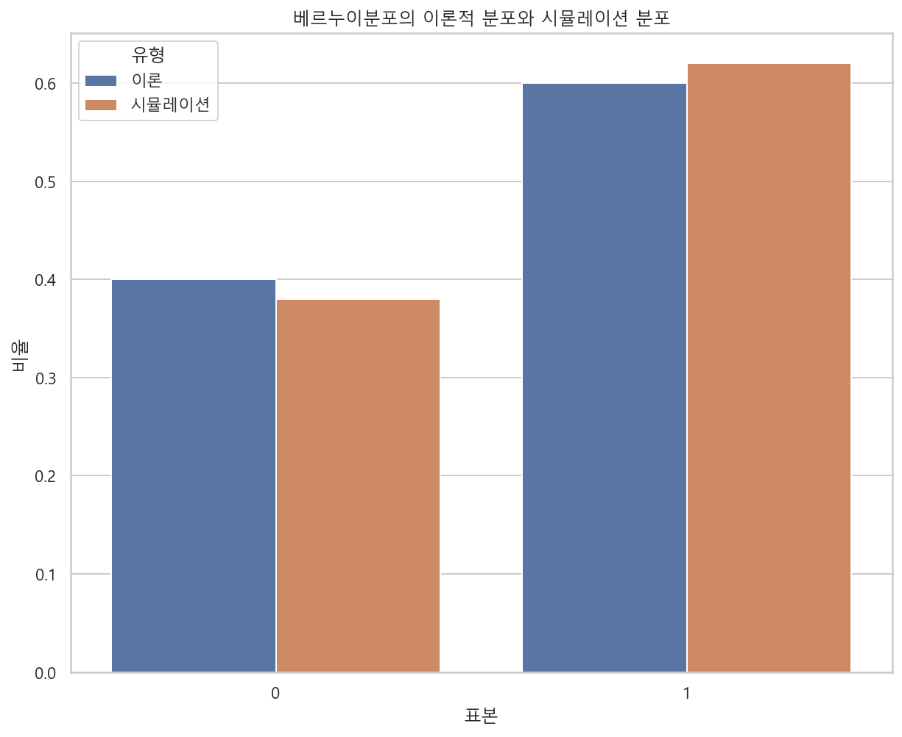

# 사이파이로 공부하는 확률분포

### 확률분포
- 이산확류분포 : 범줏값 출력
   - 베르누이분포
   - 이항분포
   - 카테고리분포
   - 다항분포
- 연속확률분포 : 연속적인 값 출력
   - 정규분포
   - 정규분포와 중심극한정리
   - 정규분포와 통계량
   - 데이터간의 상관관계 파악 : 스튜던트t분포, 카이제곱분포, F분포
   - 베이즈 추정 : 베타분포, 감마분포, 디리클레분포

## 확률분포 분석
- scipy 패키지의 stats 서브패키지로 구현
- scipy.stats.클래스이름(모수, 모수, ...)
- 확률분포 객체 생성 : 분포 선택 
    - rv = scipy.stats.norm()
- 모수 지정 : 분포의 구체적인 모양 선택
    - loc : 기댓값, scale : 표준편차
- 객체의 매서드 호출 : 분포에서 어떤 값이 자주 나오는지 알려주는 확률분포함수 선택
    - rv.pdf(), rv.cdf(), rv.rvs(size, random_state), rv.pmf(), ...
    
### 확률분포 클래스
- 사이파이의 stats 서브패키지에서 다양한 확률분포 클래스를 사용할 수 있다.
- 이산확률분포 : 분류문제 classification
    - bernoulli : 베르누이 분포
    - binom : 이항분포
    - multinomial : 다항분포
- 연속속확률분포 : 회귀분석 regression analysis
    - uniform : 균일분포
    - norm : 정규분포
    - beta : 베타분포
    - gamma : 감마분포
    - t : 스튜던트 t분포
    - chi2 : 카이제곱분포
    - f : F 분포
    - dirichlet : 디리클리분포
    - multivariate_normal : 다변수 정규분포

### 모수지정
- 확률분포 객체의 생성시 분포의 형상을 구체적으로 지정하는 모수를 입력해야한다.
- 각 확률분포마다 모수가 다르다.
- 일반적으로 비슷한 것 : loc : 기댓값, scale : 표본표준편차
    - sp.stats.norm(loc=1, scale=2)
    
### 확률분포 매서드
- 확률분포 객체가 가지는 매서드
    - pmf : 확률질량함수 probability mass function
    - pdf : 확률밀도함수 probability density function
    - cdf : 누적분포함수 cumulative distribution function
    - ppf : 누적분포함수의 역함수 inverse cumulative distribution function
    - sf : 생존함수 survival function = 1 - cdf
    - isf : 생존함수의 역함수 inverse survival function
    - rvs : 랜덤 표본 생성 random value sampling
    - logpmf : 로그 확률질량함수
    - logcdf : 로그 누적분포함수
    - logsf : 로그 생존함수
    - stats : mean, variance, skew, kurtois 값 반환
    - median : 분포의 표본중앙값
    - mean : 분포의 표본평균
    - var : 분포의 표본분산 
    - std : 분포의 표본표준편차
    - interval : 신뢰구간 
- 사용법 : 확률분포 객체뒤에 매서드를 붙이고 x값을 넣는다.
    - rv.pdf(x), rv.pmf(x), rv.cdf(x), rv.stats(), rv.mean(), rv.median(), rv.var(), ... 
    
### 누적분포함수 
- 표본값 x에 대한 누적확률 출력

### 무작위 표본 생성
- 무작위로 표본을 만들어 주는 매서드
    - rvs(size=1000, random_state=0)
- 인수
    - size=(2, 3) : 2X3 행렬
    - size=1000 : 1X1000 행렬 (열벡터)
    
### 변환 확률변수의 시뮬레이션
- ```변환 transform``` : 기존의 확률변수를 사용하여 새로운 확률변수를 만드는 것
    - Y = f(X), {x_1, x_2, x_N} -> {f(x_1), f(x_2), f(x_N)}, {x_i} -> {y_i}
    - Y = X1 + X2 + X3 + ... (X1, X2, X3 ... 는 모두 X의 복사본과 같다)
    - 여러 확률변수가 있을 때도 성립 : Z = X + Y
- 시뮬레이션 기능을 사용하여 변환 확률변수의 확률분포를 알 수 있다. (시뮬레이션이 특별한 기능이라기 보다 확률변수의 변환과정을 의미하는 것 같다.)

## 베르누이분포와 이항분포
- 베르누이분포와 이항분포는 확률분포 중 가장 단순한 분포이지만 분류문제 classification 에서 널리 사용된다.

### 베르누이 시행
- ```베르누이 시행 bernoulli trial``` : 결과가 두 가지 중 하나만 나오는 실험, 시행
    - 동전을 한 번 던져 결과가 앞면 또는 뒷면이 나오는 실험
    - 바둑알을 하나 선택할 때 결과가 흑돌 또는 백돌이 나오는 실험

### 베르누이 확률변수
- ```베르누이 확률변수 bernoulli random variable``` : 베르누이 실험 결과를 0 또는 1로 바꾼 것.
    - 정수 0, 1 둘 중에 하나의 값만 가질 수 있으므로 이산확률변수이다.
    - 정수 -1, 1로 나타내기도 한다. 
    
### 베르누이 확률분포
- ```베르누이 확률분포``` : 베르누이 확률변수의 분포
    - $X \sim Bern(x;\mu)$ : 확률변수 X가 베르누이 분포를 따른다. 
    - \mu : 1이 나올 확률
    - $Bern(x;\mu) = \left\{\begin{matrix}
\mu \;\;\;\;\;\;\;\;\; if\;\;x=1 \\ 
1-\mu \;\;\; if\;\;x=0 \\
\end{matrix}\right.$
- 한줄의 수식으로 바꾸면
    - $Bern(x;\mu) = \mu^{x}(1-\mu)^{(1-x)}$
- 베르누이 확률변수의 표본값이 -1, 1 일때 수식
    - $Bern(x;\mu) = \mu^{(1+x)/2}(1-\mu)^{(1-x)/2}$

### 사이파이를 사용한 베르누이 확률변수의 시뮬레이션
- 사이파이의 stats 패키지의 bernoulli 클래스를 사용하여 베르누이 확률변수 객체를 만든다.
    - sp.stats.bernoulli(p=mu) : 모수 mu의 값을 설정 : mu는 1이 나올 확률
    - 앞면이 나올 확률이 0.6, 뒷면이 나올 확률이 0.4인 동전과 같다.
- ```시뮬레이션 simulation``` : 확률변수의 표본을 생성하는 작업
    - 베르누이 확률분포 객체를 사용하여 표본 100개를 만드는 것은 동전을 100번 던져서 나온 결과와 같은 의미이다.
    - rv.rvs(100, random_state=0)
    
### 베르누이분포의 모멘트
- **베르누이분포의 기댓값**
    - $\text{E}[X] = \mu$
    - 베르누이분포의 기댓값은 mu이다. (mu=1이 나올 확률, 모수값)
- 증명
    - 이산확률변수 X의 기댓값 공식 사용
    - 1과 0을 대입하여 계산
    - $\begin{aligned}
\text{E}[X] 
&= \sum_{x_i \in \Omega} x_i p(x_i) \\
&= 1 \cdot \mu + 0 \cdot (1-\mu) \\
&= \mu
\end{aligned}$

- **베르누이분포의 분산**
    - $\text{Var}[X] = \mu \cdot (1-\mu)$
- 증명
    - 이산확률변수 X의 분산 공식 사용
    - 0과 1을 대입하여 계산
    - $\begin{aligned}
    \text{Var}[X] = 
    &= \sum_{x_i \in \Omega} (x_i - \bar{x})^2 p(xi) \\
    &= \sum_{x_i \in \Omega} (x_i - \mu)^2 p(xi) \\
    &= (0 - \mu)^2 p(0) + (1 - \mu)^2 p(1) \\
    &= (-\mu)^2 \cdot (1-\mu) + (1-\mu)^2 \cdot \mu \\
    &= \mu(1-\mu)(\mu + (1-\mu)) \\
    &= \mu(1-\mu) \\
    \end{aligned}$
    
### 이항분포
- ```이항분포 binomial distribution``` : N번 시행해서 X번 성공하여 성공할 확률이 \mu인 확률변수의 확률분포
    - $X \sim Bin(x;N,\mu)$
    - 확률변수 X는 성공한 횟수이므로 0~N 까지의 정수 중 하나이다.
- 베르누이분포와 이항분포는 모두 베르누이 확률변수에서 나온 분포이다.
    - 표본데이터가 1개이면 베르누이분포, 표본데이터가 여러개이면 이항분포이다.
- ```이항분포 확률변수 X의 확률질량함수 pmf```
    - 베르누이 확률분포를 따르는 확률변수 Y : $Y \sim Bern(x;\mu)$
    - 확률변수 Y의 N개의 표본 : y_1, y_2, ..., y_N (표본 각각 성공 아니면 실패 값을 갖는다.)
    - 성공한 횟수 x : $x = \sum_{i=1}^{N} y_i$ (Y의 표본값의 합)
    - 베르누이 확률분포를 따르는 확률변수 Y의 확률질량함수를 대입하여 정리
    - $Bin(x;N,\mu) = \binom{N}{x} \mu^{x} (1-\mu)^{N-x}$
        - $\binom{N}{x}=\dfrac{N!}{x!(N-x)!}$ 는 N개 중에서 순서 상관 없이 x개를 선택할 경우의 수 : **조합 combination**
        - $N! = N \cdot (N-1) \cdot (N-1) \cdots 2 \cdot 1$ : **팩토리얼 factorial**

### 이항분포의 모멘트
- **이항분포의 기댓값** 
    - $\text{E}[X] = N\mu$
    - 이항분포의 기댓값은 전체시행횟수 * 모수값과 같다. (mu : 1이 나올 확률)
- 증명
    - $\begin{aligned}
    \text{E}[X]
    &= \text{E}[\sum_{i=1}^{N} Y_i] \\
    &= \sum_{i=1}^{N} \text{E}[Y_i] \;\; ((sol:E[Y_i]=E[Y], copy))\\
    &= N\mu \;\; ((sol:E[bern]=\mu))
    \end{aligned}$
    - Y_i는 서로 독립인 베르누이분포이다. 베르누이분포의 기댓값은 mu이다.
- **이항분포의 분산**
    - $\text{Var}[X] = N\mu(1-\mu)$
- 증명
    - $\begin{aligned}
    \text{Var}[X]
    &= \text{Var}[\sum_{i=1}^{N} Y_i] \\
    &= \sum_{i=1}^{N} \text{Var}[Y_i] \;\; ((sol:Var[Y_i]=Var[Y], copy)) \\
    &= N\mu(1-\mu) \;\; ((sol:Var[bern]=\mu(1-\mu)))
    \end{aligned}$
    - Y_i는 서로 독립인 베르누이분포이다. 베르누이분포의 분산값은 mu(1-mu)이다.
    
### 베르누이분포와 이항분포의 모수추정
- ```모수추정 parameter estimation``` : 데이터에서 모수값을 찾아내는 과정
    - $\hat{\mu} = \dfrac{\sum_{i=1}^{N}x_i}{N} = \dfrac{N_1}{N}$
    - N : 전체 데이터의 수, N_1 : 1이 나온 횟수
- 베르누이분포와 이항분포는 공통된 모수 mu를 갖는다.
- 일반적으로 데이터의 표본이 1개 보다 많기 때문에 이항분포가 된다. 

### 베르누이분포의 활용
- 베르누이분포는 2가지 측면에서 활용할 수 있다. 
- **베이지안 관점** : 분류예측 문제에서 출력데이터가 두 값으로 구분되는 카테고리값인 경우, 두 값중 어느 것이 **나올 가능성**이 높은지를 표현하는 데 사용된다.
- **빈도주의 관점** : 입력데이터가 0 또는 1 혹은 참 또는 거짓 등 두 개의 값으로 구분되는 카테고리값인 경우, 두 종류의 값이 **나타나는 비율**을 표현하는 데 사용된다.

### 스팸메일 필터링에서 베르누이분포의 활용
- 스팸메일과 정상메일을 구분하는 필터 : 전체 메일 10개 중 스팸메일이 6개라면 이 메일 계정으로 들어오는 메일이 스팸메일일 가능성은 60%라고 볼 수 있다.
    - 모수가 0.6인 베르누이분포와 같다. $\mu = 0.6$
    - $p(y) = \text{Bern}(y;\mu=0.6)$
- 스팸메일 필터에서 베르누이분포를 활용하는 방법, 스팸메일은 특정한 단어를 가지고 있을 확률이 높다. 따라서 어떤 키워드가 있는지 없는지를 BOW Bag of Words 방식으로 인코딩된 벡터로 나타낼 수 있다. 
    - $x = \left[\begin{matrix}
1 \\
0 \\
1 \\
0 
\end{matrix}\right]$
    - 키워드가 있으면 1, 없으면 0으로 표시된다. 1번과 3번 키워드는 있고, 2번과 4번 키워드는 들어있지 않다.
- 여러개의 메일을 키워드가 있는지 없는지 조사하여 BOW 벡터로 나타내면,
    - $X_{spam} = \left[\begin{matrix}
    1 & 0 & 1 & 0 \\
    1 & 1 & 1 & 0 \\
    1 & 1 & 0 & 1 \\
    0 & 0 & 1 & 1 \\
    1 & 1 & 0 & 0 \\
    1 & 1 & 1 & 1 \\
    \end{matrix}\right]$
    - 열은 키워드의 종류, 행은 메일을 의미한다. 2번째 행은 2번째 메일에 어느 키워드가 있는지 없는지를 나타낸다.
- 스팸메일의 특성을 베르누이 확률변수의 튜플로 나타낼 수 있다. 
    - X1 : 스팸 메일(Y=1)이 첫번쨰 키워드를 가지고 있으면 1, 없으면 0이 되는 확률변수
        - $p(X_1 = 1 | Y = 1) = Bern(x_1 ; \mu_{spam, 1})$
    - X2 : 스팸 메일(Y=1)이 첫번쨰 키워드를 가지고 있으면 1, 없으면 0이 되는 확률변수
        - $p(X_2 = 1 | Y = 1) = Bern(x_2 ; \mu_{spam, 2})$
    - X1 : 스팸 메일(Y=1)이 첫번쨰 키워드를 가지고 있으면 1, 없으면 0이 되는 확률변수
        - $p(X_3 = 1 | Y = 1) = Bern(x_3 ; \mu_{spam, 3})$
    - X1 : 스팸 메일(Y=1)이 첫번쨰 키워드를 가지고 있으면 1, 없으면 0이 되는 확률변수
        - $p(X_4 = 1 | Y = 1) = Bern(x_4 ; \mu_{spam, 4})$
- 모수추정을 사용하여 각 베르누이 확률분포의 모수값을 추정할 수 있다.
    - $\mu_{spam, 1} = \dfrac{5}{6},\;\;\mu_{spam, 2} = \dfrac{4}{6},\;\;\mu_{spam, 3} = \dfrac{3}{6},\;\;\mu_{spam, 4} = \dfrac{3}{6}$
    - 1이 나오는 경우 / 전체 데이터수
    - 키워드 1이 나오는 경우 / 전체 메일 수

## 카테고리분포와 다항분포
- 베르누이분포의 확장판 : 카테고리분포
- 이항분포의 확장판 : 다항분포
- 베르누이분포 : **이진분류 문제 binary classification** 에 사용
- 카테고리분포 : **다중분류 multi classification** 에 사용

### 카테고리 확률변수
- 베르누이 확률변수는 0 또는 1, 1 또는 -1 이 나오는 확률변수이다.
- `카테고리 확률변수 categorical random variable` : 1 부터 K까지 K개 정숫값 중 하나가 나오는 확률변수이다.
    - 이러한 정숫값을 범줏값, 카테고리, 클래스라고 한다. 
- 카테고리 확률변수의 정숫값은 스칼라값이지만 **원핫인코딩 one-hot-encoding**으로 나타낸 벡터가 된다.
    - x = 1 -> x = (1, 0, 0, 0, 0, 0)
    - x = 2 -> x = (0, 1, 0, 0, 0, 0)
    - x = 3 -> x = (0, 0, 1, 0, 0, 0)
    - x = 4 -> x = (0, 0, 0, 1, 0, 0)
    - x = 5 -> x = (0, 0, 0, 0, 1, 0)
    - x = 6 -> x = (0, 0, 0, 0, 0, 1)
    - K = 100 이면 100차원의 벡터로 표시된다. 
- 확률변수의 값 : x = (x1, x2, x3, x4, x5, x6), 이 벡터 x의 원소의 제한 조건 2가지
    - $x_i = \left\{\begin{matrix}
    0 \\
    1 \\
    \end{matrix}\right.$, x_k 값은 0 또는 1만 가능하다는 의미이다.
    - $\sum_{k=1}^{K} x_k = 1$, 모든 x_k는 0, 1 둘중 하나만 가능하고 총합이 1이므로 xk 중 하나만 1이라는 의미이다.
- 확률변수의 값 x1, x2, ...는 모두 0, 1의 값을 갖는 베르누이 확률이므로 모수를 갖는다. 
    - $\mu = (\mu_1, \mu_2, \cdots, \mu_k)$
    - 모수 벡터의 원소들도 제한 조건 2가지를 갖는다.
    - $\mu = \left\{\begin{matrix}
    0 \leq \mu_k \leq 1 \\
    \end{matrix}\right.$, 모수는 0과 1사이의 실수값을 갖는다.
    - $\sum_{k=1}^{K} \mu_{k} = 1$, 모든 모수가 0과 1사이의 실수값이면서 총합이 1이므로 모든 경우의 확률이 1이라는 의미이다.

### 카테고리 확률분포
- `카테고리 확률분포 categorical probability distribution` : 카테고리 확률변수의 확률분포
    - $\text{Cat}(x_1, x_2, \cdots, x_k ; \mu_1, \mu_2, \cdots, \mu_k)$
    - x와, \mu의 벡터로 묶으면
    - $\text{Cat}(x;\mu)$, (x=(x1, x2, ..., xk), \mu=(mu1, mu2, ..., muk), 둘다 열벡터)
- 카테고리 확률변수의 확률질량함수 pmf
    - $\text{Cat}(x;\mu) = \left\{\begin{matrix}
    \mu_1\;\;\;\;if x=(1,0,0,\cdots,0) \\
    \mu_2\;\;\;\;if x=(0,1,0,\cdots,0) \\
    \mu_3\;\;\;\;if x=(0,0,1,\cdots,0) \\
    \vdots \\
    \mu_k\;\;\;\;if x=(0,0,0,\cdots,1) \\
    \end{matrix}\right.$ 
    > $\text{Cat}(x;\mu) = \mu_{1}^{x_1}\mu_{2}^{x_2}\cdots\mu_{K}^{x_K} = \prod_{k=1}^{K} \mu_{k}^{x_K}$
- 카테고리 확률변수의 확률질량함수는 베르누이 확률질량함수와 같다.
    - 카데고리 확률변수의 원소의 제한조건과 이 원소들의 모수의 제한조건을 사용하면 증명된다.
    - $\text{Cat}(x;\mu) = \mu^{x}(1-\mu)^{1-x}$
    
### 카테고리 확률분포의 모멘트
- 카테고리 확률분포의 기댓값
    - $\text{E}[x_k] = \mu_{k}$, (베르누이 분포의 기댓값과 같으나 k번째 모수의 값이다.)
- 카테고리 확률분포의 분산값
    - $\text{Var}[x_k] = \mu_{k} (1-\mu_{k})$, (베르누이 분포의 분산값과 같으나 k번째 모수의 값이다.)
- 표본값 x_k가 열벡터이므로 기댓값과 분산값도 열벡터이다.

### 다중 분류 문제
- `다중분류 문제` : 예측할 범주값이 두 가지 이상인 경우에 해당한다. 이러한 경우는 **카테고리 분포**를 사용하여 범주값 데이터 모형을 만들 수 있다.
    - `이진분류 문제` : 예측할 범주값이 두 가지인 경우에 해당한다. 이러한 경우는 **베르누이 분포**를 사용하여 범주값 데이터 모형을 만들 수 있다.
- 붓꽃 데이터에서 범주값에 해당하는 데이터는 품종이다. 붓꽃 데이터의 품종값은 K=3인 카테고리분포를 따른다. 

### 다항분포
- `다항분포 multinomial distribution` : 카테고리 확률변수의 데이터가 여러개 있을때 데이터의 합은 다항분포가 된다.
    - 즉 카테고리 변수에서 나온 표본이 여러개 있을 때, 1~6 눈금이 있는 주사위를 여러번 던졌을 때 다항분포를 따른다.
    - 베르누이 확률변수의 데이터가 여러개 있을때 데이터의 합은 이항분포가 된다. 
- 카테고리가 K개인 카테고리 확률변수의 표본 데이터를 N개 얻었을 때 각각의 카테고리 k가 각각 x_k번 나올 확률분포를 의미한다.
    - 표본값이 벡터 x = (x1, x2, ..., xk)가 되는 확률분포를 말한다.
    - x = (1, 2, 1, 2, 3, 1) 이면 1+2+1+2+3+1=10번 시행중에, k=1이 1번, k=2가 2번, k=3이 1번, k=4가 2번, k=5가 3번, k=6이 1번 나온 것과 같다. 
    - 다항분포의 표본값의 합은 N (시행, 실험 횟수) 이다.
- 다항분포의 확률질량함수 pmf
    - $\text{Mu}[x;N,\mu] = \binom{N}{x} \prod_{k=1}^{K} \mu_{k}^{x_k} = \binom{N}{x_1,\cdots,x_k} \prod_{k=1}^{K} \mu_{k}^{x_k}$
    - $\binom{N}{x_1,\cdots,x_k} = \dfrac{N!}{x_{1}! \cdots x_{k}!}$
    - **다항분포의 확률질량함수는 이항분포의 확률질량함수와 같다.** (표본의 합=N, 모수 \mu의 합=1 이라는 조건을 사용하여 정리)

## 정규분포와 중심극한정리

### 정규분포와 가우스 정규분포
- `정규분포 normal distribution`과 `가우스 정규분포 Gaussian normal distribution` : 자연현상의 숫자를 확률모형으로 구현할 때 사용하는 분포
- 정규분포의 확률밀도 함수
    - $\mathcal{N}(x;\mu, \sigma^2) = \dfrac{1}{\sqrt{2 \pi \sigma^2}} \exp \left(- \dfrac{(x-\mu)^2}{2 \sigma^2} \right)$
    - 평균(mu)과 분산(sigma^2) 두 모수만으로 정의된다.
- 분산의 역수
    - `정밀도 precision` : $\beta = \dfrac{1}{\sigma^2}$, (머신러닝의 예측모형의 성능 지표에서 나옴)
- `표준 정규분포 standard normal distribution` : 평균=0, 분산=1 인 정규분포
- 정규분포의 확률밀도함수의 성질
    - $x=\mu$ 에서 확률밀도가 가장 크다. (평균값의 위치에서 확률밀도값이 가장 크다)
    - $x=\infty, x=-\infty$ 로 다가갈 수록 확률밀도가 작아진다.
    - **확률밀도함수는 누적분포함수의 도함수이고, 확률밀도함수에서의 확률은 면적과 같다.**
- 정규분포 확률변수에서 데이터 집합을 생성하여 히스토그램을 보면 정규분포 형태가 아닌것 처럼 보인다. 그런데 정규분포를 따르는게 맞다.
    - 반대로 어떤 현실 데이터 집합이 정규분포가 아니라고 해도 확률변수는 정규분포 일 수 있다는 의미로 해석한다.

### 로그정규분포
- 나스닥 주가의 수익률 그래프가 정규분포라면, 주가 자체는 어떤 분포일까?
- `로그정규분포 log-normal distribution` : 데이터에 로그를 한 값 또는 변화율(수익률)이 정규분포가 되는 분포를 말한다.
    - $ln(X) \sim \mathcal{N}(x;\mu, \sigma^2)$
    - **로그정규분포를 띄는 분포는 항상 양수이다.** 그러므로 로그변환을 한 다음 사용하는 것이 일반적이다.
- 로그정규분포의 확률밀도함수
    - $f(x;\mu, \sigma^2) = \left\{\begin{matrix}
\dfrac{1}{x \sigma \sqrt{2\pi}} \exp \left(- \dfrac{(ln x - \mu)^2}{2\sigma^2}\right)\;\;\;(x \geq 0) \\ 
0 \;\;\;(x \leq 0) \\
\end{matrix}\right.$
- 위키피디아 참조

### Q-Q플롯
- `Q-Q 플롯 quantile-quantile` : 분석할 표본 데이터의 분포와 정규분포의 분포 형태를 비교하여 표본 데이터가 정규분포를 따르는지 검사해주는 시각적 도구이다.
    - 어떤 확률변수의 분포가 정규분포인지 아닌지 확인하는 것은 통계적 분석에서 중요하다.
- Q-Q 플롯은 동일 분위수에 해당하는 정상 분포의 값과 주어진 데이터값을 한 쌍으로 만들어 그린 **스캐터 플롯scatter plot**과 같다.
- Q-Q 플롯을 그리는 과정
    - 표본 데이터를 정렬한다.
    - 표본 데이터 하나가 **전체 데이터 중의 몇 % 정도에 해당하는지 위칫값**을 구한다.
        - 위치값은 순서통계량(order statistics) 값을 사용한다. 
    - **표본정규분포의 분위함수 quantile function** : 확률값에 대한 누적확률함수의 역함수값을 구한다. 각 표본데이터의 위치값이 정규분포의 누적확률함수 cdf값이 되는표준 정규분포의 표본값을 구하는 것과 같다. 
    - 정렬된 표본데이터와 그에 대응하는 분위수(theoretical quantiles)를 하나의 쌍으로 하는 점을 2차원 공간에 그린다.
    - 모든 표본에 대해서 이 작업을 하여 나타낸다.
    - 표본이 1%에 해당한다면 F^(-1)(0.01) = -2.326 이 값이 분위함수의 값이다.
- 정규분포를 따르는 데이터 표본을 Q-Q 플롯으로 그리면 직선의 형태가 된다.
- 정규분포를 따르지 않는 데이터 표본을 Q-Q 플롯으로 그리면 직선의 양 끝이 휘어진 형태가 된다.
- 사이파이 패키지의 stats 서브패키지에는 Q-Q플롯을 그려주는 probplot() 명령이 있다.

### 중심극한정리
- `중심극한정리 central limit theorem` : 여러 확률변수의 합이 정규분포와 비슷한 분포를 이루는 현상
    - central은 확률이론의 중심이라는 뜻으로, 중요하다는 의미이다.
    - 중심극한정리에 의해서 실세계에서 발생하는 많은 현상을 정규분포를 이용해서 모형화할 수 있다. 
- 기댓값이 \mu, 분산이 \sigma^2 인 확률변수 X1, X2,...,X_N이 서로 독립일 때, 각 확률변수에서 표본 데이터 x1, x2, ..., xn을 뽑으면 평균은 다음과 같다.
    - $\bar{x}_{n} = \dfrac{1}{N}(x_1, x_2, \cdots, x_N)$
    - 이러한 평균값도 예측할 수 없는 확률변수이다. $\bar{X}_N$
- `중심극한정리` : N개의 **임의의 분포**로부터 얻은 표본의 평균은 N이 증가할 수록 기댓값이 \mu, 분산이 \sigma^2 / N 인 **정규분포로 수렴**한다. 
    - $\bar{X}_{N} \overset{d}{\rightarrow} \mathcal{N}(x;\mu, \dfrac{\sigma^2}{N})$
    - d ->는 N이 커질수록 특정한 분포의 형태로 수렴한다는 의미
- 정규화 : N개의 **임의의 분포**로부터 얻은 표본의 평균을 **정규화**하면 N이 증가할 수록 기대값이 0, 분산이 1인 **표준정규분포로 수렴**한다.
    - $\dfrac{\bar{X}_{N} - \mu}{\dfrac{\sigma}{\sqrt{N}}} \overset{d}{\rightarrow} \mathcal{N}(x;0, 1)$

### 정규분포의 통계량 분포
- 중심극한정리와 다르게 임의의 분포가 N개가 아닌 N개의 정규분포로부터 얻은 표본 평균은 어떤 분포가 될까?
- N개의 정규분포로부터 얻은 표본의 합은 기대값이 N\mu, 분산이 N\sigma^2 인 정규분포이다.
    - $x_i \sim \mathcal{N}(x;\mu, \sigma^2) \rightarrow \sum_{i=1}^{N}x_i \sim \mathcal{N}(x;N\mu, N\sigma^2)$
- 정규화하면 표준정규분포가 된다.
    - $x_i \sim \mathcal{N}{x;\mu, \sigma^2} \rightarrow z=\dfrac{\bar{x}-\mu}{\dfrac{\sigma}{\sqrt{N}}} \sim \mathcal{N}(x;0,1)$
- `z 통계량` : 정규분포의 표본의 평균
    - 중심극한정리는 N이 증가할 수록 표준정규분포로 수렴한다. N이 무한대가 되기전에는 정확한 정규분포가 아니다.
    - **z통계량은 N에 상관없이 항상 정확하게 표준정규분포이다.**

### 선형회귀 모형과 정규분포
- 정규분포는 선형회귀 모형에서 **잡음 disturbance** 을 모형화는데 사용된다.
    - 잡음이 예측값에 영향을 줄 수 있기 때문에 잡음을 모형화하는 작업 필요
- 선형회귀모형 : 입력변수(데이터 표본)이 종속변수에 선형적으로 영향을 미치는 모형
    - $\hat{y} = w_1x_1 + \cdots + w_Nx_N \approx y$
- `잡음 disturbance` : 데이터 분석에 있어서 측정할 수 없는 값을 의미한다.
    - $y = w_1x_1 + \cdots + w_Nx_N + \epsilon $
    - $y = w_1x_1 + \cdots + w_Nx_N + w_{N+1}x_{N+1} + w_{N+2}x_{N+2} + \cdots +  $
    - 예측값과 실제값의 차이인 잔차 residual 과는 다른 개념이다.
    - 선형회귀 모형을 만들 때 영향력이 작거나 일일이 측정하기 어려운 값들을 하나로 합친 것을 의미한다.
    - N번째 이후의 입력데이터들은 사실상 영향력이 미미하다.
    - 집값 데이터의 여러가지 피쳐들 중 귀신이 나오는지, 경비실이 있는지, 벌레가 몇마리 나오는지 등은 측정하기 어렵다. 이러한 요소들을 하나로 합친것
- 중심극한 정리에 의해서 임의의 확률변수의 합은 정규분포와 비슷한 형태이다.
    - $\epsilon = w_1x_1 + w_2x_2 + \cdots$
    - $\epsilon \sim \mathcal{N}(0, \sigma^2)$ : 기대값이 0인 정규분포라고 가정할 수 있다.    

# 스튜던트t분포, 카이제곱분포, F분포
- 연속확률분포
- 정규분포에서 파생된 분포들
    - 정규분포에서 생성된 데이터 집합에 여러 수식을 적용하여 값을 변화시킨다. 분포 모양이 달라진다
- 이 분포들을 **통계량 분포**라고도 부른다.

### 스튜던트 t분포
- `펫테일 fat tail` : 정규분포의 형태와 비슷하지만 양 끝의 꼬리부분이 더 두터운 모양
    - 현실에서는 극단적인 상황들이 발생할 수 있다. 이러한 극단적 상황의 데이터들이 반영된 형태
- 주식시장의 수익률은 일반적으로 정규분포를 따른다고 본다.
    - 블랙스완 : 자주 발생할 수 없는 극단적 현상을 금융계에서 일컫는 말
- 과거 주가 데이터 통해서 이러한 현상을 확인 할 수 있다.
- `스튜던트 t분포 student-t distribution` : 팻테일을 보이는 데이터 모형에 적합한 분포이다. t분포라고도 부른다.
    - pdf : $t(x;\mu,\lambda,\nu) = \dfrac{\sqrt{\lambda}}{\sqrt{\nu\pi}} \dfrac{\Gamma(\dfrac{\nu+1}{2})}{\Gamma(\dfrac{\nu}{2})} \left( 1 + \lambda\dfrac{(x-\mu)^2}{\nu} \right)^{-\dfrac{\nu+1}{2}}$ 
- 모수
    - mu : 1이 될 확률
    - lambda : 정규분포의 정밀도 (분산의 역수, beta, precision)
    - Gamma : 감마함수, 특수함수 $\Gamma(x) = \int_{0}^{\infty} u^{x-1} e^{-u} du$
    - nu : 자유도
- 스튜던트 t분포에서 nu는 자유도 값을 의미한다. 
    - **코시 분포 cauchy dist-** : 자유도가 1인 t분포
    - **하프 코시 분포 half cauchy dist-** : 코시 분포에서 양수인 부분만 사용하는 것
    - 자유도가 작아질 수록 : 분산이 커지고, 높이가 낮아지고, 꼬리가 두터워진다.
    - 자유도가 커질 수록 : 정규분포에 수렴한다.
- 스튜던트 t분포의 모멘트
    - 기댓값 : $\text{E}[X] = \mu$
    - 분산값 : $\text{Var}[X] = \dfrac{\nu}{\lambda(\nu-2)}$ (\nu > 2일때만 성립, \nu=1, 2이면 분산이 무한대가 된다.)
    
### t통계량
- `z 통계량` : 정규분포의 표본을 표준편차로 나눠서 정규화한 것, z통계량은 N의 증감에 상관없이 항상 정규분포이다.
    - z 통계량을 구하려면 표준편차를 알아야하는데 현실적으로 표준편차를 구하기 어렵다. 
    - 따라서 표본으로부터 표본표준편차로 정규화 할 수 밖에 없다.
- `t 통계량` : 정규분포로부터 얻은 N개의 표본 x1, x2, ..., xn 에서 계산한 표본평균을 표본표준편차로 정규화한 값.
    - t 통계량은 자유도가 N - 1인 스튜던트 t분포를 따른다.
    - $t = \dfrac{\bar{x}-\mu}{\dfrac{s}{\sqrt{N}}} \sim t \; (x;0, 1, N-1)$
    - xbar와 s는 각각 표본평균, 표본표준편차(비편향)이다.
- 시뮬레이션을 사용하여 t 통계량 분포를 그려보면 N이 작으면 스튜던트 t분포의 형태이고, N이 커지면 정규분포와 비슷해진다.

### 카이제곱분포
- t 통계량 : 확률변수 X로부터 얻은 N개의 표본 x1, x2, ..., xn의 표본평균 또는 표본의 합을 표본분산으로 정규화하면 스튜던트t분포를 따른다.
    - 모수 nu가 N-1 인 스튜던트t분포가 된다.
- `카이제곱분포 chi-squared dist-` : 확률변수 X에서 얻은 N개의 표본 x1~xn을 제곱합하면 양수값만 가지는 카이제곱분포가 된다. 
    - $x_i \sim \mathcal{N}(x;\mu, \sigma^2) \rightarrow \sum_{i=1}^{N} x_{i}^2 \sim \chi^2(x;\nu=N)$
    - 표본 xi가 정규분포를 따를때 표본들의 제곱합은 카이제곱분포를 따른다.
    - nu=N 은 표본의 갯수
- `카이제곱분포의 확률밀도함수 pdf`
    - $\dfrac{x^{(\dfrac{\nu}{2}-1)} \exp^{\left(-\dfrac{x}{2}\right)}} {2^{\left(\dfrac{\nu}{2}\right)} \cdot \Gamma\left(\dfrac{\nu}{2}\right)}$
    - 감마함수 : $\Gamma(x) = \dfrac{\nu}{\lambda(\nu-2)}$
- 카이제곱분포의 확률밀도함수에 따라서 N=nu 가 커지면 분모가 커지기때문에 0근처의 값들이 많이 나올 것 같다. 그러나 N이 2보다 커지면 0보다 조금 큰 1-2 근처의 값이 많이 나온다. 

### F분포
- `F분포` : 카이제곱분포를 따르는 독립적인 두 확률변수의 확률변수 표본을 각각 x1, x2라고 할때 이를 각각 N1, N2로 나눈뒤 비율을 구한 값.
    - $x_1 \sim \chi^2(N_1),\;\; x_2 \sim \chi^2(N_2) \rightarrow \dfrac{\dfrac{x_1}{N_1}}{\dfrac{x_2}{N_2}} \sim \text{F}(x;N_1, N_2)$
    - 스튜던트 t분포와 카이제곱분포는 정규분포를 따르는 확률변수 X로부터 나온 N개의 표본으로부터 만들 수 있었다. F분포도 같다.
- F분포의 확률밀도함수
     - $f(x;N_1, N_2) = \dfrac{\sqrt{\dfrac{(N_1x)^{N_1} \; N_2^{N_2}}{(N_1x + N_2)^{N_1 + N_2}}}} {x\;\text{B} \left( \dfrac{N_1}{2}, \dfrac{N_2}{2} \right)}$ 
     - B(x) : 베타함수
- 스튜던트 t분포의 표본도 제곱을 하면 F분포가 될 수 있다. (정규분포의 표본을 제곱합을 하면 카이제곱분포가 된다.)
    - t(N)^2 = F(1, N)
- F분포의 특징은 N1과 N2의 값이 같을 경우 값이 1근처의 값이 가장 많이 발생할 것 같지만 1이 아닌 다른 수가 더 흔하게 발생한다. 
    - (x1/N1) / (x2/N2) : N1=N2이면 x1/x2가 되므로 1이라는 직관적 계산이 가능하다.
    - 그러나 N1=N2인 시뮬레이션을 통해 발생하는 값의 분포를 살펴보면 1이 아닌 다른 값에서 더 많이 나온다.
    - 또한 N1=N2=a에서 a의 값이 커지면 오히려 0근처의 값이 많이 나온다는 것을 알 수 있다.
    
### 선형회귀분석에서의 확률분포의 활용
- 스튜던트 t분포, 카이제곱분포, F분포는 정규분포의 `통계량분포 statistics distribution`의 일종이다.
- 선형회귀 분석에서 각 분포들이 활용된다.
    - **스튜던트 t분포 : 추정된 가중치에 대한 확률분포**
    - **카이제곱분포 : 오차 제곱합에 대한 확률분포**
    - **F분포 : 비교 대상이 되는 선형모형의 오차 제곱합에 대한 비율의 확률분포**
- 정규분포를 따르는 확률변수 X에서 뽑은 N개의 표본집합 {xi}에 대하여
-    $X \rightarrow {x_i} = \left\{\begin{matrix}
     \sum x_i \rightarrow normal\;distribution \\
     \dfrac{\bar{x}-\mu}{\dfrac{\sigma}{\sqrt{N}}} \rightarrow z\;statistics \\
     \dfrac{\bar{x}-\mu}{\dfrac{s}{\sqrt{N}}} \rightarrow t\;statistics \\
     \sum_{i=1}^{N} x_{i}^2 \rightarrow chi^2\;distribution \\
     \dfrac{\sum_{i=1}^{N_1}x_{1}^2}{\sum_{i=1}^{N_2}x_{2}^2} \rightarrow F\;distribution \\
    \end{matrix}\right.$

# 다변수 정규분포

### 다변수 정규분포
- D차원의 `다변수정규분포 MVN, multivariate gaussian normal distribution`의 확률밀도함수
- 다변수정규분포의 확률밀도함수는 벡터를 입력받아서 이 벡터가 나올 확률=스칼라 값을 출력해준다.
    - $\mathcal{N}(x;\mu,\sum) = \dfrac{1}{\left(2\pi\right)^{D/2}|\sum|^{1/2}} \exp\left( -\dfrac{1}{2}(x-\mu)^{T} \cdot \sum^{-1} \cdot (x-\mu) \right)$
    - $x \in \text{R}^D$
    - $\mu \in \text{R}^D$, 평균벡터
    - $\sum \in \text{R}^{DxD}$, 공분산행렬
    - 괄호안의 수식은 x^TAx 인 이차형식이다. 즉 스칼라 값이 된다.
    - 지수함수 값도 상수가 된다. 
- 다변수정규분포에서 공분산행렬은 양의 정부호인 대칭행렬이어야 한다. 따라서 항상 역행렬이 존재한다.
    - **공분산행렬의 역행렬 : 정밀도 행렬 precision matrix**
- 증명 : `분산행렬의 부호가 양의 정부호이면 항상 역행렬이 존재한다.` (207p)
    - 분산행렬은 대칭행렬이다.
    - 대칭행렬이 양의 정부호이면 이 행렬의 고윳값이 모두 양의 정부호이다. (대칭행렬의 부호 성질 205p)
    - 역행렬이 존재하려면 행렬식의 값이 0이 아니어야 한다.
    - 행렬식의 성질에 의해 행렬식값은 모든 고윳값의 곱과 같다.
    - 이 대칭행렬의 행렬식값은 모든 고윳값의 곱과 같고, 모든 고윳값이 양의 정부호이므로 행렬식의 값도 0보다 크다.
    - 따라서 행렬식이 0보다 크므로 항상 역행렬을 갖는다.
- 2차원 다변수 정규분포 일때 : x = [x1, x2], mu = [2, 3], 공분산행렬 = [[1, 0], [0, 1]] (항등행렬) 이라고 가정
    - 확률밀도함수에 대입하여 정리하면 다음과 같다.
    - $\mathcal{N}(x_1, x_2) = \dfrac{1}{2\pi} \exp \left(- \dfrac{1}{2} ((x_1-2)^2 + (x_2-3)^2)\right)$
    - 지수함수의 거듭제곱이 + 인경우 두개의 지수함수로 나눌 수 있다. (분리가능 함수) : 
        - $\text{e}^{(x_1-2)^{2} + (x_2-3)^{2}} \rightarrow \text{e}^{(x_1-2)^2} \text{e}^{(x_2-3)^2}$
    - 이렇게 분리하면 **결합확률밀도함수 = 주변확률밀도함수의 곱**의 형태가 된다. 이런경우 **두 확률변수는 독립이다.** (독립과 상관에서 나옴)
        - p(x, y) = p(x1)p(x2)
    - 따라서 원형의 분포나, 각각의 축에 평행한 분포형태가 된다. (기울어지지 않음)
    - 이 조건에서는 원형의 분포가 나온다.
- 2차원 다변수 정규분포 일때 : x = [x1, x2], mu = [2, 3], 공분산행렬 = [[2, 3], [3, 7]] 이라고 가정
    - 두 확률변수의 **상관관계 공식**에 의해 공분산행렬의 원소를 대입해 계산하면 **양의 상관관계**라는 것을 알 수 있다.
    - 확률밀도 함수에 대입하여 정리하면 다음과 같다.
    - $\mathcal{N}(x_1, x_2) = \dfrac{1}{2\sqrt{5}\pi} \exp \left( \dfrac{7}{5}(x_1-2)^2 - \dfrac{6}{5}(x_1-2)(x_2-3) + \dfrac{2}{5}(x_2-3)^2 \right)$
    - 이 식에서는 지수함수의 곱으로 분리할 수 없다. - 가 있기 때문이다.
    - 이 조건에서는 타원의 분포가 나온다.
    - 조건부확률분포로 단면의 분포를 나타내보면 독립이 아니라는 것을 알 수 있다. 
    
### 다변수정규분포와 고윳값 분해
- 다변수정규분포의 공분산행렬은 양의 정부호인 대칭행렬이다. 따라서 **대각화 가능 diagonalizable** 이다.
    - 양의 정부호인 대칭행렬이면 고윳값이 모두 양수이다.
    - 고윳값이 모두 양수이면 대각화 가능하다. 
    - 대칭행렬을 대각화 할 수 있다. $\sum = V \Lambda V^T$
    - 또한 양의 정부호이면 역행렬이 존재하기 때문에 대각화를 역행렬로 만들 수 있다. $\sum^{-1} = V \Lambda^{-1} V^T$
- 공분산행렬의 역행렬(=정밀도 행렬)의 고유분해
    - $\sum^{-1} = V \Lambda V^{T}$, ($\sum^{-1} = (V \Lambda V^{-1})^{-1} = V \Lambda^{-1} V^{-1} = V \Lambda^{-1} V^{T}$)
- 정밀도 행렬의 고유분해를 다변수정규분포의 확률밀도함수에 대입하면,
    - $\mathcal{N} \propto \exp \left( \dfrac{1}{2} (x-\mu)^{T} \sum^{-1} (x-\mu) \right)$
    >- $= \exp \left( \dfrac{1}{2} (x-\mu)^{T} V \Lambda^{-1} V^{T} (x-\mu) \right)$
    >- $= \exp \left( \dfrac{1}{2} (V^{T}(x-\mu))^{T} \Lambda^{-1} (V^{T} (x-\mu)) \right)$ 
    >- $= \exp \left( \dfrac{1}{2} (V^{-1}(x-\mu))^{T} \Lambda^{-1} (V^{-1} (x-\mu)) \right)$, ((sol : V^{T} => V^{-1}}))
- 정밀도 행렬의 고유분해값을 대입하여 식을 정리하면, **확률밀도함수의 좌표변환을 의미한다.**
    - $x^{'} = V^{-1}(x-\mu)$
    - x를 mu만큼 평행이동 한다. 이 값에 변환행렬을 곱해주는 형태. 
        - 고유벡터행렬은 고유벡터를 열벡터로 가지는 행렬인데, 이러한 행렬의 역행렬을 **변환행렬** 이라고 한다. (좌표변환에 필요한 행렬)
        - 변환행렬의 열벡터는 새로운 좌표의 베이시스 벡터이다.
        - 즉 V^-1의 열벡터인 고유벡터들이 새로운 베이시스 벡터가 되고 타원의 축이 된다. 
    - 따라서 x를 mu만큼 이동한 후 V^-1 로 좌표변환 한다는 의미이다. 
- 따라서 확률밀도함수는 원래좌표에서 고유벡터 방향으로 회전시킨 모양이다.
    - $\mathcal{N} \propto \exp \left(- \dfrac{1}{2} x^{'T} \Lambda^{-1} x^{'} \right)$
    - 확률밀도함수는 \mu가 중심이고 반지름은 고윳값에 비례하는 타원이다.
- 즉, 다변수정규분포의 정밀도행렬을 고유분해하여 식에 대입하면 좌표변환을 하는 것과 같아진다.
    - 공분산행렬의 고윳값이 타원의 가로와 세로 폭이 된다. 
    - 공분산행렬의 고유벡터가 타원의 방향이 된다. 
- 다변수정규분포의 공분산행렬이 고윳값의 비율 = "컨디션넘버" (회귀분석에서 나오는 개념)
    - 컨디션넘버가 클 수록 다중공선성이 강해진다. 즉 확률변수간 상관관계가 커진다. 
    - 컨디션넘버가 커지는 경우는 원래 다변수정규분포가 상관관계가 있는 경우와 이것을 좌표변환(또는 스케일링)했을 때 고윳값의 단위차이가 날 경우이다.
    
### 다변수정규분포의 조건부확률분포
- `다변수정규분포인 확률변수벡터 중 어떤 원소의 값이 주어지면 다른 확률변수의 조건부확률분포는 다변수정규분포이다.`
    - 즉 다변수 정규분포의 확률밀도함수를 자른 단면(x1, x2 중 하나의 값을 고정시킨 후 자름)의 분포도 정규분포라는 의미이다.
- x2를 임의의 값으로 고정시킨 후 자른 단면의 분포의 중심값은(\mu_{1|2}) 원래 다변수정규분포의 중심값(\mu_{1})과 차이가 생긴다. 
    - $\mu_{1|2} = \mu_1 - \Lambda_{11}^{-1} \Lambda_{12} (x_2 - \mu_2)$
    
### 다변수정규분포의 주변확률분포
- `다변수정규분포의 주변확률분포는 다변수정규분포이다.`
    - 즉 결합확률밀도함수를 어떤 확률변수의 값으로 적분하여 나머지 확률변수의 주변확률분포를 구하면 다변수정규분포라는 의미이다.
    - 확률밀도함수를 x1, x2 중 어떤 확률변수로든 조건부확률분포 즉 모든 단면의 면적(적분)을 구하면 이것의 분포가 정규분포를 따른다.

### 다변수정규분포의 의미
- 다변수정규분포의 조건부확률분포나 주변확률분포가 모두 정규분포를 따른다는 의미이다.

# 베타분포, 감마분포, 디리클레분포
- 베타분포, 감마분포, 디리클레 분포는 모숫값을 조정하여 분포의 모양을 조절 할 수 있다.
    - 모숫값 조절 -> 분포의 모양 조절
- 이 분포들은 데이터의 분포를 나타내기 보다 베이지안 확률론의 관점에서 확신 또는 신뢰의 정도를 나타내는데 주로 사용된다.

### 베타분포
- `베타분포 beta distribution` : 모수 a,b를 갖는다. 표본공간은 0과 1사이의 실수이다. 0과 1사이의 실수값만 표본으로 갖는다.
    - $\text{Beta}(x;a,b),\;\;\; 0 \leq x \leq 1$
- `베타분포의 pdf`
    - $\text{Beta}(x;a,b) = \dfrac{\Gamma(a + b)}{\Gamma(a) \Gamma(b)} x^{a-1} (1-x)^{b-1}$
    - $\Gamma(a) = \int_{0}^{\infty} x^{a-1} e^{-x} dx$, ((570p에도 나온다.))
- `베타분포의 모양`
    - sp.stats.beta(a, b)
    - a와 b의 값이 커질 수록 분포의 분산이 작아진다. 즉 폭이 좁아진다.
- `베타분포의 모멘트`
    - $\text{E}(x) = \dfrac{a}{a+b}$
    - $mode = \dfrac{a-1}{a+b-2}$, ((a와 b의 값이 같을때 식을 정리하면 0.5의 최빈값이 된다.))
    - $\text{Var}(x) = \dfrac{ab}{(a+b)^2(a+b+1)}$, ((분산의 식에 따라서 a, b의 값이 커지면 분모가 커진다는 것을 알 수 있다.))


### 감마분포
- `감마분포 gamma distribution` : 모수가 a, b이고, 어떤 모수의 베이지안 추정에 사용된다. 0부터 무한대의 양수값에 대한 추정에 사용된다.
    - $\text{Gam}(x;a,b) = \dfrac{1}{\Gamma(a)} b^{a} x^{a-1} e^{-bx}$
- `감마분포의 모멘트`
    - $\text{E}[X] = \dfrac{a}{b}$
    - $\text{mode} = \dfrac{a-1}{b}$
    - $\text{Var}[X] = \dfrac{a}{b^2}$
- `감마분포의 분포모양`
    - 베타분포와 마찬가지로 어떤 모수값에 대한 베이지안 확률론의 추정에 사용되므로, 분포의 분산의 크기가 모수값의 추정에 대한 신뢰도를 의미한다.
    - 사이파이의 stapts 서브패키지의 gamma() 클래스를 사용하여 만들 수 있다. 모수 b의 값이 1로 고정되어 있다.

### 디리클레분포
- `디리클레분포 dirichlet distribution` : 베타분포의 확장된 분포. 0과 1사이의 값을 가지는 다변수(multivariate) 확률변수의 베이지안 모형에 사용된다.
    - 3개의 변수가 사용된 경우 : (0.5, 0.6, 0.7) 또는 (1, 0, 0) 등의 0과 1사이의 값으로 이루어진 다변수를 입력받는다.
    - 베타분포는 0과 1사이의 단일(univariate) 확률변수의 베이지안 모형에 사용 됨 : (0.4) 또는 (0.145) 등 0과 1사이의 값으로 이루어진 단변수를 입력받는다.
- `디리클레분포의 확률밀도함수`
    - $\text{Dir}(x_1, x_2, \cdots, x_k ; \alpha_1, \alpha_2, \cdots, \alpha_k) = \dfrac{1}{\text{B}(\alpha_1, \alpha_2, \cdots, \alpha_k)} \prod_{i=1}^{K} x_{i}^{\alpha_i -1}$
    - 베타함수 : $B(\alpha_1, \alpha_2, \cdots, \alpha_k) = \dfrac{\prod_{i=1}^{K} \Gamma(\alpha_i)}{\Gamma\left( \sum_{i=1}^{K} \alpha_i\right)}$
    - 표본값 벡터 x = (x_1, x_2, ..., x_k), 모수값 벡터 \alpha = (\alpha_1, \alpha_2, ..., \alpha_k)
- `디리클레분포의 확률값 x의 제한조건`
    - $0 \leq x_i \leq 1$, $\sum_{i=1}^{K} x_i = 1$

### 베타분포와 디리클레분포의 관계
- **베타분포는 K=2 즉 입력변수가 2개인 디레클레분포와 같다.** x1 = x, x2 = 1-x, \alpha_1 = a, \alpha_2 = b 라고 한후, 베타분포의 확률밀도함수에 각각을 대입하여 정리한다.
- 디리클레분포의 확률밀도함수에 사용된 베타분포의 형태가 감마함수의 곱의 형태와 모수의 합을 입력받는 감마함수의 분수형태이므로, 위의 식의 형태와 같아진다.

$\begin{aligned}
    \text{Beta}(x;a,b)
    &= \dfrac{\Gamma(a+b)}{\Gamma(a)\Gamma(b)} x^{a-1} (1-x)^{b-1} \\
    &= \dfrac{\Gamma(\alpha_1+\alpha_2)}{\Gamma(\alpha_1)\Gamma(\alpha_2)} x_{1}^{\alpha_1-1} x_{2}^{\alpha_2-1} \\
    &= \dfrac{1}{\text{B}(\alpha_1, \alpha_2)} \prod_{i=1}^{K} x_{i}^{\alpha_i-1}\\
\end{aligned}$

### 디리클레분포의 모멘트
- 기댓값 : $\text{E}[x_k] = \dfrac{\alpha_k}{\sum \alpha}$
- 최빈값 : $mode = \dfrac{\alpha_k - 1}{\sum \alpha - K}$
- 분산 : $\text{Var}[x_k] = \dfrac{\alpha_k \left( \sum \alpha - \alpha_k \right)}{\left( \sum \alpha \right)^{2} \left( \sum \alpha + 1 \right)}$
- **기댓값 공식에서의 모수 \alpha 벡터는 입력변수인 x_k 벡터 중에서 어떤 수가 나올 가능성이 더 큰지를 결정하는 형상인자 shape factor이다.** 모든 모수의 값이 같으면 모든 xi의 확률분포가 같아진다. 나올확률이 같다.
- **분산 공식에서 모수 벡터가 값이 클 수록 값이 작아진다.** 즉 디리클레분포의 표본값 x가 어떤 특정한 값 근처에서 나올 가능성이 높다는 의미이다.

### 디리클레분포의 응용
- `3개의 양의 난수 x, y, z가 주어지고 항상 x + y + z = 1이 되게 하려면 어떻게 해야할까? 모든 경우가 균등해야 한다.`
    - 이러한 문제는 K=3이고, 모수가 \alpha_1 = \alpha_2 = \alpha_3인 디리클레분포의 특수한 경우이다.
    - 또한 3차원 공간에서 (1, 0, 0), (0, 1, 0), (0, 0, 1) 세점을 연결하는 정삼각형 면이 있고, 이 면 위에 점을 생성하는 문제와 같다. 디리클레분포의 확률값 제한조건에 의해서 x,y,z는 각각 1보다 클 수 없다.
- 이 정삼각형 범위안에서 일반 난수를 생성하면 점의 분포가 고르지 않고 중앙에 집중 되지만, 디리클레분포에 모수를 균일한 값으로 설정하여 난수를 생성하면 정삼각형 범위안에서 고르게 생성된다.
- **sp.stats.dirichlet((a, b, c))** : (a, b, c) 는 모수벡터 즉 모수값 \alpha_1, \alpha_2, \alpha_3 으로 이루어진 벡터이다.

### 베이지안 추정
- K=3이고, 모수가 (1, 1, 1)이 아닌 경우 : 정삼각형 안에 특정한 위치에 분포가 집중되는 것과 같다.
    - 이러한 특성을 이용하면 카테고리분포의 모수벡터 \mu를 추정한 결과를 나타낼 수 있다.
    - 즉 디리클레분포에 모수벡터 (0.3, 0.5, 0.5)를 입력하면 정삼각형 안에 특정한 값주면에 분포가 넓게 생긴다.
    - 다시 디리블레분포에 모수벡터 (30, 50, 50)을 입력하면 같은 값주변에 분포가 좁게 생긴다. 특정값 주변에서 카테고리분포의 모수가 나올 가능성이 높아진 것과 같다.

# [python] 사이파이로 확률밀도 함수 구현하기

### 확률밀도 함수
- 정규분포 
    - 기댓값 : loc = 1
    - 표본표준편차 : scale = 2
- 분포함수 : 확률밀도함수 pdf

```python
import scipy as sp
import scipy.stats
%matplotlib inline

# 정규분포 객체 생성 : 기댓값, 표준편차 설정
rv = sp.stats.norm(loc=1, scale=2)

# 표본값 생성
xx = np.linspace(-8, 8, 100)

# 정규분포의 확률밀도함수 객체 생성 : 표본값을 넣어주면 y값이 반환됨
pdf = rv.pdf(xx)

plt.figure(figsize=(8, 5))
plt.plot(xx, pdf)
plt.plot(1, rv.pdf(1), 'ro', ms=5)
plt.axvline(1, ls='--', lw=1, color='r')
plt.axhline(rv.pdf(1), ls='--', lw=1, color='r')

plt.title("확률밀도함수")
plt.xlabel('$x$')
plt.ylabel('$p(x)$')

plt.show() ;
```


### 다른 모양의 정규분포
- 기댓값 : loc = 0
- 표본표준편차 : scale = 0.1
- 분포함수 : 확률밀도함수
   - 표준편차가 작아지니 확률밀도함수의 폭도 좁아지는 것을 알 수 있다.

```python
# 기댓값과 표준편차를 다르게 설정한 정규분포 객체
rv2 = sp.stats.norm(loc=0, scale=0.1)
xx2 = np.linspace(-1, 1, 1000)
pdf2 = rv2.pdf(xx2)

plt.figure(figsize=(8, 5))
plt.plot(xx2, pdf2)
plt.plot(0, rv2.pdf(0), 'ro', ms=4)
plt.axvline(0, ls='--', lw=1, color='r')
plt.axhline(rv2.pdf(0), ls='--', lw=1, color='r')
plt.text(0+0.07, rv2.pdf(0)-0.2, '({}, {})'.format(0, round(rv2.pdf(0), 2)))

plt.xlabel('$x$')
plt.ylabel('$p(x)$')
plt.title("pdf 2")

plt.show() ;
```


#### 최대값
- 위의 분포는 x=0, 기댓값의 위치에서 최대값을 갖는다.
   - 확률밀도함수 객체에서 x=0일때의 y값 확인

```python
rv2.pdf(0)

>>> 3.989422804014327
```

### 누적분포함수

```python
xx = np.linspace(-8, 8, 300)

# rv는 위에서 생성한 정규분포 객체이다. cdf는 누적분포함수를 만드는 매서드
cdf = rv.cdf(xx)

plt.figure(figsize=(8, 5))
plt.plot(xx, cdf)
plt.title("누적분포함수")
plt.xlabel('$x$')
plt.ylabel('$F(x)$')

plt.show() ;
```


### 무작위 표본 생성
- 매서드 : rvs() : random value sampling
    - 인수 : size : 표본생성 시 생성될 표본의 크기, random_state : 표본 생성시 사용되는 시드 값

- 3X5의 배열에 정규분포 표본생성
```python
rv.rvs(size=(3, 5), random_state=0)

>>>
array([[ 4.52810469,  1.80031442,  2.95747597,  5.4817864 ,  4.73511598],
       [-0.95455576,  2.90017684,  0.69728558,  0.7935623 ,  1.821197  ],
       [ 1.28808714,  3.90854701,  2.52207545,  1.24335003,  1.88772647]])
```

- 5X5의 배열에 정규분포 표본생성
```python
rv.rvs(size=(3, 5), random_state=1)

>>>
array([[ 4.24869073, -0.22351283, -0.0563435 , -1.14593724,  2.73081526],
       [-3.60307739,  4.48962353, -0.5224138 ,  1.63807819,  0.50125925],
       [ 3.92421587, -3.12028142,  0.35516559,  0.23189129,  3.26753888],
       [-1.19978253,  0.65514358, -0.75571684,  1.08442749,  2.16563043],
       [-1.20123835,  3.28944742,  2.80318144,  2.00498868,  2.8017119 ]])
```

#### 정규분포 객체로 만든 샘플의 분포를 시각화
- sns.distplot() 은 표본값과 표본값의 범위마다 몇개가 있는지 갯수를 보여준다.

```python
plt.figure(figsize=(8, 5))

sns.distplot(rv.rvs(size=10000, random_state=0))
plt.title("랜덤 표본 생성 결과")
plt.xlabel('표본값')
plt.ylabel('count')

plt.show() ;
```


### 무작위 표본 생성 2
- 정규분포 데이터 1000개 생성
- 표본평균, 비편향표본분산 계산
- **인수로 넣은 기댓값과 분산과 비슷한지 비교**
   - 이론적 통계값과 표본 통계값은 미세하게 차이나지만 거의 같다.

```python
rv = sp.stats.norm(loc=1, scale=2)
samples = rv.rvs(size=1000, random_state=0)

print("이론적 평균 : {}, 표본 평균 : {}".format(rv.mean(), samples.mean()))
print("이론적 분산 : {}, 편향 분산 : {}".format(rv.var(), samples.var()))
print("이론적 분산 : {}, 비편향 분산 : {}".format(rv.var(), samples.var(ddof=1)))

>>>

이론적 평균 : 1.0, 표본 평균 : 0.9094865850196092
이론적 분산 : 4.0, 편향 분산 : 3.8969378252486173
이론적 분산 : 4.0, 비편향 분산 : 3.9008386639125296
```
#### scipy API에서 찾은 계산방법
- 처음 생성한 정규분포 객체의 mean, var, skew, kurt 값을 확인 할 수 있다. 

```python
mean, var, skew, kurt = rv.stats(moments='mvsk')
mean, var, skew, kurt

>>>

(array(1.), array(4.), array(0.), array(0.))
```

- 기술통계값과 모멘트값의 비교

```python
print("loc : {}".format(mean), ",", "sample_mean : {}".format(samples.mean()))
print("scale : {}".format(var), ",", "unbiased_sample_variance : {}".format(samples.var(ddof=1)))

>>>

loc : 1.0 , sample_mean : 0.9094865850196092
scale : 4.0 , unbiased_sample_variance : 3.9008386639125296
```

### 변환 확률변수의 시뮬레이션
- 시뮬레이션은 확률변수 객체에서 여러번의 샘플링을 표본을 만드는 것을 의미한다.
- 균일분포를 갖는 두 확률변수의 표보값의 합의 분포형태 확인
- 두 균일분포을 합하면 균일분포가 아니라 1에서 최빈값을 갖는 피라미드 형태의 분포 형상이 나온다.

```python
%matplotlib inline

# uniform : 균일분포
rv1 = sp.stats.uniform()
rv2 = sp.stats.uniform()

np.random.seed(0)
N = 50000
x_1 = rv1.rvs(N)
x_2 = rv2.rvs(N)

# 확률변수의 변환
x_3 = x_1 + x_2

plt.figure(figsize=(12, 5))

plt.subplot(131)
sns.distplot(x_1, kde=False)
plt.title("균일분포")
plt.xlabel("표본값")
plt.xlim(-0.2, 2.2)

plt.subplot(132)
sns.distplot(x_2, kde=False)
plt.title("균일분포")
plt.xlabel("표본값")
plt.xlim(-0.2, 2.2)

plt.subplot(133)
sns.distplot(x_3, kde=False)
plt.title("균일분포 표본의 합의 분포")
plt.xlabel("표본값")
plt.xlim(-0.2, 2.2)

plt.show() ;
```


#### 확률변수의 기술 통계값 계산
- eval() 함수를 사용하여 위에서 만든 x1, x2 변수를 불러오기

```python
for i in range(1, 4) :

    mean = round(np.mean(eval("x"+"_"+str(i))), 2)
    median = round(np.median(eval("x"+"_"+str(i))), 2)
    var = round(np.var(eval("x"+"_"+str(i))), 2)
    std = round(np.std(eval("x"+"_"+str(i))), 2)
    skew = round(sp.stats.skew(eval("x"+"_"+str(i))), 2)
    kurtosis = round(sp.stats.kurtosis(eval("x"+"_"+str(i))), 2)

    print("===", "x", "_", i, "===")
    print("mean : {0}, median : {1}, var : {2}, std : {3}, skew : {4}, kurtosis : {5}".format(mean, median, var, std, skew, kurtosis))
    print()

>>>

== x _ 1 ===
mean : 0.5, median : 0.5, var : 0.08, std : 0.29, skew : 0.0, kurtosis : -1.2

=== x _ 2 ===
mean : 0.5, median : 0.5, var : 0.08, std : 0.29, skew : -0.0, kurtosis : -1.21

=== x _ 3 ===
mean : 1.0, median : 1.0, var : 0.17, std : 0.41, skew : -0.0, kurtosis : -0.61
```

#### 확률변수의 최빈값 계산
- histogram을 사용하여 구간별 데이터의 갯수 계산
- 구간을 어떻게 나누느냐에 따라서 최빈값이 달라진다.

```python
bins = np.linspace(0, 2, 6)
ns, _ = np.histogram(x_3, bins=bins)
ns, _

>>>

(array([ 4016, 12021, 17927, 12138,  3898], dtype=int64),
 array([0. , 0.4, 0.8, 1.2, 1.6, 2. ]))
```

- 구간별 데이터의 갯수 중 가장 많은 구간을 mode_index로 정의
- mode_index 지점과 하나큰 지점을 합한 뒤 나누기

```python
mode_index = np.argmax(ns)
sample_mode = 0.5 * (bins[mode_index] + bins[mode_index + 1])
sample_mode

>>>

1.0
```
### 균일분포 확률분포와 시뮬레이션 
- 균일분포 확률분포에서 10개의 표본을 생성하고 이 값들의 합을 분포로 나타내시오
- 시뮬레이션 1000번
    - 시뮬레이션 = 표본 샘플링 = 실험, 시행과 같은 의미

- 반복문을 사용하여 10개 샘플 생성을 1000번 반복시행
```python
rv_trans_2 = []

# 10개의 데이터 샘플을 1000번 반복시행하여 생성
i = 0
while i <= 10000 :
    new_rv = sp.stats.uniform().rvs(size=10)
    rv_trans_2.append(sum(new_rv))
    i += 1

rv_trans_2.sort()

plt.figure(figsize=(10, 8))
sns.distplot(rv_trans_2, rug=False, kde=True)

# 통계값의 위치 표시
bins = np.linspace(2, 8, 7 * 2)
ns, _ = np.histogram(rv_trans_2, bins=bins)

sample_mean_2 = np.mean(rv_trans_2)
sample_median_2 = np.median(rv_trans_2)
mode_index_2 = np.argmax(ns)
sample_mode_2 = 0.5 * (bins[mode_index_2] + bins[mode_index_2 + 1])

plt.axvline(sample_mean_2, ls='--', lw=1, color='r', label='s_mean {}'.format(round(sample_mean_2), 3))
plt.axvline(sample_median_2, ls=':', lw=1, color='g', label='s_median {}'.format(round(sample_median_2), 3))
plt.axvline(sample_mode_2, ls='-.', lw=1, color='k', label='s_mode {}'.format(round(sample_mode_2), 3))

plt.title("uniform random value transform : simulation * 1000 distribution", y=1.05)
plt.xlabel("sample")
plt.ylabel("p(x)")

plt.legend()
plt.show() ;

print("s_mean : {}".format(sample_mean_2))
print("s_median : {}".format(sample_median_2))
print("s_mode : {}".format(sample_mode_2))

>>>

s_mean : 4.990873352114197
s_median : 4.9923000582335035
s_mode : 5.0
```


- rvs 매서드에서 바로 설정
   - 10개의 샘플 생성을 1000번 반복

```python
rv_new = sp.stats.uniform().rvs((10, 10000))
s = rv_new.sum(axis=0)

plt.figure(figsize=(10, 8))
sns.distplot(s)
plt.show() ;

print("s_mean : {}".format(np.mean(s)))
print("s_median : {}".format(np.median(s)))

>>>

s_mean : 5.0032185283846236
s_median : 5.004041721532175
```


## 베르누이 분포 Bernoulli Distribution

### 사이파이를 사용한 베르누이 확률변수의 시뮬레이션
- 사이파이의 stats 패키지의 bernoulli 클래스를 사용하여 베르누이 확률변수 객체를 만든다.
    - sp.stats.bernoulli(p=mu) : 모수 mu의 값을 설정 : mu는 1이 나올 확률
- 앞면이 나올 확률이 0.6인 동전을 만든것과 같은 의미이다.

#### 확률분포를 그래프로 나타내기
- 확률질량함수 계산 : pmf 매서드 사용

```python
mu = 0.6
rv = sp.stats.bernoulli(p=mu)

xx = [0, 1]

plt.figure(figsize=(8, 5))
plt.bar(xx, rv.pmf(xx))
plt.xlim(-1, 2)
plt.ylim(0, 1)
plt.xticks([0, 1], ['x=0', 'x=1'])
plt.xlabel('표본값')
plt.ylabel('P(x)')
plt.title("베르누이 확률변수의 확률질량함수")
plt.show() ;
```


#### 1이 나올 확률이 0.7인 베르누이 확률분포

```python
mu = 0.7
bern_rv = sp.stats.bernoulli(p=mu)

xx = [0, 1]

plt.figure(figsize=(8, 6))
plt.bar(xx, bern_rv.pmf(xx))
plt.xlim(-1, 2)
plt.ylim(0, 1)
plt.xticks([0, 1], ['x=0', 'x=1'])
plt.yticks([0.0, 0.2, 0.3, 0.4, 0.6, 0.7, 0.8, 1.0])
plt.xlabel('표본값')
plt.ylabel('P(x)')
plt.title("베르누이 확률변수의 확률질량함수")
plt.show() ;
```


### 표본값을 무작위로 100개 생성하고 countplot 그래프로 나타내기
- 0, 1이 각각 나온 횟수
- random_stat 값에 따라서 샘플이 어떻게 생성되는지 확인
```python
for i in range(0, 11) :
    x = rv.rvs(100, random_state=i)
    print("random_state : ", i, ",  ", "1의 갯수 : ", sum(x))

>>>

random_state :  0 ,   1의 갯수 :  62
random_state :  1 ,   1의 갯수 :  61
random_state :  2 ,   1의 갯수 :  71
random_state :  3 ,   1의 갯수 :  66
random_state :  4 ,   1의 갯수 :  60
random_state :  5 ,   1의 갯수 :  63
random_state :  6 ,   1의 갯수 :  55
random_state :  7 ,   1의 갯수 :  61
random_state :  8 ,   1의 갯수 :  62
random_state :  9 ,   1의 갯수 :  64
random_state :  10 ,   1의 갯수 :  64
```
```python
x = rv.rvs(100, random_state=0)

plt.figure(figsize=(6, 9))
plt.subplot(211)
sns.countplot(x)
plt.xticks([0, 1], ['x=0', 'x=1'])
plt.title("countplot : 베르누이 확률변수의 시뮬레이션 결과")
plt.xlabel('표본값')

plt.subplot(212)
plt.bar(x, rv.pmf(x))
plt.xticks([0, 1], ['x=0', 'x=1'])
plt.title("bar plot : 베르누이 확률변수의 시뮬레이션 결과")
plt.xlabel('표본값')
plt.ylabel('P(x)')

plt.tight_layout()
plt.show() ;
```


### 이론적 분포와 확률 분포를 함께 나타내기
- 베르누이 분포 객체로 생성한 샘플의 확률 계산
- 0이 나온 확률, 1이 나온 확률
   - 표본의 갯수 / 전체갯수
```python
y = np.bincount(x, minlength=2) / float(len(x))
y

>>>

array([0.38, 0.62])
```

- 이론적 분포와 확률 분포의 확률을 데이터프레임으로 나타내기

```python
df = pd.DataFrame({'이론':rv.pmf(xx), '시뮬레이션':y})
df.index = [0, 1]
df
```


- stack() 명령어를 사용하여 표본별로 데이터를 정렬 후 series 타입으로 변환
- reset_index() 로 새로 정렬한 데이터의 인덱스를 재설정

```python
df2 = df.stack().reset_index()
df2.columns = ["표본", "유형", "비율"]
df2
```


- 표본 0, 1 별로 정리한 이론과 시뮬레이션의 확률값 결과를 sns.barplot()을 사용하여 함께 시각화할 수 있다.
   - hue 옵션은 그래프에서 막대의 종류 : 유형은 이론과 시뮬레이션 값이 있다.
```python
plt.figure(figsize=(10, 8))
sns.barplot(x='표본', y='비율', hue='유형', data=df2)
plt.title("베르누이분포의 이론적 분포와 시뮬레이션 분포")
plt.show() ;
```



### 베르누이 확률분포와 시뮬레이션
- 모수를 바꿔서 확률분포 객체를 생성
    - mu=0.5, 0.9
    - 1이 나올 확률이 0.5인 동전, 0.9인 동전
- 표본을 생성한 후 각각 기댓값과 분산 계산
    - 표본수 10개, 1000개인 경우
- 확률밀도함수와 비교한 바 플롯 그리기
- **표본수가 많아지면 확률분포가 비슷해진다.**

```python
mu = 0.5
xx = [0, 1]
x_bern_1 = sp.stats.bernoulli(p=mu)
sample_10 = x_bern_1.rvs(10, random_state=0)
sample_1000 = x_bern_1.rvs(1000, random_state=0)

plt.figure(figsize=(10, 8))

plt.subplot(211)
y_10 = np.bincount(sample_10, minlength=2) / float(len(sample_10))
df = pd.DataFrame({"이론":x_bern_1.pmf(xx), "시뮬레이션":y_10})
df.index=[0, 1]
df2 = df.stack().reset_index()
df2.columns = ["표본", "유형", "비율"]
sns.barplot(x="표본", y="비율", hue="유형", data=df2)
plt.ylim(0, 1)
plt.title("베르누이 확률분포 이론과 시뮬레이션 비교 : mu={0}, 표본수={1}".format(mu, 10))

plt.subplot(212)
y_1000 = np.bincount(sample_1000, minlength=2) / float(len(sample_1000))
df = pd.DataFrame({"이론":x_bern_1.pmf(xx), "시뮬레이션":y_1000})
df.index=[0, 1]
df3 = df.stack().reset_index()
df3.columns = ["표본", "유형", "비율"]
sns.barplot(x="표본", y="비율", hue="유형", data=df3)
plt.ylim(0, 1)
plt.title("베르누이 확률분포 이론과 시뮬레이션 비교 : mu={0}, 표본수={1}".format(mu, 1000))

plt.tight_layout()
plt.show() ;

print("베르누이 확률분포 mu : {}".format(mu))
print("샘플 10개일 때 표본평균 : {}, 표본분산 : {}".format(sample_10.mean(), sample_10.var()))
print("샘플 1000개일 때 표본평균 : {}, 표본분산 : {}".format(sample_1000.mean(), sample_1000.var()))

>>>

베르누이 확률분포 mu : 0.5
샘플 10개일 때 표본평균 : 0.7, 표본분산 : 0.21000000000000002
샘플 1000개일 때 표본평균 : 0.483, 표본분산 : 0.24971100000000002
```


### 함수를 사용하여 모수와 표본의 갯수 입력에 따라 다른 확률분포의 그래프롤 그려준다.

```python
def plot_bernoulli(mu, M) :
    # 베르누이분포 객체 생성 : mu값을 파라미터로 설정
    rv = sp.stats.bernoulli(mu)
    # 베르누이분포의 샘플 생성 : 샘플의 갯수를 M 파라미터로 설정
    x = rv.rvs(M, random_state=0)
    # 생성한 샘플의 표본별 확률 계산 : 표본 갯수 / 전체 표본 갯수
    y = np.bincount(x, minlength=2) / float(len(x))
    # 베르누이분포의 표본 : 0과 1
    xx = [0, 1]
    # 데이터프레임 생성 : 이론적 확률과 시뮬레이션 확률
    df = pd.DataFrame({"이론" : rv.pmf(xx), "시뮬레이션" : y})
    df.index = [0, 1]
    # 데이터프레임 생성 : 이론과 시뮬레이션을 기준으로 다시 만들기
    df2 = df.stack().reset_index()
    df2.columns = ["표본", "유형", "비율"]
    # 표본값을 기준으로 유형별 확률 그래프로 나타내기
    sns.barplot(x="표본", y="비율", hue="유형", data=df2)
    plt.title("$\mu$={}, 표본갯수={}".format(mu, M))
    plt.ylim(0, 1.2)
```

- 함수 호출
- plot의 위치별로 함수를 호출하면 그 위치에 함수의 결과인 그래프가 그려진다

```python
plt.figure(figsize=(10, 10))
plt.subplot(221)
plot_bernoulli(0.5, 10)

plt.subplot(222)
plot_bernoulli(0.5, 1000)

plt.subplot(223)
plot_bernoulli(0.9, 10)

plt.subplot(224)
plot_bernoulli(0.9, 1000)

plt.tight_layout()
plt.show() ;
```


### 베르누이분포의 모멘트 계산
- 모수가 0.6인 베르누이 분포를 만들고 샘플을 100개 생성
   - 1이 나올 확률이 0.6인 동전을 100번 던져서 나온 수를 기록한 것과 같다.

```python
rv = sp.stats.bernoulli(0.6)
x = rv.rvs(100, random_state=0)
x

>>>

array([1, 0, 0, 1, 1, 0, 1, 0, 0, 1, 0, 1, 1, 0, 1, 1, 1, 0, 0, 0, 0, 0,
       1, 0, 1, 0, 1, 0, 1, 1, 1, 0, 1, 1, 1, 0, 0, 0, 0, 0, 1, 1, 0, 1,
       0, 0, 1, 1, 1, 1, 1, 1, 0, 1, 1, 1, 0, 1, 1, 1, 1, 1, 0, 1, 1, 1,
       0, 1, 0, 1, 0, 1, 0, 0, 0, 1, 1, 1, 1, 1, 1, 1, 1, 0, 1, 1, 1, 1,
       1, 0, 1, 0, 1, 0, 1, 1, 1, 1, 0, 1])
```

- stats 서브패키지의 describe() 명령어로 기술통계값 계산
   - 변수에 기술통계값이 저장된다.
```python
s = sp.stats.describe(x)
s

>>>

DescribeResult(nobs=100, minmax=(0, 1), mean=0.62, variance=0.23797979797979804, skewness=-0.4944513860581973, kurtosis=-1.755517826825128)
```
```python
print("mean : ", s[2])
print("var : ", s[3])
print("skew : ", s[4])
print("kurtosis : ", s[5])

>>>

mean :  0.62
var :  0.23797979797979804
skew :  -0.4944513860581973
kurtosis :  -1.755517826825128
```

## [python] 사이파이를 사용한 이항분포의 시뮬레이션
- scipy 패키지 -> stats 서브패키지 -> binom 클래스 
   - 모수가 0.6인 동전을 10번 던졌을 때 1일 나온 성공 횟수의 분포
   - 10번 던졌을 떄 6은 1이 나올 확률이 가장 높다. (확률이 0.6인 동전이니까)

#### plt.bar()의 인수 align='center', 'edge'
- bar를 x좌표 선의 중앙 또는 가장자리에 위치 시키는 설정

```python
N = 10
mu = 0.6
bin_rv = sp.stats.binom(n=N, p=mu)

xx = np.arange(N+1)

plt.figure(figsize=(8, 5))
plt.bar(xx, bin_rv.pmf(xx))
plt.title("이항분포의 확률질량함수")
plt.xlabel('$x$')
plt.ylabel('$p(x)$')
plt.show() ;
```


### 이항분포에서 무작위 표본 생성
- 표본하나는 10번의 시행을 했을 때 1이 나오는 횟수를 의미한다. 

```python
x = bin_rv.rvs(100, random_state=0)
x

>>>

array([ 6,  5,  6,  6,  6,  5,  6,  4,  3,  6,  5,  6,  6,  4,  8,  8,  9,
        5,  5,  4,  3,  5,  6,  5,  8,  5,  8,  4,  6,  6,  7,  5,  6,  6,
        9,  6,  6,  6,  4,  5,  7,  6,  5,  8,  5,  5,  7,  8,  7,  7,  6,
        6,  2,  8,  7,  8,  5,  7,  6,  7,  8,  8,  5,  8,  7,  7,  5,  8,
        4,  8,  3,  6,  3,  6,  5,  9,  7,  8,  7,  8,  7,  6,  8,  5,  6,
        7,  6,  8,  6,  4,  7,  5,  8,  5,  7,  7,  6,  9,  5, 10])
```
```python
plt.figure(figsize=(8, 5))
sns.countplot(x)
plt.title("이항분포의 시뮬레이션 결과 : N=10, mu=0.6")
plt.xlabel('$x$')
plt.show() ;
```


#### array 에서 같은 데이터가 몇개 있는지 계산하고 dict로 반환
- np.bincount()

```python
dict(zip(xx, np.bincount(x, minlength=N+1)))

>>>

{0: 0, 1: 0, 2: 1, 3: 4, 4: 7, 5: 21, 6: 27, 7: 17, 8: 18, 9: 4, 10: 1}
```

### 이항분포를 여러가지 모수와 시행횟수로 시뮬레이션 
- 표본 갯수가 10개, 1000개 일때
- mu = 0.5, N = 5
- mu = 0.9, N = 20

```python
def plot_binom(mu, N, M) :
    rv = sp.stats.binom(N, mu)
    x = rv.rvs(M, random_state=0)
    y = np.bincount(x, minlength=N+1) / float(len(x))
    xx = np.arange(N+1)

    df = pd.DataFrame({"이론" : rv.pmf(xx), "시뮬레이션" : y})
    df = df.stack()
    df = df.reset_index()
    df.columns = ["표본값", "유형", "비율"]
    df.pivot('표본값', '유형', '비율')

    sns.barplot(x='표본값', y='비율', hue='유형', data=df)
    plt.title("$\mu$={}, $N$={}, $M$={}".format(mu, N, M))
    plt.ylim(0, 0.7)
```

- 기댓값이 0.5, 표본개수가 5개인 이항분포
   - 샘플은 각각 10개일 때와 1000개 일때
   - 즉 기댓값이 0.5인 동전을 10번 또는 1000번 던지는 행위를 5번 반복시행 한 결과

```python
plt.figure(figsize=(12, 10))
plt.subplot(221)
plot_binom(0.5, 5, 10)

plt.subplot(222)
plot_binom(0.5, 5, 1000)

plt.subplot(223)
plot_binom(0.9, 20, 10)

plt.subplot(224)
plot_binom(0.9, 20, 1000)

plt.tight_layout()
plt.show() ; 
```


## [python] 사이파이를 이용한 카테고리분포의 시뮬레이션
- 사이파이에는 카테고리분포 클래스가 없으므로 다항분포 클래스를 사용하여 구현할 수 있다.
- multinomial() 클래스에서 실행횟수를 1로 설정하면 카테고리분포가 된다.

#### 카테고리 분포 객체 생성

```python
mu = [0.1, 0.1, 0.1, 0.1, 0.3, 0.3]
rv = sp.stats.multinomial(1, mu)
```

#### 카테고리분포의 출력값을 구하기 위해선 pmf 메서드에 원핫인코딩 벡터를 인수로 넣어야 한다.
- 카테고리 분포의 출력값이 벡터이므로

```python
xx = np.arange(1, 7)
xx

>>>

array([1, 2, 3, 4, 5, 6])
```

#### 정수를 원핫인코딩으로 변환해 준다. 
- 표본값을 원핫인코딩으로 바꾼다.

```python
xx_ohe = pd.get_dummies(xx)
xx_ohe
```


- 원핫인코딩으로 변환한 행렬의 값의 카테고리분포의 확률밀도함수 객체에 인수로 입력한다.

```python
%matplotlib inline

plt.figure(figsize=(8, 5))
plt.bar(xx, rv.pmf(xx_ohe.values))
plt.ylabel('P(x)')
plt.xlabel('표본값')
plt.title("카테고리분포의 확률질량함수")
plt.show() ;
```


### 카테고리분포의 rvs() 메서드로 샘플링을 한 결과는 원핫인코딩 벡터이다.
- 확률변수의 표본이 1~100 사이의 정수일 때 이에 해당하는 원핫인코딩 벡터가 100개 생성된다.
- 즉 샘플 100개를 만들어주는데 원핫인코딩 벡터로 반환해준다.
    - rv 객체가 다항분포의 클래스로 만들어졌기 떄문

```python
np.random.seed(1)
X = rv.rvs(100)
X[:10]

>>>

array([[0, 0, 0, 0, 0, 1],
       [0, 0, 0, 0, 1, 0],
       [0, 0, 0, 1, 0, 0],
       [0, 0, 0, 0, 0, 1],
       [0, 0, 1, 0, 0, 0],
       [0, 0, 1, 0, 0, 0],
       [0, 0, 0, 0, 1, 0],
       [0, 0, 1, 0, 0, 0],
       [0, 0, 0, 0, 1, 0],
       [0, 0, 1, 0, 0, 0]])
```

### 기댓값과 표본의 갯수를 다르게 하여 분포 그래프 확인
- 표본의 갯수가 많아질 수록 이론적 통계값과 시뮬레이션의 통계값이 같아진다.

```python
def draw_plot(mu, N) :
    rv = sp.stats.multinomial(1, mu)
    xx = np.arange(1, len(mu)+1)
    xx_ohe = pd.get_dummies(xx)
    pmf = rv.pmf(xx_ohe.values)

    X = rv.rvs(N)
    y = X.sum(axis=0) / float(len(X))

    df = pd.DataFrame({"이론" : pmf, "시뮬레이션" : y}, index=xx).stack().reset_index()
    df.columns = ["표본값", "유형", "비율"]
    df.pivot("표본값", "유형", "비율")

    sns.barplot(x="표본값", y="비율", hue="유형", data=df)
    plt.title("카테고리 분포의 pmf와 시뮬레이션 비교, N = {}".format(N))
    plt.xlabel("표본값")
    plt.ylabel("비율")
    plt.ylim(0, 0.6)


    mu_lst = []
    var_lst = []
    for i, muk in enumerate(mu) :
        mu_lst.append(muk)
        var_lst.append(round(muk * (1 - muk), 2))

    print("기댓값 ", mu_lst, " ", "분산값 ", var_lst)
```

```python
mu1 = [0.25] * 4
mu2 = [0.3, 0.3, 0.2, 0.2]
N1 = 10
N2 = 1000

plt.figure(figsize=(15, 10))
plt.subplot(221)
draw_plot(mu1, N1)

plt.subplot(222)
draw_plot(mu1, N2)

plt.subplot(223)
draw_plot(mu2, N1)

plt.subplot(224)
draw_plot(mu2, N2)

plt.tight_layout()
plt.show();

>>>
# 함수에서 기댓값과 분산값을 반환하다록 함

기댓값  [0.25, 0.25, 0.25, 0.25]   분산값  [0.19, 0.19, 0.19, 0.19]
기댓값  [0.25, 0.25, 0.25, 0.25]   분산값  [0.19, 0.19, 0.19, 0.19]
기댓값  [0.3, 0.3, 0.2, 0.2]   분산값  [0.21, 0.21, 0.16, 0.16]
기댓값  [0.3, 0.3, 0.2, 0.2]   분산값  [0.21, 0.21, 0.16, 0.16]
```


## [python] 다중분류문제
- 붓꽃 데이터의 꽃잎의 폭 데이터로 다중분류 모델 구현
- **붓꽃의 종류가 꽃잎의 폭 이라는 특징에 따라서 카테고리 분포가 달라진다.**

```python
from sklearn.datasets import load_iris

iris = load_iris()
df = pd.DataFrame(iris.data, columns=iris.feature_names)

# 붓꽃의 종에 해당하는 컬럼은 카테고리값을 갖는다. series 타입으로 변환하여 카테고리로 설정해준다.
df['species'] = pd.Series(iris.target, dtype='category')

# 꽃잎의 폭을 1.5cm를 기준으로 구분 
df1 = df[df['petal width (cm)'] > 1.5]
df2 = df[df['petal width (cm)'] <= 1.5]

fig, ax = plt.subplots(1, 2, figsize=(8, 5))
sns.countplot(x="species", data=df1, ax=ax[0]).set_title("꽃잎 폭 > 1.5cm")
sns.countplot(x="species", data=df2, ax=ax[1]).set_title("꽃잎 폭 <= 1.5cm")
plt.tight_layout()
plt.show() ;
```


## [python] 사이파이를 이용한 다항분포의 시뮬레이션
- `multinomial` : 사이파이 패키지의 다항분포 클래스
- 인수 : 시행횟수 N, 모수 mu
    - **시행횟수 N을 1로 설정하면 카테고리 분포 객체를 만들 수 있다.**

#### 5, 6이 다른 수 보다 더 잘나오게 셋팅한 주사위를 30번 던졌을때 나올 수 있는 여러 경우의 수

```python
N = 30 # 30번 시행, 실험횟수
mu = [0.1, 0.1, 0.1, 0.1, 0.3, 0.3]
rv = sp.stats.multinomial(N, mu)

np.random.seed(0)
X = rv.rvs(100) # 100 : 30번 실험 결과를 100세트 만듦
X[:10] # 행의 원소는 카테고리변수의 표본값이고, 표본값의 합은 30=N이다.

>>>

array([[ 3,  4,  3,  3,  8,  9],
       [ 3,  3,  5,  6,  6,  7],
       [ 4,  3,  3,  5,  5, 10],
       [ 1,  0,  5,  5, 12,  7],
       [ 7,  4,  2,  3,  5,  9],
       [ 3,  1,  6,  3,  8,  9],
       [ 2,  4,  3,  3,  5, 13],
       [ 3,  3,  3,  6,  8,  7],
       [ 2,  3,  4,  1, 11,  9],
       [ 4,  2,  1,  2, 10, 11]])
```

#### 스웜 플롯 swarm plot, 바이올린 플롯 viloin plot
- `스웜 플롯` : 카테고리에 해당하는 실숫값 데이터 집합을 점으로 나타내준다.
- `바이올린 플롯` : 데이터의 분포를 **커널 밀도 kernel density**라는 부드러운 곡선으로 나타내준다.

```python
# stack() : 인덱스기준으로 컬럼과 데이터를 정렬
'''
  0 1 2 3 컬럼
0 3 4 3 3 데이터

.stack() 메서드

0 0 3
  1 4
  2 3
  3 3
'''
df = pd.DataFrame(X).stack().reset_index()
df.columns = ['시도', '클래스', '표본값'] # 표본값은 주사위의 눈금이 나온 횟수
df
```


```python
%matplotlib inline

plt.figure(figsize=(8, 6))
sns.violinplot(x='클래스', y='표본값', data=df, inner='quartile')
plt.show() ;
```


### 맷플롯립 패키지의 박스 플롯 box plot
- `boxplot()` : 박스 휘스커 플롯 box-whisker plot 또는 박스 플롯 box plot을 그리는 명령
    - 상자 : 실숫값 분포에서 1사분위수 Q1와 3사분위수 Q3
    - IQR inter-quartile range : 3사분위수와 1사분위수의 차이 Q3-Q1
    - 상자 내부의 가로선 : 중앙값 median
    - 박스 위부의 선 : 위쪽) 3사분위수보다 1.5IQR 만큼 높은 값의 구간과 아래쪽) 1사분위수보다 1.5IQR 만큼 낮은 값의 구간 사이에 있는 가장 큰 데이터와 가장 작은 데이터를 잇는 선
    - 그 밖의 점은 아웃라이어 outlier

```python
plt.figure(figsize=(8, 6))
plt.boxplot(X)
plt.title("다항분포의 시뮬레이션 결과")
plt.xlabel("클래스")
plt.ylabel("표본값")
plt.show() ;
```


# [python] 사이파이를 사용한 정규분포의 시뮬레이션
#### 표준 정규분포 생성
- 평균 = 0, 분산 = 1
- norm() 클래스의 인수로 넣을 때는 표준편차값으로 넣어야 한다.

#### 확률변수와 데이터 집합의 분포 관계
- 히스토그램만 보면 정규분포가 아닌 것 같이 보인다.
- 정규분포 확률변수 rv 객체에서 생성한 데이터 집합이 정규분포 형태가 아니라고 해도 정규분포를 따른다고 볼 수 있다.
- 반대로 현실 데이터가 정규분포가 아니라고 해도 확률변수는 정규분포일 수 있다는 의미로 해석한다.

- 정규분포 객체 생성

```python
mu = 0
std = 1
rv = sp.stats.norm(mu, std)
```

```python
xx = np.linspace(-5, 5, 100)
plt.figure(figsize=(8, 6))
plt.plot(xx, rv.pdf(xx))
plt.arrow(0, 0.05, 2, 0, lw=3, color='r', head_width=0.02, head_length=0.2, length_includes_head=True)
plt.arrow(0, 0.05, -2, 0, lw=3, color='r', head_width=0.02, head_length=0.2, length_includes_head=True)
plt.text(-0.95, 0.03, '표준편차의 약 4배')
plt.ylabel('p(x)')
plt.title('정규분포의 확률밀도함수')
plt.show() ;
```


#### 샘플 20개를 생성한 후 분포확인

```python
np.random.seed(0)
X = rv.rvs(20)

plt.figure(figsize=(8, 6))
sns.distplot(X, rug=True, kde=False, fit=sp.stats.norm)
plt.title("랜덤 표본 생성 결과")
plt.xlabel('표본값')
plt.ylabel('$p(x)$')
plt.show() ;
```


### [python] 정규분포 : 붓꽃 데이터

```python
from sklearn.datasets import load_iris

# 세토사 품종의 꽃잎의 길이 데이터
setosa_data = load_iris().data[:50, 2]

plt.figure(figsize=(8,6))
sns.distplot(setosa_data, rug=True, kde=False, fit=sp.stats.norm)
plt.tight_layout()
plt.show() ;
```


### [python] 정규분포 : 주식 수익률
- 과거 약 10년간의 미국 나스닥 주가지수

```python
import pandas_datareader.data as web

symbol = 'NASDAQCOM'
data = pd.DataFrame()
data[symbol] = web.DataReader(symbol, data_source='fred', start='2009-01-01', end='2018-12-31')[symbol]
data
```


- null 값을 제거한 후 나스닥 지수를 그래프로 나타내기

```python
data = data.dropna()

data.plot(figsize=(8, 6))
plt.xlabel('날짜')
plt.title('나스닥 지수')
plt.show() ;
```


### 평균 일간수익률과 평균 일간변동성

```python
daily_returns = data.pct_change().dropna()

# 평균 수익률
mean = daily_returns.mean().values[0]

# 평균 변동성
std = daily_returns.std().values[0]

print("평균 일간수익률 : {:3.2f}%".format(mean * 100))
print("평균 일간변동성 : {:3.2f}%".format(std * 100))

>>>

평균 일간수익률 : 0.06%
평균 일간변동성 : 1.17%
```

### 일간수익률의 분포 : 히스토그램

```python
plt.figure(figsize=(8, 6))
sns.distplot(daily_returns, kde=False, fit=sp.stats.norm)
ymin, ymax = plt.ylim()
print("ylim : ", plt.ylim())
plt.vlines(x=mean, ymin=0, ymax=ymax, ls='--')
plt.ylim(0, ymax)
plt.xlabel('일간 수익률')
plt.title("나스닥 지수의 일간수익률 분포")
plt.show() ;
```


#### plot에서 y축의 최대,최소값을 반환할 수 있다.

```python
ymin, ymax = plt.ylim()
ymin, ymax

>>>

(0.0, 54.26015857023129)
```

## [python] 정규분포 : 로그정규분포
- 나스닥 주가의 일일수익률은 정규분포 형태, 주가 자체의 분포는?

```python
np.random.seed(0)
mu = 1
rv = sp.stats.norm(loc=mu)
x1 = rv.rvs(1000)

# 로그형태로 변환
s = 0.5
x2 = np.exp(s * x1)

# 정규분포와 로그분포의 비교
fig, ax = plt.subplots(1, 2, figsize=(12, 8))
sns.distplot(x1, kde=False, ax=ax[0])
ax[0].set_title('정규분포')

sns.distplot(x2, kde=False, ax=ax[1])
ax[1].set_title('로그정규분포')

plt.tight_layout()
plt.show() ; )
```


## [python] 정규분포 : Q-Q 플롯
- 어떤 분포가 정규분포인지 아닌지 비교해주는 계산 방법
- 정규분포 객체 생성 후 샘플 생성

```python
mu = 0
std = 1
rv = sp.stats.norm(mu, std)
x = rv.rvs(100)
x[:10]

>>>

array([ 1.38641859, -0.73295573, -1.30835981, -1.75641273,  0.73639359,
        0.78908013, -0.76121067, -0.766123  ,  0.45678089, -0.34799834])
```

#### 표본데이터 정렬

```python
x_sorted = np.sort(x)
x_sorted[:10]

>>>

array([-2.53604184, -1.85540998, -1.83391839, -1.75641273, -1.65587474,
       -1.62026321, -1.59680509, -1.58256476, -1.56891536, -1.49761326])
```

#### 각각의 표본마다 위치값 구하기
- 전체 데이터중에 몇 %에 해당하는지에 대한 위치값
- 순서통계량 order statistics 이 사용된다.
    - _calc_uniform_statistic_medians()

```python
from scipy.stats.morestats import _calc_uniform_order_statistic_medians

positions = _calc_uniform_order_statistic_medians(len(x))
positions[:10]

>>>

array([0.0069075 , 0.01676381, 0.02672744, 0.03669108, 0.04665471,
       0.05661834, 0.06658198, 0.07654561, 0.08650924, 0.09647287])
```

#### ppf() : 누적분포함수의 역함수
- 확률값에 대한 누적확률함수의 역함수값을 구해준다. 
- 이 값을 표본 정규분포의 분위함수 quantile function 값이라고 한다. 

```python
qf = rv.ppf(positions)
qf[:10]

>>>

array([-2.46203784, -2.12570747, -1.93122778, -1.79044653, -1.67819304,
       -1.58381122, -1.50174123, -1.42869743, -1.36256869, -1.30191411])
```

#### 정렬된 표본데이터 값과 분위함수 값을 쌍으로하는 점을 그려준다.
- 직선의 양 끝이 휘어지면 정규분포가 아니다.
- -2 <= x <= 2 의 범위를 넘어가는 표본값은 안쪽으로 휘어지게 된다.

```python
%matplotlib inline

plt.figure(figsize=(8, 6))
plt.scatter(qf, x_sorted)
plt.xlabel('이론적인 위치값')
plt.ylabel('정련된 표본 데이터')
plt.title("Q-Q 플롯")

plt.show() ;
```


### 사이파이 패키지의 stats 서브패키지의 probplot()
- probplot() : Q-Q 플롯을 계산하고 그래프로 그려준다.
- 기본적으로 표본 데이터에 대한 Q-Q 플롯 정보만 반환하고 그래프로 그리진 않는다.
    - 그래프로 그리려면 plot 인수로 matplotlib.pylab 모듈 객체나 Axes 클래스 객체를 넘겨주어야 한다.

- probaplot() 의 결과값

```python
sp.stats.probplot(x)

>>>

((array([-2.46203784, -2.12570747, -1.93122778, -1.79044653, -1.67819304,
         -1.58381122, -1.50174123, -1.42869743, -1.36256869, -1.30191411,
         -1.24570419, -1.19317644, -1.14374949, -1.09696931, -1.05247413,
         -1.00997067, -0.96921765, -0.93001393, -0.89218993, -0.85560121,
         -0.82012357, -0.78564937, -0.75208458, -0.71934648, -0.68736185,
         -0.65606548, -0.62539893, -0.59530962, -0.56574992, -0.53667655,
         -0.50804994, -0.47983378, -0.45199463, -0.42450149, -0.39732558,
         -0.37044003, -0.34381966, -0.31744076, -0.29128096, -0.26531902,
         -0.23953472, -0.21390872, -0.18842244, -0.16305799, -0.13779803,
         -0.1126257 , -0.08752455, -0.06247843, -0.03747145, -0.01248789,...])))
```

#### Q-Q 플롯의 형태로 그려준다.

```python
np.random.seed(0)

plt.figure(figsize=(7, 7))
sp.stats.probplot(x, plot=plt)   # plot 인수로 plt 객체를 입력해야 그래프로 그릴 수 있다.
plt.axis('equal')
plt.show() ;
```


### 정규분포를 따르지 않는 데이터 표본을 Q-Q 플롯으로 나타내면?
- 정규분포가 아닌 데이터 표본은 양쪽 끝이 휘어진 형태의 직선으로 나타난다.
    - 정규분포를 따르는 데이터 표본의 Q-Q 플롯은 거의 직선에 가깝다.
- 0~1 사이의 값을 균일분포를 생성했기 때문에 y값이 0과 1사이에만 있게 된다.

```python
np.random.seed(0)

x = np.random.rand(100)   # rand : 0~1까지 uniform 한 샘플 생성, 균일한 값 생성

plt.figure(figsize=(7, 7))
sp.stats.probplot(x, plot=plt)

plt.show() ;
```


### [python] Q-Q 플롯 : 나스닥 주식 수익률
- probaplot() 을 사용하여 나스탁 주식 데이터의 수익률이 정규분포인지 아닌지 확인한다.
- 수익률의 분포도를 확인 해보면 정규분포를 따른다.

```python
import pandas_datareader.data as web

symbol = 'NASDAQCOM'
data = pd.DataFrame()
data[symbol] = web.DataReader(symbol, data_source='fred', start='2007-01-01', end='2020-12-31')[symbol]
data = data.dropna()

daily_returns = data.pct_change().dropna()

plt.figure(figsize=(8, 6))
sns.distplot(daily_returns, kde=False, fit=sp.stats.norm)
plt.show() ;
```


- Q-Q 플롯을 계산하여 나타내기

```python
from scipy.stats.morestats import _calc_uniform_order_statistic_medians

new_data = daily_returns.values[:200]
new_lst = []
for i in range(len(new_data)) :
    new_lst.append(float(new_data[i][0]))

new_sorted = np.sort(new_lst)
nasdaq_array = np.array(new_sorted)
nasdaq_position = _calc_uniform_order_statistic_medians(len(nasdaq_array))
qf_nasdaq = rv.ppf(nasdaq_position)

plt.figure(figsize=(8, 6))
plt.scatter(qf_nasdaq, nasdaq_array)
plt.ylim(-0.05, 0.04)
plt.show() ;
```


- probaplot()을 사용하여 나타내기

```python
plt.figure(figsize=(8, 6))
sp.stats.probplot(nasdaq_array, plot=plt)
plt.ylim(-0.05, 0.05)
plt.show() ;
```


## [python] 중심극한정리 central limit theorem
- 여러개의 확률변수를 합하여 반든 확률변수의 변환은 정규분포를 따른다.

```python
np.random.seed(0)
xx = np.linspace(-2, 2, 100)

plt.figure(figsize=(6, 9))

for i, N in enumerate([1, 2, 10]) : 
    X = np.random.rand(5000, N)
    Xbar = (X.mean(axis=1) - 0.5) * np.sqrt(12 * N)
    
    ax = plt.subplot(3, 2, 2 * i + 1)
    sns.distplot(Xbar, bins=10, kde=False, norm_hist=True)
    plt.xlim(-5, 5)
    plt.yticks([])
    ax.set_title('N={0}'.format(N))
    
    plt.subplot(3, 2, 2 * i + 2)
    sp.stats.probplot(Xbar, plot=plt)
    
plt.tight_layout()
plt.show() ;
```


### [python] 정규분포의 표본평균과 중심극한 정리
- 정규분포로부터 나온 표본의 표본평균 N개가 정규분포가 된다는 것을 시뮬레이션과 Q-Q 플롯을 사용하여 보여라.
- z통계량 사용
- 표본 2개를 1000번 생성하고 각각의 표본집합의 평균을 구한다. 

```python
np.random.seed(0)
N = 2
M = 1000
x = np.random.normal(size=(N, M))
s = x.sum(axis=0)

plt.figure(figsize=(10, 5))
plt.subplot(121)
sns.distplot(s, kde=False, norm_hist=True, fit=sp.stats.norm)

plt.subplot(122)
sp.stats.probplot(s, plot=plt)
plt.ylim(-5, 5)

plt.show() ;
```


- 표본 10개를 1000번 생성하고 각각의 표본집합의 평균을 구한다.

```python
N = 10
M = 1000
np.random.seed(0)
x = np.random.normal(size=(N, M))
s = x.sum(axis=0)

plt.figure(figsize=(10, 5))
plt.subplot(121)
sns.distplot(s, kde=False, norm_hist=True, fit=sp.stats.norm)

plt.subplot(122)
sp.stats.probplot(s, plot=plt)

plt.show() ;
```


## [python] 스튜던트 t분포
- 주식시장의 주가 데이터
- fat tail : 정규분포의 형태에서 양 끝의 꼬리부분이 더 두텁게 나타나는 현상

```python
import pandas_datareader.data as web

symbols = ['SP500', 'NASDAQCOM', 'DJCA', 'NIKKEI225']
data = pd.DataFrame()
for sym in symbols :
    data[sym] = web.DataReader(sym, data_source='fred', start='2011-01-01', end='2019-12-31')[sym]
data = data.dropna()
data.head()
```


- 주식시장 별 주식의 수익률을 그래프로 나타내기

```python
%matplotlib inline

(data / data.iloc[0] * 100).plot(figsize=(8, 6))

plt.xlabel('날짜')
plt.ylabel('주가 수익률')
plt.show() ;
```


#### 각 지수의 일간 수익률을 구하고, 분포 형태 확인
- 정규분포의 형태를 띈다.

```python
log_returns = np.log(data / data.shift(1))
log_returns.hist(bins=50, figsize=(12, 8))
plt.tight_layout()
plt.show() ;
```


#### Q-Q 플롯으로 확인하면 정규분포보다 더 극단적인 경우들이 있다는 것을 알 수 있다.
- 주식시장별 수익률 데이터에 정규분포의 범위를 넘어서는 극단적인 데이터들이 있다. 

```python
plt.figure(figsize=(12, 8))
for i, sym in enumerate(symbols) :
    ax = plt.subplot(2, 2, 1 + i)
    sp.stats.probplot(log_returns[sym].dropna(), plot=ax)
    ax.set_title("{}".format(sym))

plt.tight_layout()
plt.show();
```


### 스튜던트t분포의 자유도 변화에 따른 분포 모양
- 사이파이 패키지의 stats 서브패키지의 t 클래스
    - df = 자유도
    - loc = 기댓값
    - scale = 표준편차
- 자유도가 작아지면 높이가 낮아지고, 분산이 커진다. 꼬리가 두터워진다.
- 자유도가 커지면 정규분포에 수렴한다.

```python
plt.figure(figsize=(12, 8))
xx = np.linspace(-4, 4, 100)
for df in [1, 2, 5, 10, 20] :
    rv = sp.stats.t(df=df)
    plt.plot(xx, rv.pdf(xx), label=('스튜던트 t(dof=%d)' % df))

plt.plot(xx, sp.stats.norm().pdf(xx), label='Normal', lw=4, alpha=0.6)
plt.xlabel('표본값')
plt.ylabel('$p(x)$')
plt.legend()
plt.show() ;
```


## [python] t통계량
- t통계량은 자유도가 N-1 인 스튜던트t분포를 이룬다.
- 표본표준편차로 정규화한 표본평균과 정규분포 비교
- N이 커지면 정규분포와 비슷해 진다.

```python
%matplotlib inline

np.random.seed(0)

rv = sp.stats.norm()
M = 1000

plt.figure(figsize=(12, 8))
plt.subplot(1, 2, 1)
N = 4
x1 = rv.rvs((N, M))
xbar1 = x1.mean(axis=0)
xstd1 = x1.std(axis=0, ddof=1) # 비편향표준편차
x = xbar1 / (xstd1 / np.sqrt(N)) # 표본표준편차로 정규화한 표본평균
sns.distplot(x, kde=True)
xx = np.linspace(-6, 6, 1000)
plt.plot(xx, rv.pdf(xx), 'r:', label='정규분포')
plt.xlim(-6, 6)
plt.ylim(0, 0.5)
plt.title('t 통계량 분포 (N=4)')
plt.legend()

plt.subplot(1, 2, 2)
N = 40
x2 = rv.rvs((N, M))
xbar2 = x2.mean(axis=0)
xstd2 = x2.std(axis=0, ddof=1)
x = xbar2 / (xstd2 / np.sqrt(N))
sns.distplot(x, kde=True)
xx = np.linspace(-6, 6, 10000)
plt.plot(xx, rv.pdf(xx), 'r:', label='정규분포')
plt.xlim(-6, 6)
plt.ylim(0, 0.5)
plt.title('t 통계량 분포 (N=40)')
plt.legend()

plt.show() ;
```


## [python] 카이제곱분포
- 확률변수로부터 얻은 N개의 표본 x1~xn 의 제곱합을 하면 카이제곱분포를 따른다. 
- 카이제곱분포의 모수는 자유도 nu

```python
%matplotlib inline

xx = np.linspace(0.01, 11, 1000)
dfs = np.arange(1, 5)
lss = ['-', '--', '-.', ':']

plt.figure(figsize=(8, 6))
for df, ls in zip(dfs, lss) :
    rv = sp.stats.chi2(df=df)
    plt.plot(xx, rv.pdf(xx), lw=2, ls=ls, label=('자유도 %d)' % df))

plt.xlim(0, 10.5)
plt.ylim(0, 0.6)
plt.title('자유도에 따른 카이제곱분포의 변화')
plt.xlabel('표본값')
plt.ylabel('p(x)')
plt.legend()
plt.show() ;
```


### N이 커지면 제곱합의 실제 분포는 어떻게 변할까?
- 위의 그래프는 카이제곱분포를 직접 그린것
- 이 그래프는 정규분포의 표본데이터를 제곱합한 것
- N이 커질 수록 0 근처의 수가 더 많이 나올 거 같은데 그렇지 않고 N이 커질수록 1,2 근처의 값이 더 많이 나온다는 것을 알 수 있다.

```python
np.random.seed(0)

rv = sp.stats.norm()
M = 2000

plt.figure(figsize=(12, 6))
plt.subplot(1, 2, 1)
N = 1
x = rv.rvs((N, M))
t = (x ** 2).sum(axis=0)
sns.distplot(t, kde=False)
plt.ylim(0, 800)
plt.xlabel('표본값')
plt.ylabel('갯수')
plt.title('제곱합의 분포 (N=1)')

plt.subplot(1, 2, 2)
N = 4
x = rv.rvs((N, M))
t = (x ** 2).sum(axis=0)
sns.distplot(t, kde=False)
plt.ylim(0, 800)
plt.xlabel('표본값')
plt.ylabel('갯수')
plt.title('제곱합의 분포 (N=4)')

plt.tight_layout()
plt.show() ;
```


### 카이제곱분포에서 N이 커질 수록 0근처보다 0보다 큰 값이 더 많이 나오는 이유
- N이 커질 수록 점차 정규분포로 수렴하기 때문이다.

```python
%matplotlib inline

np.random.seed(0)
rv = sp.stats.norm()
M = 2000

plt.figure(figsize=(12, 6))
plt.subplot(1, 3, 1)
N = 6
x = rv.rvs((N, M))
t = (x**2).sum(axis=0)
sns.distplot(t, kde=True)
plt.ylim(0, 0.15)
plt.xlabel('표본값')
plt.ylabel('갯수')
plt.title('표본의 제곱합의 분포 (N=6)')


plt.subplot(1, 3, 2)
N = 30
x = rv.rvs((N, M))
t = (x**2).sum(axis=0)
sns.distplot(t, kde=True)
plt.ylim(0, 0.06)
plt.xlabel('표본값')
plt.ylabel('갯수')
plt.title('표본의 제곱합의 분포 (N=30)')

plt.subplot(1, 3, 3)
N = 50
x = rv.rvs((N, M))
t = (x**2).sum(axis=0)
sns.distplot(t, kde=True)
plt.xlabel('표본값')
plt.ylabel('갯수')
plt.title('표본의 제곱합의 분포 (N=50)')

plt.tight_layout()
plt.show() ;
```


## [python] F분포
- 정규분포를 따르는 카이제곱분포 2개에서 각각 표본을 추출하여, 각각을 N으로 나눈 값의 비율
    - (x1/N1) / (x2/N2) ~ F(x;N1, N2)
- N1=N2=10 일때 위의 식에 따라서 1근처의 값이 많이 나올 것 같지만 시뮬레이션을 해보면 1이 아닌값이 많이 나온다.

```python
%matplotlib inline

xx = np.linspace(0.03, 2, 1000)
plt.figure(figsize=(10, 8))
plt.plot(xx, sp.stats.f(1, 2).pdf(xx), lw=2, ls='-', label='F(1, 2)')   # N1 = 1, N2 = 2
plt.plot(xx, sp.stats.f(3, 5).pdf(xx), lw=2, ls='--', label='F(3, 5)')  # N1 = 3, N2 = 5
plt.plot(xx, sp.stats.f(10, 10).pdf(xx), lw=2, ls='-.', label='F(10, 10)')   # N1 = 10, N2 = 10
plt.axvline(1, ls=':', color='r')
plt.title('자유도에 따른 F분포의 모양')
plt.legend()

plt.show() ;
```


### F분포에서 N1=N2가 같은 경우
- N1=N2인 경우 1 근처의 값이 아닌 다른 값이 많이 나온다.
- 그러나 N1=N2가 같으면서 값이 큰 경우에는 오히려 1근처의 값이 많이 나온다.

```python
np.random.seed(0)
rv = sp.stats.norm()
M = 5000

plt.figure(figsize=(10, 15))
for i, n in enumerate([10, 20, 30, 40, 50]) :
    x1 = rv.rvs((n, M))
    t1 = (x1 ** 2).sum(axis=0)
    x2 = rv.rvs((n, M))
    t2 = (x2 ** 2).sum(axis=0)
    t = t1 / t2

    plt.subplot(5, 1, i + 1)
    sns.distplot(t, bins=200, kde=False)
    plt.axvline(1, ls=':')
    plt.xlim(-0.1, 3)
    plt.title('제곱합의 비율 (N1={}, N2={}, 기댓값 : {:.4f})'.format(n, n, t.mean()))
    plt.xlabel('표본값')
    plt.ylabel('표본개수')

plt.tight_layout()
plt.show() ;
```


### 스튜던트t분포에서 나온 N개의 표본을 제곱하여 이루는 분포를 구하기
- 이 분포의 히스토그램을 (1, N) 인 F분포와 비교하라.
   - N = 2
   - N = 30
- 스튜던트 t분포의 표본의 제곱의 분포와 F분포는 같은 모양이다.

```python
def plot_t2_f(N) :
    np.random.seed(0)
    t2 = sp.stats.t(df=N).rvs(1000) ** 2
    f = sp.stats.f(1, N).rvs(1000)

    plt.hist(t2, bins=50, range=(0, 10), rwidth=0.5, align='left',
            color='k', label='$t^2$')
    plt.hist(f, bins=50, range=(0, 10), rwidth=0.5, align='mid',
            color='g', label='$F$')
    plt.xlim(0, 5)
    plt.legend()
    plt.title('N={}인 경우'.format(N))
    plt.show()
```

- 함수 호출
```python
plt.figure(figsize=(10, 8))
plt.subplot(211)
plot_t2_f(2)

plt.figure(figsize=(10, 8))
plt.subplot(212)
plot_t2_f(30)

plt.show() ;
```


## [python] 다변수정규분포
- x : [x1, x2]
- mu : [2, 3]
- cov : [[1, 0], [0, 1]]
- 인 다변수 정규분포
    - 피어슨 상관계수 값을 확인하면 0에 가깝다. 분포가 원형에 가깝다. 상관관계가 없다는 의미. 독립의 관계에 해당.

```python
mu = [2, 3]
cov = [[1, 0], [0, 1]]

rv = sp.stats.multivariate_normal(mu, cov) # mean = mu, cov = cov
X = rv.rvs(20000)   # 샘플생성 [x1, x2], 2만개 생성
X

>>>

array([[ 2.12686388,  2.98664532],
       [ 1.74500148,  1.78915748],
       [-0.33365288,  3.68257998],
       ...,
       [ 1.35880569,  3.3881271 ],
       [ 2.30625462,  1.04873707],
       [ 0.9800098 ,  3.18829559]])
```

#### 피어슨 상관계수 확인
- X이 각 열은 확률변수 X1, X2에서 뽑은 표본들이다.
- 상관계수 값이 0에 가깝다.
   - 분포의 형태가 원형이다.
```python
sp.stats.pearsonr(X[:, 0], X[:, 1])[0]

>>>

0.0015197346800231246
```

```python
%matplotlib inline

xx = np.linspace(-1, 6, 120)
yy = np.linspace(-1, 6, 150)
XX, YY = np.meshgrid(xx, yy)

plt.figure(figsize=(8, 6))
plt.scatter(X[:, 0], X[:, 1], s=1)
plt.contour(XX, YY, rv.pdf(np.dstack([XX, YY])))   # 다변수 정규분포의 확률밀도함수는 2차원 함수형태

plt.show() ;
```


- 확대해서 다시 그리기

```python
%matplotlib inline

xx = np.linspace(-1, 6, 120)
yy = np.linspace(-1, 6, 150)
XX, YY = np.meshgrid(xx, yy)

plt.figure(figsize=(8, 6))
plt.scatter(X[:, 0], X[:, 1], s=1)
plt.contour(XX, YY, rv.pdf(np.dstack([XX, YY])))
plt.axis('equal')
plt.xlim(0, 4)
plt.ylim(2, 4)
plt.xlabel('x1')
plt.ylabel('x2')
plt.title('이차원 다변수정규분포의 예')

plt.show() ;
```


### [python] 다변수정규분포 2
- x : [x1, x2]
- mu : [2, 3]
- cov : [[2, 3], [3, 7]]
- 인 다변수정규분포
    - 피어슨 상관계수 값을 확인하면 0.8 이 나온다. 타원형이면서 양의 상관관계

```python
mu = [2, 3]
cov = [[2, 3], [3, 7]]

rv = sp.stats.multivariate_normal(mu, cov)
X = rv.rvs(20000)

xx = np.linspace(-1, 6, 120)
yy = np.linspace(-1, 6, 150)
XX, YY = np.meshgrid(xx, yy)

plt.figure(figsize=(8, 6))
plt.scatter(X[:, 0], X[:, 1], s=1)
plt.contour(XX, YY, rv.pdf(np.dstack([XX, YY])))

plt.show() ;
```


#### 피어슨 상관계수 확인
- 상관계수가 0.8에 가깝다. 분포의 형태가 직선에 가까운 타원형이다.

```python
sp.stats.pearsonr(X[:, 0], X[:, 1])[0]

>>>

0.8040743210338
```

- 확대해서 다시 그리기

```python
mu = [2, 3]
cov = [[2, 3], [3, 7]]

rv = sp.stats.multivariate_normal(mu, cov)
X = rv.rvs(20000)

xx = np.linspace(-1, 6, 120)
yy = np.linspace(-1, 6, 150)
XX, YY = np.meshgrid(xx, yy)

plt.figure(figsize=(8, 6))
plt.scatter(X[:, 0], X[:, 1], s=1)
plt.contour(XX, YY, rv.pdf(np.dstack([XX, YY])))
plt.axis('equal')
plt.ylim(2, 4)
plt.xlim(0, 4)
plt.xlabel('x1')
plt.ylabel('x2')
plt.title('이차원 다변수정규분포의 예')

plt.show() ;
```


## [python] 다변수정규분포와 고유분해
- 정밀도 행렬(공분산 행렬의 역행렬)을 고유분해하면 원래의 확률밀도함수를 좌표변환한 것과 같다.

```python
mu = [2, 3]
cov = [[4, 3], [3, 5]]
w, V = np.linalg.eig(cov)
```

- 고윳값 : 고윳값 행렬의 대각 성분

```python
w

>>>

array([1.45861873, 7.54138127])
```

- 고유벡터 행렬
- 열벡터가 각각 고유벡터이다. v1, v2

```python
V

>>>

array([[-0.76301998, -0.6463749 ],
       [ 0.6463749 , -0.76301998]])
```

#### 다변수정규분포의 확률밀도함수를 고유벡터 방향으로 회전한 것과 같다.

```python
plt.figure(figsize=(8, 4))

d = dict(facecolor='k', edgecolor='k', width=2)

plt.subplot(121)
xx = np.linspace(-1, 5, 120)
yy = np.linspace(0, 6, 150)
XX, YY = np.meshgrid(xx, yy)
rv1 = sp.stats.multivariate_normal(mu, cov)
plt.contour(XX, YY, rv1.pdf(np.dstack([XX, YY])))
plt.annotate('', xy=(mu + 0.35 * w[0] * V[:, 0]), xytext=mu, arrowprops=d)
plt.annotate('', xy=(mu + 0.35 * w[1] * V[:, 1]), xytext=mu, arrowprops=d)
plt.scatter(mu[0], mu[1], s=10, c='k')
plt.axis('equal')
plt.xlabel('$x_1$')
plt.ylabel('$x_2$')
plt.title('$x_1, x_2$의 좌표의 결합확률밀도함수')

plt.subplot(122)
xx = np.linspace(-3, 3, 120)
yy = np.linspace(-3, 3, 150)
XX, YY = np.meshgrid(xx, yy)
rv2 = sp.stats.multivariate_normal((0, 0), w)    # 좌표변환 : cov 모수에 고윳값을 인수로 넣어줌
plt.contour(XX, YY, rv2.pdf(np.dstack([XX, YY])))
plt.annotate('', xy=(0.35 * w[0] * np.array([1, 0])), xytext=(0, 0), arrowprops=d)
plt.annotate('', xy=(0.35 * w[1] * np.array([0, 1])), xytext=(0, 0), arrowprops=d)
plt.scatter(0, 0, s=10, c='k')
plt.axis('equal')
plt.xlabel('$x^{\prime}_1$')
plt.ylabel('$x^{\prime}_2$')
plt.title('$x^{\prime}_1, x^{\prime}_2$의 좌표의 결합확률밀도함수')

plt.tight_layout()
plt.show();
```


### [python] 다변수정규분포의 확률밀도함수
- mu를 중심으로하는 타원이다.
- 공분산행렬의 비대각성분이 음수이므로 타원의 방향은 2, 4 사분면이다.

```python
mu = [1, 2]
cov = [[4, -3], [-3, 4]]

rv = sp.stats.multivariate_normal(mu, cov)
X = rv.rvs(10000)

xx = np.linspace(-6, 6, 100)
yy = np.linspace(-6, 6, 100)
XX, YY = np.meshgrid(xx, yy)

plt.figure(figsize=(8, 6))
plt.scatter(X[:, 0], X[:, 1], s=1, c='b', alpha=0.4)
plt.contour(XX, YY, rv.pdf(np.dstack([XX, YY])))
plt.scatter(mu[0], mu[1], s=50, c='r')
plt.text(1.07, 2.2, 'center=mu', fontsize=20)
plt.xlim(-1, 3)
plt.ylim(-1, 5)
plt.xlabel('$x_1$')
plt.ylabel('$x_2$')
plt.title('다변수정규분포의 확률밀도함수', y=1.05)

plt.show() ;
```


#### 피어슨 상관계수도 음수이다.
```python
sp.stats.pearsonr(X[:, 0], X[:, 1])[0]

>>>

-0.7520456763382852
```

## [python] 베타분포, 감마분포, 디리클레분포

### [python] 베타분포
- 모수인 a, b 값이 커질 수록 분포의 폭이 좁아진다.

```python
%matplotlib inline

xx = np.linspace(0, 1, 1000)

plt.figure(figsize=(12, 8))
plt.subplot(221)
plt.fill_between(xx, sp.stats.beta(1.0001, 1.0001).pdf(xx))
plt.ylim(0, 6)
plt.title('(A) a=1, b=1')

plt.subplot(222)
plt.fill_between(xx, sp.stats.beta(4, 2).pdf(xx))
plt.axvline(0.75, ls='--', lw=1.3, color='r')
plt.ylim(0, 6)
plt.title('(B) a=4, b=2, 최빈값 : {}'.format((4 - 1)/(4 + 2 - 2)))

plt.subplot(223)
plt.fill_between(xx, sp.stats.beta(8, 4).pdf(xx))
plt.axvline(0.7, ls='--', lw=1.3, color='r')
plt.ylim(0, 6)
plt.title('(C) a=8, b=4, 최빈값 : {}'.format((8 - 1) / (8 + 4 - 2)))

plt.subplot(224)
plt.fill_between(xx, sp.stats.beta(30, 12).pdf(xx))
plt.axvline(0.725, ls='--', lw=1.3, color='r')
plt.ylim(0, 6)
plt.title('(D) a=30, b=12, 최빈값 : {}'.format((30 - 1) / (30 + 12 - 2)))

plt.tight_layout()
plt.show() ;
```


### 베타분포의 모수의 변화에 따른 분포 모양의 변화
- 모수가 커지면 분산값이 작아져 분산의 폭이 좁아진다. 즉 특정한 표본이 나올 가능성이 높아진다.
- 두개의 베타분포 객체를 만들고 모수 a, b 값을 다르게 설정한 후 분산을 계산한다.

```python
beta_1 = sp.stats.beta(4, 2)
beta_2 = sp.stats.beta(30, 12)

beta_1.var(), beta_2.var()
```

- 두 베타분포의 분포모양 확인

```python
plt.figure(figsize=(12, 6))
plt.subplot(121)
plt.fill_between(xx, sp.stats.beta(30, 12).pdf(xx), color='k', alpha=0.7)
plt.ylim(0, 8)

plt.subplot(122)
plt.fill_between(xx, sp.stats.beta(50, 32).pdf(xx), color='k', alpha=0.7)
plt.ylim(0, 8)

plt.suptitle('Beta(x;a,b) : 모수값이 커질수록 폭이 좁아진다.', fontsize=15, y=1.05)
plt.tight_layout()
plt.show() ;
```


## [python] 감마분포의 분포 모양
- stats 서브패키지의 gamma() 클래스로 만든다.
- 모수 a, b 중 b의 값은 1로 고정되어 있다.
- 모수 a의 값이 작아지면 분포의 폭이 좁아진다. 즉 어떤 값이 나올 가능성이 높아진다.

```python
xx = np.linspace(0, 16, 100)

plt.figure(figsize=(10, 8))
plt.subplot(221)
plt.fill_between(xx, sp.stats.gamma(9).pdf(xx))
plt.ylim(0, 0.4)
plt.title('(A) a=9, b=1, 최빈값={}'.format((9 - 1) / (1)))

plt.subplot(222)
plt.fill_between(xx, sp.stats.gamma(6).pdf(xx))
plt.ylim(0, 0.4)
plt.title('(B) a=6, b=1, 최빈값={}'.format((6 - 1) / (1)))

plt.subplot(223)
plt.fill_between(xx, sp.stats.gamma(3).pdf(xx))
plt.ylim(0, 0.4)
plt.title('(C) a=3, b=1, 최빈값={}'.format((3 - 1) / (1)))

plt.subplot(224)
plt.fill_between(xx, sp.stats.gamma(2).pdf(xx))
plt.ylim(0, 0.4)
plt.title('(D) a=2, b=1, 최빈값={}'.format((2 - 1) / (1)))

plt.tight_layout()
plt.show() ;
```


## [python] 디리클레분포의 응용
- 디리클레분포는 x = (1, 0, 0), y = (0, 1, 0), z = (0, 0, 1) 인 정삼각형의 면 위에 생성된 점의 분포와 같다.
- K개의 모수벡터의 크기에 따라서 분포의 균일성이 달라진다. 이러한 특징에 의해서 베이지안 추정이 가능하다. 
- 카테고리분포의 모수벡터 \mu의 값을 추정할 수 있다. 

### 3차원 공간의 정삼각형 나타내기

```python
from mpl_toolkits.mplot3d import Axes3D
from mpl_toolkits.mplot3d.art3d import Poly3DCollection

fig = plt.figure()
ax = Axes3D(fig)

x = [1, 0, 0]
y = [0, 1, 0]
z = [0, 0, 1]

verts = [list(zip(x, y , z))]

%matplotlib inline

fig = plt.figure(figsize=(6, 6))
ax = Axes3D(fig)

x = [1, 0, 0]
y = [0, 1, 0]
z = [0, 0, 1]

verts = [list(zip(x, y , z))]

ax.add_collection3d(Poly3DCollection(verts, edgecolor='k', lw=5, alpha=0.4))
ax.text(1, 0, 0, '(1, 0, 0)', position=(1.1, 0))
ax.text(0, 1, 0, '(0, 1, 0)', position=(0, 1.04))
ax.text(0, 0, 1, '(0, 0, 1)', position=(-0.2, 0))
ax.set_xlabel('x')
ax.set_ylabel('y')
ax.set_zlabel('z')
ax.set_xticks([])
ax.set_yticks([])
ax.set_zticks([])
ax.view_init(30, -20)

tmp_planes = ax.zaxis._PLANES

ax.yaxis._PLANES = (
    tmp_planes[2], tmp_planes[3],
    tmp_planes[0], tmp_planes[1],
    tmp_planes[4], tmp_planes[5],
)

ax.zaxis._PLANES = (
    tmp_planes[2], tmp_planes[3],
    tmp_planes[0], tmp_planes[1],
    tmp_planes[4], tmp_planes[5],
)
```


### 2차원 공간의 삼각형의 면적에 난수를 생성하여 점의 분포로 나타내기
- 삼각형 형태의 jointplot 을 만드는 함수

```python
def plot_triangle(X, kind) :
    n1 = np.array([1, 0, 0])
    n2 = np.array([0, 1, 0])
    n3 = np.array([0, 0, 1])
    n12 = (n1 + n2) / 2

    m1 = np.array([1, -1, 0])
    m2 = n3 - n12
    m1 = m1 / np.linalg.norm(m1)
    m2 = m2 / np.linalg.norm(m2)

    # 벡터의 곱, 닷 프로덕트
    X1 = (X - n12).dot(m1)
    X2 = (X - n12).dot(m2)

    sns.jointplot(X1, X2, kind=kind, xlim=(-0.8, 0.8), ylim=(-0.1, 1.25))
    plt.show()
```

#### 0과 1사이의 유니폼 확률변수 3개를 선택한 후 3변수의 합이 1이 되도록 정규화한 분포
- 점의 분포가 가운데에 집중된다.

```python
np.random.seed(0)
X1 = np.random.rand(1000, 3)
X1 = X1 / X1.sum(axis=1)[:, np.newaxis]

# 함수 호출
plot_triangle(X1, kind='scatter')
```


- 점이 아닌 육각형의 형태로 분포 확인

```python
plot_triangle(X1, kind='hex')
```


#### 이 함수에 모수가 같은 디리클레분포로 생성한 샘플을 넣어주면 분포가 일정해진다.

```python
X2 = sp.stats.dirichlet((1, 1, 1)).rvs(1000)
plot_triangle(X2, kind='scatter')
```


- 육각형의 분포로 확인

```python
plot_triangle(X2, kind='hex')
```


### 디리클레 분포를 사용하여 베이지안 추정 
- 디리클레 분포의 모수값이 (1, 1, 1) 이 아니면 샘플이 특정한 곳에 집중되게 할 수 있다.
- 이러한 특징으로 카테고리분포의 모수 벡터를 추정할 수 있다.

- 모숫값을 추정하지 못한 경우
- 모수값 (1, 1, 1)

```python
pdf = sp.stats.dirichlet((1, 1, 1)).pdf(XYZ.T)
plt.figure(figsize=(6, 6))
plt.tricontourf(triang2, pdf, cmap=plt.cm.bone)
plt.axis('equal')
plt.show()
```


### 디리클레 분포의 모수가 (0.3, 0.5, 0.2) 인 경우
- 카테고리 분포의 모수가 (0.3, 0.5, 0.2) 라고 추정한 것과 같은 분포이다.
- 디리클레 분포의 모수가 클 수록 추정의 가능성이 높아진다. 즉 분포가 좁아진다.

```python
pdf = sp.stats.dirichlet((3, 5, 2)).pdf(XYZ.T)
plt.figure(figsize=(6, 6))
plt.tricontourf(triang2, pdf, cmap=plt.cm.bone_r)
plt.axis('equal')
plt.show() ;
```


### 디리클레 분포의 모수가 (30, 50, 20) 인 경우
- 카테고리 분포의 모수가 (30, 50, 20) 이라고 높은 신뢰도로 추정한 것과 같은 의미이다.

```python
pdf = sp.stats.dirichlet((30, 50, 20)).pdf(XYZ.T)
plt.figure(figsize=(6, 6))
plt.tricontourf(triang2, pdf, cmap=plt.cm.bone_r)
plt.axis('equal')
plt.show() ;
```


