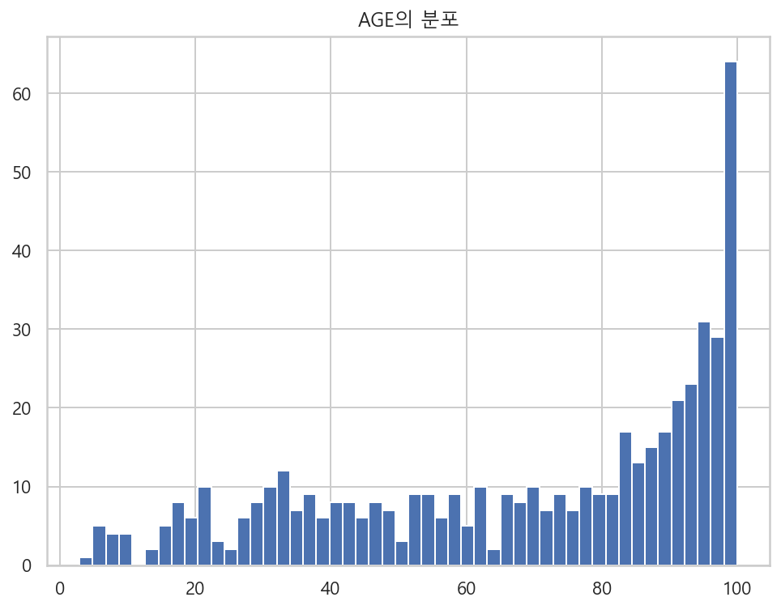
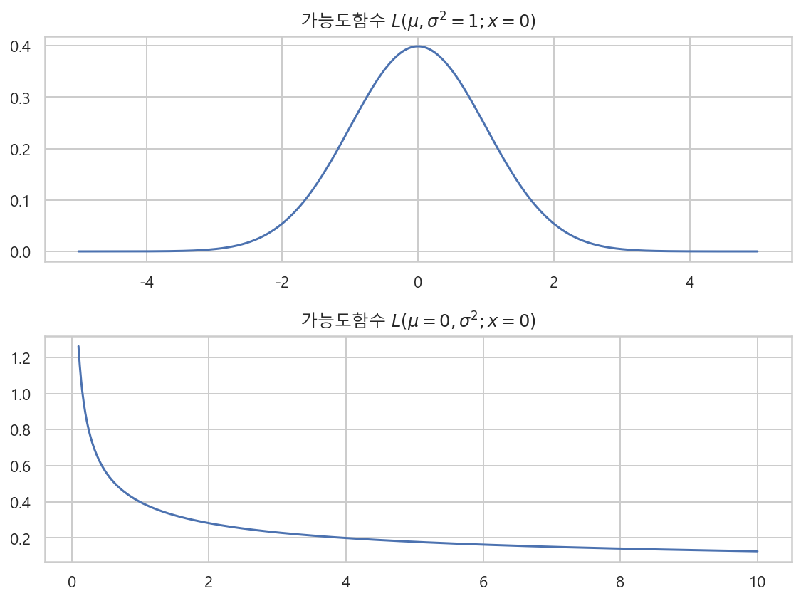

# 추정과 검정
- 추정 : 데이터로부터 확률분포를 찾아내는 역설계 과정, 데이터가 확률변수가 된다.
- 검정 : 추정이 어느정도 신뢰성이 있는지 알아보는 과정

## 1. 확률분포의 추정
- 데이터 분석의 첫번째 가정 : "분석할 데이터는 어떤 확률변수로부터 실현(realized)된 표본이다."
    - 내가 지금 수집한 데이터는 이 뒤에서 데이터를 만든 어떤 확률변수의 분포라는 의미이다.
    - 확률론적 관점에서 데이터는 확률변수와 확률분포를 알아내기 위한 참고 자료와 같다.

### 1-1. 확률분포의 결정
- 확률분포를 알아내는 과정
- 1) 확률변수가 어떤 분포를 따르는지 확인 한다. : 베르누이분포, 이항분포, 카테고리분포, 다항분포, 정규분포 등
    - 데이터의 표본이 0 또는 1 이다. : 베르누이분포
    - 데이터의 표본이 카테고리 값이다. : 카테고리분포
    - 데이터의 표본이 0과 1사이의 실수값이다. : 베타분포
    - 데이터의 표본이 항상 0 또는 양수이다. : 로그정규분포, 감마분포, F분포, 카이제곱분포, 지수분포, 하프코시분포 등
    - 데이터의 표본이 크기 제한이 없는 실수값이다. : 정규분포, 스튜던트t분포, 코시분포, 라플라스분포 등
- 2) 데이터로부터 해당 확률분포의 모수값을 구한다.
- 데이터의 표본의 범위로 확률분포를 결정하는 방법에는 예외가 있을 수 있다. 이런경우는 검정을 통해서 확률분포 형태를 알아낼 수 있다.

### 1-2. 모수추정 방법론
- `모수추정 parameter estimation` : 모수의 값으로 가장 높은 가능성이 있는 하나의 숫자를 찾아내는 방법
    - 모멘트 방법
    - 최대가능도 추정법
    - 베이지안 추정법

### 1- 3. 모멘트 방법
- `모멘트 방법 method of moment` : 표본자료에 대한 표본모멘트가 확률분포의 이론적 모멘트와 같다고 가정하여 모수를 구하는 방법.
    - 즉 표본자료의 모멘트값을 구한다. 이 값이 확률분포의 모멘트와 같다고 가정한다.
- **베르누이 분포의 모수추정**
    - $\text{E}[X] = \mu \triangleq \bar{x} = \dfrac{1}{N} \sum_{i=1}^{N} x_i = \dfrac{N_1}{N}$
    - N1은 1의 갯수, 베르누이 분포의 표본은 0 아니면 1이므로 xi를 다 더하면 1의 갯수와 같다.
- **정규분포의 모수추정**
    - $\text{E}[X] = \mu \triangleq \bar{x} = \dfrac{1}{N} \sum_{i=1}^{N} x_i$
    - $\text{E}[(X-\mu)^2] = \sigma^2 \triangleq s^2 = \dfrac{1}{N-1} \sum_{i=1}^{N} (x_i - \bar{x})^2$
    - 정규분포의 모수는 모멘트로 정의되어 있다. 따라서 모멘트 방법으로 쉽게 구할 수 있다.
- **베타 분포의 모수추정**
    - $Beta(x; a, b), \;\; 0 \leq x \leq 1, \;\; x \in R$
    - $\text{E}[X] = \dfrac{a}{a+b} \triangleq \bar{x}$
    - $\text{E}[X-\mu)^2] = \dfrac{ab}{(a+b)(a+b+1)} \triangleq s^2$
    - 위의 두 모멘트 식을 풀어 a와 b 모수값을 구한다.
    - $a = \bar{x}\left( \dfrac{\bar{x}(1-\bar{x})}{s^2} - 1 \right), \;\; b = (1-\bar{x})\left( \dfrac{\bar{x}(1-\bar{x})}{s^2} - 1 \right)$


# 1-4. [python] 보스턴 집값데이터와 확률분포
- 각 컬럼별로 분포를 살펴본다.
- df[컬럼명].hist()를 사용한다.
  
```python
from sklearn.datasets import load_boston

boston = load_boston()
dfX = pd.DataFrame(boston.data, columns = boston.feature_names)
dfy = pd.DataFrame(boston.target, columns=["MEDV"])
df = pd.concat([dfX, dfy], axis=1)
df.head(3)
```
### CRIM의 분포
- 0 근처의 값이 많다.
    - **지수분포와 유사하다.**

```python
plt.figure(figsize=(8, 6))
df["CRIM"].hist(bins=100)
plt.title("CRIME의 분포")
plt.show();
```


### ZN의 분포
- **0~100 까지의 균일분포의 모양이다.**
    - 그러나 0의 갯수가 훨씬 많다. 

```python
plt.figure(figsize=(10, 8))
plt.subplot(311)
col = df.columns[1]
df[col].hist(bins=100)
plt.ylim(0, 30)
plt.title("{}의 분포".format(col))

plt.subplot(312)
col = df.columns[1]
df[col].hist(bins=100)

plt.subplot(313)
sns.countplot(df[col] == 0)

plt.tight_layout()
plt.show() ;
```


### INDUS의 분포
- **복잡한 다봉분포의 형태이다.**

```python
plt.figure(figsize=(8, 6))
col = df.columns[2]
df[col].hist(bins=100)
plt.title("{}의 분포".format(col))
plt.show() ;
```


### CHAR의 분포
- 0 또는 1의 값을 가진다.
    - **베르누이 분포의 형태이다.**

```python
plt.figure(figsize=(8, 6))
plt.subplot(211)
df["CHAS"].hist(bins=100)
plt.title("CHAS의분포")

plt.subplot(212)
sns.countplot(df["CHAS"])

plt.tight_layout()
plt.show()
```


### NOX의 분포
- 데이터의 크기제한이 없는 경우
    - **정규분포의 형태와 비슷하다.**

```python
plt.figure(figsize=(10, 6))
plt.subplot(211)
df["NOX"].hist(bins=100)
plt.title("NOX의 분포")

plt.subplot(212)
np.log(df["NOX"]).hist(bins=100)
plt.title("np.log(NOX)의 분포")

plt.tight_layout()
plt.show() ;
```


### RM의 분포
- **정규분포와 비슷하다.**

```python
plt.figure(figsize=(8, 6))
df["RM"].hist()
plt.title("RM의 분포")
plt.show() ;
```


### AGE의 분포
- 0~100사이의 데이터만 있다.
    - **베타분포로 나타낼 수 있다.**
    - 0과 1사이의 값만 갖는다. 오른쪽으로 쏠려 있는 형태

```python
plt.figure(figsize=(8, 6))
df["AGE"].hist(bins=50)
plt.title("AGE의 분포")
plt.show() ;
```



### DIS의 분포
- **로그 정규 분포의 형태를 따른다.**

```python
plt.figure(figsize=(8, 6))
df["DIS"].hist(bins=100)
plt.title("DIS의 분포")
plt.show() ;
```


- 로그를 적용한 분포

```python
plt.figure(figsize=(8, 6))
np.log(df["DIS"]).hist(bins=100)
plt.title("로그 함수로 계산한 DIS의 분포")
plt.show() ;
```


### RAD의 분포
- **정규분포와 비슷하다.**
    - 24값이 많이 나온다.

```python
plt.figure(figsize=(8, 6))
plt.subplot(211)
df["RAD"].hist(bins=100)
plt.title("RAD의 분포")

plt.subplot(212)
df[df["RAD"] != 24]["RAD"].hist(bins=100)
plt.title("24를 제외한 RAD의 분포")

plt.tight_layout()
plt.show() ;
```


### TAX의 분포
- **정규분포와 비슷하다.**
    - 특정 표본이 많이 나온다. 

```python
plt.figure(figsize=(8, 6))
df["TAX"].hist(bins=100)
plt.show() ; 
```


- 특정 데이터의 수가 많으므로 이 데이터를 제외하고 분포를 다시 확인

```python
temp = df["TAX"].value_counts().reset_index()
temp.columns = ["x", "counts"]
temp[:10]
```


```python
plt.figure(figsize=(8, 6))
plt.subplot(211)
df[df["TAX"] != 666.0]["TAX"].hist(bins=100)
plt.title("666을 제외한 TAX의 분포")

plt.subplot(212)
df[~df["TAX"].isin([666, 771])]["TAX"].hist(bins=100)
plt.title("666과 711제외한 TAX의 분포")

plt.tight_layout()
plt.show() ;
```


### PTRATIO의 분포
- **균일분포와 비슷하다.**
    - 20.2의 값이 나온다.

```python
plt.figure(figsize=(8, 6))
plt.subplot(211)
df["PTRATIO"].hist(bins=100)
plt.title("PTRATIO의 분포")

plt.subplot(212)
df[df["PTRATIO"] != 20.2]["PTRATIO"].hist(bins=100)
plt.title("20.2를 제거한 PTRATIO의 분포")
plt.tight_layout()
plt.show() ;
```


### B의 분포
- **정규분포와 비슷하다.**
    - 400이상의 값을 갖지 않는다.

```python
plt.figure(figsize=(8, 6))
plt.subplot(211)
df["B"].hist(bins=50)
plt.title("B의 분포")

plt.subplot(212)
df[df["B"] != 396.90]["B"].hist(bins=50)
plt.title("396.90을 제거한 B의 분포")

plt.tight_layout()
plt.show() ;
```


### LSTAT의 분포
- **로그 정규 분포와 비슷하다**

```python
plt.figure(figsize=(8, 6))
plt.subplot(211)
df["LSTAT"].hist(bins=100)
plt.title("LSTAT의 분포")

plt.subplot(212)
np.log(df["LSTAT"]).hist(bins=100)
plt.title("log 함수를 적용한 LSTAT의 분포")

plt.tight_layout()
plt.show() ;
```


### MEDV의 분포
- **정규 분포와 유사하다.**
    - 50이 많이 나온다. 

```python
plt.figure(figsize=(8, 6))
plt.subplot(211)
df["MEDV"].hist(bins=100)
plt.title("MEDV의 분포")

plt.subplot(212)
df[df["MEDV"] != 50]["MEDV"].hist(bins=100)
plt.title("50을 제외한 MEDV의 분포")

plt.tight_layout()
plt.show() ;
```


# 1-5. [python] 모수추정 - 모멘트방법

```python
%matplotlib inline

np.random.seed(0)
x = sp.stats.beta(15, 12).rvs(10000)

plt.figure(figsize=(8, 6))
sns.distplot(x, kde=False, norm_hist=True)
plt.title("베타 분포를 따르는 표본의 히스토그램")
plt.show() ;
```


### 모멘트 방법 
- 표본데이터의 표본 모멘트값 = 확률분포의 이론적 모멘트값
- 위에서 베타분포 객체에서 생성한 표본데이터 x의 표본모멘트로 모수를 추정하면 확률분포의 모수와 거의 같다.

```python
def estimate_beta(x) :
    x_bar = x.mean()
    s2 = x.var()
    a = x_bar * (x_bar * (1 - x_bar) / s2 - 1)
    b = (1 - x_bar) * (x_bar * (1 - x_bar) / s2 - 1)
    return a, b

params = estimate_beta(x)
print("모수 a : ", params[0], " ", "모수 b : ", params[1])

>>>

모수 a :  15.346682046700685   모수 b :  12.2121537049535
```

### 추정 한 모수값으로 확률밀도함수를 그리면 히스토그램과 같다.

```python
xx = np.linspace(0, 1, 1000)

plt.figure(figsize=(8, 6))
sns.distplot(x, kde=False, norm_hist=True)
plt.plot(xx, sp.stats.beta(params[0], params[1]).pdf(xx))
plt.xlim(0, 1)
plt.title("베타분포를 따르는 표본의 히스토그램과 추정된 확률밀도함수")
plt.show() ;
```


### distplot()의 모수추정 기능
- distplot(fit=확률분포객체)

```python
plt.figure(figsize=(8, 6))
sns.distplot(x, kde=False, norm_hist=True, fit=sp.stats.beta)
plt.xlim(0, 1)
plt.title("베타 분포를 따르는 표본의 히스토그램과 추정된 확률밀도함수")
plt.show() ;
```


### [python] 보스턴집값 데이터의 feature를 distplot으로 나타내고 모수추정하기
- NOX : 로그정규분포
- RM : 정규분포
- DIS : 로그정규분포

```python
plt.figure(figsize=(20, 20))

for i in range(14) :
    plt.subplot(4, 4, i + 1)
    col = df.columns[i]
    sns.distplot(df[[col]], rug=False, kde=True, color='k')
    plt.title("{}".format(col), fontsize=20)

plt.tight_layout()
plt.show()
```


# 2. 최대가능도 추정법
- 모멘트 방법으로 구한 모수값은 가장 가능성이 높다는 보장이 없다.
- 따라서 이론적으로 가능도가 가장 높은 모수값을 찾는 방법으로 모수를 추정한다. 

### 2-1. 가능도 함수란?
- `가능도 함수 likelihood function` : 확률밀도함수에서 모수를 변수로 보는 경우
    - $L(\theta ; x) = p(x ; \theta)$
    - 일반적인 확률밀도함수에서는 표본인 x가 변수이고, 모수는 이미 알고있는 상수계수이다.
    - 가능도 함수에서는 모수 θ가 변수이고, 표본 x가 상수계수로 생각한다. 
    - 확률분포에 따라서 모수값이 다르므로 가능도함수의 모수 θ도 다르다.

#### **정규분포의 가능도함수**
- 정규분포의 확률밀도함수의 변수는 x이고 모수가 mu, sigma2 인데, 가능도 함수에서는 반대가 된다. 변수가 모수이고, 상수계수가 x가 된다.
    - 원래 정규분포의 확률밀도함수 : $p(x;\mu, \sigma_0^2) = \dfrac{1}{\sqrt{2 \pi \sigma_0^2}} \exp \left( - \dfrac{(x - \mu_0)^2}{2\sigma_0^2} \right)$
    - 정규분포의 가능도 함수 : $L(\mu, \sigma^2 ; x_0) = \dfrac{1}{\sqrt{2 \pi \sigma^2}} \exp \left( - \dfrac{(x_0 - \mu)^2}{2 \sigma^2} \right)$

#### **베르누이분포의 가능도함수**
- 베르누이분포의 확률질량 함수 : 변수 x는 0 또는 1의 값만 갖는다.
    - $p(x ; \mu_0) = \mu_0^x (1 - \mu_0)^{1-x}$
- 베르누이분포의 가능도 함수 : 변수가 모수 mu이므로 0~1까지의 실수값을 입력받는 함수가 된다. x0는 고정 된 상수계수와 같다.
    - $p(\mu ; x_0) = \mu^{x_0} (1 - \mu)^{1-x_{0}}$
- 가능도 함수와 확률밀도함수(확률질량함수)의 수식은 같지만 의미는 다르다.
    - 확률밀도함수는 모든 표본값 x에 대해 적분하면 값이 1이다. 전체 면적 = 1 = 전체확률과 같다.
    - 가능도함수는 가능한 모든 θ에 대해 적분하면 1이 된다는 보장이 없다.

### 2-2. 최대가능도 추정법
- `최대가능도 추정법 MLE(maximum likelihood estimation)` : 주어진 표본에 대해 가능도 함수를 가장 크게 하는 모수 θ를 찾는 방법
    - $\hat{\theta}_{MLE} = argmax_{theta} L(\theta ; x)$
    - 가능도함수 L의 값을 가장 크게하는 θ를 찾는다는 의미
- 가능도함수를 구하고, 이 함수를 미분하여 도함수를 구하고, 이 도함수가 0인 지점 θ를 찾는다. 
    - 도함수가 0인 지점이 원래함수의 최대 또는 최소 지점이다.
- **가능도 값은 확률밀도함수에서 x가 고정된 지점의 값이다.** 모수값을 여러가지로 바꾸면서 가능도 값이 가장 값이 높은 확률분포를 선택한다.
    - [sp.stats.norm(loc=mu).pdf(1) for mu in (0, -1, 1)]

### 2-3. 복수의 표본데이터가 있는 경우의 가능도 함수
- 복수의 표본데이터가 주어진 경우 가능도 함수는 결합확률밀도함수(joint probability density function)가 된다.
- 복수의 표본데이터가 확률변수 X에서 생성된 독립적인 값이므로 결합확률밀도함수는 각 확률값의 곱이된다. 
    - $L(\theta ; x_1, \cdots, x_N) = p(x_1, \cdots, x_N ; \theta) = \prod_{i=1}{N} p(x_i ; \theta)$

#### 정규분포로부터 복수의 표본데이터 {1, 0, -3}이 주어진 경우 가능도함수

$$\begin{aligned} 
&L(\theta; x_1, x_2, x_3) \\ &= 
\mathcal{N}(x_1, x_2, x_3;\theta)  \\
&=
\mathcal{N}(x_1;\theta) \cdot \mathcal{N}(x_2;\theta) \cdot \mathcal{N}(x_3;\theta) \\
&=
\dfrac{1}{\sqrt{2\pi\sigma^2}} \exp\left({-\frac{(1-\mu)^2}{2\sigma^2}}\right) \cdot
\dfrac{1}{\sqrt{2\pi\sigma^2}} \exp\left({-\frac{(0-\mu)^2}{2\sigma^2}}\right) \cdot
\\
&\;\;\;\; \dfrac{1}{\sqrt{2\pi\sigma^2}} \exp\left({-\frac{(-3-\mu)^2}{2\sigma^2}}\right) \\
&=
\dfrac{1}{(2\pi\sigma^2)^{\frac{3}{2}}} 
\exp\left({-\frac{\mu^2 + (1-\mu)^2 + (-3-\mu)^2}{2\sigma^2}}\right) \\
&=
\dfrac{1}{(2\pi\sigma^2)^{\frac{3}{2}}} 
\exp\left({-\frac{3\mu^2+4\mu+10}{2\sigma^2}}\right) \cdot \\
&=
\dfrac{1}{(2\pi\sigma^2)^{\frac{3}{2}}} 
\exp\left({-\frac{3(\mu+\frac23)^2+\frac{26}3}{2\sigma^2}}\right) \cdot
\end{aligned}$$

- 루트가 있는 경우 2 * 1/2 = 1의 형태로 거듭제곱을 바꿔주면 루트를 제거할 수 있다. 이러한 규칙을 적용하여 좌측 수식을 정리할 수 있다.
- 지수 함수의 곱은 지수의 거듭제곱의 합이 된다. $e^a \cdot e^b = e^{a+b}$ 이러한 규칙을 적용하여 정리하면 우측 지수함수의 수식이 2차함수의 형태가 된다. 

#### 베르누이분포로부터 복수의 표본데이터 {1, 0, 1}을 얻은 경우 가능도 함수

$$\begin{aligned}
&L(\mu ; x_1=1, x_2=0, x_3=1) \\
&= p(x_1=1, x_2=0, x_3=1 ; \mu) \\
&= p(x_1=1;\mu) p(x_2=0;\mu) p(x_3=1;\mu)\\
&= \mu^{1} (1-\mu)^{1-1} \cdot \mu^{0} (1-\mu)^{1-0} \cdot \mu^{1} (1-\mu)^{1-1} \\
&= \mu \cdot (1-\mu) \cdot \mu \\
&= -\mu^3 + \mu^2
\end{aligned}$$

- **이 가능도함수를 최대화하는 모수는 미분을 하여 구한 도함수가 0이 되는 위치와 같다.**
    - $\dfrac{dL}{d\mu} = -3\mu^2 + 2\mu = -3\mu \left( \mu - \dfrac{2}{3} \right)$
    - mu = 0 또는 -2/3 이다. 그런데 mu=0이면 베르누이분포에서 1이 나올 수 없다. 따라서 가능도함수를 최대화하는 mu=-2/3가 된다. 
    
### 2-4. 로그가능도함수
- 최대가능도 추정법을 사용하여 가능도가 최대가 되는 θ를 계산하려면 **수치적 최적화**를 해야한다. 
    - $\hat{\theta_{ML}} = argmax_{\theta} L(\theta ; {x_i})$
- 가능도를 직접사용하는 것보다 로그함수를 사용하여 변환환 **로그가능도함수**를 사용하는 것이 더 유용하다.
    - $LL = log L$
    - $\hat{\theta_{ML}} = argmax_{\theta} \; log L(\theta ; {x_i})$
- 로그변환을 하면 좋은점 (로그함수의 특징)
    - 로그 변환을 해도 최대값(또는 최소값)의 위치가 변하지 않는다.
    - 복수의 독립적인 표본 데이터를 입력으로 받는 가능도함수의 경우 결합확률밀도함수가 되므로 각 변수마다의 확률의 곱이 된다. 이런경우 로그변환을 하면 곱하기의 형태가 더하기의 형태로 바뀌어 계산이 단순해진다.
- 따라서 가능도함수를 수치적 최적화하기 위해 로그변환을하여 식을 단순화하면 유용하다.

### 2-5. 최대가능도 추정법과 라그랑주 승수법
- 어떤 분포 X의 가장 가능성이 높은 모수를 구하기 위해 최대가능도 추정법을 사용한다.
- 로그가능도 함수를 구하고 정리한다.
- 분포 X에 제한조건이 있는 경우 제한조건이 있는 최적화 방법으로 **라그랑주 승수법을 사용하여 목적함수를 만든다.**
- 목적함수를 변수(로그가능도함수의 변수는 모수이다)와 라그랑주 승수로 편미분하여 도함수를 구한다.
- 여러개의 도함수의 연립방정식을 풀면 모수값을 구할 수 있다.

### 2-6. 베르누이분포의 최대가능도 모수추정
- 모수가 mu인 베르누이분포의 pmf
    - $p(x;\mu) = Bern(x;\mu) = \mu^x (1-\mu)^{1-x}$
- N번 반복시행 한 경우 표본 데이터가 {x1, x2, ..., xN} 된다. 각 표본은 모두 하나의 확률변수로부터 나온 독립된 표본이므로 **전체 확률질량함수는 각 확률질량함수의 곱과 같다.**(가능도함수=결합확률질량함수)
    - $L(\mu ;x_1,\cdots,x_N)=p(x_1,\cdots,x_N ; \mu) = \prod_{i=1}^{N} \mu^{x_i} (1-\mu)^{1-x_i}$
- 로그변환을 하여 로그가능도함수를 구한다.

$\begin{aligned}
\log L 
&= \log p(x_1, \cdots, x_N;\mu)  \\
&= \sum_{i=1}^N \big\{ {x_i} \log\mu + (1-x_i)\log(1 - \mu) \big\} \\
&=  \sum_{i=1}^N {x_i} \log\mu +  \left( N-\sum_{i=1}^N x_i \right) \log( 1 - \mu ) \\
\end{aligned}$

- x=1 또는 x=0의 횟수
    - $N_1 = \sum_{i=1}^{N} x_i, \;\; N_0 = N - \sum_{i=1}^{N} x_i$

- 위의 가능도함수를 로그변환한다.
    - $logL = N_1 log \mu + N_0 log (1-\mu)$

- 로그가능도함수를 mu로 미분한 도함수의 값이 0인 모수값을 구한다.
    - 로그를 미분하면 역수의 형태가 된다.

$\begin{aligned}
\dfrac{\partial \log L}{\partial \mu} 
&= \dfrac{\partial}{\partial \mu} \big\{ N_1 \log\mu  + N_0 \log(1 - \mu)  \big\} = 0\\
&= \dfrac{N_1}{\mu}  - \dfrac{N_0}{1-\mu} = 0 \\
\end{aligned}$

$\dfrac{N_1}{\mu}  = \dfrac{N_0}{1-\mu}, \;\; \dfrac{1-\mu}{\mu} = \dfrac{N_0}{N_1} = \dfrac{N-N_1}{N_1}$

$\dfrac{1}{\mu} - 1 = \dfrac{N}{N_1} - 1$ 이므로

- **mu = N1 / N 이다.**
- `최대가능도 추정법으로 구한 베르누이분포의 모수는 1이 나온 횟수와 전체 실행횟수의 비율과 같다.`

### 2-7. 카테고리분포의 최대가능도 모수추정
- 모수가 mu = (mu1, mu2, ..., muN) 인 카테고리분포의 pmf (모수는 벡터의 형태이다.)
    - $p(x ; \mu_1, \cdots, \mu_K ) = \text{Cat}(x ; \mu_1, \cdots, \mu_K) = \prod_{k=1}^K \mu_k^{x_k}$

- 카테고리분포의 mu 제한조건
    - 모든 mu를 합하면 1이 된다. : $\sum_{k=1}^K \mu_k = 1$ 
    - mu는 0과 1사이의 실수값이다. : $0 \leq mu_k \leq 1$

- x는 k개의 원소를 갖는 원핫인코딩 벡터이다. x1=(1,0,0,...,0)
- N번 반복시행하여 얻은 표본 x1~xN은 모두 독립이므로 확률밀도함수는 각각의 확률질량함수의 곱과 같다.
    - $L(\mu_1, \cdots, \mu_K ; x_1,\cdots, x_N) = \prod_{i=1}^N \prod_{k=1}^K \mu_k^{x_{i,k}}$
    - x_i,k는 i번째 시행 결과인 x_i의 k번째 원소를 의미한다. x_i는 원핫인코딩 벡터이므로 0과 1로 되어 있다. 

- 로그가능도함수를 구한다.

$\begin{aligned}
\log L 
&= \log p(x_1, \cdots, x_N;\mu_1, \cdots, \mu_K)  \\
&= \sum_{i=1}^N \sum_{k=1}^K  \left( {x_{i,k}} \log\mu_k  \right) \\
&= \sum_{k=1}^K  \sum_{i=1}^N  \left(  \log\mu_k \cdot {x_{i,k}}\right) \\
&= \sum_{k=1}^K \left( \log\mu_k \left( \sum_{i=1}^N {x_{i,k}}   \right)  \right)
\end{aligned}$

- k번째 원소가 나온 횟수를 N_k라고 할 수 있다.
    - $N_k = \sum_{i=1}^N {x_{i,k}}$
    
- 위의 식을 가능도함수에 대입하여 정리한다.
    - $\log L = \sum_{k=1}^K \left( \log\mu_k  \cdot N_k  \right)$
    
- 카테고리분포의 제한 조건이 있으므로, 라그랑주 승수법을 사용하여 로그가능도함수에 제한조건을 추가한 새로운 목적함수를 만든다. 
    - $J = \sum_{k=1}^K \log\mu_k N_k  + \lambda \left(1- \sum_{k=1}^K \mu_k \right)$
    
- 목적함수 J를 모수와 라그랑주 승수로 각각 미분한 후 0이 되는 모수값을 찾는다.  
- k개의 도함수가 나온다.
- 제한조건에 의해서 muk로 미분한 경우 라그랑주 승수만 남는다.

$\begin{aligned}
\dfrac{\partial J}{\partial \mu_k} 
&= \dfrac{\partial}{\partial \mu_k} \left\{ \sum_{k=1}^K \log\mu_k N_k  + \lambda \left(1- \sum_{k=1}^K \mu_k\right)  \right\} = 0  \;\; (k=1, \cdots, K) \\
\dfrac{\partial J}{\partial \lambda} 
&= \dfrac{\partial}{\partial \lambda} \left\{ \sum_{k=1}^K \log\mu_k N_k  + \lambda \left(1- \sum_{k=1}^K \mu_k \right)  \right\} = 0 & \\
&= \dfrac{N_1}{\mu_1}  = \dfrac{N_2}{\mu_2} = \cdots = \dfrac{N_K}{\mu_K} = \lambda \\
&= N_k = \lambda \mu_k \\
&= \sum_{k=1}^K N_k = \lambda \sum_{k=1}^K \mu_k  = \lambda = N \\
&= \mu_k = \dfrac{N_k}{N} \\
\end{aligned}$

- `최대가능도 추정법을 사용하여 구한 카테고리분포의 모수는 각 범줏값이 나온 횟수와 전체 시행 횟수의 비율과 같다.`

### 2-8. 정규분포의 최대가능도 모수추정
- 정규분포의 pdf를 구한다.
- N번 반복시행으로 표본 x1~xN이 있으므로 가능도 함수는 전체 확률밀도함수와 같다. 전체 확률밀도함수는 각 확률밀도함수의 곱과 같다.
- 로그변환을 하여 각 확률밀도함수의 곱을 덧셈으로 변환하여 식을 정리한다. 
- 정규분포의 모수는 기댓값과 분산이므로 각각의 값으로 편미분하여 도함수를 구한다.
- mu와 sigma2로 미분한 도함수가 0이 되는 값을 구한다. 
- `최대가능도 추정법으로 구한 정규분포의 기댓값은 표본평균과 같다.`
    - $\mu = \dfrac{1}{N}\sum_{i=1}^N x_i = \bar{x}$
- `최대가능도 추정법으로 구한 정규분포의 분산은 편향 표본분산과 같다.`
    - $\sigma^2  =  \dfrac{1}{N}\sum_{i=1}^N (x_i-\mu)^2 = \dfrac{1}{N}\sum_{i=1}^N (x_i-\bar{x})^2 = s^2$

### 2-9. 다변수 정규분포의 최대가능도 모수추정
- 다변수 정규분포의 pdf를 구한다. 
    - 변수 x와 mu는 모두 M차원 벡터이다. 
    - 공분산행렬은 MxM 행렬이다. 공분산행렬은 양의 정부호이고, 역행렬이 존재한다.
    - 따라서 pdf에서 공분산행렬의 역행렬인 정밀도 행렬이 가능하다.
- N번 반복시행으로 얻은 표본 데이터는 x1~xN이고 모두 독립이므로 가능도함수는 전체 확률밀도함수가 된다. 이 값은 각각의 확률밀도함수의 곱과 같다.
- 로그변환을 하여 로그가능도함수의 식을 정리한다. 정밀도 행렬을 단순한 기호로 대치하여 정리하면 식이 간단해진다.
- 로그가능도함수의 값이 최대가 되는 모수값을 찾으려면 모수로 미분한 도함수의 값이 0이 되게끔 하는 모수값을 찾는다.
- 다변수 정규분포의 로그가능도함수를 미분하려면, **대각합의 트레이스 공식**과 **미분공식 5가지**를 사용하여야 한다. 
- `최대가능도 추정법에 의한 다변수 정규분포의 기댓값은 표본평균벡터와 같다.`
    - $\mu = \dfrac{1}{N}\sum_{i=1}^N x_i = \bar{x}$ 
- `최대가능도 추정법에 의한 다변수 정규분포의 분산은 표본공분산행렬과 같다.`
    - $\Lambda^{-1} = \Sigma = \dfrac{1}{N}\sum_{i=1}^N (x_i-\bar{x})(x_i-\bar{x})^T$

# 2-10. [python] 가능도함수
- 정규분포의 가능도함수
- x : 고정된 상수계수
- mu, \sigma^2 : 변수
    - loc : mu, scale : np.sqrt(\sigma^2)
    - 설정하지 않으면 mu=0, scale=1로 고정된 값    

```python
%matplotlib inline

plt.figure(figsize=(8, 6))

def likelihood_mu(mu) :
    return sp.stats.norm(loc=mu).pdf(0)

mus = np.linspace(-5, 5, 1000)
likelihood_mu = [likelihood_mu(m) for m in mus]

plt.subplot(211)
plt.plot(mus, likelihood_mu)
plt.title("가능도함수 $L(\mu, \sigma^{2}=1 ; x=0)$")

def likelihood_sigma2(sigma) :
    return sp.stats.norm(scale=np.sqrt(sigma)).pdf(0)

sigmas = np.linspace(0.1, 10, 1000)
likelihood_sigma2 = [likelihood_sigma2(s) for s in sigmas]

plt.subplot(212)
plt.plot(sigmas, likelihood_sigma2)
plt.title("가능도함수 $L(\mu=0, \sigma^{2} ; x=0)$")

plt.tight_layout()
plt.show() ;
```




### 정규분포의 가능도함수는 2차원 함수

```python
MU, SIGMA = np.meshgrid(mus, sigmas)

L = np.exp(-MU**2 / (2 * SIGMA)) / np.sqrt(2 * np.pi * SIGMA)

fig = plt.figure(figsize=(8, 8))
ax = fig.gca(projection='3d')
ax.plot_surface(MU, SIGMA, L, linewidth=0.1)
plt.xlabel("$\mu$")
plt.ylabel("$\sigma^2$")
plt.title("가능도함수 $L(\mu, \sigma ; x)$")
plt.show() ;
```


### 최대가능도 추정법
### 하나의 표본 데이터가 주어진 경우의 가능도함수
- x = 1이 주어진 경우
- 정규분포의 객체를 만들고 확률밀도함수의 변수 x에 1을 넣는다.
- 이 객체의 loc 즉 기대값을 여러가지로 바꾸어서 확률밀도함수의 값을 계산한다.
- 즉 여러개의 모수값중 x=1에서 확률밀도함수 값이 가장 클때 이 모수값이 가장 가능성이 높다.

```python
x = np.linspace(-5, 5, 1000)

p1 = sp.stats.norm(loc=-1).pdf(1)
p2 = sp.stats.norm(loc=0).pdf(1)
p3 = sp.stats.norm(loc=1).pdf(1)

plt.figure(figsize=(12, 8))
plt.scatter(1, p1, c='r', s= 100, marker='v', label=r'$N(x_1 ; \mu = -1)={:.2f}$'.format(round(p1, 2)))
plt.scatter(1, p2, c='b', s=100, marker='^', label=r'$N(x_1 ; \mu = 0)={:.2f}$'.format(round(p2, 2)))
plt.scatter(1, p3, c='g', s=100, marker='s', label=r'$N(x_1 ; \mu = 1)={:.2f}$'.format(round(p3, 2)))
plt.scatter(1, 0, c='k', s=100, marker='o')

plt.plot(x, sp.stats.norm(loc=-1).pdf(x), ls='-.', color='r')
plt.plot(x, sp.stats.norm(loc=0).pdf(x), ls=':', color='b')
plt.plot(x, sp.stats.norm(loc=1).pdf(x), ls='--', color='g')
#plt.axvline(1, color='k', linestyle=':')
plt.vlines(1, -0.09, 0.45, linestyle=':')
plt.text(1-0.3, -0.15, '$x_1=1$')
plt.xlabel("x")
plt.ylabel("확률밀도")
plt.title("최대가능도 추정법의 원리", fontsize=20, y=1.03)

plt.legend()
plt.show() ;
```


### 복수의 표본데이터가 있는 경우의 가능도 함수
- 정규분포로부터 3개의 표본을 얻은 경우
    - {1, 0, -3}
- 가능도함수는 결합확률밀도함수가 된다. 표본데이터는 같은 확률분포에서 나온 독립적인 값이므로 곱으로 나타낼 수 있다. 
    - $L(\theta ; x_1, x_2, \cdots, x_N) = p(x_1, x_2, \cdots, x_N ; \theta) =  \prod_{i=1}^{N} p(x_i ; \theta)$

```python
mu = np.linspace(-3, 3, 1000)
sigma2 = 1

def likelihood(mu) :
    return 1 / ((2 * np.pi * sigma2) ** (3 / 2)) * np.exp(-(3 * mu **2 + 4 * mu + 10) / (2 * sigma2))

li = likelihood(mu)

plt.figure(figsize=(8, 6))
plt.plot(mu, li)
plt.vlines(-2/3, -0.00005, 0.0009, linestyles="--")
plt.xlabel("모수 $\mu$")
plt.title("데이터가 {1, 0, -3} 이 나온 경우의 정규분포의 가능도함수")
plt.show() ;
```


# 3. 베이즈 추정법
- `베이즈 추정법 bayesian estimation` : 모숫값이 가질 수 있는 모든 가능성의 분포를 계산하는 방법이다.
- 어떤 확률분포함수의 모수가 mu일때, 최대가능도 추정법에서는 모수가 미지의 상수이다. 베이즈 추정법에서는 **모수가 확률변수이다.**
- 따라서 베이즈 추정법에서 모수인 확률변수가 갖는 확률밀도함수를 가지고 어떤 값이 더 가능성이 높은지 확인할 수 있다. 
- 모멘트 방법이나 최대가능도 추정법으로 구한 모수값은 한개이며, 한개의 추정된 모수값으로는 신뢰도와 신뢰구간을 알 수 없다.
- 베이즈 추정법에서는 모수의 값을 하나만 구하는 것이 아니기 때문에 잘못된 모수를 추정하지 않도록 도와준다.

### 3-1. 베이즈 추정법의 원리
- 주어진 데이터를 기반으로 모수인 mu의 조건부 확률분포를 계산하는 것과 같다.
    - 데이터 : {x1, x2, ..., xN}
    - 모수값 : mu
    - $p(\mu \mid x_{1},\ldots,x_{N}) = \dfrac{p(x_{1},\ldots,x_{N} \mid \mu) \cdot p(\mu)}{p(x_{1},\ldots,x_{N})} \propto p(x_{1},\ldots,x_{N}  \mid \mu )  \cdot p(\mu)$
    - 확률론의 베이즈 정리와 같다. : 어떤 데이터가 주어졌을 때 조건부확률을 구하는 공식
- `p(mu)` : 모수의 **사전(Prior)분포** 이다. 사전분포는 베이지안 추정 작업을 하기 전에 이미 알고 있던 모수의 분포를 의미한다. 만약 모수의 분포에 대해서 알지 못하면 대신 **균일분포(uniform)인 Beta(1, 1)분포** 또는 **기대값이 0인 정규분포**를 사용할 수 있다. 이러한 분포를 무정보분포(non-infromative distribution)이라고 한다. 
- `p(mu | x1, x2, ..., xN)` : 모수의 **사후(Posterior)분포**이다. 데이터가 주어진 상태에서의 mu에대한 조건부확률분포이다. 베이즈 추정법으로 구하려고 하는 값이다.
- `p(x1, x2, ..., xN | mu)` : 가능도 분포이다. 모수 mu가 특정한 값으로 주어진 경우 데이터 {x1, ..., xN}이 나올수 있는 확률값이다. 

### 3-2. 모수적 방법(parametric)
- 다른 확률분포를 사용하여 추정된 모수의 분포를 나타내는 방식이다. 모수를 알아내는 것이 목표이므로, 모수의 여러가지 후보들을 찾고 그 분포를 나타내는 의미이다. 
- 이와 같이 모수의 분포를 표현하기 위해 사용된 확률분포함수의 모수를 **하이퍼모수(hyper-parameter)**라고 한다. 
- 즉 하이퍼모수는 원래 우리가 찾고자 하는 모수가 아닌 이 모수를 찾기위해 새로 고안한 확률분포함수의 모수이다. 
- 베이즈 추정법은 모수적 방법을 사용한다. 따라서 베이즈 추정법은 결국 하이퍼 모수값을 계산하는 작업이다.

### 3-3. 비모수적 방법(non-parametric)
- 모수의 분포와 동일한 분포를 가지는 실제 표본 집합을 생성한다. 
- 이렇게 생성한 표본 집합의 히스토그램, 최빈값 등을 분포로 표현한다. 
- **MCMC(markov chain monte carlo)** 와 같은 **몬테카를로(monte carlo)** 방법이 비모수적 방법에 해당한다.

### 3-4. 베이즈 추정법을 사용한 베르누이분포의 모수추정
- 베르누이분포의 모수 mu는 0과 1사이의 값을 갖는다. 
- 따라서 이러한 모수값의 범위와 일치하는 사전분포로 하이퍼 모수가 a=b=1인 베타분포를 사용한다. 
- 베르누이분포의 모수를 추정하기위해 이 모수의 분포로 베타분포를 사용하겠다는 의미이다.
    - 베타분포의 표본값의 범위도 0과 1사이의 값을 갖는다.
    - $p(\mu) \propto \mu^{a-1}(1-\mu)^{b-1} \;\;\; (a=1, b=1)$

- 가능도 함수 : 주어진 데이터가 모두 독립이다. 따라서 베르누이분포의 곱과 같다.
    - $p(x_{1},\ldots,x_{N} \mid \mu) = \prod_{i=1}^N  \mu^{x_i} (1 - \mu)^{1-x_i}$

- 베이즈 정리를 사용하면, 사후분포가 하이퍼모수 a', b'를 가지는 또다른 베타분포가 된다. 
    - $\begin{aligned}
p(\mu \mid x_{1},\ldots,x_{N})
&\propto p(x_{1},\ldots,x_{N} \mid \mu)  p(\mu) \\
&= \prod_{i=1}^N  \mu^{x_i} (1 - \mu)^{1-x_i} \cdot \mu^{a-1}(1-\mu)^{b-1}  \\
&= \mu^{\sum_{i=1}^N x_i + a-1} (1 - \mu)^{\sum_{i=1}^N (1-x_i) + b-1 }   \\
&= \mu^{N_1 + a-1} (1 - \mu)^{N_0 + b-1 }   \\
&= \mu^{a'-1} (1 - \mu)^{b'-1}   \\
\end{aligned}$
    - 밑이 같은 거듭제곱항의 곱은 거듭제곱의 합으로 바꿀 수 있다. 
    - 2^2 * 2^3 = 2^{2 + 3}
    - 1 - N1 = N0
- **켤레사전확률분포 conjugate prior** : 사전분포와 사후분포가 모수값만 다르고 함수형태가 같도록 하는 사전분포.
- 베이즈 정리를 사용하여 계산을 하고나면 사전분포와 사후분포가 함수형태가 같아지게 된다. 
- 이렇게 구해진 하이퍼모수를 사전분포에 대입하면 a', b'을 모수로 갖는 베타분포가 되고, 이 베타분포가 우리가 구하고자 하는 최초의 모수의 분포가 된다. 
- 즉 최대가능도 추정법에서는 모수의 값이 하나인데, 베이즈 추정법으로 추정한 모수는 분포의 형태로 여러가지가 될 수 있다. 
- 이 베타분포의 값이 가장 높은 지점이 모수값으로서의 가능성이 가장 높다고 볼 수 있다. 

### 3-5. 베이즈 추정법의 장점
- **모수를 추정하기위한 계산이 순차적(sequantial)이다.**
- 데이터를 추가로 얻었을 때 새로 추가된 데이터에 대해서만 베이즈 추정의 계산을 하여 모수를 구하면 된다.
    - 최대가능도 추정법은 기존의 데이터와 새로운 데이터를 합한 데이터로 베이즈 추정을 계산하므로 데이터가 많아질 수록 계산량이 많아지고 복잡해진다.
- 순차적 계산이 가능한 이유는 하이퍼파라미터 값이 계속 누적되어 베이즈 추정의 사전분포의 하이퍼파라미터로 사용되기 때문이다. 
    - 즉 새로운 데이터가 들어와서 베이즈 추정을 새로 하면 하이퍼파라미터가 갱신되는 데 이 갱신된 값이 다음 베이즈 추정의 계산 때 하이퍼파라미터로 사용된다는 의미이다.


### 3-6. 베이즈 추정법을 사용한 카테고리분포의 모수추정
- 클래스 즉 법주값의 개수가 K개인 카테고리분포의 모수 mu 벡터의 추정
- 카테고리분포의 모수 벡터는 원핫인코딩 벡터이므로 모든 원소가 0 또는 1의 값이다. 이러한 조건과 같은 분포인 **디리클레분포**를 사전분포로 사용할 수 있다. 
    - $p(\mu) \propto \prod_{k=1}^K \mu_k^{\alpha_k - 1} \;\;\; (\alpha_k = 1, \; \text{ for all } k)$
    
- 가능도 함수 : 주어진 데이터는 모두 독립이므로 각 확률밀도함수의 곱이된다. (다항분포) 
    - $p(x_{1},\ldots,x_{N} \mid \mu) = \prod_{i=1}^N  \prod_{k=1}^K \mu_k^{x_{i,k}}$

- 베이즈 정리를 계산하여 사후분포를 구하면 갱신된 하이퍼파라미터를 갖는 디리클레분포가 된다. 
    - $\begin{aligned}
p(\mu \mid x_{1},\ldots,x_{N})
&\propto p(x_{1},\ldots,x_{N} \mid \mu)  p(\mu) \\
&= \prod_{i=1}^N  \prod_{k=1}^K \mu_k^{x_{i,k}} \cdot \prod_{k=1}^K \mu_k^{\alpha_k - 1}  \\
&= \prod_{k=1}^K  \mu^{\sum_{i=1}^N x_{i,k} + \alpha_k - 1}   \\
&= \prod_{k=1}^K  \mu^{N_k + \alpha_k -1}   \\
&= \prod_{k=1}^K  \mu^{\alpha'_k -1}   \\
\end{aligned}$

- 사전분포와 사후분포의 함수형태가 같으므로 사전분포는 켤레사전분포이다.
- 갱신된 하이퍼파라미터 : $\alpha'_k = N_k + \alpha_k$

### 3-7. 베이즈 추정법을 사용한 정규분포의 모수추정
- 정규분포의 분산 sigma^2를 알고있다는 가정하에 기댓값을 추정한다.
- 정규분포의 기댓값은 음의 무한대에서 양의 무한대까지 가능하기때문에 사전분포를 정규분포로 사용한다. 
    - $p(\mu) = N(\mu_0, \sigma^2_0) = \dfrac{1}{\sqrt{2\pi\sigma_0^2}} \exp \left(-\dfrac{(\mu-\mu_0)^2}{2\sigma_0^2}\right)$
    - mu - mu0 는 mu0 근처의 값이 라는 의미이다. 
- 가능도 함수 : 데이터는 모두 독립이므로 정규분포의 곱의 형태가 된다. 

$p(x_{1},\ldots,x_{N} \mid \mu) = \prod_{i=1}^N N(x_i \mid \mu )  = \prod_{i=1}^N  \dfrac{1}{\sqrt{2\pi\sigma^2}} \exp \left(-\dfrac{(x_i-\mu)^2}{2\sigma^2}\right)$

- 베이즈 정리는 다음과 같아진다. (사전분포와 가능도함수의 곱의 풀이는 생략됨) 

$\begin{aligned}
p(\mu \mid x_{1},\ldots,x_{N})  
&\propto p(x_{1},\ldots,x_{N} \mid \mu) p(\mu) \\
&\propto \exp \left(-\dfrac{(\mu-\mu'_0)^2}{2\sigma_0^{'2}}\right) \\
\end{aligned}$

- 베이즈 정리를 계산하면 갱신된 하이퍼파라미터를 가지는 정규분포가 된다.
- 사전분포와 사후분포의 함수형태가 같으므로 사전분포는 켤레사전확률분포이다. 

$\begin{aligned}
\mu'_0 &= \dfrac{\sigma^2}{N\sigma_0^2 + \sigma^2}\mu_0 + \dfrac{N\sigma_0^2}{N\sigma_0^2 + \sigma^2} \dfrac{\sum x_i}{N} \\
\dfrac{1}{\sigma_0^{'2}} &= \dfrac{1}{\sigma_0^{2}} + \dfrac{N}{\sigma^{'2}}
\end{aligned}$

- 갱신된 모수인 mu0'의 의미는 다음과 같다.
    - 원래 우리가 알고 있던 mu0의 값과 새로운 데이터의 평균값의 가중합의 형태가 된다. 이 의미는 w1 x mu0 근처의 값에서 w2 x barx 와 같다.
    - 즉 추정하고자 하는 모수 mu0 가 새로들어온 데이터의 평균값 근처의 값만큼 변화한다는 의미와 같다. 
    - 데이터가 새로 추가될 때마다 기존의 데이터와 섞이는데, 기존 데이터와 새로운 데이터 중에 어떤것에 더 비중을 많이 두어야 할까?
    - 이 식에 의하면 새로운 데이터의 갯수가 많아질 수록 N이 커질 수록 N x sigma^2이 커지므로 새로운 데이터의 비중이 더 커지게 되고, N이 작아질 수록 mu0의 가중치가 상대적으로 더 커지므로 원래 데이터의 비중이 커지게 된다. 

- 갱신된 모수인 sigma^20'의 의미는 다음과 같다.
    - sigma^2의 의미는 분포의 신뢰도와 같다.
    - 위의 식에서 분자의 N 즉 데이터 갯수가 늘어날 수록 분산의 역수인 정밀도가 커지게되고, 정밀도가 커지면 분모인 분산이 작아진다는 의미와 같다.
    - 즉 데이터가 늘어날 수록 분산이 작아지므로 한 지점에 분포가 몰리게 된다. 즉 신뢰도가 높아지게 된다. 
    
- 데이터가 추가 될 때마다 하이퍼파라미터인 분산 sigma^20' 이 갱신되어 기댓값 mu0'의 공식에 적용된다. 즉 순차적 계산이 가능하다. 

#### 베이즈 추정법의 결론
- 베이즈 추정법의 결과는 mu=0.5 이다라고 말할 수 없다. 최대가능도 추정법 MLE는 이렇게 말하는 것이 가능하지만, 베이즈 추정법의 결과는 "0.5에서 이러한 분포가 어느정도의 신뢰도로 높다"라고 말할 수 있다. 
- 즉 모멘트 방법이나 최대가능도 추정법보다 모수값에 대한 신뢰도가 더 높다고 할 수 있다. 

# 3-8. [python] 베이즈 추정법

### 베이즈 추정법으로 계산한 베르누이 분포의 모수 추정
- 10번 던져서 앞면 6번, 뒷변이 4번 나온 확률분포의 모수를 추정하는 과정
- 베이즈 추정법으로 계산했을때 사전분포와 사후분포의 관계를 나타냄

```python
%matplotlib inline

plt.figure(figsize=(8, 6))
xx = np.linspace(-0, 1, 1000)
a0, b0 = 1, 1
plt.plot(xx, sp.stats.beta(a0, b0).pdf(xx), ls='--', c='r', label='사전분포')
a1, b1 = 6 + 1, 4 + 1
plt.plot(xx, sp.stats.beta(a1, b1).pdf(xx), ls='-.', c='k', label='사후분포')

plt.legend()
plt.show() ;
```


### 각 상품별 댓글분포의 모수를 베이즈 추정법으로 계산하기
- 상품 A : 총댓글 3개, 좋아요 2개, 싫어요 1개
    - 하이퍼파라미터 : a_prime = 2 + 1 = 3, b_prime = 1 + 1 = 2
- 상품 B : 총댓글 100개, 좋아요 60개, 싫어요 40개
    - 하이퍼파라미터 : a_prime = 60 + 1 = 61, b_prime = 40 + 1 = 41

```python
plt.figure(figsize=(10, 8))

xx = np.linspace(0, 1, 1000)

plt.subplot(211)
A_a0, A_b0 = 1, 1
plt.plot(xx, sp.stats.beta(A_a0, A_b0).pdf(xx), c='r', ls='--', label='상품A의 사전확률')
A_a1, A_b1 = 2 + 1, 1 + 1
plt.plot(xx, sp.stats.beta(A_a1, A_b1).pdf(xx), c='k', ls='-', label='상품A의 사후확률')
plt.ylim(-0.2, 8)
plt.legend()

plt.subplot(212)
B_a0, B_b0 = 1, 1
plt.plot(xx, sp.stats.beta(B_a0, B_b0).pdf(xx), c='r', ls='--', label='상품B의 사전확률')
B_a1, B_b1 = 60 + 1, 40 + 1
plt.plot(xx, sp.stats.beta(B_a1, B_b1).pdf(xx), c='k', ls='-', label='상품B의 사후확률')

plt.suptitle("베이즈 추정법 : 베르누이 분포의 사전, 사후분포", fontsize=15)
plt.tight_layout()
plt.legend()
plt.show() ;
```


### 베이즈 추정법의 장점
- 순차적 계산이 가능하다.
- 즉 하루하루 데이터가 추가되더라도 추가된 것 만큼만 계산을 하여 모수값을 추정하면 된다.
- 최대가능도 추정법을 사용할 때는 추가된 갯수를 합한 총 데이터로 모수값을 추정 해야한다. 데이터 크기가 커질 수록 계산량이 늘어난다. 
- 데이터가 갱신될 때마다 하이퍼 파라미터 모수가 누적되고, 이 누적된 모수에 의해 모수값을 표현한 분포가 변화한다. 즉 여러가지의 모수값 분포가 발생하고 데이터가 늘어늘 수록 더 높은 가능성의 모수값을 추정할 수 있게 된다. 

```python
%matplotlib inline

plt.figure(figsize=(12, 8))
xx = np.linspace(0, 1, 1000)
mu = 0.65
a, b = 1, 1
print("추정횟수 = 0, mode = 알수없음")
plt.plot(xx, sp.stats.beta(a, b).pdf(xx), ls='--', c='k', lw=0.8, label='초기 추정')

#line_style = ['-.', ':', '--']
color_style = ['g', 'b', 'r']

for i in range(3) :
    x = sp.stats.bernoulli(mu).rvs(100)
    N0, N1 = np.bincount(x, minlength=2)
    a, b = a + N1, b + N0
    plt.plot(xx, sp.stats.beta(a, b).pdf(xx), ls='-', c=color_style[i], label='{}차 추정, {:4.2f}'.format(i+1, (a-1)/(a+b-2)))
    print("{}차 추정 : mode = {:4.2f}".format(i, (a-1)/(a+b-2)))
    print("(하이퍼파라미터 : a'={}, b'={})".format(a, b))
    print("=======")

ymin, ymax = plt.ylim()
plt.vlines(mu, ymin, ymax, color='k', linestyle='--', linewidth=0.8)
plt.legend()
plt.show() ;

>>>>

추정횟수 = 0, mode = 알수없음
0차 추정 : mode = 0.63
(하이퍼파라미터 : a'=64, b'=38)
=======
1차 추정 : mode = 0.66
(하이퍼파라미터 : a'=132, b'=70)
=======
2차 추정 : mode = 0.66
(하이퍼파라미터 : a'=198, b'=104)
=======
```


### 베이즈 추정법으로 카테고리분포의 모수 추정
- 식물원에 3가지 종류의 붓꽃이 있을때, 세 붓꽃의 비율을 카테고리 분포로 나타내고자 한다. 
- 카테고리분포의 모수를 디리클레분포로 표현한다. 

```python
def plot_dirichlet(alpha, n) :

    def project(x) :
        n1 = np.array([1, 0, 0])
        n2 = np.array([0, 1, 0])
        n3 = np.array([0, 0, 1])
        n12 = (n1 + n2) / 2
        m1 = np.array([1, -1, 0])
        m2 = n3 - n12
        # 단위벡터
        m1 = m1 / np.linalg.norm(m1)
        m2 = m2 / np.linalg.norm(m2)
        return np.dstack([(x - n12).dot(m1), (x - n12).dot(m2)])[0]

    def project_reverse(x) :
        n1 = np.array([1, 0, 0])
        n2 = np.array([0, 1, 0])
        n3 = np.array([0, 0, 1])
        n12 = (n1 + n2) / 2
        m1 = np.array([1, -1, 0])
        m2 = n3 - n12
        m1 = m1 / np.linalg.norm(m1)
        m2 = m2 / np.linalg.norm(m2)
        return x[:, 0][:, np.newaxis] * m1 + x[:, 1][:, np.newaxis] * m2 + n12

    eps = np.finfo(float).eps * 10
    X = project([[1 - eps, 0, 0], [0, 1 - eps, 0], [0, 0, 1 - eps]])

    import matplotlib.tri as mtri

    triang = mtri.Triangulation(X[:, 0], X[:, 1], [[0, 1, 2]])
    refiner = mtri.UniformTriRefiner(triang)
    triang2 = refiner.refine_triangulation(subdiv=6)
    XYZ = project_reverse(
        np.dstack([triang2.x, triang2.y, 1 - triang2.x - triang2.y])[0])

    plt.figure(figsize=(8, 6))
    pdf = sp.stats.dirichlet(alpha).pdf(XYZ.T)
    plt.tricontourf(triang2, pdf, cmap=plt.cm.bone_r)
    plt.axis('equal')
    plt.title("정규분포 확률변수의 모수를 베이즈추정법으로 추정한 결과 : {} 추정".format(n))

    plt.show() ;
```

```python
np.random.seed(0)
a0 = np.ones(3) / 3
plot_dirichlet(a0, '초기')
```


#### 1차로 측정한 벗꽃의 수가 각각 9, 29, 12 일때 카테고리 분포의 모수는?
- 디리클레분포로 모수 추정값 확인
    - 하이퍼파라미터 모수와 분포를 살펴본다.
- 카테고리분포의 샘플을 생성하는데 사용한 mu0와 점점 비슷해진다.

```python
mu0 = np.array([0.3, 0.5, 0.2])

# 0, 1, 2에서 50개를 mu0 확률로 선택
x1 = np.random.choice(3, 50, p=mu0)

# 0, 1, 2 각각 몇개씩 선택했는지 확인
N1 = np.bincount(x1, minlength=3)

# np.ones(3)/3 에 N1을 더한다.
a1 = a0 + N1

print("종류별 붓꽃의 수 : {}".format(N1))
print("1차 추정 하이퍼모수 : {}".format((a1 - 1)/(a1.sum() - 3)))

plot_dirichlet(a1, '1차')

>>>>

종류별 붓꽃의 수 : [13 28  9]
1차 추정 하이퍼모수 : [0.25694444 0.56944444 0.17361111]
```


#### 2차로 붓꽃종류를 조사하니 각각 21, 63, 3개가 나왔다.
- 디리클레분포로 카테고리분포의 모수값을 추정한다. 

```python
x2 = np.random.choice(3, 50, p=mu0)
N2 = np.bincount(x2, minlength=3)
a2 = a1 + N2

print("종류별 붓꽃의 수 : {}".format(N2))
print("2차 추정 하이퍼모수 : {}".format((a2 - 1) / (a2.sum() - 3)))

plot_dirichlet(a2, '2차')

>>>

종류별 붓꽃의 수 : [16 25  9]
2차 추정 하이퍼모수 : [0.28911565 0.53401361 0.17687075]
```


### 베이즈 추정법을 사용하여 정규분포의 모수값 추정
- 기댓값 2, 분산이 4인 정규분포에서 나온 데이터를 이용하여 모수값을 순차적으로 베이즈 추정한다. 
- 즉 데이터가 늘어날 때마다 하이퍼파라미터 모수값이 누적계산된다.
- 이 경우 데이터의 갯수 N이 커질 수록 분포의 폭이 좁아지고(정밀도가 높아지고), 점차 원래 모수값에 가까워진다.

```python
%matplotlib inline

plt.figure(figsize=(10, 8))
mu, sigma2 = 2, 4
mu0, sigma20 = 0, 1
xx = np.linspace(1.8, 2.2, 1000)
np.random.seed(1)
N = 100
ls = [':', '-.', '--', '-']
for i in range(4) :
    x = sp.stats.norm(mu).rvs(N)
    mu0 = sigma2 / (N * sigma20 + sigma2) * mu0 + (N * sigma20) / (N * sigma20 + sigma2) * x.mean()
    sigma20 = 1 / (1 / sigma20 + N / sigma2)
    plt.plot(xx, sp.stats.norm(mu0, sigma20).pdf(xx), ls=ls[i], label='{}차 추정'.format(i))
    print("{}차 추정 : {:4.2f}".format(i, mu0))

plt.vlines(mu, ymin=-1, ymax=45, lw=0.8, color='k', label='mu=2')
plt.legend()
plt.title("정규분포의 기댓값을 베이즈 추정법으로 추정한 결과")
plt.show() ;

>>>

0차 추정 : 1.98
1차 추정 : 2.07
2차 추정 : 2.05
3차 추정 : 2.03
```


### 연습문제
- 사이킷런의 붓꽃데이터에서 꽃받침 길이를 정규분포라고 가정하고 베이즈 추정법을 사용하여 기댓값을 추정하라.
- 단 정규분포의 분산으로는 표본분산을 사용하고 사전분포로 기댓값 1, 분산 1인 정규분포를 사용한다. 

```python
from sklearn.datasets import load_iris

iris = load_iris()
df = pd.DataFrame(iris.data, columns=iris.feature_names)
sl = iris.data[:, 0]

>>>

array([5.1, 4.9, 4.7, 4.6, 5. , 5.4, 4.6, 5. , 4.4, 4.9, 5.4, 4.8, 4.8,
       4.3, 5.8, 5.7, 5.4, 5.1, 5.7, 5.1, 5.4, 5.1, 4.6, 5.1, 4.8, 5. ,
       5. , 5.2, 5.2, 4.7, 4.8, 5.4, 5.2, 5.5, 4.9, 5. , 5.5, 4.9, 4.4,
       5.1, 5. , 4.5, 4.4, 5. , 5.1, 4.8, 5.1, 4.6, 5.3, 5. , 7. , 6.4,
       6.9, 5.5, 6.5, 5.7, 6.3, 4.9, 6.6, 5.2, 5. , 5.9, 6. , 6.1, 5.6,
       6.7, 5.6, 5.8, 6.2, 5.6, 5.9, 6.1, 6.3, 6.1, 6.4, 6.6, 6.8, 6.7,
       6. , 5.7, 5.5, 5.5, 5.8, 6. , 5.4, 6. , 6.7, 6.3, 5.6, 5.5, 5.5,
       6.1, 5.8, 5. , 5.6, 5.7, 5.7, 6.2, 5.1, 5.7, 6.3, 5.8, 7.1, 6.3,
       6.5, 7.6, 4.9, 7.3, 6.7, 7.2, 6.5, 6.4, 6.8, 5.7, 5.8, 6.4, 6.5,
       7.7, 7.7, 6. , 6.9, 5.6, 7.7, 6.3, 6.7, 7.2, 6.2, 6.1, 6.4, 7.2,
       7.4, 7.9, 6.4, 6.3, 6.1, 7.7, 6.3, 6.4, 6. , 6.9, 6.7, 6.9, 5.8,
       6.8, 6.7, 6.7, 6.3, 6.5, 6.2, 5.9])
```

#### 베이즈 추정법으로 모수값 추정

```python
plt.figure(figsize=(8, 6))
sigma2 = sl.var()
mu0, sigma20 = 1, 1
xx = np.linspace(4, 6, 2000)

ls = ['-.', '--', ':', '-']
for i in range(4) :
    x = sl
    mu0 = sigma2 / (N * sigma20 + sigma2) * mu0 + (N * sigma20) / (N * sigma20 + sigma2) * x.mean()
    sigma20 = 1 / (1 / sigma20 + N / sigma2)
    plt.plot(xx, sp.stats.norm(mu0, sigma20).pdf(xx), ls=ls[i], label='{}차 추정'.format(i))
    print("{} 차 추정 : mu {:4.2f}, sigma2 {:.3f}".format(i, mu0, sigma20))

plt.xlim(5.75, 5.88)
plt.legend()
plt.show()

>>>

0 차 추정 : mu 5.81, sigma2 0.007
1 차 추정 : mu 5.83, sigma2 0.003
2 차 추정 : mu 5.83, sigma2 0.002
3 차 추정 : mu 5.84, sigma2 0.002
```


#### 붓꽃데이터의 꽃받침의 길이의 분포

```python
from sklearn.datasets import load_iris

iris = load_iris()
x = iris.data[:, 0]

N = len(x)
mu = np.mean(x)
sigma2 = np.var(x)
print("sample mean : ", mu)
print("sample variance : ", sigma2)

plt.figure(figsize=(8, 6))
sns.distplot(x, kde=False, fit=sp.stats.norm)
plt.vlines(x=mu, ymin=0, ymax=0.6, ls='--', color='k', lw=1.5)
plt.vlines(x=mu + 2 * np.sqrt(sigma2), ymin=0, ymax=0.6, ls=':')
plt.vlines(x=mu - 2 * np.sqrt(sigma2), ymin=0, ymax=0.6, ls=':')

plt.show() ;

>>>

sample mean :  5.843333333333334
sample variance :  0.6811222222222223
```


#### 베이즈추정법으로 구한 꽃받침 길이 분포의 모수추정
- 추정횟수는 한번이다.
- sample mean과 mean_post 가 거의 비슷하다.
- sigma2_post 값이 매우 작다. -> 정밀도가 크다 (분산의 역수 = 정밀도)

```python
mu0 = 1
sigma20 = 1

mu_post = sigma2 / (N * sigma20 + sigma2) * mu0 + (N * sigma20) / (N * sigma20 + sigma2) * mu
sigma2_post = 1 / (1 / sigma20 + N / sigma2)
print("post mean : {}".format(mu_post))
print("post variance : {}".format(sigma2_post))

>>>

post mean : 5.821440066849044
post variance : 0.00452028901946797
```

#### 베이즈 추정법으로 추정한 꽃받침 길이 분포의 모수값에 대한 분포

```python
plt.figure(figsize=(8, 6))
plt.subplot(211)
sns.distplot(x, kde=False, fit=sp.stats.norm)
plt.vlines(x=mu_post, ymin=0, ymax=0.6, ls='--')
plt.xlim(4, 8)

plt.subplot(212)
xx = np.linspace(4, 8, 1000)
plt.plot(xx, sp.stats.norm(loc=mu_post, scale=np.sqrt(sigma2_post)).pdf(xx))
plt.title("기댓값의 사후분포")
plt.xlim(4, 8)
plt.tight_layout()

plt.show() ;
```


# 4. 검정
- `검정 testing` : 데이터의 뒤에 숨어 있는 확률변수의 분포에 대한 가설이 맞는지 틀리는지 정량적으로 증명하는 작업
    - 어떤 데이터를 확률분포로 표현했을 때 그 모수에 대한 추정값이 정말 그러한지에 대해 논리적으로 증명한다.
- 데이터를 확률변수로 바꿔주는 작업이 추정이었다. 어떤 확률변수에서 데이터가 나왔다는 가정에서 이 확률변수가 따르는 확률분포를 알면 다음 데이터의 분석이 가능하기 때문이다.
- 이렇게 가정한 확률분포는 어떤 형태인지 어떤 특징이 있는지 알기 위해서는 확률분포의 모수를 알아야 한다.
- 확률분포의 모수를 추정하여 가능성이 높은 모수를 찾았다면 이 추정된 모수에 대해서 검정을 하여 정말 믿을만한 값인지 확인하는 작업이다. 

### 4-1. 가설과 검정
- `가설 hypothesis` : 확률분포에 대한 어떤 주장. 확률분포는 ~할 것이다. 
    - 표기 : H
- `통계적 가설검정 statistical hypothesis testing` : 이러한 가설을 증명하는 행위.
    - 검정 testing 이라고 부른다.
    - 확률분포의 모숫값이 특정한 값이라는 가설에 대한 검정을 **모수값 검정**이라고 한다. 
- 추정 -> 가설 -> 통계적 가설검정

### 4-2. 귀무가설
- `귀무가설 null hypothesis` : 확률분포의 모수에 대한 가설
    - 데이터가 어떤 확률분포의 표본이라고 가정을 한다. 
    - 데이터를 만드는 확률변수가 따르는 확률분포의 모수 θ가 특정한 실수값이라는 가정을 한다. 
    - 표기 : H_0
- 검정에서의 귀무가설은 특정 사실을 고정화하는 작업이므로 반드시 등식으로 이루어져야 한다. 
    - $H_0 : \theta = \theta_0$
    - 확률분포의 모수에 대한 귀무가설은 다음과 같다 : 모수는 어떤 실수값이다.
- 귀무가설에서 고정한 실수값이 검정으로 증명할 가설에 대한 기준이 되는 값이다. 즉 이 값이 맞느냐 틀리느냐, 이 값보다 크냐 작냐 등의 검정에 대한 기준이다.

#### 동전은 공정한가? 에 대한 귀무가설
- $H_0 : \mu = 0.5$
- theta = mu, 실수값 = 0.5
- 이 동전은 1이 나올 확률 즉 기대값이 0.5이다. (기대값이 0.5이면 0과 1이 나올 확률이 같기 때문)

#### 주식의 수익률의 전망에 대한 귀무가설
- $H_0 : \mu = 0$
- 기대값이 0이면 이익도 손해도 아니다. 
- 이 값이 검정의 기준값이 되며, 이 값보다 기대값이 크면 이 주식은 이익이 날 것이고, 이 값보다 기대값이 작으면 주식은 손해가 날 것이다. 

### 4-3. 대립가설
- `대립가설 alternative hypothesis` : 귀무가설과 함께 고려하는 가설. 진실임을 증명하려는 가설
    - H_a로 표기한다.
    - 연구가설 research hypothesis 라고도 한다.
    - 귀무가설은 등식을 사용하여 표현한 분포의 기준상태와 같다. 
- 어떤 주장을 증명하려면 **대립가설이 맞는 방향에서 귀무가설이 틀렸다는 것을 증명해야 하며 이를 뒷받침하는 증거가 있어야 한다.**
- 귀무가설과 대립가설은 반드시 여집합의 관계는 아니다.

#### 모수가 어떤 특정값이 아니라는 것을 증명할 때의 가설
- H_0 : theta = theta_0 , H_a : theta ≠ theta_0
- 동전이 공정하지 않다는 것을 증명할 때
    - H_0 : mu = 0.5, H_a : mu ≠ 0.5
    - 동전 던지기의 경우 베르누이분포를 따른다. 1이 나올 확률인 기댓값 mu=0.5 이다라고 귀무가설을 설정하고, 검정해서 증명할 가설인 대립가설로 mu는 0.5가 아니다, 즉 1이 나올 확률이 0.5가 아니다라는 것을 설정한다.

#### 모수가 어떤 특정값보다 크다는 것을 증명할 때의 가설
- H_0 : theta = theta_0 , H_a : theta > theta_0
- 동전의 앞면이 더 많이 나온다는 것을 증명할 때
    - H_0 : mu = 0.5 , H_a : mu > 0.5
    - 1이 나올 확률에 해당하는 기댓값 mu이 0.5보다 크다는 의미는 1이 0보다 나올 확률이 더 높다는 것과 같다. 

#### 모수가 어떤 특정값보다 작다는 것을 증명할 때의 가설
- H_0 : theta = theta_0 , H_a : theta < theta_0

### 4-4. 검정통계량
- `검정통계량 test statistics` : 표본데이터 집합을 입력으로 계산되는 함수의 값
    - $t = f(x_1, x_2, ..., x_N)$
    - 귀무가설이 맞거나 틀렸다는 것을 증명하기위해 필요한 증거에 해당한다.
- 검정통계량은 확률변수 X의 표본에서 계산된 함수의 값이다. 따라서 어떤 값이 나올지 정확하게 알 수 없다. 따라서 검정통계량 t도 **검정통계량확률변수 T**라는 새로운 확률변수와 같다.
    - 데이터 표본을 생성한 것도 확률변수, 표본으로 계산된 t 검정통계량의 값도 확률변수에서 생성 됐다는 의미
- 입력데이터가 되는 확률변수 X의 확률분포함수 p_x(x)와 검정통계량 수식 f(x)가 이미 결정되어 있기 때문에 검정통계량 확률변수 T의 확률분포함수 p_T(t)도 수식으로 유도가 가능하다. 

$\begin{bmatrix}
p(x) \\
f(x_1, x_2, \ldots, x_N) \\
\end{bmatrix} \rightarrow p_T(t)$

- 데이터 표본의 확률변수의 확률분포함수와 검정통계량 수식으로 검정통계량 확률변수 T의 확률분포함수 p_T(t)를 유도하는 과정은 어렵다.
- 따라서 시뮬레이션을 해서 유사한 분포를 만들거나, 기존에 이미 구해놓은 검정통계량 확률분포를 이용한다. 

### 4-5. 베르누이분포 확률변수
- 모수 mu를 가지는 베르누이분포 확률변수에 대해서는 전체 시도 횟수 N번 중 성공한 횟수 n 자체를 검정통계량으로 사용할 수 있다.
- 이 검정통계량 t는 자유도가 N이고 기댓값 모수가 mu인 이항분포를 따른다. 
    - $x \sim Bern(x ; \mu) \rightarrow t = \sum_{i=1}^{N} x ~ Bin(t ; \mathcal, \mu)$

### 4-6. 정규분포 확률변수 : 분산 sigma^2를 알고 있는 경우
- 분산 sigma^2을 알고 있는 정규분포 확률변수의 검정통계량 : z통계량
    - $x \sim \mathcal{N}(\mu, \sigma^2) \;\; \rightarrow \;\; z = \dfrac{\bar{x}-\mu}{\frac{\sigma}{\sqrt{N}}} \sim \mathcal{N}(z;0,1)$
    - z통계량은 표준정규분포를 따른다. 
    - \bar_x 는 표본평이다. 
- z통계량 : 정규분포의 표본평균을 정규화한 통계량. 중심극한 정리와 다르다. 중심극한정리는 N이 커질수록 표준정규분포로 다가가는데, z통계량은 N에 상관없이 항상 표준정규분포를 따른다.

### 4-7. 정규분포 확률변수 : 분산 sigma^2를 모르는 경우
- 분산을 모르는 정규분포의 확률변수에서 통계량은 모수값 mu와 sigma^2에 대한 두가지 이다.
- `모수 mu에 대한 검정을 할 때` : 표본평균을 표본분산으로 정규화한 값을 검정통계로 사용한다. 
    - $x \sim \mathcal{N}(\mu, \sigma^2) \;\; \rightarrow \;\; t = \dfrac{m-\mu}{\frac{s}{\sqrt{N}}} \sim t(t;0,1,N-1)$
    - t통계량은 자유도가 N-1인 스튜던트t분포를 따른다.
    - 스튜던트t 분포의 모수 : 기댓값 mu, 정밀도 lambda, 자유도 nu
    - s^2 : 비편향 표본분산
- t통계량 : 정규분포로부터 얻은 N개의 표본 x1~xN에서 구한 표본평균을 표본표준편차로 정규화한 값이다. 
- z통계량은 항상 정규분포이다. 그러나 z통계량을 계산하려면 **확률분포의 표준편차**를 알아야 하는데 이 값을 구하기 어렵다. 따라서 t통계량 처럼 **표본의 표준편차**를 사용하여 통계량을 계산 할 수 있다.

- `모수 sigma^2에 대한 검정을 할 때` : 표본분산을 정규화한 값을 검정통계량을 사용한다. 
    - $x \sim \mathcal{N}(\mu, \sigma^2) \;\; \rightarrow \;\; t = (N-1)\dfrac{s^2}{\sigma^2} \sim \chi^2 (t;N-1)$
    - sigma^2 : 확률변수의 분산, s^2 : 표본의 분산
    - 자유도가 N-1인 카이제곱분포를 따른다. 

### 4-8. 지금까지의 과정
- 모수값 추정으로 구한 모수값과 모수값 추정에 사용된 임의의 확률분포가 있다. 이것을 검정하기 위해 귀무가설과 대립가설을 가정하고, 이 주장이 맞는지 귀무가설을 증명하기 위해 검정통계량을 구했다.  
- 검정통계량을 통해서 알 수 있는 것
    - 검정통계량이 따르는 검정통계량t의 확률분포 p_T(x)를 알고 있다. (이항분포, 표준정규분포, 스튜던트t분포, 카이제곱분포 등)
    - 또한 실제 데이터에서 구한 검정통계량의 어떤 값 t_0, 즉 확률분포 p_T(x)의 표본 1개를 구할 수 있다.
- `최초에 가정한 귀무가설이 사실이라면(맞다고 증명됐다면)` : 실제 데이터에서 구한 검정통계량값 t_0는 검정통계량 확률분포(p_T(x))를 따르므로 이 확률분포의 기댓값이나 모드값(최빈값) 근처의 값이 나왔을 것이다. 
    - "이 동전은 공정하다"라고 귀무가설을 가정했을 때 이를 증명하기 위해서 베르누이분포를 설정했고, 베르누이분포의 검정통계량은 1의 횟수이며, 이 통계량은 N번시행 할 때의 이항분포를 따른다는 것을 확인했다. 
    - 즉 귀무가설이 맞다면 동전을 던져서 나온 표본 데이터로 검정통계량값을 구했고, 이 값이 이항분포의 기댓값 근처의 값이 나왔다는 의미이다. 
- `최초에 가정한 귀무가설이 사실이 아니라면` : 실제 데이터에서 구한 검정통계량값 t_0이 검정통계량에서 나오기 어려운 값이 나오게 된다. 즉 검정통계량 확률분포에서 기댓값이나 모드값 근처의 값에서 멀리 떨어진 값이라는 의미이다. 
    - 귀무가설이 맞다면 검정통계량값 t_0가 검정통계량 확률분포의 p_T(x) 기댓값이나 모드값 근처의 값이 나와야한다.    
    
### 4-9. 유의확률
- `유의확률 p-value` : 어떤 표본 데이터가 해당 확률분포에서 나오기 쉬운 값인지 나오기 어려운 값인지를 수치로 정량화한 방법
    - 유의확률은 확률분포와 확률분포의 표본값 1개가 주어졌을 때 그 확률분포에서 해당 표본값 혹은 더 희귀한 값이 나올 수 있는 확률이다.
    - 일반적인 확률분포와 확률분포의 표본값에도 적용할 수 있다. 
    - 이 확률값을 검정에 적용하면 귀무가설이 맞는지 틀리는지를 수치적으로 증명할 수 있게 된다. 
    - 유의확률의 값은 확률밀도함수에서 표본값을 기준으로 만들어진 양측 꼬리 부분에 해당하는 영역의 면적과 같다. 
- **유의확률의 계산** : 누적확률분포함수 F(x)를 사용하여 계산할 수 있다.
    - 연속확률변수인 경우

$$\begin{aligned}
p-value  &= 2 * (P(t \leq t_0), P(t \geq t_0)) \\
&= 2 * (F(t_0), 1-F(t_0)) \\
\end{aligned}$$

    - 이산확률변수인 경우 : 등호가 성립하는 부분을 제외한다.

$$p-value = 2 * (F(t_0), 1 - F(t_0 - 1))$$

#### 검정의 관점에서의 유의확률의 의미
- `귀무가설이 맞음에도 불구하고 현재 검정통계량값과 같은 혹은 대립가설을 더 옹호하는 검정통계량값이 나올 확률`
    - P(t for H_a | H_0)
    - H_0는 귀무가설이 진실인 사건과 같다. 즉 H_0가 발생했을 때 H_a의 확률(t통계량과 같은)

### 4-10. 단측검정과 유의확률
- `단측검정 one-side test, single-tailed test` : 대립가설이 부등식인 경우, 대립가설을 옹호하는 검정통계량값이 나올 확률은 특정한 한 방향의 확률만 구해야 한다.
    - 즉 양층검정은 양쪽의 면적을 구하지만, 단측검정은 한쪽의 면적을 구한다.

#### 우측검정 유의 확률 right-side test
- 모수가 특정값보다 크다는 것을 증명할 떄의 가설
    - H_0 : theta = theta_0, H_a : theta > theta_0
- 우측검정 유의확률은 귀무가설이 맞음에도 불구하고 검정통계랴이 현재 검정통계량과 같거나 더 큰 값이 나오는 확률이다. 
    - $p-value = P( t \geq t_0 | H_0 ) =1 - F(t_0)$
- 이산확률분포인 경우
    - $p-value = 1 - F(t_0 - 1)$
    
#### 좌측검정 유의확률 left-side test
- 모수가 특정값보다 작다는 것을 증명할 때의 가설
    - H_0 : theta = theta_0, H_a : theta < theta_0
- 좌측검정 유의확률은 귀무가설이 맞음에도 불구하고 실제로 나온 검정통계량과 같거나 더 작은 값이 나오는 확률이다. 
    - $p-value = P( t \leq t_0 | H_0 ) = F(t_0)$
- 이산확률분포인 경우
    - $p-value = F(t_0)$ 
    
#### 고혈압 판단의 예
- 어떤 환자가 고혈압인지 아닌지 증명하기 위한 가설
    - 귀무가설 : 이 환자는 혈압이 정상이다.
    - 대립가설 : 이 환자는 고혈압이다. 
- 이 환자의 혈압을 측정하고 검사 결과를 통계량 분포로 사용하고, 환자의 혈압을 검정통계량을 사용하여 계산하였을 때 우측유의확률이 0.02% 나왔다고 하자.
- 이 의미는 정상인 중에서(귀무가설이 맞다는 하에서) 이 환자의 혈압보다 더 높은 혈압을 가진 사람이 0.02% 라는 것과 같다. 

### 4-11. 유의수준과 기각역
- 유의확률값이 아주 작다는 것은 현재 귀무가설이 맞다는 가정하에 현재의 검정통계량값이 나올 가능성이 매우 적다는 의미이다. 
- **그러므로 유의확률값이 작으면 귀무가설을 기각하고 대립가설을 채택할 수 있다.**
    - `유의확률이 아주 작으면, 귀무가설이 맞다는 가정하에 대립가설을 옹호하는 현재의 실제 결과가 나올 가능성이 거의 없다면, 틀린 것은 가장 처음의 귀무가설이다. 따라서 귀무가설을 기각하고 대립가설을 채택한다.`

#### 유의수준
- `유의수준 level of significance` : 계산된 유의확률값에 대해 귀무가설을 기각할지 채택할지 결정할 수 있는 기준이 되는 값
- 1%, 5%, 10% 가 일반적으로 사용되는 유의수준이다. 
    - `즉 유의확률값이 1% 유의수준 보다 작으면 귀무가설을 기각할 수 있고 대립가설을 채택할 수 있다. 반대로 크다면 귀무가설을 채택할 수 있다.`
    - 어떤 유의수준으로 사용할지는 실험, 혹은 상황에 따라 다르다.

#### 기각역
- `기각역 critical value` : 유의수준에 대해 계산된 검정통계량
- 검정통계량 t를 계산하면 확률밀도함수로 유의확률을 계산할 수 있었다. 반대로 특정한 유의확률값에 대한 검정통계량을 구할 수도 있다. 
- 기각역을 아는 경우 유의확률을 유의수준과 비교하는 것이 아니라 검정통계량 t를 직접 기각역과 비교하여 기각 여부를 판단할 수 있다.
    - 즉 기각역을 안다면, 유의확률을 계산하지 않고 검정통계량 t를 바로 비교할 수 있다.

### 4-12. 검정방법론
- 검정의 기본적인 논리 정리
    - **데이터 = 확률변수** : 데이터를 어떤 확률분포를 따르는 확률변수라고 가정한다. 
    - **귀무가설 : 모수값 = 어떤 실수값** : 이 확률분포의 모수값을 어떤 실수값이라고 가정한다. 실수값은 검증할 사건과 관련이 있는 수여야 한다.
    - **검정통계량 계산** : 데이터는 귀무가설에서 가정한 모수값을 갖는 확률분포에서 나온 표본과 같다. 이 표본을 특정한 수식(함수)로 계산한 숫자는 귀무가설에서 유도한 특정 확률분포를 따른다. 이 숫자를 검정통계량이라고 하며, 이 통계량의 확률분포를 검정통계분포라고 한다. 검정통계분포의 종류, 모수 등은 모두 처음에 가정한 귀무가설에 의해 결정된다. 
    - **유의확률 계산** : 귀무가설이 맞으면서 표본 데이터에 의해 실제로 계산된 검정통계량값과 같거나 이 통계량값보다 더 극단적인 희귀한 값이 나올 확률을 계산한다. 
    - **유의확률과 유의수준의 비교** : 유의확률과 유의수준을 비교한다. 유의확률이 유의수준으로 정한 값보다 작다는 것은 검정통계분포에서 이 검정통계값(또는 더 극단적인 경우)이 나올 수 있는 확률이 아주 작다는 의미이다. 검정통계량값과 검정통계분포 자체가 귀무가설에서 나온 것이므로 처음의 귀무가설이 틀렸다는 의미이고 귀무가설을 기각한다.
    - **유의확률과 유의수준의 비교** : 유의확률이 유의수준보다 크다면 해당 검정통계분포에서 검정통계값이 나오는 것이 불가능하지 않다는 의미이다. 따라서 귀무가설을 기각할 수 없다. 귀무가설을 채택한다. 

# 4-13. [python] 검정 testing    

### 귀무가설이 사실 일때와 사실이 아닐 때 검정통계량의 값
- 귀무가설이 사실이라면 검정통계량의 값이 검정통계량 분포를 따른다.
- 귀무가설이 사실이 아니라면 검정통계량의 값이 검정통계량 분포를 따르지 않는 값이 나온다. (분포에서 멀리 떨어진 값)
- 아래 그래프는 시각적으로 보여준 것

```python
%matplotlib inline

xx1 = np.linspace(-4, 4, 100)

black = {'facecolor' : 'black'}
plt.figure(figsize=(10 ,6))

plt.subplot(121)
plt.title("가능성이 높은 검정통계량이 나온 경우")
plt.plot(xx1, sp.stats.norm.pdf(xx1))
plt.plot(0.5, 0, 'ro')
plt.annotate('실제 검정통계량', xy=(0.5, 0.01), xytext=(0.85, 0.1), arrowprops=black)

plt.subplot(122)
plt.title("가능성이 낮은 검정통계량이 나온 경우")
plt.plot(xx1, sp.stats.norm.pdf(xx1))
plt.plot(2.2, 0, 'ro')
plt.annotate('실제 검정통계량 $t_0$', xy=(2.2, 0.01), xytext=(0.85, 0.1), arrowprops=black)


plt.suptitle("검정통계량 분포와 실제 검정통계량의 값", y=1.05)
plt.tight_layout()
plt.show() ;
```


# 4-14. [python] 유의확률

```python
xx1 = np.linspace(-4, 4, 100)

black = {"facecolor" : "black"}
plt.figure(figsize=(11, 7))

plt.subplot(121)
plt.title("유의 확률이 큰 경우")
plt.plot(xx1, sp.stats.norm.pdf(xx1))
plt.plot(0.5, 0, 'ro')
plt.annotate("실제 검정통계량", xy=(0.5, 0.01), xytext=(0.85, 0.1), arrowprops=black)

xx2 = np.linspace(-4, -0.5, 100)
xx3 = np.linspace(0.5, 4, 100)

plt.fill_between(xx2, sp.stats.norm.pdf(xx2), facecolor='blue', alpha=0.5)
plt.fill_between(xx3, sp.stats.norm.pdf(xx3), facecolor='blue', alpha=0.5)
plt.annotate("유의확률", xy=(-1.5, 0.05), xytext=(-3.5, 0.1), arrowprops=black)

plt.subplot(122)
plt.title("유의 확률이 작은 경우")
plt.plot(xx1, sp.stats.norm.pdf(xx1))
plt.plot(2.2, 0, 'ro')
plt.annotate("실제 검정통계량", xy=(2.2, 0.01), xytext=(0.85, 0.1), arrowprops=black)

xx2 = np.linspace(-4, -2.2, 100)
xx3 = np.linspace(2.2, 4, 100)

plt.fill_between(xx2, sp.stats.norm.pdf(xx2), facecolor='blue', alpha=0.5)
plt.fill_between(xx3, sp.stats.norm.pdf(xx3), facecolor='blue', alpha=0.5)
plt.annotate("유의확률", xy=(-2.5, 0.01), xytext=(-3.5, 0.1), arrowprops=black)

plt.suptitle("검정통계량 분포와 실제 검정통계량 $t_0$의 값", y=1.05)
plt.show() ;
```


# 4-15. [python] 귀무가설, 대립가설, 유의확률

### 동전던지기
- 15번 던져서 12번이 앞면이 나왔다
- 귀무가설 : 이 동전은 공정한 동전이다.
    - H0 : \theta = 0.5
- 대립가설 : 이 동전은 공정하지 않다.
    - H1 : \theta ≠ 0.5
- 대립가설 : 이 동전은 1이 많이 나온다, 0이 많이 나온다.     
    - H1 : \theta > 0.5, H1 : \theta < 0.5

```python
%matplotlib inline

N = 15
mu = 0.5
rv = sp.stats.binom(N, mu)

xx = np.arange(N + 1)

plt.figure(figsize=(8, 6))
plt.subplot(211)
plt.stem(xx, rv.pmf(xx))
plt.ylabel('pmf')
plt.title("검정통계량분포(N=15인 이항분포)의 확률질량함수")
black = {'facecolor' : 'black'}
plt.annotate('검정통계량 t=12', xy=(12, 0.02), xytext=(12, 0.1), arrowprops=black)

plt.subplot(212)
plt.stem(xx, rv.cdf(xx))
plt.ylabel('cdf')
plt.title("검정통계량분포(N=15인 이항분포)의 누적분포함수")

plt.tight_layout()
```


### 유의확률
- 대립가설에 따라서 유의확률을 양측검정 유의확률값을 계산한다.
- 유의확률값이 유의수준 보다 작으면 귀무가설을 기각하고 대립가설을 채택한다.
- 유의확률값이 유의수준 보다 크면 귀무가설을 채택한다.

```python
2 * (1 - rv.cdf(12 - 1))

>>>

0.03515625
```

### 다른 대립가설
- H1 : \theta ＞ 0.5
    - 우측검정 유의확률을 계산한다.

```python
1 - (rv.cdf(12 - 1))

>>>

0.017578125
```

### 주식가격의 귀무가설과 유의확률
- 귀무가설 : 이 주식의 수익률을 0이다.
    - H0 : \mu = 0
- 대립가설 : 이 주식은 장기적으로 손실을 낸다.
    - Ha : \mu < 0
- 좌측검정 유의확률을 구한다.    

```python
x = np.array([-0.025, -0.05, 0.043, -0.037, -0.056])
t = x.mean() / x.std(ddof=1) * np.sqrt(len(x))
t

>>>

-1.4025921414082105
```

#### 자유도가 N-1인 스튜던트 t분포를 따른다.

```python
sp.stats.t(df=4).cdf(t)

>>>

0.11669216509589829
```
#### 검정통계량의 확률분포

```python
rv = sp.stats.norm()

xx = np.linspace(-4, 4, 100)

plt.figure(figsize=(8, 6))
plt.subplot(211)
plt.plot(xx, rv.pdf(xx))
plt.ylabel('pdf')
plt.title("검정통계량분포(표준정규분포)의 확률밀도함수")
black = {'facecolor' : 'black'}
plt.annotate("검정통계량 t=-1.4025", xy=(-1.4, 0.15), xytext=(-4, 0.25), arrowprops=black)
xx2 = np.linspace(-4, -1.4025, 100)
plt.fill_between(xx2, rv.pdf(xx2), facecolor='blue', alpha=0.35)

plt.subplot(212)
plt.plot(xx, rv.cdf(xx))
plt.fill_between(xx2, rv.cdf(xx2), facecolor='blue', alpha=0.35)
plt.ylabel('cdf')
plt.title("검정통계량분포(표준정규분포)의 누적분포함수")

plt.tight_layout()
plt.show() ;
```


### 쇼핑몰 상품과 상품평의 검정통계량
- 상품평 20개, 좋아요 11개, 싫어요 9개
- 귀무가설 : H0 : mu = 0.5
- 대립가설 : Ha : mu > 0.5
- 유의수준 : 10 %

### 검정통계량값

```python
t = 11
t

>>>

11
```

### 검정통계량 분포

```python
N = 20
mu = 0.5
rv = sp.stats.binom(N, mu)
xx = np.arange(N + 1)

plt.figure(figsize=(8, 6))
plt.subplot(211)
plt.stem(xx, rv.pmf(xx))
plt.plot(11, rv.pmf(11), 'rD')
plt.ylabel('pmf')

plt.subplot(212)
plt.stem(xx, rv.cdf(xx))
plt.plot(11, rv.cdf(11), 'rD')
plt.ylabel('cdf')

plt.show()
```


### 우측검정 유의확률
- 유의확률값이 유의수준보다 크다.
- 따라서 귀무가설을 기각할 수 없다. 
- 이 상품평이 맞다고 할 수 없다. 즉 상품평이 좋아요가 많다고 해서 이 상품이 정말 좋다고 말할 수 없다.

```python
pv = 1 - rv.cdf(11 - 1)
pv * 100

>>>

41.190147399902344

rv.cdf(10)

>>>

0.5880985260009766
```

# 5. scipy를 사용한 검정

### [python] 이항검정
- `이항검정 binomial test` : 이항검정은 이항분포를 사용하여 베르누이 확률변수의 모수 mu에 대한 가설을 조사하는 검정방법이다.
- scipy의 서브패키지 binom_test를 사용하면 유의확률을 계산한다. 
- 디폴트 귀무가설은 mu=0.5 이다.

```
# 양측검정 유의확률
scipy.stats.binom_test(x, n=None, p=0.5, alternative='two-sided')
x : 검정통계량, 1이 나온 횟수
n : 총 시도 횟수
p : 귀무가설의 mu값
alternative : 양측검정인 경우 two-sided, 단측검정인 경우에는 one-sided
```
- 이항검정은 **두 가지 값을 가지는 확률변수의 분포**를 판단하는데 도움을 준다.

### 예제1) mu=0.5인 베르누이 확률변수
- 시뮬레이션을 통해서 이항검증을 수행한다.
- 10번 시도했을 때 7번이 1이 나왔다는 의미
- mu=0.5 인데 10번중 7번이 1이 나왔다면 mu=0.7인가?
- 귀무가설 `H0 : mu = 0.5` 를 확인하기 위해 유의확률을 계산한다.
- 1%, 5%, 10% 유의수준보다 높은지 확인, 높으면 귀무가설 채택한다.

#### 시뮬레이션

```python
N = 10
mu_0 = 0.5
x = sp.stats.bernoulli(mu_0).rvs(N)
x

>>>

array([1, 0, 1, 1, 0, 1, 0, 1, 1, 1])
```

#### 유의확률
- x : 1이 나온 횟수 : n
- n : 총 시도 횟수 : N
- p : 귀무가설의 mu 값 : 디폴트 0.5

```python
sp.stats.binom_test(n, N)

>>>

0.34375
```

### 예제2) mu=0.5인 확률변수와 N=100인 시뮬레이션
- 1이 49번 나온 경우
    - np.random.seed(0)

```python
N = 100
mu_0 = 0.5
np.random.seed(0)
simulation = sp.stats.bernoulli(mu_0).rvs(100)
n = np.count_nonzero(simulation)
n

>>>

49

simulation

>>>

array([1, 1, 1, 1, 0, 1, 0, 1, 1, 0, 1, 1, 1, 1, 0, 0, 0, 1, 1, 1, 1, 1,
       0, 1, 0, 1, 0, 1, 1, 0, 0, 1, 0, 1, 0, 1, 1, 1, 1, 1, 0, 0, 1, 0,
       1, 1, 0, 0, 0, 0, 1, 0, 1, 0, 0, 0, 1, 0, 0, 0, 0, 0, 1, 0, 0, 0,
       1, 0, 1, 0, 1, 0, 1, 1, 1, 0, 0, 0, 0, 0, 0, 0, 0, 1, 1, 0, 1, 0,
       1, 1, 0, 1, 0, 1, 0, 0, 1, 0, 1, 0])
```

#### 유의 확률
- 유의확률이 92% 가량되므로 유의 수준보다 높다. 따라서 귀무가설을 기각할 수 없다.

```python
sp.stats.binom_test(n, N)

>>>

0.9204107626128211
```
### 예제 3) mu=0.35, N=100
- mu=0.35 인 베르누이 분포로 100번 시뮬레이션하면 1이 31개 나온다.
- 이항검증 명령어 binom_test에 1이 나온 횟수, 총 시도 횟수를 인수로 입력한다. 
    - binom_test의 mu의 디폴트 값은 0.5이다.
    - 즉 귀무가설 H0:mu=0.5 라는 의미이다.
- 유의확률이 0.0183은 유의수준보다 작으므로 귀무가설을 기각할 수 있으며 mu=0.5가 아니다라는 대립가설이 유의하다.
- 즉 처음 베르누이 분포에서 시도한 mu와 일치하는 것을 알 수 있다. 

```python
N = 100
mu = 0.35
np.random.seed(0)
sim_2 = sp.stats.bernoulli(mu).rvs(N)
sim_2

>>>

array([0, 1, 0, 0, 0, 0, 0, 1, 1, 0, 1, 0, 0, 1, 0, 0, 0, 1, 1, 1, 1, 1,
       0, 1, 0, 0, 0, 1, 0, 0, 0, 1, 0, 0, 0, 0, 0, 0, 1, 1, 0, 0, 1, 0,
       1, 1, 0, 0, 0, 0, 0, 0, 1, 0, 0, 0, 1, 0, 0, 0, 0, 0, 1, 0, 0, 0,
       1, 0, 1, 0, 1, 0, 1, 0, 1, 0, 0, 0, 0, 0, 0, 0, 0, 1, 0, 0, 0, 0,
       0, 1, 0, 1, 0, 1, 0, 0, 0, 0, 1, 0])
```

#### 유의확률
- mu=0.5일 때

```python
sp.stats.binom_test(n, N, p=0.5)

>>>

0.00018314322488235366

sp.stats.binom_test(n, N, p=0.35)

>>>

0.463239159738974
```
### 연습문제  1)
- 동전을 N번 던져서 앞면이 나오는 횟수 측정
- N=10, 유의수준 10% 일때 앞면이 나온 횟수가 몇번이어야 동전이 공정하지 않다고 이야기 할 수 있을까?

```python
N = 10
mu_0 = 0.5
simulation = sp.stats.bernoulli(mu_0).rvs(N)
non_zero = np.count_nonzero(simulation)
non_zero

>>>

7
```
#### 귀무가설의 mu=0.5일 때 귀무가설이 기각되려면 1이 몇번 나와야 할까?
- 귀무가설이 기각된다는 의미는 mu=0.5가 아니다라는 의미
- 즉 유의수준 10% 보다 작은 p_value 값이 나오는 경우이다.-
- 귀무가설 p=0.5과 전체시도횟수 N이 고정값이므로, 1이 나온 횟수를 바꿔서 10% 낮은 경우를 찾는다.

```python
N = 10
one_count = []
for i in range(0, 11) :
    pv = sp.stats.binom_test(i, N)
    print("===== 유의확률 : {}".format(round(pv, 2)))
    if pv * 100 <= 10 :
        print("---> 귀무가설 기각 : 1이 나온 횟수 : {}".format(i))
        one_count.append(i)

one_count

===== 유의확률 : 0.0
---> 귀무가설 기각 : 1이 나온 횟수 : 0
===== 유의확률 : 0.02
---> 귀무가설 기각 : 1이 나온 횟수 : 1
===== 유의확률 : 0.11
===== 유의확률 : 0.34
===== 유의확률 : 0.75
===== 유의확률 : 1.0
===== 유의확률 : 0.75
===== 유의확률 : 0.34
===== 유의확률 : 0.11
===== 유의확률 : 0.02
---> 귀무가설 기각 : 1이 나온 횟수 : 9
===== 유의확률 : 0.0
---> 귀무가설 기각 : 1이 나온 횟수 : 10
[0, 1, 9, 10]
```

```python
N = 10
one_count_1 = []
for i in range(0, 11) :
    pv = sp.stats.binom_test(i, N)
    print("===== 유의확률 : {}".format(round(pv, 2)))
    if (pv * 100) > 10 :
        one_count_1.append(i)

one_count_1

>>>

===== 유의확률 : 0.0
===== 유의확률 : 0.02
===== 유의확률 : 0.11
===== 유의확률 : 0.34
===== 유의확률 : 0.75
===== 유의확률 : 1.0
===== 유의확률 : 0.75
===== 유의확률 : 0.34
===== 유의확률 : 0.11
===== 유의확률 : 0.02
===== 유의확률 : 0.0
[2, 3, 4, 5, 6, 7, 8]
```

### 연습문제  1) - 2
- 동전을 N번 던져서 앞면이 나오는 횟수 측정
- N=1000, 유의수준 10% 일때 앞면이 나온 횟수가 몇번이어야 동전이 공정하지 않다고 이야기 할 수 있을까?
- 이때 1~N의 횟수 범위 중에서 동전이 공정하다고 이야기할 수 있는 횟수의 범위(비율)는 N=10일때와 비교하여 넓은가 좁은가?

```python
N = 1000
mu0 = 0.5
simulation_1000 = sp.stats.bernoulli(mu0).rvs(N)
non_zeros = np.count_nonzero(simulation_1000)
non_zeros

>>>

481
```

#### 동전이 공정하지 않은 경우

```python
N = 1000
one_count_2 = []
for i in range(0, 1000) :
    pv = sp.stats.binom_test(i, N)
    if pv * 100 <= 10 :
        one_count_2.append(i)

len(one_count_2)

>>>

947
```

#### 동전이 공정한 경우
- 전체 횟수 중 동전이 공정한 경우의 비율

```python
N = 1000
one_count_3 = []
for i in range(0, 1001) :
    pv = sp.stats.binom_test(i, N)
    if pv * 100 > 10 :
        one_count_3.append(i)

one_count_3

>>>

[474,
 475,
 476,
 477,
 478,
 479,
 480,
 481,
 482,
 483,
 484,
 485,
 486,
 487, ...]
```

```python
len(one_count_3) / 1000

>>>

0.053
```

### 풀이

```python
N1 = 10
pvalues1 = np.array([sp.stats.binom_test(n, N1) for n in range(N1 + 1)])
fair_range1, = np.where(pvalues1 > 0.1)

fair_start1, fair_end1 = fair_range1[0], fair_range1[-1]
print("N={} 일때 공정한 경우 : 앞면의 갯수가 {}~{} 일때".format(N1, fair_start1, fair_end1))

>>>

N=10 일때 공정한 경우 : 앞면의 갯수가 2~8 일때
```

```python
N2 = 1000
pvalues2 = np.array([sp.stats.binom_test(n, N2) for n in range(N2 + 1)])
fair_range2, = np.where(pvalues2 > 0.1)
len(fair_range2)

>>> 

53

fair_start2, fair_end2 = fair_range2[0], fair_range2[-1]
print("N={} 일때 공정한 경우 : 앞면의 갯수가 {}~{} 일때".format(N2, fair_start2, fair_end2))

>>>

N=1000 일때 공정한 경우 : 앞면의 갯수가 474~526 일때
```

#### 확률밀도함수로 유의확률 확인

```python
plt.figure(figsize=(8, 6))
plt.subplot(211)
plt.plot(pvalues1, 'r-')
plt.hlines(y=0.1, xmin=0, xmax=N1 + 1 ,ls='--')
plt.xlim(0, N1)
plt.title("N={}일때 유의확률".format(N1))

plt.subplot(212)
plt.plot(pvalues2, 'r-')
plt.hlines(y=0.1, xmin=0, xmax=N2 + 1, ls='--')
plt.xlim(0, N2)
plt.title("N={}일떄 유의확률".format(N2))
plt.xlabel('앞면이 나온 횟수')

plt.tight_layout()
plt.show()
```


### 연습문제 2
- tip 데이터셋에서 이항검증을 통해 다음을 구하시오

```python
import seaborn as sns

tips = sns.load_dataset("tips")
tips
```


### 2-1. 여자 손님 중 비흡연자가 흡연자보다 많다고 할 수 있는가?
- 베르누이 분포로 시뮬레이션
- 귀무가설 : 여자 손님의 비흡연자와 흡연자수는 같다.
    - H0 : mu = 0.5
- 대립가설 : 여자 손님 중 비흡연자가 흡연자보다 많다.
    - Ha : mu > 0.5
- 유의수준 : 10%    

#### 여자인 손님중 담배를 피는 사람의 수

```python
tips[tips["sex"]=="Female"]["smoker"].value_counts()

>>>

No     54
Yes    33
Name: smoker, dtype: int64
```

```python
f_smoker = tips[tips["sex"]=="Female"]["smoker"].value_counts()["Yes"]
f_non_smoker = tips[tips["sex"]=="Female"]["smoker"].value_counts()["No"]

print("전체 고객수 {}, 여성 고객수 {}, 흡연자 {}, 비흡연자 {}".format(total_customer, Female, f_smoker, f_non_smoker))

>>>

전체 고객수 244, 여성 고객수 87, 흡연자 33, 비흡연자 54
```

#### 유의수준 10% 보다 유의확률(우측검정 유의확률)값이 작다.
- 따라서 귀무가설을 기각 하고, 대립가설을 채택할 수 있다.
- 그러므로 여자 비흡연자가 흡연자보다 더 많다는 것은 신뢰할 수 있다.

```python
pv1 = sp.stats.binom_test(f_non_smoker, Female, alternative='greater')
pv1 * 100

>>>

1.5709055116923054
```

### 2-2 저녁에 오는 여자 손님 중 비흡연자가 흡연자보다 많다고 할 수 있는가?

#### 저녁에 오는 여자 손님

```python
tips[(tips["sex"]=="Female") & (tips["time"] == "Dinner")]
```


#### 저녁에 오는 여자 손님 중 흡연자

```python
tips.loc[f_dinner.index]["smoker"].value_counts()

>>>

No     29
Yes    23
Name: smoker, dtype: int64
```

#### 유의수준 10% 보다 유의확률갑이 더 크므로 귀무가설을 채택할 수 있다.
- 즉 저녁에 오는 여성손님 중 비흡연자가 흡연자보다 많다고 할 수 없다.

```python
pvalue = sp.stats.binom_test(dinner_f_no_s, len(f_dinner), alternative='greater')
pvalue * 100

>>>

24.422783468994602
```

### 연습문제 3
- 어떤 주제에 대해 찬반을 묻는 설문을 실시했다. 설문조사 결과 응답자의 70%가 찬성이라는 결과가 나왔다.
- 전체 국민의 삼분의 2가 넘게 찬성한다는 결론을 유의 수준 1%에서 얻기위해 필요한 응답자 수는 얼마인가?
- 응답자 수가 바뀌어도 찬성 70%는 바뀌지 않는다고 가정한다. 

```python
response = range(1050, 1180)

pv_lst = []
for N in response :
    n = int(round(0.7 * N))
    pv = sp.stats.binom_test(n, N, p=2/3, alternative='greater')
    pv_lst.append(pv)

agree = np.where(np.array(pv_lst) > 0.01) 
non_agree = np.where(np.array(pv_lst) < 0.01)

np.where(np.array(pv_lst) == 0.009788822693564474)

>>>

(array([66], dtype=int64),)
```

#### p_value값의 분포도
- 66번째 값부터 p_value 값이 유의 수준 0.01보다 모두 작다.
    - 그 이전까지는 유의 수준보다 높고 낮음이 진동한다.
- 따라서 전체 응답자 리스트에서 66번째 값은 1116명이므로, 응답자가 1116명보다 많으면 항상 응답자의 2/3의 찬성이 70%가 나온다.

```python
%matplotlib inline

plt.figure(figsize=(12, 10))
plt.plot(response, pv_lst, 'ro-')
plt.plot(response[66], pv_lst[66], 'go', ms=10)
plt.text(response[66] + 1, pv_lst[66] + 0.0003, "66번째 : [{}, {}]".format(response[66], round(pv_lst[66], 5)))
for i in range(0, 66) :
    plt.plot(response[i], pv_lst[i], 'bo', ms=6)
plt.text(response[65] + 1, pv_lst[65] + 0.0002, "65번째 : [{}, {}]".format(response[65], round(pv_lst[65], 5)))
plt.hlines(y=0.01, xmin=1050, xmax=1180, ls='--')
plt.show() ;
```


# 5-1. [python] 카이제곱검정
- `카이제곱검정 chi-squared test` : 카테고리분포의 통계량 분포 검정 방법
    - 카테고리분포의 표본의 합은 스칼라가 아닌 벡터이므로 이항분포를 사용할 수 없으므로 카이제곱분포를 사용한다.
    - `적합도 검정 goodness of fit test` : 범주형 확률분포의 모수 mu=(mu1, mu2, mu3, ..., muN)에 대한 가설을 조사하는 검정 방법\
- 원래 범주형 값 k가 나와야 할 횟수에 대한 기댓값 mk와 실제 나온 횟수 xk의 차이를 이용하여 검정통계량을 구한다.
    - $\sum_{k=1}^{K} \dfrac{(x_k - m_k)^2}{m_k}$

### scipy로 계산하기
- scipy의 서브패키지 stats의 chisquare 명령을 사용한다.

```
sp.stats.chisquare(f_obs, f_exp=None)
f_obs : 데이터 행렬
f_exp : 기댓값 행렬 (디폴트 귀무가설 mu = (1/k, 1/k, ..., 1/k))
```

### 예제 1)
- 데이터수 N = 10, 귀무가설의 모수가 mu0 = (0.25, 0.25, 0.25, 0.25), 실제 데이터가 (0, 3, 5, 2)인 경우의 카이제곱검정

```python
N = 10
K = 4
mu_0 = np.ones(K) / K
mu_0

>>>

array([0.25, 0.25, 0.25, 0.25])
```

#### 카테고리 분포의 데이터 표본 생성

```python
np.random.seed(0)
x = np.random.choice(K, N, p=mu_0)
x

>>>

array([2, 2, 2, 2, 1, 2, 1, 3, 3, 1])
```

#### 데이터 표본의 갯수 확인

```python
n = np.bincount(x, minlength=K)
n

>>>

array([0, 3, 5, 2], dtype=int64)
```
#### 카이제곱검정으로 유의확률 계산
- 유의확률이 유의수준보다 높으므로 모수 mu = (0.25, 0.25, 0.25, 0.25) 가 맞다.

```python
sp.stats.chisquare(n)

>>>

Power_divergenceResult(statistic=5.199999999999999, pvalue=0.157724450396663)
```
### 예제 2) 
- 데이터수 N = 100, 귀무가설 mu = (0.25, 0.25, 0.25, 0.25), 실제 데이터 (37, 32, 20, 11)인 경우 카이제곱검정

```python
N = 100
K = 4
mu0 = np.array([0.35, 0.30, 0.20, 0.15])
mu0

>>>

array([0.35, 0.3 , 0.2 , 0.15])
```
```pyton
np.random.seed(0)
x = np.random.choice(K, N, p=mu0)
n = np.bincount(x, minlength=K)
n

>>>

array([37, 32, 20, 11], dtype=int64)
```
#### 유의확률이 유의수준보다 작으므로 귀무가설은 기각된다.
- 현재 디폴트 모수값인 귀무가설의 mu=(0.25, 0.25, 0.25, 0.25)아 아니라는 의미이다.
- mu0를 보면 유의확률의 의미가 맞다는 것을 알 수 있다.
- 페어한 주사위에서는 이러한 표본이 나올 수 없다는 것을 의미한다.

```python
sp.stats.chisquare(n)

>>>

Power_divergenceResult(statistic=16.56, pvalue=0.0008703471978912127)

sp.stats.chisquare(n)[1]

>>>

0.0008703471978912127
```

### 연습문제
- 6면체 주사위를 5번 던졌다.
- 5번 모두 6이 나왔다면 주사위가 공정하다는 귀무가설의 유의확률을 얼마인가?

```python
N = 5
K = 6
mu0 = np.array([0, 0, 0, 0, 0, 1])
np.random.seed(0)
x = np.random.choice(K, N, p=mu0)
n = np.bincount(x, minlength=K)
sp.stats.chisquare(n)

>>>

Power_divergenceResult(statistic=25.000000000000004, pvalue=0.00013933379118562602)
```

### 유의확률 
- 유의확률이 유의수준보다 작으므로 귀무가설의 모수벡터 mu=(1/6, 1/6, 1/6, 1/6, 1/6, 1/6)은 기각된다.
- 즉 주사위가 공정하지 않다.

```python
sp.stats.chisquare(np.array([0, 0, 0, 0, 0, 5]))[1] * 100

>>>

0.013933379118562602
```

# 5-2. [python] 카이제곱 독립검정
- `카이제곱 독립검정` : 서로 다른 두 범주형 확률변수(카테고리 분포)의 독립과 상관관계를 카이제곱 검정을 사용하여 계산할 수 있다.
    - 두 확률변수가 독립이라면 두 확률변수의 주변확률밀도함수 marginal pdf로 이루어진 표에서, 각각의 주변확률밀도함수의 곱은 결합확률질량함수와 같다. 
- `분할표 contingence table` : 이러한 확률변수의 표본을 측정하여 표로 나타낸 것
- 이 분할표를 인수로 카이제곱 독립검정을 계산하면 독립의 경우의 분포와 실제 y 표본분포의 차이를 검정통계량으로 계산한다.
    - "표본 집합이 같은 확률변수에서 나왔다(두 확률변수는 독립이다)" 라고 귀무가설을 설정하는 것과 같다.
    - 어떤 분할표의 표본개수 측정값을 통해서 두 확률변수가 독립인지 상관관계인지를 측정해준다.
    - 유의확률이 유의수준보다 높다면 귀무가설은 채택된다. 따라서 두 확률변수는 독립이다.
- 서로 다른 두 카테고리분포의 모수를 비교검정하는 것과 같은 의미이다.
    - 귀무가설 : 두 카테고리분포의 모수는 같다.

### 사이파이로 카이제곱 독립검정 실행
- sp.stats.chi2_contingency(array) : 분할표를 넘파이로 구현하여 인수로 입력한다.
   - 검정통계량, 유의확률, 실제 독립인 경우의 분할표의 표본측정 배열이 반환된다.

```python
obs = np.array([[5, 15], [10, 20]])
obs

>>>

array([[ 5, 15],
       [10, 20]])
```

#### 반환값 확인
- 유의확률이 0.75%이므로 유의수준보다 높다. 따라서 귀무가설을 채택할 수 있으며, 이 분할표를 만든 두 확률변수는 서로 독립이다.
- 독립인 두 확률변수에서 나올 수 있는 분할표를 반환한다. 즉 인수로 입력한 분할표는 약간의 오차가 있는 것으로 생각할 수 있다.

```python
sp.stats.chi2_contingency(obs)

>>>

(0.0992063492063492,
 0.7527841326498471,
 1,
 array([[ 6., 14.],
        [ 9., 21.]]))
```

### 연습문제
- 데이터 사이언스 스쿨 수업을 들었는가의 여부가 대학원에서 머신러닝 수업의 학점과 상관관계가 있는지를 알기위해 데이터를 측정한 결과가 다음과 같다.
    - 데이터 사이언스 스쿨 수업을 듣지 않은 경우 x=0이면 A, B, C 학점 (Y값)을 받은 학생의 분포가 4, 16, 20 이다.
    - 데이터 사이언스 스쿨 수업을 들은 경우 x=1이면 A, B, C 학점 (Y값)을 받은 학생의 분포가 23, 18, 19 이다.
- 이 측정 데이터로부터 데이서 사이언스 스쿨 수업을 들었는지에 대한 여부와 머신러닝 수업의 학점과 상관관계가 있다고 말할 수 있는가?

#### 반환값 확인
- 유의확률값이 0.7%이므로 유의수준 1%q보다 작다. 따라서 귀무가설은 기각될 수 있다.
- 그러므로 데이터 사이언스 스쿨 수강여부와 머신러닝 수업의 학점이라는 두 확률변수는 상관관계이다.

```python
dss_score = np.array([[4, 16, 20], [23, 18, 19]])
sp.stats.chi2_contingency(dss_score)

>>>

(9.910060890453046,
 0.00704786570249751,
 2,
 array([[10.8, 13.6, 15.6],
        [16.2, 20.4, 23.4]]))
```

# 5-3. [python] 단일표본 z검정
- `단일표본 z검정 one-sample z-test` : 분산값을 알고있는 정규분포의 기댓값을 검정하는 방법
    - z통계량으로 검정하는 방법
- scipy에 따로 명령어가 있지않으므로 z통계량 수식을 직접 구현하여 유의확률을 구한다.
- `1종 오류 type 1 error` : 유의확률에 따라서 귀무가설을 기각, 채택할 때 실제 귀무가설이 진실임에도 다른 결과가 나올 수 있다.
    - 표본의 수가 작은 경우 발생할 수 있다.
    - 귀무가설이 진실이지만 유의확률이 유의수준보다 작은 경우이다.
    - **1종 오류가 나올 확률은 유의수준과 같다.**

### 실제 모수 mu=0, sigma2=1 인 경우
- N=10 개의 시뮬레이션으로 표본집합을 만들고 귀무가설에 대해 단일표본 z검정을 실행
    - 귀무가설 : H0 : mu = 0

```python
N = 10
mu0 = 0
np.random.seed(0)
x = sp.stats.norm(mu0).rvs(N)
x

>>>

array([ 1.76405235,  0.40015721,  0.97873798,  2.2408932 ,  1.86755799,
       -0.97727788,  0.95008842, -0.15135721, -0.10321885,  0.4105985 ])
```

#### 유의확률 확인
- 만약 유의수준이 5%이면 유의확률이 1.9%이므로 귀무가설이 기각된다.
- 귀무가설은 mu=0 이기므로, 실제 mu=0과 일치하지 않늗다.
- 이러한 경우 **1종 오류**라고 볼 수 있다.

```python
def ztest_onesample(x, mu=0, sigma2=1) :
    z = (x.mean() - mu) / np.sqrt(sigma2 / len(x))
    return z, 2 * sp.stats.norm(mu).sf(z)

ztest_onesample(x)

>>>

(2.3338341854824276, 0.019604406021683538)
```
#### 1종 오류인 경우 해결방법
- 원인을 수정하면 귀무가설과 유의확률의 기각여부가 일치한다.
- 이와 같은 경우에는 표본의 수가 작아서 생긴 오류라고 볼 수 있다. 
- 따라서 표본의 수를 늘려준다.

```python
N = 100
mu0 = 0
np.random.seed(0)
x = sp.stats.norm(mu0).rvs(100)
x

>>>

array([ 1.76405235,  0.40015721,  0.97873798,  2.2408932 ,  1.86755799,
       -0.97727788,  0.95008842, -0.15135721, -0.10321885,  0.4105985 ,
        0.14404357,  1.45427351,  0.76103773,  0.12167502,  0.44386323,
        0.33367433,  1.49407907, -0.20515826,  0.3130677 , -0.85409574,
       -2.55298982,  0.6536186 ,  0.8644362 , -0.74216502,  2.26975462,
       -1.45436567,  0.04575852, -0.18718385,  1.53277921,  1.46935877,
        0.15494743,  0.37816252, -0.88778575, -1.98079647, -0.34791215,
        0.15634897,  1.23029068,  1.20237985, -0.38732682, -0.30230275,
       -1.04855297, -1.42001794, -1.70627019,  1.9507754 , -0.50965218, ... ]
```
```python
ztest_onesample(x)

>>>

(0.5980801553448499, 0.5497864508624168)
```

# 5-4. [python] 단일표본 t검정
- `단일표본 t검정 one-sample t-test` : 정규분포의 표본의 기댓값을 조사하는 검정 방법
    - 자유도가 N-1인 스튜던트 t분포를 따르는 검정통계량을 사용하여 검정한다.

### scipy로 단일표본 t검정 사용하기
- sp.stats.ttest_1samp(a, popmean)
    - a : 표본 집합 배열
    - popmean : 기댓값 (디폴트 값이 설정되어 있지 않으므로 입력해주어야 한다.)

### mu=0, N=10 인 정규분포의 단일표본 t검정

```python
N = 10
mu0 = 0
np.random.seed(0)
x = sp.stats.norm(mu0).rvs(N)
x

>>>

array([ 1.76405235,  0.40015721,  0.97873798,  2.2408932 ,  1.86755799,
       -0.97727788,  0.95008842, -0.15135721, -0.10321885,  0.4105985 ])
```

#### 유의확률 확인
- 유의확률값이 4.78로 만약 유의수준이 5%이면 귀무가설이 기각된다.
- 따라서 mu=0이 아니다가 된다. 
- 그러나 실제 mu=0이므로 이와 같은 경우도 1종 오류에 속한다. 

```python
sp.stats.ttest_1samp(x, popmean=mu0)

>>>

Ttest_1sampResult(statistic=2.28943967238967, pvalue=0.04781846490857058)
```
#### 1종 오류인 경우 N을 크게 한다.
- 유의확률값이 유의수준보다 높으므로 귀무가설이 채택된다.

```python
N = 200
mu0 = 0
x = sp.stats.norm(mu0).rvs(N)
sp.stats.ttest_1samp(x, popmean=mu0)

>>>

Ttest_1sampResult(statistic=0.45059592812857185, pvalue=0.6527713473979802)
```
# 5-5. [python] 독립표본 t검정
- `독립표본 t검정 independent-two-sample t-test` : 두 독립적인 정규분포에서 나온 N1, N2개의 데이터셋을 사용하여 두 정규분포의 기댓값이 동일한지를 검정하는 방법이다.
- 두 정규분포의 분산이 같은 경우와 분산이 다른 경우에 따라 검정통계량 수식이 다르다.
- 분산이 같은 경우 : $t = \dfrac{\bar{x_1} - \bar{x_2}}{s \cdot \sqrt{\dfrac{1}{N_1} + \dfrac{1}{N_2}}}$
    - 자유도(dof) = N1 + N2 - 2인 스튜던트t분포를 따른다.
- 분산이 다른 경우 : $t = \dfrac{\bar{x_1} - \bar{x_2}}{\sqrt{\dfrac{s_1^2}{N_1} + \dfrac{s_2^2}{N_2}}}$
    - 자유도(dof) = $\dfrac{\left( \dfrac{s_1^2}{N_1} + \dfrac{s_2^2}{N_2}  \right)^2}{\dfrac{\left( s_1^2 / N_1 \right)^2}{N_1 - 1} + \dfrac{\left( s_2^2 / N_2 \right)^2}{N_2 -1}}$ 인 스튜던트t분포를 따른다.
    
### scipy로 독립표본 t검정 계산하기
- sp.stats.ttest_inds(a, b, equal_var=True)
    - a : 1번 데이터 표본 집합
    - b : 2번 데이터 표본 집합
    - equal_var : 두 표본 집합의 분산이 같은 경우는 True, 다른 경우는 False (잘 모르는 경우 False)
- 분산이 같은지 다른지를 비교하기 위해서는 **등분산검정**을 사용한다.

### 두 정규분포의 기댓값 mu1 = 0, mu2 = 0.5, sigma_1 = sigma_2 = 1
- 표본수 N_1 = N_2 = 10인 경우를 시뮬레이션하고, 독립표본 t검정으로 계산한다.
- 분산값이 정말 같은지 다른지 모르므로 equal_var = False

```python
N1 = N2 = 10
mu1 = 0
mu2 = 0.5
sigma1 = 1
sigma2 = 1

np.random.seed(0)
x1 = sp.stats.norm(mu1, sigma1).rvs(N1)
x2 = sp.stats.norm(mu2, sigma2).rvs(N2)

plt.figure(figsize=(8, 6))
ax = sns.distplot(x1, kde=False, fit=sp.stats.norm, label='1번 데이터 집합')
ax.lines[0].set_linestyle(':')
ax = sns.distplot(x2, kde=False, fit=sp.stats.norm, label='2번 데이터 집합')
ax.lines[1].set_linestyle('-.')

plt.legend()
plt.show() ;
```


#### 두 표본집합의 표본평균은 다르다.

```python
np.mean(x1), np.mean(x2)

>>>

(0.7380231707288347, 0.9006460151624349)
```

### 독립표본 t검정으로 두 분포의 기댓값을 구하면
- p-value : 68.4% 이므로 두 기댓값이 같다는 귀무가설을 기각할 수 없다.
- **2종오류** : 귀무가설은 거짓인데 검정결과가 진실인 경우
    - N의 갯수를 늘려서 해결하는 방법이 있다.

```python
sp.stats.ttest_ind(x1, x2, equal_var=False)

>>>

Ttest_indResult(statistic=-0.4139968526988655, pvalue=0.6843504889824326)
```

### 2종 오류의 해결
- N1과 N2를 증가시켜준다.

```python
N1 = 50
N2 = 100
mu1 = 0
mu2 = 0.5
sigma1 = 1
sigma2 = 1

np.random.seed(0)
x1 = sp.stats.norm(mu1, sigma1).rvs(N1)
x2 = sp.stats.norm(mu2, sigma2).rvs(N2)

sp.stats.ttest_ind(x1, x2, equal_var=True)

>>>

Ttest_indResult(statistic=-2.6826951236616963, pvalue=0.008133970915722658)
```

### 연습문제
- 1반과 2반 학생들의 성적이 각각 다음과 같다.
    - 1반 : 80, 75, 85, 50, 60, 75, 45, 70, 90, 95, 85, 80, 평균 74.1
    - 2반 : 80, 85, 70, 80, 35, 55, 80, 평균 69.2
- 1반이 2반보다 실력이 좋다고 이야기 할 수 있는가?

```python
x1 = np.array([80, 75, 85, 50, 60, 75, 45, 70, 90, 95, 85, 80])
x2 = np.array([80, 85, 70, 80, 35, 55, 80])

N1 = len(x1)
N2 = len(x2)

np.mean(x1), np.mean(x2)

>>>

(74.16666666666667, 69.28571428571429)

np.var(x1), np.mean(x2)

>>>

(220.1388888888889, 69.28571428571429)
```

### 유의확률 확인
- 평균성적은 1반이 더 좋다.
- 그러나 두 확률분포의 기댓값이 같다는 귀무가설에 대해서 유의확률이 56%이므로 귀무가설을 기각할 수 없다.
- 즉 두 확률분포의 기댓값은 같다.
- 따라서 1반이 2반보다 실력이 좋다고 얘기할 수 없다.
- 두 확률분포의 기댓값이 서로 같다, 다르다로 계산해도 유의확률이 유의수준보다 높다.

```python
sp.stats.ttest_ind(x1, x2, equal_var=False)

>>>

Ttest_indResult(statistic=0.596519621317167, pvalue=0.562790180213766)

sp.stats.ttest_ind(x1, x2, equal_var=True)

>>>

Ttest_indResult(statistic=0.623010926550264, pvalue=0.5415458608473267)
```

# 5-6. [python] 대응표본 t검정
- `대응표본 t검정 paired-two-sample t-test` : 두 독립된 정규분포에서 나온 표본집단 N1, N2개로 각 표본끼리 대응시켜 두 정규분포의 기대값이 같은지 검정하는 방법이다.
    - $t = \dfrac{\bar{x_d} - \mu_0}{\dfrac{s_d}{\sqrt{N}}}$
    - $x_d = x_{i,1} - x_{i, 2}$ : 대응하는 두 표본의 차이
    - 두 정규분포의 기대값의 일치여부를 검정하므로 독립표본 t검정과 유사하다.
    - **독립표본 t검정은 표본간의 차이로 발생하는 영향을 받는다.**
    - 이러한 문제점을 보완한 검정 방법이다.
- 어떤 반의 학생들의 특강 수업을 듣기 전후의 점수와 같이 일대일 대응되는 표본 집합과 같은 경우

### scipy로 대응표본 t검정 계산
- sp.stats.ttest_rel(a, b)
    - a : 1번 표본 데이터 집합
    - b : 2번 표본 데이터 집합

### mu=0 -> mu=0.4로 달라진 경우

```python
N = 5
mu_1 = 0
mu_2 = 0.4

np.random.seed(1)
x1 = sp.stats.norm(mu_1).rvs(N)

# 벡터연산으로 새로운 표본 데이터 집합 생성 : x1 + new
x2 = x1 + sp.stats.norm(mu_2, 0.1).rvs(N)

%matplotlib inline

plt.figure(figsize=(8, 6))
ax = sns.distplot(x1, kde=False, fit=sp.stats.norm, label='1번 데이터 집합')
ax = sns.distplot(x2, kde=False, fit=sp.stats.norm, label='2번 데이터 집합')
ax.lines[0].set_linestyle(':')

plt.legend()
plt.show() ;
```


### 유의확률 확인
- 대응표본 t검정으로 계산한 유의확률은 0.48%이고, 유의수준보다 작다. 따라서 귀무가설은 기각될 수 있다. 
    - 귀무가설은 H0 : mu1 = mu2이므로 귀무가설이 기각되면 두 정규분포의 기댓값이 다르다는 의미이다.
    - 실제 평균값이 다른 것과 일치하는 결과이다.
- 독립표본 t검정으로 계산한 유의확률은 60%이다. 귀무가설이 채택될 수 있다. 
    - 두 정규분포의 기댓값이 같다는 귀무가설이 채택되었지만, 실제 평균은 다르다. 
    - 이러한 경우 2종 오류에 해당한다. 
- **즉 N이 작은 경우 독립표본 t검정은 2종 오류가 발생하지만, 대응표본 t검정은 실제값과 검정결과가 같다는 것을 알 수 있다.**

```python
sp.stats.ttest_rel(x1, x2)

>>>

Ttest_relResult(statistic=-5.662482449248929, pvalue=0.0047953456833781305)

sp.stats.ttest_ind(x1, x2)

>>>

Ttest_indResult(statistic=-0.5452403591738114, pvalue=0.6004549807079278)
```

# 5-7. [python] 등분산 검정
- `등분산 검정` : 두 정규분포로부터 나온 표본 데이터 집합을 사용하여 정규분포의 분산값이 일치하는지 확인하는 검정
    - 독립표본 t검정에서 두 정규분포의 분산값이 일치하는 경우와 일치하지 않는 경우를 적용하여 두 정규분포의 기대값 일치여부를 검정할 수 있었다.
    - 여기에서 두 정규분포의 분산이 일치하는지 알아야한느데 이를 위해서 등분산 검정이 사용될 수 있다.    
    
### 등분산 검정의 종류
- **바틀렛 bartlett** : 등분산을 분산의 동질성이라고 표현한다. 분산 분석과 같은 통계 실험에서 그룹 또는 샘플간에 분산이 같다고 가정한다. 바틀렛 검정을 사용하여 이러한 귀무가설을 검정할 수 있다. 바틀렛 검정은 데이터가 정규분포에서 나온경우 좋은 성능을 보인다. 비정규성 분포의 표본에 민감하다(값이 튄다). 이러한 정규성 이탈에 덜 민감한 검정이 levene 검정이다
    - $T=\dfrac{ (N−k)ln s_{p}^2 − \sum_{i=1}^{k} (N_i − 1)ln s_{i}^2 }{ 1 + (1/(3(k−1)))((\sum_{i=1}^{k} 1/(N_i−1))−1/(N−k)) }$
    - scipy.stats.bartlett(*samples)
    - https://www.itl.nist.gov/div898/handbook/eda/section3/eda357.htm

- **레빈 levene** : 정규분포에서 큰 편차가 있는 경우 바틀렛분포의 대안 검정방법이다. 바틀렛 검정보다 정규성 이탈에 덜 민감하다. 3가지 다른 사용법이 가능하다. 비대칭분포(skew)에서 median값의 검정, 분포의 꼬리가 중간인 대칭분포(symmetric)에서 mean값의 검정, 분포의 꼬리가 두터운 경우 trimmed값의 검정
    - $W=\dfrac{(N−k)(k−1)\sum_{i=1}^{k}N_i(\bar{Z_{i.}} − \bar{Z_{..}})^2}{\sum_{i=1}^{k}∑_{j=1}^{N_i}(Z_{ij} − \bar{Z_{i.}})^2}$
    - scipy.stats.levene(*samples, center='median', proportiontocut=0.05)
    - https://www.itl.nist.gov/div898/handbook/eda/section3/eda35a.htm

- **플리그너 fligner** : fligner-killeen test라고도 한다. 레빈 검증과 같이 3가지 다른 사용법이 가능하다. 정규분포에서 이탈한 표본 데이터에 대해 좀 더 좋은 성능을 보인다?
    - scipy.stats.fligner(*samples, center='median', proportiontocut=0.05)

- engineering statistics handbook 사이트 참고

### 분산이 다른 두 표본 집합

```python
N1 = 100
N2 = 100
sigma_1 = 1
sigma_2 = 1.2

np.random.seed(0)
x1 = sp.stats.norm(0, sigma_1).rvs(N1)
x2 = sp.stats.norm(0, sigma_2).rvs(N2)

plt.figure(figsize=(8, 6))
ax = sns.distplot(x1, kde=False, fit=sp.stats.norm, label='1번 데이터 집합')
ax = sns.distplot(x2, kde=False, fit=sp.stats.norm, label='2번 데이터 집합')
ax.lines[0].set_linestyle(':')

plt.legend()
plt.show() ;
```


### 등분산 검정 종류에 따라서 결과가 다르게 나올 수 있다.

```python
x1.std(), x2.std()

>>>

(1.0078822447165796, 1.2416003969261071)
```
### bartlet 검정
- 유의확률 3.92%, 유의수준이 1%이면 귀무가설은 채택될 수 있다.
- 즉 두 정규분포의 분산이 같다고 판단할 수 있다.

```python
sp.stats.bartlett(x1, x2)

>>>

BartlettResult(statistic=4.253473837232266, pvalue=0.039170128783651344)
```

### bartlett 검정 다른 예시
- 3개의 데이터 표본을 비교하여 분산이 같은지 검정 할 수 있다.

```python
a = [8.88, 9.12, 9.04, 8.98, 9.00, 9.08, 9.01, 8.85, 9.06, 8.99]
b = [8.88, 8.95, 9.29, 9.44, 9.15, 9.58, 8.36, 9.18, 8.67, 9.05]
c = [8.95, 9.12, 8.95, 8.85, 9.03, 8.84, 9.07, 8.98, 8.86, 8.98]

sp.stats.bartlett(a, b, c)

>>>

BartlettResult(statistic=22.789434813726768, pvalue=1.1254782518834628e-05)

[np.var(x, ddof=1) for x in (a, b, c)]

>>>

[0.007054444444444413, 0.13073888888888888, 0.008890000000000002]
```

### levene 검정
- 유의확률 0.61%, 유의수준보다 작다. 따라서 귀무가설은 기각될 수 있다.
- 두 정규분포의 분산이 같다고할 수 없다.

```python
sp.stats.levene(x1, x2)

>>>

LeveneResult(statistic=7.680708947679437, pvalue=0.0061135154970207925)
```

### fligner 검정
- 유의확률 0.72%, 유의수준보다 작다. 따라서 귀무가설은 기각될 수 있다.
- 두 정규분포의 분산이 같다고 할 수 없다.

```python
sp.stats.fligner(x1, x2)

>>>

FlignerResult(statistic=7.224841990409457, pvalue=0.007190150106748367)
```

# 5-7. [python] 정규성 검정
- `정규성 검정 normality test` : 확률분포가 가우시안 정규분포를 따르는지 확인하는 검정 방법
    - 회귀분석에서 잘 사용된다. 중요한 검정이므로 여러가지 정규성 검정 명령어들이 있다.

### scipy로 정규성 검정 계산
- **콜모고로프-스미르노프 검정 kolmogrove-smirnov test** : sp.stats.ks_2samp
- **샤피로-윌크 검정 shapiro-wilk test** : sp.stats.shapiro
- **앤더스-달링 검정 anderson-darling test** : sp.stats.anderson
- **다고스티노 k-제곱 검정 d'agostinos k-squared test** : sp.stats.mstats.normaltest

### statsmodels로 정규성 검정 계산
- **콜모고로프-스미르노프 검정 kolmogrove-smirnov test** : sm.stats.dignostic.kstest_normal
- **옴니버스 검정 omnibus normality test** : sm.stats.stattools.omni_normtest
- **자크-베라 검정 jarque-bera test** : sm.stats.stattools.jarque_bera
- **릴리포스 검정 lilliefors test** : sm.stats.diagnostic.lillifors

### 콜모고로프-스미르노프 검정
- 콜모고로프-스미르노프 검정은 정규성 분포인지 확인하는 기능이외에도 두 표본이 같은 분포를 따르는지 확인하는 기능도 있다.

```python
N1 = 50
N2 = 100

np.random.seed(0)
x1 = sp.stats.norm(0, 1).rvs(N1)
x2 = sp.stats.norm(0.5, 1.5).rvs(N2)

plt.figure(figsize=(8, 6))
ax = sns.distplot(x1, kde=False, fit=sp.stats.norm, label='1번 데이터 집합')
ax = sns.distplot(x2, kde=False, fit=sp.stats.norm, label='2번 데이터 집합')
ax.lines[0].set_linestyle(':')

plt.legend()
plt.show() ;
```


### 콜모고로프-스미르노프 정규성검정

```python
sp.stats.ks_2samp(x1, x2)

>>>

KstestResult(statistic=0.23, pvalue=0.05550723364321564)
```

### 샤피로 윌크 검정

```python
sp.stats.shapiro(x1)

>>>

ShapiroResult(statistic=0.987645149230957, pvalue=0.8765420317649841)

sp.stats.shapiro(x2)

>>>

ShapiroResult(statistic=0.9792245030403137, pvalue=0.11565004289150238)
```

#### statsmodels의 옴니버스 검정

```python
import statsmodels as sm

sm.stats.stattools.omni_normtest(x1)

>>>

NormaltestResult(statistic=0.5155610863166633, pvalue=0.7727648020224127)

sm.stats.stattools.omni_normtest(x2)

>>>

NormaltestResult(statistic=4.196440464395735, pvalue=0.12267456632112507)
```
