# 엔트로피
- 확률론에서의 엔트로피
    - 확률분포의 모양을 설명하는 특정값이다.
    - 확률분포가 가지고 있는 정보의 양을 나타내는 값이다.
    - 두 확률분포의 모양이 어떤 관계를 갖는지 또는 유사한 정도를 표현한다.
    - **조건부엔트로피**는 한 확률분포에 대해서 다른 확률분포가 받는 영향을 설명해준다.
    - **교차엔트로피와 쿨벡-라이블러 발산**은 두 확률분포가 얼마나 닮았는지를 나타낸다.
    - **상호정보량**은 두 확률분포의 독립 및 상관관계를 나타낸다. 

## 1. 엔트로피
- `엔트로피 entropy` : 확률분포의 이러한 정보의 차이를 하나의 숫자로 나타내 준다.
- Y=0, Y=1인 두 가지 값을 갖는 두 확률변수의 세가지 확률분포
    - Y_1 : P(Y=0) = 0.5, P(Y=1) = 0.5
    - Y_2 : P(Y=0) = 0.8, P(Y=1) = 0.2
    - Y_3 : P(Y=0) = 1.0, P(Y=1) = 0.0
- 베이지안 확률론 관점에서 위 확률분포에서 얻을 수 있는 정보
    - Y_1은 y값에 대해서 아무것도 모르는 상태와 같다.
    - Y_2는 y=0이라고 믿지만 아닐 가능성도 있다는 것을 아는 상태와 같다.
    - Y_3은 y=0이라고 100% 확신하는 상태이다.

## 1-1. 엔트로피의 정의
- `엔트로피 entropy` : 확률분포가 갖는 **정보의 확신도** 혹은 **정보량**을 수치로 표현한 것.
- 엔트로피값의 의미
    - 어떤 확률분포에서 특정한 값이 나올 확률이 높아지고 다른 값이 나올 확률이 낮아지면 엔트로피값이 작아진다.
    - 여러가지 값이 나올 확률이 비슷하다면 엔트로피값은 높아진다.
    - 확률분포의 모양에 대한 특성값
    - 확률또는 확률밀도가 특정한 값에 몰려있으면 엔트로피가 작고, 반대로 여러값에 퍼져있으면 엔트로피가 크다고 할 수 있다.

#### 물리학의 엔트로피 용어를 사용한 것
- 물리학에서의 엔트로피는 물질의 상태가 분산되는 정도를 나타낸다. 물체의 상태가 고루 분산되어 있으면(무질서하면) 엔트로피가 높고, 특정한 하나의 상태로 몰려있으면 엔트로피가 낮다.
- 물리학에서의 엔트로피는 "무질서의 정도"의 의미로 해석되기도 한다.
    - 우주는 엔트로피가 낮은 쪽에서 높은 곳으로 활동한다.

#### 엔트로피의 수학적 의미
- 엔트로피는 확률분포함수를 입력으로 받아 숫자를 출력하는 **범함수 functional**와 같다.
- 범함수의 표기 방법에 따라서 "H[ ]" 이렇게 표기 한다.
- 확률변수 Y가 카테고리분포와 같은 이산확률변수인 경우 엔트로피
    - 
    - K : X가 가질 수 있는 클래스(범주값)의 수
    - p(y_k) : 확률질량함수(pmf)
    - 확률의 로그값은 항상 음수이므로 -를 곱하여 양수값으로 만들어 준다.
    - 확률은 0과 1사이의 값이고 로그함수에서 0과 1 사이의 영역은 음수값이다.
- 확률변수 Y가 정규분포와 같은 연속확률변수인 경우 엔트로피
    - 
    - p(y) : 확률밀도함수(pdf)
    - log2 : 정보통신 분야에서의 로그값 사용관례
- 엔트로피 계산에서 p(y) = 0 인 경우는 로그값이 정의되지 않는다. 따라서 로피탈의 정리(l'Hopitals rule)를 따라서 0으로 수렴하는 값으로 계산한다.
    - 

#### Y_1, Y_2, Y_3의 이산확률분포에 대한 엔트로피
- 
    - -1log_2 1/2 = log_2 1/2^-1 = log_2 2 = 1
- 
    - (- 8/10 * np.log2(8/10)) - (2/10 * np.log2(2/10)) = 0.7219280948873623
- 

### [python] Y_1, Y_2, Y_3의 확률분포
- 엔트로피의 크기 순서 : 확률이 골고루 분포되어있으면 엔트로피가 크고, 확률이 한쪽에 몰려있으면 엔트로피가 작다.
    - Y_1 > Y_2 > Y_3

```python
%matplotlib inline

plt.figure(figsize=(9, 3))
plt.subplot(131)
plt.bar([0, 1], [0.5, 0.5])
plt.xticks([0, 1], ["Y=0", "Y=1"])
plt.ylim(0, 1.1)
plt.title("$Y_1$")

plt.subplot(132)
plt.bar([0, 1], [0.8, 0.2])
plt.xticks([0, 1], ["Y=0", "Y=1"])
plt.ylim(0, 1.1)
plt.title("$Y_2$")

plt.subplot(133)
plt.bar([0, 1], [1.0, 0.0])
plt.xticks([0, 1], ["Y=0", "Y=1"])
plt.ylim(0, 1.1)
plt.title("$Y_3$")

plt.tight_layout()
plt.show() ;
```

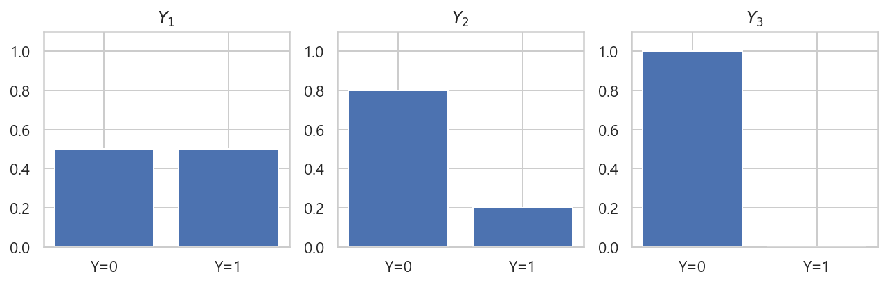

### [python] 넘파이로 엔트로피 계산

```python
y_1 = - 0.5 * np.log2(0.5) - 0.5 * np.log2(0.5)
y_1

>>>

1.0
```

```python
y_2 = - 0.8 * np.log2(8/10) - 0.2 * np.log2(2/10)
y_2

>>>

0.7219280948873623
```

```python
eps = np.finfo(float).eps
y_3 = - 1 * np.log2(1) - eps * np.log2(eps)
y_3

>>>

1.1546319456101628e-14
```

### [python] quiz
- 베르누이분포에서 확률값 P(Y=1)은 0부터 1까지의 값을 가질 수 있다. 각각의 값에 대해 엔트로피를 계산하여 가로축이 P(Y=1)이고 세로축이 H[Y]인 그래프를 그리시오.
- 베르누이분포는 입력값이 0 또는 1이므로 P(Y=1)인 경우의 엔트로피와 P(Y=0)인 경우의 엔트로피를 함께 계산해야 한다.
    - 즉 P(Y=1) = 0.3 이면, P(Y=0) = 0.7 이다.

```python
def entropy(x) :
    a = x
    b = 1-x
    return - a * np.log2(a) - (b) * np.log2(b)

xx = np.linspace(0.001, 1-0.001, 1000)

plt.figure(figsize=(8, 6))
plt.plot(xx, entropy(xx), 'b-')
plt.xticks(np.arange(0, 11)/10)
plt.xlabel("$P(Y=1)$")
plt.ylabel("entropy")
plt.title("베르누이 분포 Y_1의 엔트로피")
plt.show() ;
```

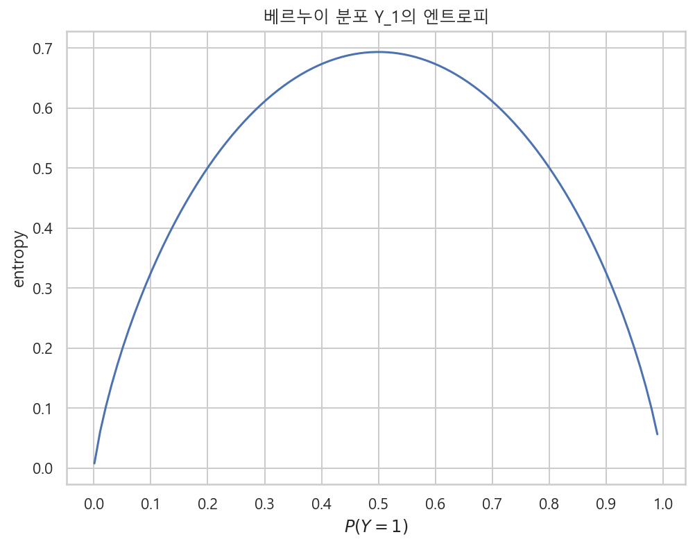

### [풀이]

```python
plt.figure(figsize=(8, 6))
P0 = np.linspace(0.001, 1-0.001, 1000)
P1 = 1 - P0
H = - P0 * np.log2(P0) - P1 * np.log2(P1)

plt.plot(P1, H, '-', label='엔트로피')
plt.xlabel('P(Y=1)')
plt.ylabel("entropy")
plt.legend()
plt.show() ;
```

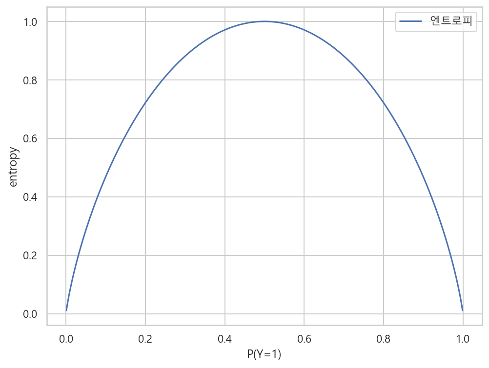

### [python] quiz
- 다음 확률분포의 엔트로피를 계산하시오.
    - P(Y=0) = 1/8, P(Y=1) = 1/8, P(Y=2) = 1/4, P(Y=3) = 1/2
    - P(Y=0) = 1, P(Y=1) = 0, P(Y=2) = 0, P(Y=3) = 0
    - P(Y=0) = 1/4, P(Y=1) = 1/4, P(Y=2) = 1/4, P(Y=3) = 1/4

```python
Y0 = - 1/8 * np.log2(1/8) - 1/8 * np.log2(1/8) - 1/4 * np.log2(1/4) - 1/2 * np.log2(1/2)
Y0

>>>

1.75
```

```python
eps = np.finfo(float).eps
Y1 = - 1 * np.log2(1) - eps * np.log2(eps) - eps * np.log2(eps) - eps * np.log2(eps)
Y1

>>>

3.4638958368304884e-14
```

```python
Y2 = - 1/4 * np.log2(1/4) - 1/4 * np.log2(1/4) - 1/4 * np.log2(1/4) - 1/4 * np.log2(1/4)
Y2

>>>

2.0
```

## 1-2 엔트로피의 성질
- **엔트로피의 최소값** : 확률변수가 결정론적이면 확률분포에서 어떤 값이 나올 확률은 1과 같다. 따라서 이러한 경우 엔트로피는 0이다. 이 값이 엔트로피가 가질 수 있는 최소값이다.
- **엔트로피의 최대값** : 이산확률변수의 클래스의 개수에 따라서 엔트로피의 값이 달라진다. 이산확률분포가 가질 수 있는 클래스의 개수가 2^K개일때 엔트로피의 최대값은 K이다.
    - 
    - 만약 이산확률분포의 클래스의 개수가 2^3=8이면 위의 계산에 의해 엔트로피가 가질 수 있는 최대값은 3이 된다.

## 1-3 엔트로피의 추정
- 이론적인 확률밀도함수가 없는 경우, 실제 데이터로부터 확률질량함수를 추정하여 엔트로피를 계산한다.
    - **데이터 -> 확률질량함수 추정 -> 엔트로피 계산**
- 전체 데이터 수 80개, Y=0인 데이터가 40개, Y=1인 데이터가 40개 있는 경우의 엔트로피
    - 

### [python] 사이파이로 entropy 계산

```python
p = [0.5, 0.5]
sp.stats.entropy(p, base=2)

>>>

1.0
```

```python
p = [0.3, 0.7]
sp.stats.entropy(p, base=2)

>>>

0.8812908992306927
```

```python
p = [0.8, 0.2]
sp.stats.entropy(p, base=2)

>>>

0.7219280948873623
```

### [python] quiz
- 데이터가 모두 60개이고 그 중 Y=0인 데이터가 20개, Y=1인 데이터가 40개 있는 경우 엔트로피를 계산하시오
- 데이터가 모두 40개이고 그 중 Y=0인 데이터가 30개, Y=1인 데이터가 10개 있는 경우 엔트로피를 계산하시오
- 데이터가 모두 20개이고 그 중 Y=0인 데이터만 20개 있는 경우의 엔트로피를 계산하시오.

```python
p0 = [20/60, 40/60]
sp.stats.entropy(p0, base=2)

>>>

0.9182958340544894
```

```python
p1 = [30/40, 10/40]
sp.stats.entropy(p1, base=2)

>>>

0.8112781244591328
```

```python
p2 = [20/20, eps]
sp.stats.entropy(p2, base=2)

>>>

1.1866662106483117e-14
```

## 1-4 가변길이 인코딩
- **엔트로피는 원래 통신 분야에서 데이터가 가지고 있는 정보량을 계산하기 위해 고안되었다.**
- A, B, C, D 4글자로 이루어진 문서가 있다.
- 각 글자를 0, 1로 이루어진 이진수로 변환하면 다음과 같다.
    - A = "00"
    - B = "01"
    - C = "10"
    - D = "11"
- ABCD로 이루어진 문서가 200글자이면 인진수는 400개가 된다. 문서의 길이가 길어지면 이진수의 갯수는 더 많아지게 된다. 문자를 이진수로 변환할 때 이진수의 수를 줄이기 위한 방법으로 **가변길이 인코딩 variable length encoding**을 사용한다.
- 가변길이 인코딩은 ABCD 각 문자가 문서에 등장한 빈도수에 따라서 변환할 인코딩 문자의 길이를 다르게 할 수 있다.
- 어떤 문서에서 ABCD 각 문자의 빈도수 분포를 조사했을 때 다음과 같다.
    - P(Y=A) = 1/2, P(Y=B) = 1/4, P(Y=C) = 1/8, P(Y=D) = 1/8
    - A가 가장 많이 등장하고 다음으로 B가 많이 등장하고 C와 D는 빈도수가 같다.
- 이러한 경우 가장 많이 나오는 A의 인코딩 문자의 갯수를 줄이고 C와 D의 인코딩 문자의 갯수를 늘일 수 있다.
- 가변길이 인코딩 방식으로 인코딩 된 문서의 한 글자당 비트수를 계산하면 엔트로피의 값과 같다.
    - 
    - **한 문자당 바이트 수 : 350 / 200 = 1.75**
    - 각 문자의 확률에 대한 엔트로피 :


### [python] 가변길이 인코딩

#### ABCD로 조합된 문서 만들기

```python
N = 200
p = [1/2, 1/4, 1/8, 1/8]
doc0 = list("".join([int(N * p[i]) * c for i, c in enumerate("ABCD")]))
np.random.shuffle(doc0)
doc = "".join(doc0)
doc

>>>

'BAADDAABAAAAAADAACDBCBDBBAABCCDBADABDDAADAAAABBAABBAACDAACABCAAABAABADAABBBDBACCAAADACADCABABACBCABADACAAAAAAAABBAABAADAAABBBBBACCDCAAAABABBACDBBBDBAABBAAAADCAACDAAABACABBBCBDBCAAAAACAAABAADDAAACBBAAA'
```

#### 코드 풀이
- ABCD의 각 확률대로 만든다.

```python
[int(N * p[i]) * c for i, c in enumerate("ABCD")]

>>>

['AAAAAAAAAAAAAAAAAAAAAAAAAAAAAAAAAAAAAAAAAAAAAAAAAAAAAAAAAAAAAAAAAAAAAAAAAAAAAAAAAAAAAAAAAAAAAAAAAAAA',
 'BBBBBBBBBBBBBBBBBBBBBBBBBBBBBBBBBBBBBBBBBBBBBBBBBB',
 'CCCCCCCCCCCCCCCCCCCCCCCCC',
 'DDDDDDDDDDDDDDDDDDDDDDDDD']
```

- join 함수로 합쳐준다.

```python
"".join([int(N * p[i]) * c for i, c in enumerate("ABCD")])

>>>

'AAAAAAAAAAAAAAAAAAAAAAAAAAAAAAAAAAAAAAAAAAAAAAAAAAAAAAAAAAAAAAAAAAAAAAAAAAAAAAAAAAAAAAAAAAAAAAAAAAAABBBBBBBBBBBBBBBBBBBBBBBBBBBBBBBBBBBBBBBBBBBBBBBBBBCCCCCCCCCCCCCCCCCCCCCCCCCDDDDDDDDDDDDDDDDDDDDDDDDD'
```

- list로 변환하면 각 문자가 하나의 str 원소로 바뀐다.

```python
print(list("".join([int(N * p[i]) * c for i, c in enumerate("ABCD")])))

>>>

['A', 'A', 'A', 'A', 'A', 'A', 'A', 'A', 'A', 'A', 'A', 'A', 'A', 'A', 'A', 'A', 'A', 'A', 'A', 'A', 'A', 'A', 'A', 'A', 'A', 'A', 'A', 'A', 'A', 'A', 'A', 'A', 'A', 'A', 'A', 'A', 'A', 'A', 'A', 'A', 'A', 'A', 'A', 'A', 'A', 'A', 'A', 'A', 'A', 'A', 'A', 'A', 'A', 'A', 'A', 'A', 'A', 'A', 'A', 'A', 'A', 'A', 'A', 'A', 'A', 'A', 'A', 'A', 'A', 'A', 'A', 'A', 'A', 'A', 'A', 'A', 'A', 'A', 'A', 'A', 'A', 'A', 'A', 'A', 'A', 'A', 'A', 'A', 'A', 'A', 'A', 'A', 'A', 'A', 'A', 'A', 'A', 'A', 'A', 'A', 'B', 'B', 'B', 'B', 'B', 'B', 'B', 'B', 'B', 'B', 'B', 'B', 'B', 'B', 'B', 'B', 'B', 'B', 'B', 'B', 'B', 'B', 'B', 'B', 'B', 'B', 'B', 'B', 'B', 'B', 'B', 'B', 'B', 'B', 'B', 'B', 'B', 'B', 'B', 'B', 'B', 'B', 'B', 'B', 'B', 'B', 'B', 'B', 'B', 'B', 'C', 'C', 'C', 'C', 'C', 'C', 'C', 'C', 'C', 'C', 'C', 'C', 'C', 'C', 'C', 'C', 'C', 'C', 'C', 'C', 'C', 'C', 'C', 'C', 'C', 'D', 'D', 'D', 'D', 'D', 'D', 'D', 'D', 'D', 'D', 'D', 'D', 'D', 'D', 'D', 'D', 'D', 'D', 'D', 'D', 'D', 'D', 'D', 'D', 'D']
```

- np.random.shuffle로 원소를 무작위로 섞어준 후, str 원소를 join으로 다시 합쳐준다.

```python
test = list("".join([int(N * p[i]) * c for i, c in enumerate("ABCD")]))
np.random.shuffle(test)
test = "".join(test)
test

>>>

'ACBBAAAABAAAAAADACBABCDBCAAACAACBCAABDDAADCCABBABBAACAAAAABDDBACDAABBBAAACBCABDACDDABBBADABDBBACBAAABAAAAAAAAABAABCABBBDCBABBAAABAACCABDABADADCDABCABAAAADAADBAAABABDDCABBABAACAAABADCAAABAAADCAAAABBDAA'
```

#### 이 문서를 이진수로 인코딩 하기

```python
encoder = {"A" : "00", "B" : "01", "C" : "10", "D" : "11"}
encoded_doc = "".join([encoder[c] for c in doc])
encoded_doc

>>>

'0100001111000001000000000000110000101101100111010100000110101101001100011111000011000000000101000001010000101100001000011000000001000001001100000101011101001010000000110010001110000100010010011000010011001000000000000000000101000001000011000000010101010100101011100000000001000101001011010101110100000101000000001110000010110000000100100001010110011101100000000000100000000100001111000000100101000000'
```

#### 이진수로 인코딩하면 400개의 문자가 된다.
- 원래 문서는 길이가 200이었다.

```python
len(encoded_doc)

>>>

400
```

#### 인코딩한 문서의 문자별 빈도수를 분포로 확인
- A > B > C = D 의 순으로 사용 횟수가 다르다.
- sns.countplot(list(doc), order="ABCD") : list의 원소를 order의 인수로 입력하면 자동으로 count해서 bar로 표현해준다.

```python
plt.figure(figsize=(8, 6))
sns.countplot(list(doc), order="ABCD")
plt.title("글자수의 분포 : ABCD")
plt.show() ;
```
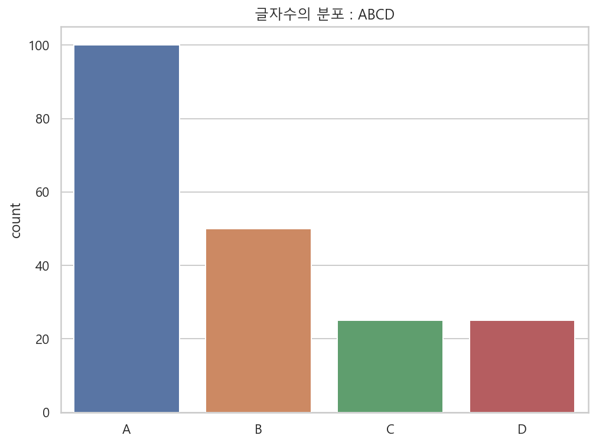

#### 가변길이 인코딩 방식을 사용하여 각 문자별 인코딩 문자의 갯수 조정
- 많이 등장한 문자는 인코딩 문자를 줄이고, 적게 등장한 문자는 인코딩 문자를 늘려준다.
- 즉 처음 인코딩한 문서의 길이보다 줄어든다.

```python
v1_encoder = {"A" : "0", "B" : "10", "C" : "110", "D" : "111"}
v1_encoded_doc = "".join([v1_encoder[c] for c in doc])
v1_encoded_doc

>>>

'10001111110010000000111001101111011010111101000101101101111001110101111110011100001010001010001101110011001011000010001001110010101011110011011000011101100111110010010011010110010011101100000000010100010001110001010101010011011011111000001001010011011110101011110001010000011111000110111000100110010101011010111101100000011000010001111110001101010000'
```
- 가변길이 인코딩으로 변환한 문서의 길이

```python
len(v1_encoded_doc)

>>>

350
```

#### 가변길이 인코딩 된 문서를 한 글자당 인코딩 비트 수로 나누면?
- 각 문자의 확률에 대한 엔트로피 값과 같다.

```python
350/200

>>>

1.75

p = [1/2, 1/4, 1/8, 1/8]
sp.stats.entropy(p, base=2)

>>>

1.75
```

### [python] quiz
- A, B, C, D, E, F, G, H 의 8개 글자로 이루어진 문서가 있을 때 각각의 글자가 나올 확률이 다음과 같다.
- 이 문서를 위한 가변길이 인코딩 방식을 서술하고 한 글자를 인코딩하는데 필요한 평균 비트수를 계산하라.

#### 평균비트수 = 엔트로피

```python
p_docs = [1/2, 1/4, 1/8, 1/16, 1/64, 1/64, 1/64, 1/64]
sp.stats.entropy(p_docs, base=2)

>>>

2.0
``

## 1-6 엔트로피의 최대화
- 기대값=0, 분산=sigma^2 이 주어진 경우 엔트로피 H[p(x)]를 가장 크게 만드는 확률밀도함수 p(x)는 정규분포가 된다.
- 정규분포는 기댓값과 표준편차를 알고있는 확률분포들 중에서 엔트로피가 가장 크다.
    - 따라서 가장 정보가 적은 확률분포이기도 하다.
    - 정규분포는 **무정보 사전확률분포**로서 베이즈추정의 사전분포에 사용되는 경우가 많다.
#### 증명 
- 목적범함수인 엔트로피의 값을 최대화한다. 이 과정에서 입력변수인 확률밀도함수의 제한조건이 라그랑주 승수법으로 추가된다. 엔트로피함수에 제한조건이 추가되어 새로운 목적함수가 된다. 이 목적함수를 풀면 정규분포의 형태가 된다. 
- **pdf의 제한조건 1 : 면적의 총합은 1이다.**
    - 
- **pdf의 제한조건 2 : 기대값은 0이다. (연속확률변수의 기대값 공식)**
    - 
- **pdf의 제한조건 3 : 분산은 sigma^2 이다.**
    - 
- **목적범함수 objective functional**인 엔트로피를 최대화 한다. 
    - 
- 목적범함수에 pdf의 제한조건 3가지를 라그랑주 승수법으로 추가한다. 

- 최대값을 구하기위해서 목적함수를 확률밀도함수로 편미분한다.
    - 
- 양변에 지수함수를 적용하여 정리하면 다음과 같아진다. 
    - 
- pdf의 제한조건 3가지와 이 제한조건을 만족하는 연립방정식을 계산하면 라그랑주 승수 3개가 나온다. (이 과정은 생략함)
    - 
    - 
    - 
- 라그랑주 승수값을 각각 위의 식에 대입하면 정규분포의 확률밀도함수가 된다.
    - 
    
#### 정규분포의 확률밀도함수에 대한 엔트로피
- 

## 1-7 조건부 엔트로피
- 두 확률변수의 결합엔트로피(joint entropy)와 조건부엔트로피(conditional entropy)를 구하고 분류문제에 적용한다. 

### 결합엔트로피
- `결합엔트로피 joint entropy` : 결합확률분포를 사용하여 정의한 엔트로피이다.
- 이산확률변수 : 
    - K_X, K_Y 는 X의 갯수, Y의 갯수
    - p(x)는 확률질량함수
- 연속화률변수 : 
    - p(x)는 확률밀도함수
- 결합엔트로피도 엔트로피와 같다. 확률분포가 고르게 퍼져있으면 엔트로피 값이 증가하고, 확률분포가 하나의 값에 치우쳐져 있으면 엔트로피 값이 감소한다.     
    
### 조건부엔트로피
- `조건부엔트로피 conditioanl entropy` : 어떤 확률변수 X가 다른 확률변수 Y의 값을 예측하는데 도움이 되는지를 측정하는 방법이다. 
- 확률변수 X가 하나의 값을 갖고 확률변수 Y도 하나의 값만 갖는다면 X로 Y를 예측할 수 있다.
- 확률변수 X가 하나의 값을 갖고 확률변수 Y가 여러개의 값에 퍼져있다면 X로 Y를 예측할 수 없다. 
- 수학적 정의
    - 
- 조건부엔트로피는 확률변수 X가 가질 수 있는 모든 경우에 대해 H[Y|X=x_i]를 가중평균한 값과 같다.
- 이산확률변수
    - 
- 연속확률변수
    - 

### [python] 조건부엔트로피, 결합 엔트로피

#### 확률변수 X가 확률변수 Y의 예측에 도움이 되는 경우
- **X가 특정한 값일 때 Y도 특정한 값이 될때 예측에 도움이 된다.**
- 두 확률변수 X, Y의 관계가 다음과 같다.

```
    | Y=0 | Y=1
----------------
X=0 | 0.4 | 0.0
----------------
X=1 | 0.0 | 0.6
```
- 조건부확률분포 : conditional = joint / marginal
    - P(Y=0|X=0) = P(X=0, Y=0) / P(X=0) = 1
    - P(Y=1|X=0) = P(X=0, Y=1) / P(X=0) = 0
    - P(Y=0|X=1) = P(X=1, Y=0) / P(X=1) = 0
    - P(Y=1|X=1) = P(X=1, Y=1) / P(X=1) = 1
- Y의 엔트로피는 모두 0이다.
    - H[Y|X=0] = - 1 log2(1) - 0 log2(0) = 0
    - H[Y|X=1] = - 0 log2(0) - 1 log2(1) = 0
- 조건부 엔트로피도 0이 된다.
    - H[Y|X] = 0

- X=0 이면 Y=0 이다.
- X=1 이면 Y=1 이다.

```python
plt.figure(figsize=(8, 5))
ax1 = plt.subplot(121)
pXY = [[0.4, 0], [0, 0.6]]
sns.heatmap(pXY, annot=True, cbar=False)
plt.xlabel("Y")
plt.ylabel("X")

plt.subplot(222)
plt.bar([0, 1], [1.0, 0])
plt.ylim(0, 1)
plt.title("조건부확률분포 p(Y|X=0)")

plt.subplot(224)
plt.bar([0, 1], [0, 1.0])
plt.ylim(0, 1)
plt.title("조건부확률분포 p(Y|X=1)")

plt.suptitle("조건부 엔트로피 H[Y|X]=0")
plt.tight_layout()
plt.show() ;
```

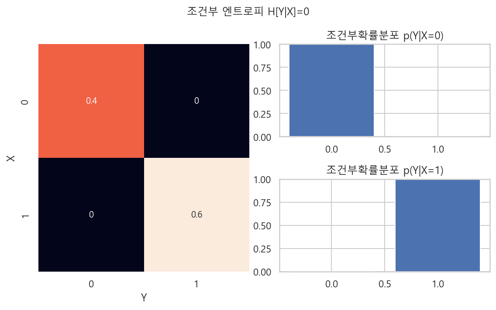

#### 확률변수 X가 확률변수 Y의 예측에 도움이 되지 않는 경우
- **X가 특정한 값일때 Y는 여러값의 분포가 생길 때 예측에 도움이 되지 않는다.**
- 두 확률변수 X, Y의 관계가 다음과 같다.

```
    | Y=0 | Y=1
----------------
X=0 | 1/9 | 2/9
----------------
X=1 | 2/9 | 4/9
```
- 조건부확률분포 : conditional = joint / marginal
    - P(Y=0|X=0) = P(X=0, Y=0) / P(X=0) = 1/3 
    - P(Y=1|X=0) = P(X=0, Y=1) / P(X=0) = 2/3
    - P(Y=0|X=1) = P(X=1, Y=0) / P(X=1) = 1/3
    - P(Y=1|X=1) = P(X=1, Y=1) / P(X=1) = 2/3
- Y의 엔트로피는 0.92에 가깝다.
    - H[Y|X=0] = H[Y|X=1] = - 1/3 log2(1/3) - 2/3 log2(2/3) = 0.92
- 가중평균한 조건부엔트로피도 0.92에 가깝다.
    - H[Y|X] = 1/3 H[Y|X=0] + 2/3 H[Y|X=1] = 0.92 

#### Y의 엔트로피

```python
sp.stats.entropy([1/3, 2/3], base=2)

>>>

0.9182958340544894
```

```python
pXY = [[1/9, 2/9], [2/9, 4/9]]

plt.figure(figsize=(8, 5))
ax1 = plt.subplot(121)
sns.heatmap(pXY, annot=True, cbar=False)
plt.xlabel("Y")
plt.ylabel("X")

plt.subplot(222)
plt.bar([0, 1], [1/3, 2/3])
plt.ylim(0, 1)
plt.title("조건부확률분포 p(Y|X=0)")

plt.subplot(224)
plt.bar([0, 1], [1/3, 2/3])
plt.ylim(0, 1)
plt.title("조건부확률분포 p(Y|X=1)")

plt.suptitle("조건부엔트로피 H[Y|X]=0.92")
plt.tight_layout()
plt.show() ;
```


### [python] 조건부엔트로피를 사용한 스팸메일 분류문제
- 학습용 메일 80개 중 정상메일 40개 (Y=0), 스팸메일 40개 (Y=1)이 있다고 가정한다.
- 스팸메일인지 아닌지 구분하기 위해 특정 키워드가 존재하면 X=1, 키워드가 존재하지 않으면 X=0으로 정의한다.
- 키워드로 X1, X2, X3이 있다.

#### 키워드 X1과 Y의 관계
```
     | Y=0 | Y=1
---------------------
X1=0 | 30  | 10  | 40
---------------------
X1=1 | 10  | 30  | 40
---------------------
       40  | 40  | 80
```

#### 키워드 X2과 Y의 관계
```
     | Y=0 | Y=1
---------------------
X2=0 | 20  | 40  | 60
---------------------
X2=1 | 20  |  0  | 20
---------------------
       40  | 40  | 80
```

#### 키워드 X3과 Y의 관계
```
     | Y=0 | Y=1
---------------------
X3=0 |  0  | 40  | 40
---------------------
X3=1 | 40  |  0  | 40
---------------------
       40  | 40  | 80
```

- 스팸메일인지 아닌지 확인할 수 있는 키워드는 X3이다. X3이 있는 경우와 없는 경우의 정상메일, 스팸메일의 구분이 명확하다.
- X1과 X2 중에서는 어떤 키워드가 스팸메일을 구분하기에 더 좋을까?

#### **조건부엔트로피값을 사용하여 구할 수 있다.**
- X1과 Y의 조건부엔트로피
    - H[Y|X1]=p(X1=0)H[Y|X1=0] + p(X1=1)H[Y|X1=1] = 40/80x0.81 + 40/80x0.81 = 0.81
    - H[Y|X1=0]와 H[Y|X1=1]는 각각 따로 구할 수 있다.

- X2와 Y의 조건부엔트로피
    - H[Y|X2]=p(X2=0)H[Y|X2=0] + p(X2=1)H[Y|X2=1] = 60/80x0.92 + 20/80x0 = 0.69

- X3와 Y의 조건부엔트로피
    - H[Y|X3]=p(X3=0)H[Y|X3=0] + p(X3=1)H[Y|X3=1] = 0

- `X2가 X1 보다 좋은 키워드 이다.` : 엔트로피값이 낮다는 것에 의하여, X2의 값이 0 또는 1일때 Y가 정상인지 스팸인지 한쪽값에 확률이 더 쏠린다는 것을 알 수 있다.

#### 조건부엔트로피는 의사결정나무에 사용된다.
- `의사결정나무 decision tree` 분류모형은 조건부엔트로피를 사용하여 가장 좋은 특징값과 기준점을 찾아준다.

### [python] 조건부엔트로피를 사용한 붓꽃 분류문제
- 붓꽃 데이터에서 버지니카와 베르시칼라 품종을 꽃받침의 길이(sepal length)로 분류하려고 한다.
- 꽃받침의 길이 중 특정한 값을 기준으로 품종의 갯수를 구한뒤, 조건부엔트로피를 계산한다.
    - 조건부엔트로피 값이 작을 수록 X로 Y를 예측하는데 더 도움이 된다는 의미이다.
    - 즉 6cm 가 6.5cm 보다 베르시칼라와 버지니카 품종을 구분하는데 더 도움이 된다.

#### 버지니카와 베르시칼라 품종만 임포트

```python
from sklearn.datasets import load_iris

iris = load_iris()
idx = np.in1d(iris.target, [1, 2])
X = iris.data[idx, :]
y = iris.target[idx]

df = pd.DataFrame(X, columns=iris.feature_names)
df['species'] = iris.target[idx]
df.tail() ;
```

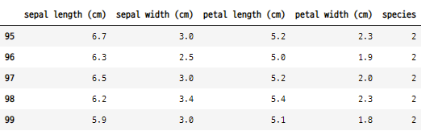

#### 확률밀도 확인
- 기준점을 어떻게 잡아야 두 품종을 구분할 수 있을까?
- 조건부엔트로피 값이 작은 기준점을 찾는다.

```python
plt.figure(figsize=(8, 6))

sns.distplot(df[df.species==1]["sepal length (cm)"], hist=True, rug=True, label="버지니카")
sns.distplot(df[df.species==2]["sepal length (cm)"], hist=True, rug=True, label="베르시칼라")
plt.xlabel("꽃받침의 길이")
plt.title("꽃받침의 길이와 붓꽃의 품종")
plt.legend()
plt.show() ;
```

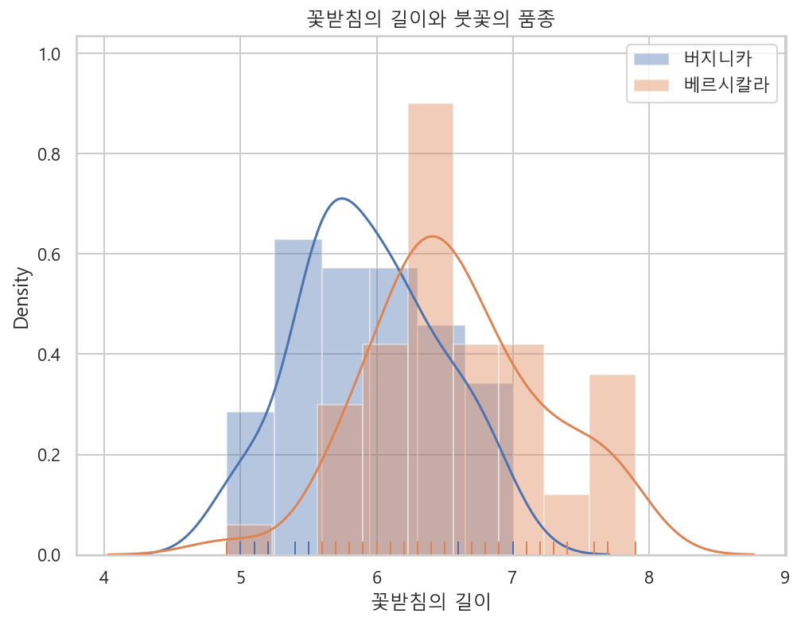

#### 6cm 로 기준을 잡았다면?
- 6보다 큰 것과 6보다 작은 것 중 각 품종의 갯수

```python
df["x1"] = df["sepal length (cm)"] > 6
pivot_table1 = df.groupby(["x1", "species"]).size().unstack().fillna(0)
pivot_table1
```

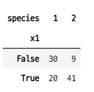

#### 조건부 엔트로피 계산

```python
def cond_entropy(v) :
    # conditional = joint / marginal
    pYX0 = v[0, :] / np.sum(v[0, :])
    pYX1 = v[1, :] / np.sum(v[1, :])
    HYX0 = sp.stats.entropy(pYX0, base=2)
    HYX1 = sp.stats.entropy(pYX1, base=2)

    # 조건부엔트로피는 H[Y|X=xi]를 가중평균한 값과 같다.
    HYX = np.sum(v, axis=1) @ [HYX0, HYX1] / np.sum(v)

    return HYX
```

#### 6cm 로 기준을 잡은 경우의 조건부 엔트로피

```python
cond_entropy(pivot_table1.values)

>>>

0.860714271586387
```

#### 6.5cm 를 기준으로 구분하는 경우

```python
df["x2"] = df["sepal length (cm)"] > 6.5
pivot_table2 = df.groupby(["x2", "species"]).size().unstack()
pivot_table2
```

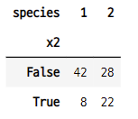

```python
cond_entropy(pivot_table2.values)

>>>

0.9306576387006182
```

#### 기준값이 6cm 엔트로피 값이 더 작으므로 6cm를 기준으로 삼는 것이 더 좋다.

### [python] quiz

#### - 붓꽃데이터에서 꽃받침의 길이 sepal length의 최소값과 최대값 구간을 0.05 간격으로 나누어 각각의 값을 기준값으로 했을 때 조건부엔트로피가 어떻게 변하는지 그래프로 그리시오.

- 붓꽃 데이터로 데이터 프레임 생성

```python
from sklearn.datasets import load_iris

iris = load_iris()
X = iris.data
y = iris.target
df_ir = pd.DataFrame(X, columns=iris.feature_names)
df_ir['species'] =iris.target

df_ir.head(3)
```

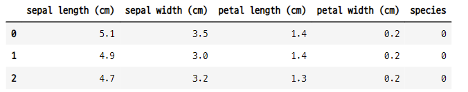


- 기준값과 컬럼명을 파라미터로 받아 조건부 엔트로피를 계산하는 함수

```python
def calc_cond_entropy(col, threshold) :
    df_ir['X1'] = df_ir[col] > threshold
    ptb = df_ir.groupby(['X1', 'species']).size().unstack().fillna(0)
    v = ptb.values
    pYX0 = v[0, :] / np.sum(v[0, :])
    pYX1 = v[1, :] / np.sum(v[1, :])
    HYX0 = sp.stats.entropy(pYX0, base=2)
    HYX1 = sp.stats.entropy(pYX1, base=2)
    HYX = np.sum(v, axis=1) @ [HYX0, HYX1] / np.sum(v)

    return HYX
```

- 컬럼명을 파라미터로 입력받아서 조건부 엔트로피 값을 반환받아 그래프를 그려주는 함수

```python
def plot_min_cond_entropy(col) :
    th_min = df_ir[col].min()
    th_max = df_ir[col].max()
    th_range = np.arange(th_min, th_max + 0.05, 0.05)

    cond_entropies = []
    for th in th_range :
        cond_entropies.append(calc_cond_entropy(col, th))

    id_min = np.argmin(cond_entropies)
    th_min = th_range[id_min]
    ce_min = np.min(cond_entropies)

    plt.figure(figsize=(8, 6))
    plt.plot(th_range, cond_entropies, 'r-')
    plt.plot(th_min, ce_min, 'bo')
    plt.title("{} 기준값에 따른 조건부엔트로피 ({:.3} 일 때 최소값 {:.3})" \
             .format(col, th_min, ce_min), y=1.03)
    plt.xlabel(col)
    plt.show()
```

#### 꽃받침의 길이를 0.05 간격으로 변화시켰을 때 조건부 엔트로피 값의 변화

```python
plot_min_cond_entropy('sepal length (cm)')
```
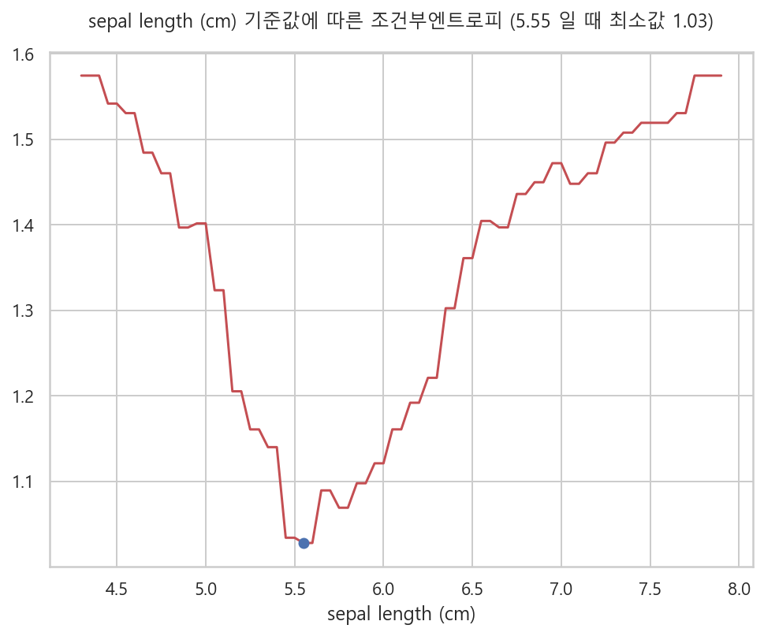

#### 꽃받침의 폭을 0.05 간격으로 변화시켰을 때 조건부 엔트로피 값의 변화

```python
plot_min_cond_entropy('sepal width (cm)')
```

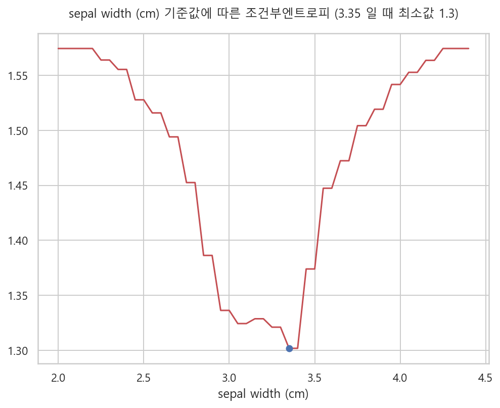

- 베르시칼라와 버지니카 품종을 구분하기 위한 기준값은 꽃받침의 길이에서 찾는 것이 더 정확하다.
    - 조건부엔트로피 값이 낮기 떄문.

#### petal 컬럼을 적용하면 에러 발생
- petal 컬럼을 적용하면 특정 기준값(threshold)에서 피벗테이블이 (1,2)가 되어 pYX1이 계산되지 않는다.
- 피벗테이블을 만드는 조건으로 th보다 큰 값을 사용했는데, 이때 th보다 큰 값이 없는 경우 False행만 만들어지기 때문이다.
- 이러한 경우 try, except를 사용하여 error가 발생하면 바로 이전th값(th-0.05)으로 함수를 다시 호출하게 했다.

```python
def calc_cond_entropy(col, threshold) :
    df_ir["X1"] = df_ir[col] > threshold
    pt = df_ir.groupby(["X1", "species"]).size().unstack().fillna(0)
    v = pt.values
    # threshold 값에 따라서 피벗테이블의 크기가 달라지면 이전 threshold 값을 적용한다.
    try :
        pYX0 = v[0, :] / np.sum(v[0, :])
        pYX1 = v[1, :] / np.sum(v[1, :])
        HYX0 = sp.stats.entropy(pYX0, base=2)
        HYX1 = sp.stats.entropy(pYX1, base=2)
        HYX = np.sum(v, axis=1) @ [HYX0, HYX1] / np.sum(v)
    except :
        HYX = calc_entropy(col, threshold-0.05)

    return HYX
```

## 1-8 교차엔트로피와 쿨벡-라이블러 발산

### 교차엔트로피
- `교차엔트로피 cross-entropy` : 두 확률분포를 입력받아 엔트로피를 계산한다.
    - 분류문제의 성능을 평가해준다.
    - 예측의 틀린정도를 나타내는 오차함수 역할을 할 수 있다.
- **이산확률분포** 
    - 
- **연속확률분포**
    - 

### 교차엔트로피를 사용한 분류 성능 측정
- 교차엔트로피는 분류성능을 측정하는 데 사용된다.

#### 확률변수 Y가 0과 1의 값는 이진분류 문제
- p는 X값이 정해졌을 때 Y의 확률분포
    - 정답이 Y=1 : p(Y=0)=0, p(Y=1)=1
    - 정답이 Y=0 : p(Y=0)=1, p(Y=1)=0
- q는 X값이 정해졌을 때 예측값의 확률분포
    - 정답이 Y=1 : q(Y=1)=mu
    - 정답이 Y=0 : q(Y=0)=1-mu
- **p와 q의 교차엔트로피**
    - 정답이 Y=1 : - p(Y=1) log2 q(Y=1) = - 1 log2 mu
    - 정답이 Y=0 : - p(Y=0) log2 q(Y=0) = - 1 log2 (1-mu)
- **mu에 따른 분류성능**
    - Y=1 일때 mu가 작아지면 -log2mu 가 커진다. (예측이 잘 못된 경우), mu가 커지면 -log2mu가 작아진다.(예측이 잘 된 경우) 
    - Y=0 일때 mu가 커지면 -log2(1-mu)가 커진다. (예측이 잘 못된 경우), mu가 작아지면 -log2(1-mu)가 작아진다. (예측이 잘 된 경우)

- `로그손실 log-loss` : 이진분류에서의 교차엔트로피가 오차의 정도를 나타낸다고 할 때(손실함수), 교차엔트로피의 평균값
    - 
- `카테고리 로그손실` : 다중분류에서의 교차엔트로피 손실함수
    - 
    -  : y_i=k 이면 1, 아니면 0을 출력하는 지시함수(indicator function)
    -  : 분류모델이 계산한 y_i=k 일 확률

### [python] 교차엔트로피 계산

```python
p = [1/4, 1/4, 1/4, 1/4]
q = [1/2, 1/4, 1/8, 1/8]

H_pq = - 1/4 * np.log2(1/2) - 1/4 * np.log2(1/4) - 1/4 * np.log2(1/8) - 1/4 * np.log2(1/8)
H_pq

>>>

2.25
```
### [python] 로그함수 그래프

```python
def log_2(x) :
    return np.log2(x)

def log(x) :
    return np.log(x)

def log_10(x) :
    return np.log10(x)
```

```python
plt.figure(figsize=(8, 6))

xx = np.linspace(0, 3, 1000)

plt.plot(xx, log_2(xx), label="log_2")
plt.plot(xx, log(xx), label="log")
plt.plot(xx, log_10(xx), label="log_10")

plt.xlim(0, 3)
plt.ylim(-2, 2)

plt.legend()
plt.show() ;
```

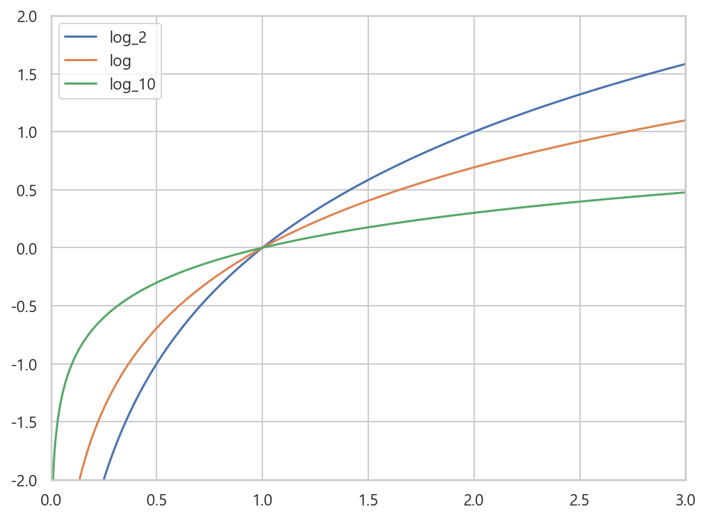

#### - 로그함수

```python
def log_2_minus(x) :
    return -np.log2(x)

def log_22_minus(x) :
    return -np.log2(1-x)


plt.figure(figsize=(8, 6))

xx = np.linspace(-2, 3, 1000)
plt.plot(xx, log_2_minus(xx), label="-log2x")
plt.plot(xx, log_22_minus(xx), label="-log2(1-x)")

plt.axvline(1, linestyle='--', color='k', linewidth=1)
plt.axhline(0, linestyle='-', color='k', linewidth=0.7)
plt.ylim(-2.1, 7)

plt.legend()
plt.show() ;     
```

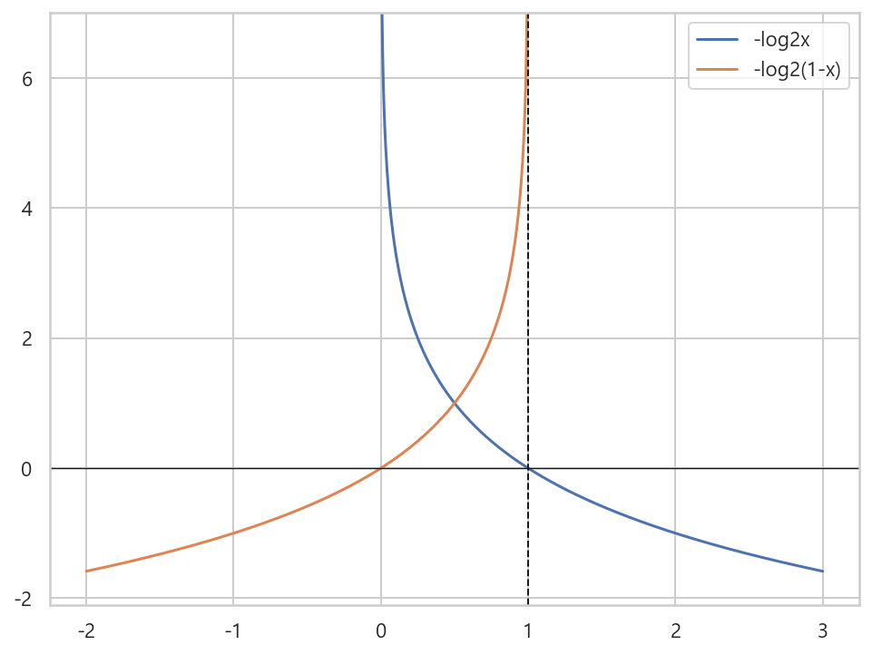

### [python] scikit-learn으로 로그손실 계산하기

```python
from sklearn.datasets import load_iris

iris = load_iris()
idx = np.in1d(iris.target, [0, 1])
idx

>>>

array([ True,  True,  True,  True,  True,  True,  True,  True,  True,
        True,  True,  True,  True,  True,  True,  True,  True,  True,
        True,  True,  True,  True,  True,  True,  True,  True,  True,
        True,  True,  True,  True,  True,  True,  True,  True,  True,
        True,  True,  True,  True,  True,  True,  True,  True,  True,
        True,  True,  True,  True,  True,  True,  True,  True,  True,
        True,  True,  True,  True,  True,  True,  True,  True,  True,
        True,  True,  True,  True,  True,  True,  True,  True,  True,
        True,  True,  True,  True,  True,  True,  True,  True,  True,
        True,  True,  True,  True,  True,  True,  True,  True,  True,
        True,  True,  True,  True,  True,  True,  True,  True,  True,
        True, False, False, False, False, False, False, False, False,
       False, False, False, False, False, False, False, False, False,
       False, False, False, False, False, False, False, False, False,
       False, False, False, False, False, False, False, False, False,
       False, False, False, False, False, False, False, False, False,
       False, False, False, False, False, False])
```

```python
X = iris.data[idx, :]
y = iris.target[idx]

df = pd.DataFrame(X, columns=iris.feature_names)
df['y'] = iris.target[idx]
df['y_hat'] = (df['sepal length (cm)'] > 5.4).astype(int)
df.head()
```

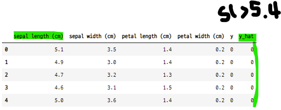

#### `scikit learn의 metrics 서브패키지의 log_logg 함수 사용`

```python
from sklearn.metrics import log_loss

log_loss(df['y'], df['y_hat'])

>>>

3.799305383311686
```
### [python] quiz
- 붓꽃 데이터에서 꽃받침 길이의 최솟값과 최대값 구간을 0.5 간격으로 나누어 각각의 값을 기준값으로 했을 때 로그손실이 어떻게 변하는지 그래프로 그려라. 세토사와 베르시 칼라만 사용.
- 꽃받침의 폭도 같은 방식으로 로그손실을 계산하고 그래프로 그려라.
- 꽃받침의 길이와 꽃받침의 폭 둘 중 어떤 것을 사용해야 로그 손실이 더 작은가?

#### 붓꽃 데이터 생성
- 세토사와 베르시칼라 컬럼만 사용
    - 라벨값 : 0, 1

```python
from sklearn.datasets import load_iris

iris = load_iris()
idx = np.in1d(iris.target, [0, 1])
X = iris.data[idx, :]
y = iris.target[idx]

df_ir = pd.DataFrame(X, columns=iris.feature_names)
df_ir['y'] = iris.target[idx]
df_ir.head()
```

#### 로그손실 값을 계산하는 함수
- reverse 파라미터가 False 이면 if문을 실행하고 True이면 else문을 실행한다.
    - 컬럼에 따라서 로그손실값이 반대로 될 수 있다.

```python
def calc_log_loss(col, threshold, reverse) :
    if reverse == False :
        df_ir['y_hat'] = (df_ir[col] > threshold).astype(int)
    else :
        df_ir['y_hat'] = (df_ir[col] < threshold).astype(int)
    logloss = log_loss(df_ir['y'], df_ir['y_hat'])

    return logloss
```

#### 로그손실 그래프를 그리는 함수
- 컬럼의 최소, 최대값을 구하고 0.05 간격으로 기준값 threshold 를 만든다.
- 기준값, 컬럼, reverse 아규먼트를 로그손실 값 계산 함수에 입력하여 호출한다.
    - sepal width 는 로그손실 값이 반대로 나온다. reverse 키워드 아규스 값을 True로 호출한다.

```python
def plot_log_loss(col, reverse=False) :
    th_min = df_ir[col].min()
    th_max = df_ir[col].max()
    th_range = np.arange(th_min, th_max, 0.05)

    l_loss = []
    for th in th_range :
        l_loss.append(calc_log_loss(col, th, reverse))

    idx_min = np.argmin(l_loss)
    th_min = th_range[idx_min]
    l_loss_min = l_loss[idx_min]

    plt.figure(figsize=(8, 6))
    plt.plot(th_range, l_loss, '-', label="log_loss")
    plt.plot(th_min, l_loss_min, 'ro')
    plt.title("기준값 {} 일 때 로그 손실 ({:.3} 에서 최저 로그손실 값 {:.3})" \
              .format(col, th_min, l_loss_min), y=1.03)

    plt.legend()
    plt.show()
```

#### 꽃받침의 길이를 기준값으로 한 경우 로그손실 값 그래프

```python
plot_log_loss("sepal length (cm)")
```

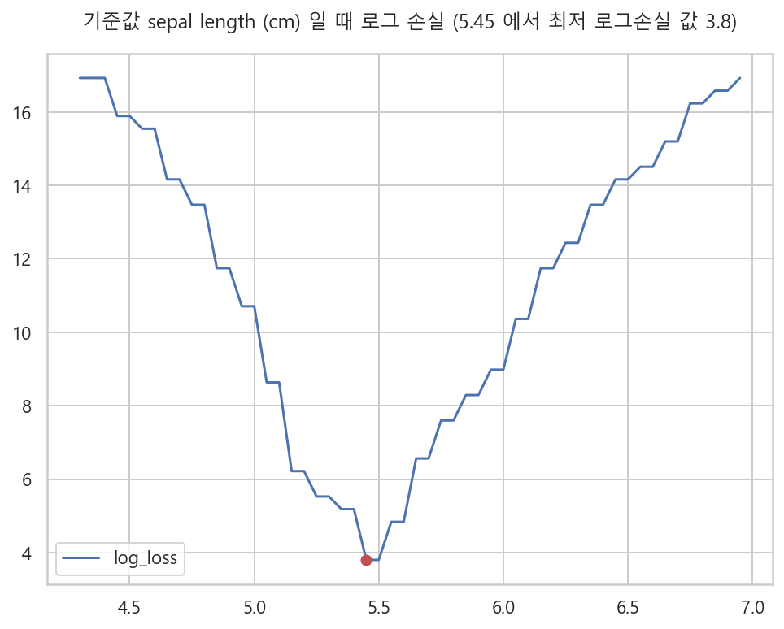


#### 꽃받침의 폭을 기준값으로 한 경우 로그손실 값 그래프

```python
plot_log_loss("sepal width (cm)", reverse=True)
```

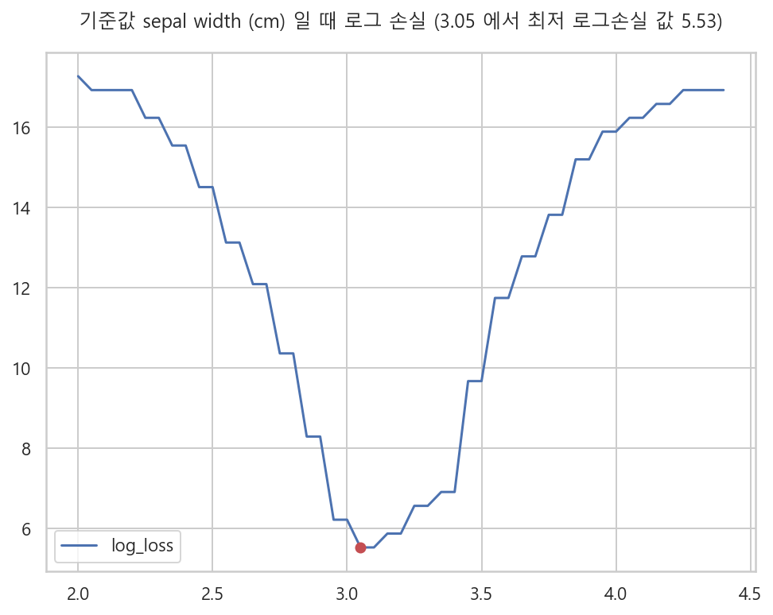

## 1-9 쿨백-라이블러 발산
- `쿨백-라이블러 발산 Kullback-Leibler divergence` : 두 확률분포 p(y), q(y)의 분포모양이 얼마나 다른지를 숫자로 계산한 값.
    - KL(p||q)
- **이산확률분포의 쿨백-라이블러 발산**
    - 
    - 교차엔트로피 - 엔트로피
    -  를 사용하여 정리
    
- **연속확률분포의 쿨백-라이블러 발산**
    - 

#### `상대엔트로피 relative entropy` : 쿨백-라이블러 발산은 교차엔트로피에서 기준이 되는 p분포의 엔트로피 값을 뺀 것과 같다.
- H[p, q] - H[p]
- 상대엔트로피 값은 항상 양수이다.
- 두 확률분포 p(x), q(x)가 완전히 동일한 분포일 때만 값이 0이다.
- 쿨백-라이블러 발산 값이 0이면 두 확률분포는 같다. (증명 복잡)
    - **KL(p||q) = 0 <-> p(x) = q(x)**

####   쿨백-라이블러 발산의 의미
- 쿨백-라이블러 발산은 두 확률분포의 거리(distance)를 계산하여 유사한지를 따지는 방법이 아니라 q가 기준확률분포 p와 얼마나 다른지를 계산하다.
- 따라서 기분이 되는 확률분포의 위치가 달라지면 쿨백-라이블러 발산의 값도 달라진다.
    - **KL(p||q) ≠ KL(q||p)**

#### 쿨백-라이블러 발산과 가변길이 인코딩
- p분포와 q분포의 글자수의 차이와 같다.
- 확률분포 q와 확률분포 p의 모양이 다른 정도를 정량화한 것과 같다.

$\begin{aligned}
KL(p||q)
&= \sum_{i=1}^{K} p(y_i) log_2 \left( \dfrac{p(y_i)}{q(y_i)} \right) \\
&= -\sum_{i=1}^{K} p(y_i) log_2 q(y_i) - (- \sum_{i=1}^{K} p(y_i) log_2 p(y_i)) \\
&= H[p, q] - H[p] \\
&= 2.0 - 1.75 = 0.25 \\
\end{aligned}$

- entropy 함수에 두 확률분포를 list로 넣으면 두 확률분포의 닮음 여부를 값으로 반환해준다.


### [python] 가변길이 인코딩과 쿨백-라이블러 발산

#### A, B, C, D로 이루어진 어떤 문서를 가변길이 인코딩하는 경우
- A, B, C, D 를 각각의 확률로 생성한 후 join함수로 합친다.
- list로 변환하면 각각의 데이터가 str 형태로 떨어지게 된다.

```python
N = 200
p = [1/2, 1/4, 1/8, 1/8]
doc0 = list("".join([int(N * p[i]) * c for i, c in enumerate("ABCD")]))
doc0

>>>

['A',
 'A',
 'A',
 'A',
 'A',
 'A',
 'A',
 'A',
 'A',
 'A',
 'A',
 'A',
 'A',...]
```

- 원소를 무작위로 섞어준 후 join함수를 사용하여 이어준다.
- 전체 200개의 문자가 생성된다.

```python
np.random.shuffle(doc0)
doc = "".join(doc0)
doc

>>>

'AABABDAAAABAAAADAABBADDBBABDBAABABACAAAAACCBAABABCADBABDABBDABACAAAAABDBBACDDBAADAADAABAADBABBCAAAAAAAAADAAAAAAAADDCBCCACCACBBACCAABAACAACDABBAAADADAAABABBCDBBAADAABBAABCAABACDCBBBAADABBBAABCAABACCCAD'
```

#### 문서를 구성하는 글자의 분포
- Counter 함수로 A, B, C, D 각각의 갯수를 계산하고 전체 길이로 나누어준다.

```python
from collections import Counter

p = np.array(list(Counter(doc).values())) / len(doc)
p

>>>

array([0.5  , 0.25 , 0.125, 0.125])

# 문서의 각 원소의 갯수 계산
Counter(doc)

>>>

Counter({'A': 100, 'B': 50, 'D': 25, 'C': 25})
```

#### 한글자당 인코딩된 글자수 = q 분포의 엔트로피

```python
sp.stats.entropy(p, base=2)

>>>

1.75
```

#### A, B, C, D를 가변길이 인코딩하여 다시 문서를 만들고 글자수를 확인
- A, B, C, D를 0과 1로 인코딩한다
- 각 문자의 확률에 따라 인코딩 길이를 다르게 한다.
    - 전체 길이는 변하지 않는다.

```python
v1_encoder = {"A" : "0", "B" : "10", "C" : "110", "D" : "111"}
v1_encoder_doc = "".join(v1_encoder[a] for a in doc)
v1_encoder_doc

>>>

'00100101110000100000111001010011111110100101111000100100110000001101101000100101100111100101110101011101001100000010111101001101111111000111001110010001111001010110000000000111000000001111111101011011001101100110101001101100010001100011011101010000111011100010010101101111010001110010100010110001001101111101010100011101010100010110001001101101100111'
```

- 가변길이 인코딩 된 문서를 원래 문서의 길이로 나누어주면 엔트로피 값과 같다.

```python
len(v1_encoder_doc) / len(doc)

>>>

1.75
```

#### 가변길이 인코딩이 아닌 고정길이 인코딩을 사용하면?
- 문자의 확률에 따른 가변길이가 아닌 모두 같은길이의 고정길이 인코딩을 사용하면 한글자당 인코딩 된 글자수는 어떻게 변할까?
    - q(Y=A) = 1/4, q(Y=B) = 1/4, q(Y=C) = 1/4, q(Y=D) = 1/4

```python
sp.stats.entropy([1/4]*4, base=2)

>>>

2.0
```

```python
v2_encoder = {"A" : "00", "B" : "01", "C" : "01", "D" : "11"}
v2_encoder_doc = "".join(v2_encoder[a] for a in doc)
len(v2_encoder_doc) / len(doc)

>>>

2.0
```

#### 쿨벡-라이블러 발산은 p분포와 q분포의 글자수의 차이와 같다. 
- entropy 함수에 두 확률분포를 list로 넣으면 두 확률분포의 닮은 정도를 값으로 반환해준다.

```python
sp.stats.entropy([1/2, 1/4, 1/8, 1/8], [1/4, 1/4, 1/4, 1/4], base=2)
```

### [python] quiz
- A, B, C, D, E, F, G, H 8글자로 이루어지 문서가 있다.
- 각 글자가 나올 확률이 다음과 같다.
    - p = [1/2, 1/4, 1/8, 1/16, 1/64, 1/64, 1/64, 1/64]
- 확률분포 p와 균일 확률분포 q의 쿨백-라이블러 발산값을 계산하시오.
- 이 문서를 가변길이 인코딩을 할 떄와 고정길이 인코딩을 할 때 한글자당 인코딩된 글자수를 비교하시오

```python
N = 100
p = [1/2, 1/4, 1/8, 1/16, 1/64, 1/64, 1/64, 1/64]
doc1 = list("".join(int(N * p[i]) * c for i, c in enumerate("ABCDEFGH")))
doc1

>>>

['A',
 'A',
 'A',
 'A',
 'A',
 'A',
 'A',
 'A',
 'A',
 'A',
 'A',...]
```

#### 가변길이 인코딩을 한 후 한글자당 분포는 = 엔트로피 값과 같다.

```python
np.random.shuffle(doc1)
doc = "".join(doc1)
doc

>>>

'CBAAAABAAAAABBABADACACABABCBADADAABAABAAABAAACBADAADAABDFCABCABBABAABAACBBAHACACAABCAAEAGACBBBABA'
```

#### entropy 확인

```python
ent1 = sp.stats.entropy(p, base=2)
ent1

>>>

2.0
```

#### 고정길이의 확률분포 fix_p의 한글자당 분포 = 엔트로피 값과 같다.

```python
fix_p = [1/8, 1/8, 1/8, 1/8, 1/8, 1/8, 1/8, 1/8]

ent2 = sp.stats.entropy(fix_p, base=2)
ent2

>>>

3.0
```

#### 쿨백-라이블러 발산
- 가변길이 인코딩의 한글자당 글자수와 고정길이 인코딩의 한글자당 글자수의 차이와 같다.

```python
ent2 - ent1

>>>

1.0
```

```python
sp.stats.entropy(p, fix_p, base=2)

>>>

1.0
```


## 1-10 상호정보량
- 상호정보량은 상관계수를 대체할 수 있는 확률변수의 특성이다.

### 상호정보량
- 두 확률변수 X, Y가 독립일 때 결합확률밀도함수는 주변확률밀도함수의 곱과 같다.
    - p(x, y) = p(x)p(y)

- **쿨백-라이블러 발산은 두 확률분포가 얼마나 다른지를 정량적으로 나타내는 수치이다.**
    - 두 확률분포가 같으면 쿨백-라이블러 발산은 0이고, 두 확률분포가 다를 수록 값이 커진다.
    - 

- `상호정보량 mutual information` : 결합확률밀도함수 p(x, y)와 주변확률밀도함수의 곱인 p(x)p(y)dml 쿨백-라이블러 발산이다.
    - 결합확률밀도함수와 주변확률밀도함수의 차이를 측정하여 두 확률변수의 상관관계를 계산하는 방법이다.
    - 두 확률변수가 독립이면 결합확률밀도함수는 주변확률밀도함수의 곱과 같으므로 상호정보량은 0이 된다.
    - 

- **상호정보량은 엔트로피와 조건부엔트로피의 차이와 같다**
    - MI[X, Y] = H[X] - H[X|Y]
    - MI[X, Y] = H[Y] - H[Y|X]
- 조건부엔트로피는 두 확률변수의 상관관계가 강할 수록 원래 엔트로피 값보다 작아진다.
- **따라서 상관관계가 강할 수록 상호정보량의 값은 커진다.**

### 이산확률변수의 상호정보량
- 상관관계가 있는 두 확률변수 X, Y에서 나온 표본데이터 N개가 있을 때, 이 데이터를 이용하여 상호정보량을 알기 위해서 필요한 값들
    - **I** : X의 카테고리 개수
    - **J** : Y의 카테고리 개수
    - **N_i** : X = i 인 데이터의 개수
    - **N_j** : Y = j 인 데이터의 개수
    - **N_ij** : X = i, Y = j 인 데이터의 개수
- 결합확률밀도함수와 주변확률밀도함수
    - 
    - 
    - 
- 확률밀도함수를 대입하여 상호정보량을 구한다.
    - 

### [python] 상호정보량
- 사이킷런 패키지 -> metrics 서브패키지 -> mutual_info_score 명령어
    - X, Y의 카테고리 값을 2차원 배열로 입력한다. 

#### 문서 카테고리 분류문제
- rec.autos, sci.med, rec.sport.baseball 세 클래스의 문서 데이터 사용
- 각 문서의 키워드와 카테고리 사이의 상호정보량 계산

```python
from sklearn.datasets import fetch_20newsgroups
from sklearn.feature_extraction.text import CountVectorizer
from sklearn.metrics import mutual_info_score
```

```python
categories = ['rec.autos', 'sci.med', 'rec.sport.baseball']
newsgroups = fetch_20newsgroups(subset='train', categories=categories)
newsgroups.data[0:3]

>>>
```

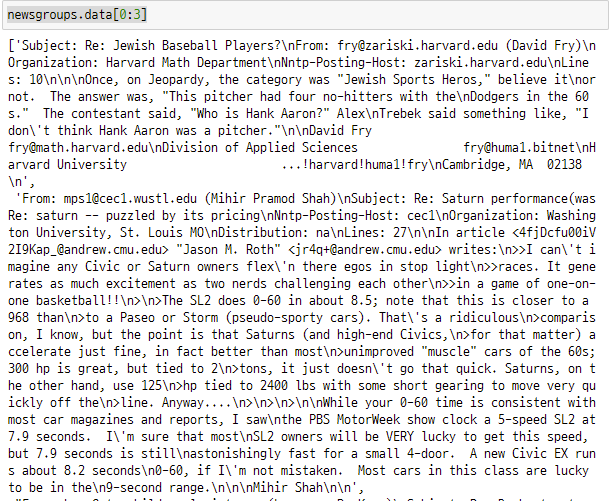

#### 카테고리 값
- 3개의 카테고리가 있으며 0, 1, 2 값으로 라벨링 된다.

```python
newsgroups.target

>>>

array([1, 0, 0, ..., 0, 2, 1], dtype=int64)
```

#### 카운트벡터라이저로 문서의 키워드 분석
- 전체 데이터에서 token_pattern에 따라서 말뭉치(키워드)를 만든다.
- 23805개가 만들어 진다.

```python
vect = CountVectorizer(stop_words='english', token_pattern="[a-zA-Z]+")
vect

>>>

CountVectorizer(stop_words='english', token_pattern='[a-zA-Z]+')
```

- 어떤 키워드들이 있는지 확인해보기

```python
words = vect.get_feature_names_out()
words[:20]

>>>

array(['aa', 'aaa', 'aaai', 'aamir', 'aanerud', 'aardvark', 'aaron',
       'aaronson', 'aas', 'ab', 'abacus', 'abandon', 'abates',
       'abberation', 'abbie', 'abbot', 'abbott', 'abbrev', 'abbreviation',
       'abbreviations'], dtype=object)
```

#### 카운트벡터라이즈 훈련
- 3개의 카테고리 뉴스 데이터를 학습시킨다.
- 1785개의 문서 데이터마다 23805개의 키워드가 있는지 없는지 배열로 반환된다.

```python
X = vect.fit_transform(newsgroups.data).toarray()
X

>>>

array([[0, 0, 0, ..., 0, 0, 0],
       [0, 0, 0, ..., 0, 0, 0],
       [0, 0, 0, ..., 0, 0, 0],
       ...,
       [0, 0, 0, ..., 0, 0, 0],
       [0, 0, 0, ..., 0, 0, 0],
       [0, 0, 0, ..., 0, 0, 0]], dtype=int64)
```

- X 배열의 모양
- 1785개의 문서 각각에 대한 키워드 분석 배열이 행으로 되어 있다.
    - 행은 각각의 문서이고
    - 열은 각각의 문서에서 23806개의 키워드에 대한 갯수를 의미한다.

```python
X.shape

>>>

(1785, 23805)
```

#### 첫번째 문서데이터에서 가장 많이 나온 키워드는?
- fry 라는 키워드이다.
- 카운트벡터라이저가 키워드를 구분할 때 의미가 있는 단어를 구분하는 것은 아니다.

```python
# 첫번쨰 문서에서 가장 큰 숫자는 해당 위치의 키워드의 등장 개숫이다.
X[0].argmax()

>>>

8055

# 현재 문서에서 가장 많이 등장한 단어
words[X[0].argmax()]

>>>

'fry'
```

#### 라벨 데이터

```python
y = newsgroups.target
y

>>>

array([1, 0, 0, ..., 0, 2, 1], dtype=int64)
```

### 상호정보량 계산
- 키워드별 나온 횟수(X의 열)와 라벨 데이터의 상호정보량을 계산한다.

```python
mi = np.array([mutual_info_score(X[:, i], y) for i in range(X.shape[0])])
mi

>>>

array([0.00310637, 0.01482766, 0.00061673, ..., 0.00077476, 0.00061673,
       0.00348708])
```

- 뉴스그룹 카테고리와 키워드 사이의 상호정보량을 그래프로 그리기

```python
%matplotlib inline

plt.figure(figsize=(8, 6))
plt.stem(mi)
plt.title("뉴스그룹 카테고리와 키워드 사이의 상호정보량")
plt.xlabel("키워드 번호")
plt.show() ;
```
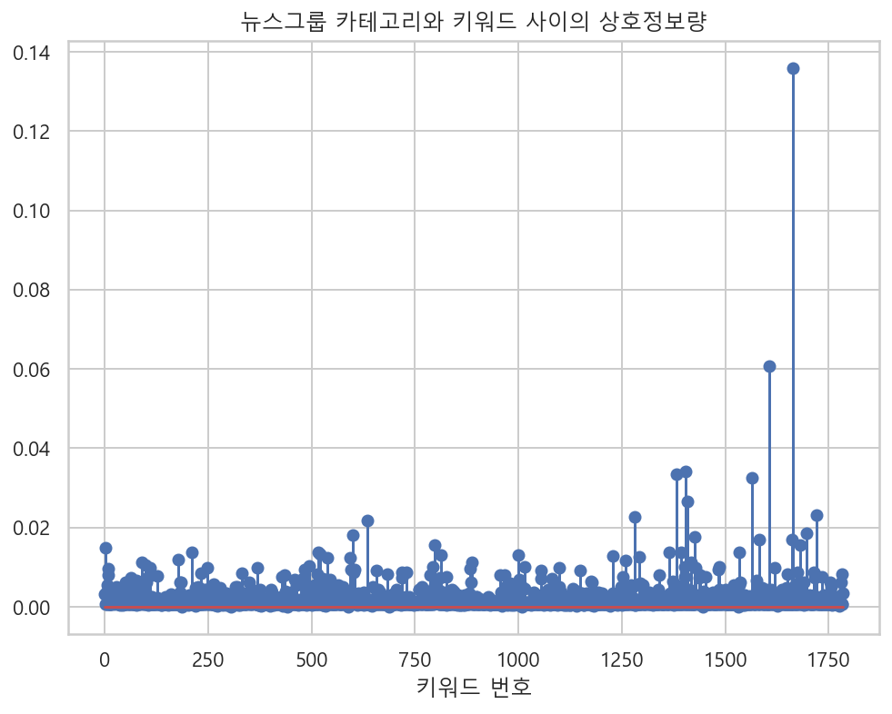


#### 가장 상호정보량이 큰 10개의 키워드
- 상호정보량은 두 확률변수이 상관관계가 클 수록 크다.
- 카운터벡터라이저로 만든 말뭉치와 갯수 확인

```python
voca = vect.vocabulary_
voca

>>>

{'subject': 20358,
 'jewish': 10868,
 'baseball': 1664,
 'players': 15868,
 'fry': 8055,
 'zariski': 23746,
 'harvard': 9062,
 'edu': 6432,
 'david': 5046,
 'organization': 14839,
 'math': 12749,
 'department': 5347,
 'nntp': 14254,
 'posting': 16079,
 'host': 9586,...}
```

#### key와 values 의 위치를 바꾼 후 상호정보량이 큰 10개의 키워드 확인
- auto, med, baseball 문서이므로 키워드도 이와 관련된 것들이 상호정보량이 크다.

```python
inv_vocabulary = {v : k for k, v in vect.vocabulary_.items()}
inv_vocabulary

>>>

{20358: 'subject',
 10868: 'jewish',
 1664: 'baseball',
 15868: 'players',
 8055: 'fry',
 23746: 'zariski',
 9062: 'harvard',
 6432: 'edu',
 5046: 'david',
 14839: 'organization',
 12749: 'math',...}
```

- 상호정보량 값을 정렬한다.
- 상호정보량 배열을 작은값 순으로 인덱스를 반환한다.
- np.flip()을 사용하여 뒤집으면 큰 값 순으로 인덱스가 정렬된다.

```python
idx = np.flip(np.argsort(mi))
idx

>>>

array([1664, 1606, 1404, ..., 1009,  687,  187], dtype=int64)
```

- 상호정보량 값이 큰 10개의 키워드 확인
- 문서의 카테고리와 키워드의 의미가 어느정도 일치하는 것 같다.

```python
[inv_vocabulary[idx[i]] for i in range(10)]

>>>

['baseball',
 'banks',
 'automotive',
 'auto',
 'ball',
 'autos',
 'batting',
 'atlanta',
 'alomar',
 'bat']
```

## 1-11 최대정보 상관계수
- 연속확률변수에서 상호정보량을 계산하려면 확률분포함수를 알아야 한다.
    - 확률분포함수는 히스토그램을 사용하여 유한개의 구간으로 나누어 측정한다. 
    - 구간의 개수나 경계 위치에 따라서 추정오차가 커진다.
- `최대정보 상관계수 maximum information coefficient MIC` : 따라서 여러 구간을 나누는 방법을 다양하게 시도하고, 그 결과로 구한 다양한 상호정보량 중에서 가장 큰 값을 선택하고 정규화한다.
- **minepy 패키지를 사용하여 최대정보 상관계수를 구할 수 있다.**
    - conda 패키지 매니저로 설치
- 선형상관계수(피어슨상관계수)가 0이지만, 비선형적 상관관계를 갖는 데이터들에 대해서 최대정보 상관계수를 구할 수 있다.
    - 비선형적 상관관계의 데이터들은 피어슨 상관계수값이 0이지만, 상관관계를 갖는다.
    - 여러 구간으로 나누어 상호정보량을 측정하고 가장 큰 값을 선택하면 최대정보 상관계수 값을 구할 수 있다.
    - 즉 비선형적 상관관계의 데이터들도 최대정보 상관계수로 정량화 할 수 있다.

### minepy
- 최대 상호정보량을 계산해주는 패키지 설치
- 아나콘다 홈페이지에서 minepy 패키지 페이지로 들어가면 설치 명령어를 확인할 수 있다.
    - https://anaconda.org/conda-forge/minepy
- conda install minepy 명령어로는 설치가 안된다.
- **conda install -c conda-forge minepy** 로 설치해야한다.
    - conda-forge 명령어 안에 scikitlearn 패키지도 있다. 
    - 뭔지 알아볼 것    

```python
from minepy import MINE

%matplotlib inline

mine = MINE()
n = 500

plt.figure(figsize=(8, 6))
plt.subplot(231)
x1 = np.random.uniform(-1, 1, n)
y1 = 2 * x1**2 + np.random.uniform(-1, 1, n)
plt.scatter(x1, y1)
# 최대상호정보량 계산
mine.compute_score(x1, y1)
plt.title("MIC={0:0.3f}".format(mine.mic()))

plt.subplot(232)
x2 = np.random.uniform(-1, 1, n)
y2 = 4 * (x2**2 - 0.5)**2 + np.random.uniform(-1, 1, n) / 5
plt.scatter(x2, y2)
mine.compute_score(x2, y2)
plt.title("MIC={0:0.3f}".format(mine.mic()))

plt.subplot(233)
x3 = np.random.uniform(-1, 1, n)
y3 = np.cos(x3 * np.pi) + np.random.uniform(0, 1/8, n)
x3 = np.sin(x3 * np.pi) + np.random.uniform(0, 1/8, n)
plt.scatter(x3, y3)
mine.compute_score(x3, y3)
plt.title("MIC={0:0.3f}".format(mine.mic()))

plt.subplot(234)
x4 = np.random.uniform(-1, 1, n)
y4 = np.random.uniform(-1, 1, n)
plt.scatter(x4, y4)
mine.compute_score(x4, y4)
plt.title("MIC={0:0.3f}".format(mine.mic()))

plt.subplot(235)
x5 = np.random.uniform(-1, 1, n)
y5 = (x5**2 + np.random.uniform(0, 0.5, n)) * np.array([-1, 1])\
[np.random.random_integers(0, 1, size=n)]
plt.scatter(x5, y5)
mine.compute_score(x5, y5)
plt.title("MIC={0:0.3f}".format(mine.mic()))

plt.subplot(236)
xy1 = np.random.multivariate_normal([3, 3], [[1, 0], [0, 1]], int(n/4))
xy2 = np.random.multivariate_normal([-3, 3], [[1, 0], [0, 1]], int(n/4))
xy3 = np.random.multivariate_normal([-3, -3], [[1,0], [0, 1]], int(n/4))
xy4 = np.random.multivariate_normal([3, -3], [[1, 0], [0, 1]], int(n/4))
xy = np.concatenate((xy1, xy2, xy3, xy4), axis=0)
x6 = xy[:, 0]
y6 = xy[:, 1]
plt.scatter(x6, y6)
mine.compute_score(x6, y6)
plt.title("MIC={0:0.3f}".format(mine.mic()))

plt.tight_layout()
plt.show() ;
```

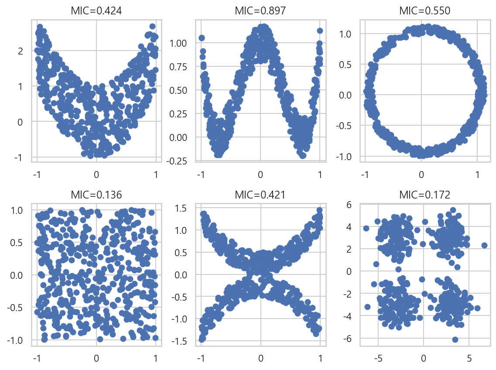
