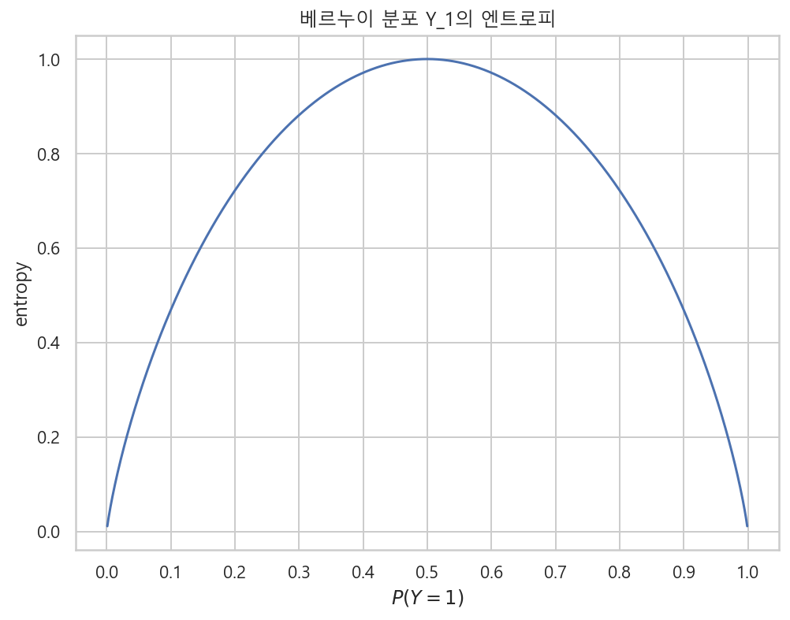

# 엔트로피
- 확률론에서의 엔트로피
    - 확률분포의 모양을 설명하는 특정값이다.
    - 확률분포가 가지고 있는 정보의 양을 나타내는 값이다.
    - 두 확률분포의 모양이 어떤 관계를 갖는지 또는 유사한 정도를 표현한다.
    - **조건부엔트로피**는 한 확률분포에 대해서 다른 확률분포가 받는 영향을 설명해준다.
    - **교차엔트로피와 쿨벡-라이블러 발산**은 두 확률분포가 얼마나 닮았는지를 나타낸다.
    - **상호정보량**은 두 확률분포의 독립 및 상관관계를 나타낸다. 

## 1. 엔트로피
- `엔트로피 entropy` : 확률분포의 이러한 정보의 차이를 하나의 숫자로 나타내 준다.
- Y=0, Y=1인 두 가지 값을 갖는 두 확률변수의 세가지 확률분포
    - Y_1 : P(Y=0) = 0.5, P(Y=1) = 0.5
    - Y_2 : P(Y=0) = 0.8, P(Y=1) = 0.2
    - Y_3 : P(Y=0) = 1.0, P(Y=1) = 0.0
- 베이지안 확률론 관점에서 위 확률분포에서 얻을 수 있는 정보
    - Y_1은 y값에 대해서 아무것도 모르는 상태와 같다.
    - Y_2는 y=0이라고 믿지만 아닐 가능성도 있다는 것을 아는 상태와 같다.
    - Y_3은 y=0이라고 100% 확신하는 상태이다.

## 1-1. 엔트로피의 정의
- `엔트로피 entropy` : 확률분포가 갖는 **정보의 확신도** 혹은 **정보량**을 수치로 표현한 것.
- 엔트로피값의 의미
    - 어떤 확률분포에서 특정한 값이 나올 확률이 높아지고 다른 값이 나올 확률이 낮아지면 엔트로피값이 작아진다.
    - 여러가지 값이 나올 확률이 비슷하다면 엔트로피값은 높아진다.
    - 확률분포의 모양에 대한 특성값
    - 확률또는 확률밀도가 특정한 값에 몰려있으면 엔트로피가 작고, 반대로 여러값에 퍼져있으면 엔트로피가 크다고 할 수 있다.

#### 물리학의 엔트로피 용어를 사용한 것
- 물리학에서의 엔트로피는 물질의 상태가 분산되는 정도를 나타낸다. 물체의 상태가 고루 분산되어 있으면(무질서하면) 엔트로피가 높고, 특정한 하나의 상태로 몰려있으면 엔트로피가 낮다.
- 물리학에서의 엔트로피는 "무질서의 정도"의 의미로 해석되기도 한다.
    - 우주는 엔트로피가 낮은 쪽에서 높은 곳으로 활동한다.

#### 엔트로피의 수학적 의미
- 엔트로피는 확률분포함수를 입력으로 받아 숫자를 출력하는 **범함수 functional**와 같다.
- 범함수의 표기 방법에 따라서 "H[ ]" 이렇게 표기 한다.
- 확률변수 Y가 카테고리분포와 같은 이산확률변수인 경우 엔트로피
    - $\text{H}[Y] = - \sum_{k=1}^{K} p(y_k) log_2 p(y_k)$
    - K : X가 가질 수 있는 클래스(범주값)의 수
    - p(y_k) : 확률질량함수(pmf)
    - 확률의 로그값은 항상 음수이므로 -를 곱하여 양수값으로 만들어 준다.
    - 확률은 0과 1사이의 값이고 로그함수에서 0과 1 사이의 영역은 음수값이다.
- 확률변수 Y가 정규분포와 같은 연속확률변수인 경우 엔트로피
    - $\text{H}[Y] = - \int_{- \infty}^{\infty} p(y) log_2 p(y) dy$
    - p(y) : 확률밀도함수(pdf)
    - log2 : 정보통신 분야에서의 로그값 사용관례
- 엔트로피 계산에서 p(y) = 0 인 경우는 로그값이 정의되지 않는다. 따라서 로피탈의 정리(l'Hopitals rule)를 따라서 0으로 수렴하는 값으로 계산한다.
    - $\lim_{p \rightarrow 0} p log_2 p = 0$

#### Y_1, Y_2, Y_3의 이산확률분포에 대한 엔트로피
- $\text{H}[Y_1] = - \dfrac{1}{2} log_2 \dfrac{1}{2} - \dfrac{1}{2} log_2 \dfrac{1}{2} = 1$
    - -1log_2 1/2 = log_2 1/2^-1 = log_2 2 = 1
- $\text{H}[Y_2] = - \dfrac{8}{10} log_2 \dfrac{8}{10} - \dfrac{2}{10} log_2 \dfrac{2}{10} \approx 0.72$
    - (- 8/10 * np.log2(8/10)) - (2/10 * np.log2(2/10)) = 0.7219280948873623
- $\text{H}[Y_3] = - 1 log_2 1 - 0 log_2 0 = 0$

### [python] Y_1, Y_2, Y_3의 확률분포

```python
%matplotlib inline

plt.figure(figsize=(9, 3))
plt.subplot(131)
plt.bar([0, 1], [0.5, 0.5])
plt.xticks([0, 1], ["Y=0", "Y=1"])
plt.ylim(0, 1.1)
plt.title("$Y_1$")

plt.subplot(132)
plt.bar([0, 1], [0.8, 0.2])
plt.xticks([0, 1], ["Y=0", "Y=1"])
plt.ylim(0, 1.1)
plt.title("$Y_2$")

plt.subplot(133)
plt.bar([0, 1], [1.0, 0.0])
plt.xticks([0, 1], ["Y=0", "Y=1"])
plt.ylim(0, 1.1)
plt.title("$Y_3$")

plt.tight_layout()
plt.show() ;
```


### [python] 넘파이로 엔트로피 계산

```python
y_1 = - 0.5 * np.log2(0.5) - 0.5 * np.log2(0.5)
y_1

>>>

1.0
```

```python
y_2 = - 0.8 * np.log2(8/10) - 0.2 * np.log2(2/10)
y_2

>>>

0.7219280948873623
```

```python
eps = np.finfo(float).eps
y_3 = - 1 * np.log2(1) - eps * np.log2(eps)
y_3

>>>

1.1546319456101628e-14
```

### [python] quiz
- 베르누이분포에서 확률값 P(Y=1)은 0부터 1까지의 값을 가질 수 있다. 각각의 값에 대해 엔트로피를 계산하여 가로축이 P(Y=1)이고 세로축이 H[Y]인 그래프를 그리시오.
- 베르누이분포는 입력값이 0 또는 1이므로 P(Y=1)인 경우의 엔트로피와 P(Y=0)인 경우의 엔트로피를 함께 계산해야 한다.
    - 즉 P(Y=1) = 0.3 이면, P(Y=0) = 0.7 이다.

```python
# 엔트로피 계산 함수
def entropy(x) :
    return - x * np.log(x) - (1-x) * np.log(1-x)

# 0.001부터 1까지 P(Y=1)의 값의 범위
xx = np.linspace(0.001, 1, 100)

plt.figure(figsize=(8, 6))
plt.plot(xx, entropy(xx))
plt.title("베르누이 분포 Y_1의 엔트로피")
plt.xticks(np.arange(0, 11)/10)
plt.xlabel("$P(Y=1)$")
plt.ylabel("entropy")
plt.show() ;
```



### [풀이]

```python
plt.figure(figsize=(8, 6))
P0 = np.linspace(0.001, 1-0.001, 1000)
P1 = 1 - P0
H = - P0 * np.log2(P0) - P1 * np.log2(P1)

plt.plot(P1, H, '-', label='엔트로피')
plt.xlabel('P(Y=1)')
plt.ylabel("entropy")
plt.legend()
plt.show() ;
```


### [python] quiz
- 다음 확률분포의 엔트로피를 계산하시오.
    - P(Y=0) = 1/8, P(Y=1) = 1/8, P(Y=2) = 1/4, P(Y=3) = 1/2
    - P(Y=0) = 1, P(Y=1) = 0, P(Y=2) = 0, P(Y=3) = 0
    - P(Y=0) = 1/4, P(Y=1) = 1/4, P(Y=2) = 1/4, P(Y=3) = 1/4

```python
Y0 = - 1/8 * np.log2(1/8) - 1/8 * np.log2(1/8) - 1/4 * np.log2(1/4) - 1/2 * np.log2(1/2)
Y0

>>>

1.75
```

```python
eps = np.finfo(float).eps
Y1 = - 1 * np.log2(1) - eps * np.log2(eps) - eps * np.log2(eps) - eps * np.log2(eps)
Y1

>>>

3.4638958368304884e-14
```

```python
Y2 = - 1/4 * np.log2(1/4) - 1/4 * np.log2(1/4) - 1/4 * np.log2(1/4) - 1/4 * np.log2(1/4)
Y2

>>>

2.0
```

## 1-2 엔트로피의 성질
- **엔트로피의 최소값** : 확률변수가 결정론적이면 확률분포에서 어떤 값이 나올 확률은 1과 같다. 따라서 이러한 경우 엔트로피는 0이다. 이 값이 엔트로피가 가질 수 있는 최소값이다.
- **엔트로피의 최대값** : 이산확률변수의 클래스의 개수에 따라서 엔트로피의 값이 달라진다. 이산확률분포가 가질 수 있는 클래스의 개수가 2^K개일때 엔트로피의 최대값은 K이다.
    - $H = - 2^K \cdot \dfrac{1}{2^K} log_2 \dfrac{1}{2^K} = K$
    - 만약 이산확률분포의 클래스의 개수가 2^3=8이면 위의 계산에 의해 엔트로피가 가질 수 있는 최대값은 3이 된다.

## 1-3 엔트로피의 추정
- 이론적인 확률밀도함수가 없는 경우, 실제 데이터로부터 확률질량함수를 추정하여 엔트로피를 계산한다.
    - **데이터 -> 확률질량함수 추정 -> 엔트로피 계산**
- 전체 데이터 수 80개, Y=0인 데이터가 40개, Y=1인 데이터가 40개 있는 경우의 엔트로피
    - $\text{H}[Y] = - \dfrac{40}{80} log_2(\dfrac{40}{80}) - \dfrac{40}{80} log_2(\dfrac{40}{80}) = \dfrac{1}{2} + \dfrac{1}{2} = 1$

### [python] 사이파이로 entropy 계산

```python
p = [0.5, 0.5]
sp.stats.entropy(p, base=2)

>>>

1.0
```

```python
p = [0.3, 0.7]
sp.stats.entropy(p, base=2)

>>>

0.8812908992306927
```

```python
p = [0.8, 0.2]
sp.stats.entropy(p, base=2)

>>>

0.7219280948873623
```

### [python] quiz
- 데이터가 모두 60개이고 그 중 Y=0인 데이터가 20개, Y=1인 데이터가 40개 있는 경우 엔트로피를 계산하시오
- 데이터가 모두 40개이고 그 중 Y=0인 데이터가 30개, Y=1인 데이터가 10개 있는 경우 엔트로피를 계산하시오
- 데이터가 모두 20개이고 그 중 Y=0인 데이터만 20개 있는 경우의 엔트로피를 계산하시오.

```python
p0 = [20/60, 40/60]
sp.stats.entropy(p0, base=2)

>>>

0.9182958340544894
```

```python
p1 = [30/40, 10/40]
sp.stats.entropy(p1, base=2)

>>>

0.8112781244591328
```

```python
p2 = [20/20, eps]
sp.stats.entropy(p2, base=2)

>>>

1.1866662106483117e-14
```

## 1-4 가변길이 인코딩
- **엔트로피는 원래 통신 분야에서 데이터가 가지고 있는 정보량을 계산하기 위해 고안되었다.**
- A, B, C, D 4글자로 이루어진 문서가 있다.
- 각 글자를 0, 1로 이루어진 이진수로 변환하면 다음과 같다.
    - A = "00"
    - B = "01"
    - C = "10"
    - D = "11"
- ABCD로 이루어진 문서가 200글자이면 인진수는 400개가 된다. 문서의 길이가 길어지면 이진수의 갯수는 더 많아지게 된다. 문자를 이진수로 변환할 때 이진수의 수를 줄이기 위한 방법으로 **가변길이 인코딩 variable length encoding**을 사용한다.
- 가변길이 인코딩은 ABCD 각 문자가 문서에 등장한 빈도수에 따라서 변환할 인코딩 문자의 길이를 다르게 할 수 있다.
- 어떤 문서에서 ABCD 각 문자의 빈도수 분포를 조사했을 때 다음과 같다.
    - P(Y=A) = 1/2, P(Y=B) = 1/4, P(Y=C) = 1/8, P(Y=D) = 1/8
    - A가 가장 많이 등장하고 다음으로 B가 많이 등장하고 C와 D는 빈도수가 같다.
- 이러한 경우 가장 많이 나오는 A의 인코딩 문자의 갯수를 줄이고 C와 D의 인코딩 문자의 갯수를 늘일 수 있다.
- 가변길이 인코딩 방식으로 인코딩 된 문서의 한 글자당 비트수를 계산하면 엔트로피의 값과 같다.
    - $\left( 200 \text{X} \dfrac{1}{2} \right) \cdot 1 + \left( 200 \text{X} \dfrac{1}{4} \right) \cdot 2 + \left( 200 \text{X} \dfrac{1}{8} \right) \cdot 3 + \left( 200 \text{X} \dfrac{1}{8} \right) \cdot 3 = 350$
    - **한 문자당 바이트 수 : 350 / 200 = 1.75**
    - 각 문자의 확률에 대한 엔트로피 :
$H=-\dfrac{1}{2}log_2\dfrac{1}{2} - \dfrac{1}{4}log_2\dfrac{1}{4} - \dfrac{1}{8}log_2\dfrac{1}{8} - \dfrac{1}{8}log_2\dfrac{1}{8}=1.75$

### [python] 가변길이 인코딩

#### ABCD로 조합된 문서 만들기

```python
N = 200
p = [1/2, 1/4, 1/8, 1/8]
doc0 = list("".join([int(N * p[i]) * c for i, c in enumerate("ABCD")]))
np.random.shuffle(doc0)
doc = "".join(doc0)
doc

>>>

'BAADDAABAAAAAADAACDBCBDBBAABCCDBADABDDAADAAAABBAABBAACDAACABCAAABAABADAABBBDBACCAAADACADCABABACBCABADACAAAAAAAABBAABAADAAABBBBBACCDCAAAABABBACDBBBDBAABBAAAADCAACDAAABACABBBCBDBCAAAAACAAABAADDAAACBBAAA'
```

#### 코드 풀이
- ABCD의 각 확률대로 만든다.

```python
[int(N * p[i]) * c for i, c in enumerate("ABCD")]

>>>

['AAAAAAAAAAAAAAAAAAAAAAAAAAAAAAAAAAAAAAAAAAAAAAAAAAAAAAAAAAAAAAAAAAAAAAAAAAAAAAAAAAAAAAAAAAAAAAAAAAAA',
 'BBBBBBBBBBBBBBBBBBBBBBBBBBBBBBBBBBBBBBBBBBBBBBBBBB',
 'CCCCCCCCCCCCCCCCCCCCCCCCC',
 'DDDDDDDDDDDDDDDDDDDDDDDDD']
```

- join 함수로 합쳐준다.

```python
"".join([int(N * p[i]) * c for i, c in enumerate("ABCD")])

>>>

'AAAAAAAAAAAAAAAAAAAAAAAAAAAAAAAAAAAAAAAAAAAAAAAAAAAAAAAAAAAAAAAAAAAAAAAAAAAAAAAAAAAAAAAAAAAAAAAAAAAABBBBBBBBBBBBBBBBBBBBBBBBBBBBBBBBBBBBBBBBBBBBBBBBBBCCCCCCCCCCCCCCCCCCCCCCCCCDDDDDDDDDDDDDDDDDDDDDDDDD'
```

- list로 변환하면 각 문자가 하나의 str 원소로 바뀐다.

```python
print(list("".join([int(N * p[i]) * c for i, c in enumerate("ABCD")])))

>>>

['A', 'A', 'A', 'A', 'A', 'A', 'A', 'A', 'A', 'A', 'A', 'A', 'A', 'A', 'A', 'A', 'A', 'A', 'A', 'A', 'A', 'A', 'A', 'A', 'A', 'A', 'A', 'A', 'A', 'A', 'A', 'A', 'A', 'A', 'A', 'A', 'A', 'A', 'A', 'A', 'A', 'A', 'A', 'A', 'A', 'A', 'A', 'A', 'A', 'A', 'A', 'A', 'A', 'A', 'A', 'A', 'A', 'A', 'A', 'A', 'A', 'A', 'A', 'A', 'A', 'A', 'A', 'A', 'A', 'A', 'A', 'A', 'A', 'A', 'A', 'A', 'A', 'A', 'A', 'A', 'A', 'A', 'A', 'A', 'A', 'A', 'A', 'A', 'A', 'A', 'A', 'A', 'A', 'A', 'A', 'A', 'A', 'A', 'A', 'A', 'B', 'B', 'B', 'B', 'B', 'B', 'B', 'B', 'B', 'B', 'B', 'B', 'B', 'B', 'B', 'B', 'B', 'B', 'B', 'B', 'B', 'B', 'B', 'B', 'B', 'B', 'B', 'B', 'B', 'B', 'B', 'B', 'B', 'B', 'B', 'B', 'B', 'B', 'B', 'B', 'B', 'B', 'B', 'B', 'B', 'B', 'B', 'B', 'B', 'B', 'C', 'C', 'C', 'C', 'C', 'C', 'C', 'C', 'C', 'C', 'C', 'C', 'C', 'C', 'C', 'C', 'C', 'C', 'C', 'C', 'C', 'C', 'C', 'C', 'C', 'D', 'D', 'D', 'D', 'D', 'D', 'D', 'D', 'D', 'D', 'D', 'D', 'D', 'D', 'D', 'D', 'D', 'D', 'D', 'D', 'D', 'D', 'D', 'D', 'D']
```

- np.random.shuffle로 원소를 무작위로 섞어준 후, str 원소를 join으로 다시 합쳐준다.

```python
test = list("".join([int(N * p[i]) * c for i, c in enumerate("ABCD")]))
np.random.shuffle(test)
test = "".join(test)
test

>>>

'ACBBAAAABAAAAAADACBABCDBCAAACAACBCAABDDAADCCABBABBAACAAAAABDDBACDAABBBAAACBCABDACDDABBBADABDBBACBAAABAAAAAAAAABAABCABBBDCBABBAAABAACCABDABADADCDABCABAAAADAADBAAABABDDCABBABAACAAABADCAAABAAADCAAAABBDAA'
```

#### 이 문서를 이진수로 인코딩 하기

```python
encoder = {"A" : "00", "B" : "01", "C" : "10", "D" : "11"}
encoded_doc = "".join([encoder[c] for c in doc])
encoded_doc

>>>

'0100001111000001000000000000110000101101100111010100000110101101001100011111000011000000000101000001010000101100001000011000000001000001001100000101011101001010000000110010001110000100010010011000010011001000000000000000000101000001000011000000010101010100101011100000000001000101001011010101110100000101000000001110000010110000000100100001010110011101100000000000100000000100001111000000100101000000'
```

#### 이진수로 인코딩하면 400개의 문자가 된다.
- 원래 문서는 길이가 200이었다.

```python
len(encoded_doc)

>>>

400
```

#### 인코딩한 문서의 문자별 빈도수를 분포로 확인
- A > B > C = D 의 순으로 사용 횟수가 다르다.

```python
plt.figure(figsize=(8, 6))
sns.countplot(list(doc), order="ABCD")
plt.title("글자수의 분포 : ABCD")
plt.show() ;
```


#### 가변길이 인코딩 방식을 사용하여 각 문자별 인코딩 문자의 갯수 조정
- 많이 등장한 문자는 인코딩 문자를 줄이고, 적게 등장한 문자는 인코딩 문자를 늘려준다.
- 즉 처음 인코딩한 문서의 길이보다 줄어든다.

```python
v1_encoder = {"A" : "0", "B" : "10", "C" : "110", "D" : "111"}
v1_encoded_doc = "".join([v1_encoder[c] for c in doc])
v1_encoded_doc

>>>

'10001111110010000000111001101111011010111101000101101101111001110101111110011100001010001010001101110011001011000010001001110010101011110011011000011101100111110010010011010110010011101100000000010100010001110001010101010011011011111000001001010011011110101011110001010000011111000110111000100110010101011010111101100000011000010001111110001101010000'
```
- 가변길이 인코딩으로 변환한 문서의 길이

```python
len(v1_encoded_doc)

>>>

350
```

#### 가변길이 인코딩 된 문서를 한 글자당 인코딩 비트 수로 나누면?
- 각 문자의 확률에 대한 엔트로피 값과 같다.

```python
350/200

>>>

1.75

p = [1/2, 1/4, 1/8, 1/8]
sp.stats.entropy(p, base=2)

>>>

1.75
```

### [python] quiz
- A, B, C, D, E, F, G, H 의 8개 글자로 이루어진 문서가 있을 때 각각의 글자가 나올 확률이 다음과 같다.
- 이 문서를 위한 가변길이 인코딩 방식을 서술하고 한 글자를 인코딩하는데 필요한 평균 비트수를 계산하라.

#### 평균비트수 = 엔트로피

```python
p_docs = [1/2, 1/4, 1/8, 1/16, 1/64, 1/64, 1/64, 1/64]
sp.stats.entropy(p_docs, base=2)

>>>

2.0
```

